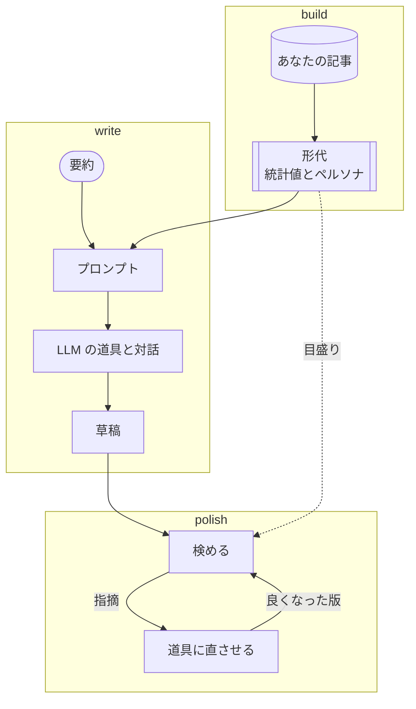

# kuchiyose

LLM に、あなたの代わりに日本語の文章を書かせるツール。書くのは手元の LLM の道具
（`claude` や `codex`）で、kuchiyose は書かせるためのプロンプトを作り、書かれた文章が
あなたの書き方からどこでずれているかを数えて、直させる。



ペルソナで寄るのは内容や話の運び方までで、表面の書きぶりは書かせ方を工夫してもほとんど
寄らない。だから表面は、書いたあとに数えて直させる周回で寄せる。数えるのは語や句読点の
頻度、文の長さ、表記の揺れなど、読まずに数えられる量だけで、同じ草稿からは毎回同じ結果が
出る。kuchiyose 自身は LLM の API を呼ばない。

AI が書いたことを隠すためのツールではない。見ているのは「素の LLM の書きぶりが残って
いないか」と「あなたの書き方に寄っているか」で、検出器をすり抜けられるかではない。

## 入れる

```sh
cargo install kuchiyose
```

手元のリポジトリから入れるなら `cargo install --path crates/kuchiyose-cli` とする。組んだ
実行ファイルは [GitHub Releases](https://github.com/lambdalisue/kuchiyose/releases) にも
ある（Linux と macOS）。

要るのは Rust だけである。形態素解析器と辞書、比べる相手になる基準の形代は実行ファイルに
入っている。辞書は組むときに取ってくるので、`cargo install` にはネットへの接続が要る。
代筆させるには `claude`（Claude Code）か `codex`（Codex CLI）が `PATH` に要る。

## 使う

自分で書いた記事を 1 つのフォルダに入れる。目安は 10 本以上、1 本あたり地の文で
1,000 字以上。題材は混ざっていてよいが、技術記事と議事録のように書き方が違う文章は
フォルダを分ける。

```sh
kuchiyose build ~/articles                     # 形代を作り、ペルソナを下書きさせる
kuchiyose write "Denops でファイラーを作った話"  # 代筆させる。要約は標準入力や $EDITOR でも渡せる
kuchiyose polish draft.md                      # 手元の文章の表現だけを寄せる
```

- `build` は記事を数えて形代（かたしろ）を作り、既定の形代にする。記事の本文は入らない。
  ペルソナは隣の `articles.persona.md` にも書かれるので、読んで直したら
  `kuchiyose katashiro persona <形代> articles.persona.md` で取り込み直す。
- `write` は LLM の道具を対話の画面で起動する。内容を詰めて草稿ができると、そのまま表現を
  寄せる周回に入る。良くなった版だけを採り、通るか 4 周で止まる。
- 最後の版は `<名前>.polished.md` に書かれ、元の草稿は上書きしない。各周の版は
  `<名前>.kuchiyose/` に残る。kuchiyose は内容までは測れないので、差分は自分で読む。

判定は終了コードにも出る。0 が通る、1 が通らない、2 が判定できない、64 以上は判定の前に
止まったことを表す。

形代は人に渡せる。受け取った人は `--katashiro` でその人に寄せた代筆ができる。ペルソナは
私的な内容なので、渡す前に `kuchiyose katashiro persona <形代> --remove` で外せる。

道具の選び方、結果の読み方、指摘の調整、エラーへの対処、基準の替え方は
[詳しい使い方](docs/guide.md)にある。

## 限界

- 数字があなたの記事に揃っても、読んだ人が「あなたらしい」と感じるかは確かめていない。
- 確かめたのはまだ 1 人分の記事である。ほかの書き手で同じように働くかは言えない。
- 閾値のいくつかは暫定値である。どれが暫定かは[仕様](docs/spec/200-extract.md)に書いてある。

## もっと知りたい

- [詳しい使い方](docs/guide.md)
- [用語集](docs/glossary.md)：形代、ペルソナ、照合値、帯などの意味
- [docs/README.md](docs/README.md)：仕様・設計・先行研究の入口

## ライセンス

MIT
