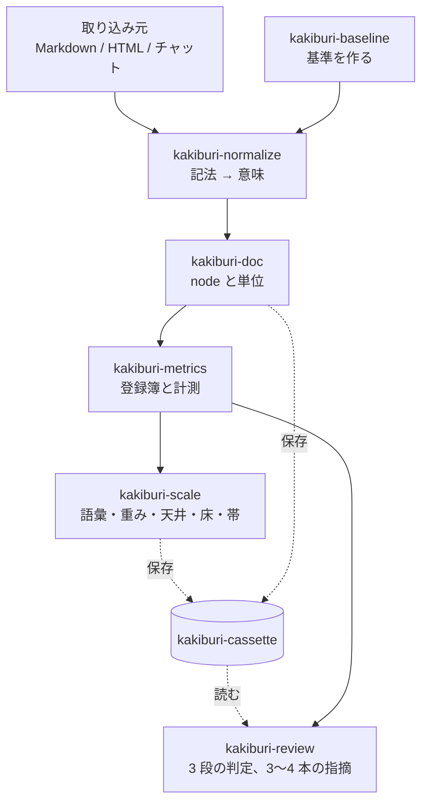
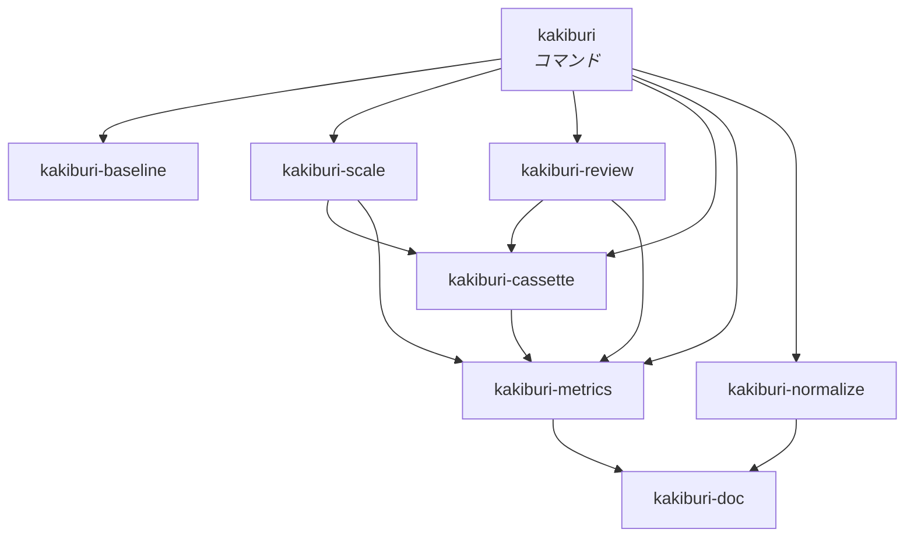

# 全体の構造とクレートの分割

[仕様](../spec/)が決めたことを、どういう部品に割るかを決める。

<strong>仕様を読み替えない。</strong> ここで決めるのは境界だけである。何を測るか、どう判定するかは
仕様が持つ。

## 分ける基準

<strong>境界は「漏れてはいけないもの」で引く。</strong> 層が綺麗に並ぶからではない。

仕様が「黙って壊れる」と名指しした場所が 4 つあり、そのどれもが <strong>境界を跨いだ漏れ</strong>で
起きる。

| 漏れると何が起きるか | どこで止めるか |
| --- | --- |
| 非決定的なものが数える側に入る | [基準の生成](#kakiburi-baseline)を隔離する |
| 単位の意味が指標ごとに変わる | [文書](#kakiburi-doc)が単位を独占する |
| 指標の一覧が 2 か所に現れる | [指標](#kakiburi-metrics)が登録簿を独占する |
| <strong>検める対象で目盛りが動く</strong> | [検め](#kakiburi-review)が[目盛り](#kakiburi-scale)に依存できないようにする |

<strong>4 行目は[較正と目盛りの分離](../spec/200-extract.md#較正と天井床)とは別の漏れである。</strong>
あちらは較正した対で測ることを防ぐが、それは `kakiburi-scale` の中の話である。
ここで防ぐのは、<strong>検めが当てはめる手続きに手を伸ばせること</strong>——検める文書を見てから
重みや語彙を作り直せてしまう経路である。

## 流れ

<strong>入力 → 正規形 → 値 → 目盛り → 判定と指摘。</strong>

<strong>横に 2 つ。</strong>[カセット](#kakiburi-cassette)が全部を保存し、
[基準](#kakiburi-baseline)が材料の片側を作る。

<strong>検めが `kakiburi-scale` から直接ではなくカセットを経由して読む</strong>のが、この図の要で
ある。目盛りを作る経路と使う経路が繋がっていなければ、検めは目盛りを作り直せない。

## クレート

### kakiburi-doc

[文書の形](../spec/020-document.md)。<strong>node の型と、数える単位。</strong>

地の文・日本語の文字・文・段落・節・項目・見出しの深さを、<strong>ここだけが定義する。</strong>
仕様が「指標ごとに決め直さない」と要求しているものを、型で守る。

<strong>依存を持たない。</strong> 形態素解析器も入出力も要らない。ここが軽いことが、上のすべてを
試験しやすくする。

### kakiburi-normalize

[入力を正規形にする](../spec/030-normalize.md)。<strong>記法から意味への対応表。</strong>

取り込み元ごとの実装を持つ唯一の場所である。GitHub の Alert を引用より先に認識する、
といった<strong>取り込み元固有の知識をここに閉じこめる</strong>。

<strong>決定的である。</strong> 推測しない。落ちない入力は断る。

`kakiburi-doc` にだけ依存する。

### kakiburi-metrics

[指標を決める](../spec/100-metrics.md)。<strong>登録簿と計測。</strong>

<strong>登録簿がこのクレートの本体である。</strong> 仕様の「使う側は一覧を持たない」は、
<strong>ほかのクレートが指標名を書けない</strong>ことを意味する。名前は登録簿から回して得る。

| 持つもの | 何のためか |
| --- | --- |
| 種別（照合 / 指示 / 人らしさ） | 比べ方と使い道が違う |
| 分類と層 | [系統の 2 段引き](../spec/100-metrics.md#層は系統の属性である指標は系統から引く) |
| 除外（既定と個別） | 分母が小さいときに測らない |
| 直し方 | 指摘に載せる。照合は持たない |

<strong>形態素解析器と圧縮器を使う。</strong>（係り受け解析器は[文節パターンが保留中](../spec/metrics/文節パターン.md#保留)
なので、まだ要らない。）<strong>どれも辞書・設定を版として外に出す</strong>——
[指紋](../spec/200-extract.md#何で測ったかを指紋にする)に入るからである。

### kakiburi-scale

[評価して、その人の値と目盛りにする](../spec/200-extract.md)。<strong>コーパスから目盛りを作る。</strong>

| 作るもの | |
| --- | --- |
| 固定した語彙 | 頻度で次元を選ぶ系統の、選んだ中身 |
| 値・幅・出現割合 | 単位ごとの値と、その人の振れ幅（最小〜最大） |
| 重み | ロジスティック回帰。<strong>1 組だけ</strong> |
| 天井・床・帯 | 照合値と人らしさ値、それぞれの分布と重なり |
| <strong>前に出す指標</strong> | 効くと判定されたものから、層 3 と動かないものを除いた集合 |

<strong>ここだけが当てはめる。</strong> 較正・語彙選択・閾値の導出は全部ここにある。

<strong>効くかどうかは 2 つの門を通す。</strong>[標本の範囲](../spec/200-extract.md#見る前に標本の範囲を確かめる)
が覆えていなければ判定そのものを出さず、[狭いだけ](../spec/200-extract.md#狭いだけで信じない)
のときは「確かめられていない」を添える。

<strong>成果物の型は自分で持たない。</strong>[カセット](#kakiburi-cassette)の型に書き出す。

### kakiburi-review

[検めて、直す](../spec/300-revise.md)。<strong>目盛りに載せて、判定と指摘を返す。</strong>

<strong>`kakiburi-scale` に依存しない。</strong> 当てはめる関数が視界に入らないので、検める対象を
見てから目盛りを作り直す経路が <strong>書けない</strong>。読むのはカセットだけである。

<strong>判定にも指摘にも[前に出す指標](../spec/300-revise.md#3-種類を合わせて通るを出す)を使う。</strong>
同じ集合を 2 か所で組み立て直さない——`kakiburi-scale` が作ったものをそのまま読む。

### kakiburi-cassette

保存形式と <strong>成果物の型</strong>。[カセットの構造](100-cassette.md)が中身を決める。

<strong>型をここに置くのは、作る側と読む側の両方から見えるからである。</strong> どちらかに置けば、
もう片方がそちらに依存することになる。

指紋の組み立ても持つ。<strong>入力の一部を混ぜ忘れる事故</strong>を型で防ぐ——指紋を作る関数が
全部の材料を引数に取り、1 つでも欠ければ組み立てられないようにする。<strong>材料が増えれば
型が変わり、既存の呼び出しがコンパイルで止まる。</strong>

### kakiburi-baseline

<strong>基準（LLM の既定出力）を作る。</strong> このクレートだけが非決定的である。

> [!WARNING]
> <strong>これは[軸](../spec/000-axis.md#だからしないこと)への意図した例外である。</strong> 軸の判定基準
> ——言うために内側になければならないか、外から渡されれば済むか——に当てると、基準の
> <strong>生成</strong>は渡されれば済む側に落ちる。<strong>基準の文書</strong>は言うために要るが、それを作る手続き
> は要らない。
>
> <strong>基準にならって置いたのではない。例外として置いた。</strong> 理由は
> [評価](../spec/200-extract.md#基準を置く)が言う <strong>「集めてくるのではなく作れるので、
> 素材が手に入らずに止まらない」</strong> ——実際に止まらないことのほうを取った。
>
> <strong>だから例外の範囲を狭く保つ。</strong> ほかのどのクレートもこれに依存しない。外から入れた
> 基準だけで全部が動く。<strong>このクレートを消しても、消えるのは便利さだけである。</strong>

依頼文の作り方（[書き方を漏らさない](../spec/200-extract.md#依頼文に書き方を漏らさない)）と、
版・推論設定の記録が責務である。<strong>題材は外から受け取る</strong>——文章から当てにいけば、
[題材を統制する](../spec/010-strategy.md#題材を統制する)が禁じた漏れがここで起きる。

### kakiburi

コマンド。<strong>[コマンドの体系](200-command.md)が決める。</strong>

## 依存の向き

<strong>`kakiburi-review` から `kakiburi-scale` への線が無いことが、この図の要である。</strong>
検めは目盛りを <strong>カセット越しに読む</strong>。当てはめる関数が視界に入らないので、
<strong>検める対象を見てから作り直す経路が、そもそも書けない。</strong>

<strong>成果物の型は `kakiburi-cassette` が持つ。</strong> 語彙・重み・天井・床・帯・幅・効く指標の
判定は、作る側と読む側の両方から見えるので、どちらでもない場所に置く。

<strong>逆向きの依存を作らない。</strong> とくに `kakiburi-metrics` が `kakiburi-scale` を知らない
ことが効く——指標は「誰にどう効くか」を知らないまま定義できる、という仕様の要求
（[集合は広く持つ](../spec/100-metrics.md#集合は広く持つ絞るのはあとである)）が、
そのまま依存の向きになる。

## なぜこの粒度か

<strong>8 つは多い。</strong> それでも割るのは、<strong>1 つ 1 つが仕様の要求と対応している</strong>からである。

| もし統合したら | 何が守れなくなるか |
| --- | --- |
| doc + normalize | 単位の定義に取り込み元の都合が混ざる |
| metrics + scale | 指標が「効くかどうか」を知ってしまう |
| <strong>scale + review</strong> | <strong>検めが、検める対象を見てから目盛りを作り直せてしまう</strong> |
| cassette + scale | 成果物の型が作る側に付き、検めが作る側に依存することになる |
| baseline を混ぜる | 非決定的なものが数える側に入る |

## 登録簿は定義ファイルから作る

<strong>[1 つ足すのに何か所も直す必要があれば、そこで止まる](../spec/100-metrics.md#実装に組みこむ)。</strong>

指標を 1 つ足すときに人が触るのは、<strong>[metrics/](../spec/metrics/) に定義ファイルを 1 つ置く
ことと、数え方を 1 つ書くこと</strong>の 2 か所にする。<strong>登録簿は定義ファイルから作る。</strong>

手で書けば 3 か所になり、書き忘れたものが黙って発火しなくなる——仕様が
[名前は 1 度しか書かない](../spec/100-metrics.md#名前は-1-度しか書かない)で警告している形
そのものである。

<strong>札と必須項目は定義ファイルが持っているので、そこから読める。</strong> 読めない形の定義ファイル
は、登録簿を組み立てる時点で落とす。

## 外部の道具

| 何に使うか | 制約 |
| --- | --- |
| 形態素解析 | <strong>辞書と版を[指紋](../spec/200-extract.md#何で測ったかを指紋にする)に出す。</strong> 解析器と対象がずれると精度が落ちる（[柳・金 2023](../references/yanagi-jin-2023.md)） |
| 係り受け解析 | 同上。<strong>[保留中](../spec/metrics/文節パターン.md#保留)</strong> |
| 圧縮 | <strong>圧縮器と設定を指紋に出す。</strong> ヘッダが短い文書の結果を支配する |
| LLM | `kakiburi-baseline` のみ。<strong>版と推論設定を指紋に出す</strong>（[林・相澤](../references/japanese-llm-style.md)） |

<strong>埋め込みは使わない</strong>（[保留](../spec/100-metrics.md#埋め込みは保留する)）。使うと
決めたときは `kakiburi-metrics` に系統が 1 つ増え、モデルと版が指紋に増える。
<strong>ほかのクレートは変わらない。</strong>
