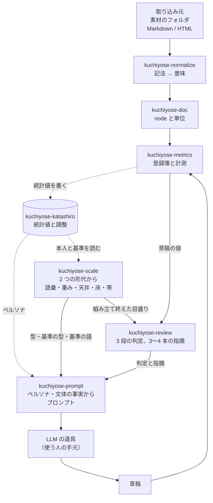
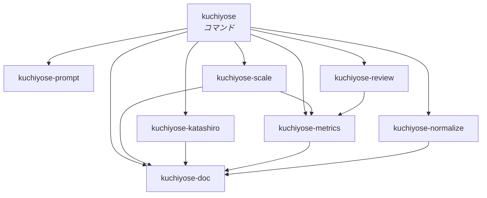

# 全体の構造とクレートの分割

[仕様](../spec/)が決めたことを、どういう部品に割るかを決める。

仕様を読み替えない。ここで決めるのは境界だけである。何を測るか、どう判定するかは
仕様が持つ。

## 分ける基準

境界は「漏れてはいけないもの」で引く。層が綺麗に並ぶからではない。

仕様が「黙って壊れる」と名指しした場所は、どれも境界を跨いだ漏れで起きる。

| 漏れると何が起きるか | どこで止めるか |
| --- | --- |
| 非決定的なものが数える側に入る | どのクレートも LLM の API を呼ばない。LLM の道具を起動するのは[組み立て層](#kuchiyose)だけで、道具が書いたものは草稿として検めに入るだけである。[基準も作らない](#基準は作らない) |
| ペルソナが測る側に入る | ペルソナを読むのは[プロンプト](#kuchiyose-prompt)だけにする |
| 単位の意味が指標ごとに変わる | [文書](#kuchiyose-doc)が単位を独占する |
| 指標の一覧が 2 か所に現れる | [指標](#kuchiyose-metrics)が登録簿を独占する |
| 検める対象で目盛りが動く | [検め](#kuchiyose-review)が[目盛り](#kuchiyose-scale)に依存できないようにし、組み立ては草稿を読む前に終える |
| 本人の側に基準の文書が混ざる | [跨ぐ道を 1 本に絞る](#場面を跨ぐ道は-1-本に絞る) |

4 行目は[較正と目盛りの分離](../spec/200-extract.md#較正と天井床)とは別の漏れである。
あちらは較正した対で測ることを防ぐが、それは `kuchiyose-scale` の中の話である。ここで防ぐの
は、検めが当てはめる手続きに手を伸ばせること、つまり検める文書を見てから重みや語彙を
作り直せてしまう経路である。

目盛りは検めるたびに組み立てるので、組み立てる関数と検める関数が同じコマンドの中で
呼ばれる。それでも、組み立ての入力は 2 つの形代だけで、草稿は入らない。この順序を
崩さないことが 4 行目の中身である。

## 流れ

入力 → 正規形 → 統計値 → 形代 → 目盛り → 判定と指摘。書かせる部分は、その横に
形代と目盛りから代筆のプロンプトを作り、LLM の道具が書いたものを草稿として同じ流れに戻す。

横に 1 つ。[形代](#kuchiyose-katashiro)が統計値と調整を保存する。目盛りは保存しない。

基準は取り込み元の 1 つである。本人の文章と同じ口から入り、同じ形の形代になる。
[作らない](#基準は作らない)ので、作る経路が図に出ない。

草稿は目盛りを作る側と繋がっていない。これがこの図の要である。草稿の値は検めに直接
渡り、目盛りの組み立てには入らない。検めは組み立て終えた数を読むだけになる。

LLM の道具が書いたものも、草稿としてしか戻らない。道具が目盛りや判定に触れる線は無く、
ペルソナから目盛りへの線も無い。

## クレート

### kuchiyose-doc

[文書の形](../spec/020-document.md)。node の型と、数える単位。

地の文・日本語の文字・文・段落・節・項目・見出しの深さを、ここだけが定義する。仕様が
「指標ごとに決め直さない」と要求しているものを、型で守る。

依存を持たない。形態素解析器も入出力も要らない。ここが軽いことが、上のすべてを試験
しやすくする。

### kuchiyose-normalize

[入力を正規形にする](../spec/030-normalize.md)。記法から意味への対応表。

取り込み元ごとの実装を持つ唯一の場所である。GitHub の Alert を引用より先に認識する、
といった取り込み元固有の知識をここに閉じこめる。

決定的である。推測しない。落ちない入力は断る。

`kuchiyose-doc` にだけ依存する。

### kuchiyose-metrics

[指標を決める](../spec/100-metrics.md)。登録簿と計測。

登録簿がこのクレートの本体である。仕様の「使う側は一覧を持たない」は、ほかのクレートが
指標名を書けないことを意味する。名前は登録簿から回して得る。

| 持つもの | 何のためか |
| --- | --- |
| 種別（照合 / 指示 / 人らしさ / 検査） | 比べ方と使い道が違う |
| 分類と層 | [系統の 2 段引き](../spec/100-metrics.md#層は系統の属性である指標は系統から引く) |
| 除外（既定と個別） | 分母が小さいときに測らない |
| 直し方 | 指摘に載せる。照合は持たない |

計測は 1 文書ずつ行い、[文書ごとの統計値](../spec/200-extract.md#文書ごとの統計値を持つ)に
要る形で返す。指示できる指標は値と一緒に分子・分母・下限を、人らしさの指標は窓ごとの値を、
系統は語彙で切らない全次元の頻度を返す。下限を掛ける前の生の数も返す。

語のまとめ方を見つけるのもここである。形代ごとに、その形代の文書から見つける。

形態素解析器と圧縮器を使う。（係り受け解析器は[文節パターンが保留中](../spec/metrics/文節パターン.md#保留)
なので、まだ要らない。）どれも辞書・設定を版として外に出す。
[指紋](../spec/200-extract.md#何で測ったかを指紋にする)に入るからである。

### kuchiyose-scale

[評価して、その人の値と目盛りにする](../spec/200-extract.md)。2 つの形代の統計値から
目盛りを組み立てる。

| 作るもの | |
| --- | --- |
| 選んで束ねた基準の単位 | 文体と題材で選び、長さで束ねる |
| 固定した語彙 | 頻度で次元を選ぶ系統の、選んだ中身 |
| 値・幅・出現割合 | 単位ごとの値と、その人の振れ幅（最小〜最大） |
| 重み | ロジスティック回帰。1 組だけ |
| 天井・床・帯 | 照合値と基準との距離、それぞれの分布と重なり |
| 自己検査の結果 | 本人がいちばん高く出るか |
| 前に出す指標 | 効くと判定されたものから、層 3 と無効にしたものを除いた集合 |
| 型・基準の型・基準の語 | 言い回しの表から |

ここだけが当てはめる。較正・語彙選択・閾値の導出は全部ここにある。

組み立ての入口は 2 つの欄を持つ。本人の形代の統計値と、基準の形代の統計値である。
草稿を受け取る欄は無い。

文書ごとの統計値の型はここが持つ。組み立ての入力だからである。形代へは JSON にして
渡すので、形代は中身の形を知らない（[理由](#形代は中身の形を知らない)）。

[狭いだけ](../spec/200-extract.md#狭いだけで信じない)のときに「確かめられていない」を
添えることは、実装していない。効くかの判定にその印は無い。

### kuchiyose-review

[検めて、直す](../spec/300-revise.md)。目盛りに載せて、判定と指摘を返す。

`kuchiyose-scale` に依存しない。当てはめる関数が視界に入らないので、検める対象を見てから
目盛りを作り直す経路がこのクレートには書けない。受け取るのは、組み立て終えた値と幅と
集合、それに草稿を測った値だけである。（[組み立て層は別である](#守られるのはクレートの中だけである)。）

判定にも指摘にも[前に出す指標](../spec/300-revise.md#種別を合わせて通るを出す)を使う。
同じ集合を 2 か所で組み立て直さない。`kuchiyose-scale` が作ったものをそのまま読む。

[良くなった版だけを採る](../spec/400-write.md#良くなった版だけを採る)ための比べ方もここに
置く。同じ目盛りで検めた 2 つの結果だけを受け取り、どちらが良いかを返す。判定と段と
指摘の意味を知っているのがこのクレートだからである。組み立て層に置けば、判定の順序が
2 か所に書かれる。採らなかった版について、最初に差が付いた鍵とその前後の値を言うのも
ここである。同じ順を別に持てば、採否と理由が食い違う。直させるプロンプトに載せる
[上限までの余地](../spec/400-write.md#上限までの余地を見せる)もここで数える。使いすぎの
知らせと同じ数え方でなければ、プロンプトの値と次の検めが食い違う。

### kuchiyose-prompt

[代筆する](../spec/400-write.md)。ペルソナの形を確かめ、代筆のプロンプトと直させる
プロンプトを組み立てる。

| 持つもの | |
| --- | --- |
| ペルソナの読み方 | 見出しと項目と引用を取り出す。形が合わなければ断る |
| 引用の照らし方 | 単位ごとの node の文字列を受け取り、引用が現れるかを返す |
| 代筆のプロンプト | ペルソナ・文体の事実・要約・保存先から組み立てる |
| 直させるプロンプト | 検めた結果の散文・言い回しの上限・捨てた直し・読む経路・書く経路から組み立てる |
| 変えたところ | 2 つの版の文字列から、変えた文の断片を返す。捨てた直しに載せる |
| ペルソナを作らせるプロンプト | 素材のフォルダ・書く経路・確かめるコマンドから組み立てる |

入出力を持たない。素材を読むのも、正規化するのも、道具を起動するのも組み立て層である。
受け取るのは文字列と、組み立て層が詰めた平らな値だけなので、同じ入力から同じバイト列が
出ることを試験で固定できる（[決定的に作る](../spec/400-write.md#決定的に作る)）。

どのクレートにも依存しない。とくに `kuchiyose-scale` と `kuchiyose-review` を知らない。
文体の事実も判定の散文も、組み立て層が値にして渡す。プロンプトの側から目盛りや判定を
作り直す経路が書けない。

逆向きも同じである。`kuchiyose-metrics`、`kuchiyose-scale`、`kuchiyose-review` は
`kuchiyose-prompt` に依存しない。ペルソナを読む関数が測る側から見えないので、ペルソナが
測った値や判定に混ざる経路が書けない。

### kuchiyose-katashiro

保存形式と原本の型。[形代の構造](100-katashiro.md)が中身を決める。

原本の型だけを持つ。調整・場面・指紋である。本文も目盛りも持たない
（[素材を正本にする](../spec/200-extract.md#素材を正本にする)）。統計値はテキストとして
抱えるだけで、形を知らない（[理由](#形代は中身の形を知らない)）。ペルソナも同じで、
Markdown のバイト列として抱える。見出しと引用を読むのは `kuchiyose-prompt` である。

1 形代が 1 つのフォルダの 1 場面である（[構造](100-katashiro.md#1-形代-1-場面)）。

`kuchiyose-doc` にだけ依存する。指標も目盛りも知らないので、それらが増えても保存の側は
変わらない。

指紋の組み立ても持つ。入力の一部を混ぜ忘れる事故を型で防ぐ。指紋を作る関数が全部の材料を
引数に取り、1 つでも欠ければ組み立てられないようにする。材料が増えれば型が変わり、既存の
呼び出しがコンパイルで止まる。

同梱の基準形代は、実行ファイルに埋め込んだバイト列としてここから読める。読み方は
ほかの形代と同じである。

## 基準は作らない

基準（LLM の既定出力）を作るクレートを置かない。代筆のために LLM の道具を起動する口は
あるが、基準の文書を書かせるのには使わない。基準は素の LLM の文章でなければならず、
代筆のプロンプトを通せば基準ではなくなる。

[軸](../spec/000-axis.md#だからしないこと)の判定基準、つまり道具の中に無ければならないか、
外から渡されれば済むか、に当てると、基準の生成は渡されれば済む側に落ちる。
基準の文書は検めるために要るが、それを作る手続きは要らない。

作れば例外を 1 つ抱えることになる。目盛りの材料を作る手続きに非決定的なものが入り、
しかもそれを外しても何も失われない。基準は書き手ごとに変わらないので、同梱したもので
足りる。

| | どこでやるか |
| --- | --- |
| 基準の文書を作る | 外。書かせる道具は世に多い |
| 基準の文書を測って形代にする | 内。`katashiro build` が本人の文書と同じ手順で測る |
| どの基準かを名指す | 内。形代の中身のハッシュが名指す（[同じ基準形代で比べる](../spec/200-extract.md#同じ基準形代で比べる)） |
| 依頼文の作り方を決める | [規則として書く](200-command.md#基準は外で作る)。人が守る |

名指す側だけを内に持つ。どの基準で出した判定かが言えなければ、次に測ったときに比べられ
ない。そこは言うために要る側である。

> [!NOTE]
> [評価](../spec/200-extract.md#基準を置く)が「集めてくるのではなく作れる」と言うのは、
> 素材が手に入らずに止まらないという意味である。作る道具を我々が持つ、という意味では
> ない。外で作れることは変わらない。

### kuchiyose

コマンド。[コマンドの体系](200-command.md)が決める。組み立て層でもある。

LLM の道具の起動はここに置く（[LLM の道具の起動](400-agent.md)）。起動は入出力と子プロセスの
扱いで、判断を持たない。道具ごとの違いは[道具の定義](400-agent.md#道具ごとに違うこと)という
値にして持ち、起動する関数は 1 つにする。

表現を寄せる周回もここで回す。1 周ごとに、`kuchiyose-review` で検め、`kuchiyose-prompt` で
直させるプロンプトを作り、道具を起動し、`kuchiyose-review` の比べ方で採るかを決める。
捨てた版の記録を作業用のフォルダに残し、次の周の直させるプロンプトに渡すのもここである。
目盛りは周回の最初に 1 度だけ組み立てる（[守られるのはクレートの中だけである](#守られるのはクレートの中だけである)）。

既定の形代と設定ファイルを読むのもここである（[既定の形代](200-command.md#既定の形代)）。

## 依存の向き

`kuchiyose-review` から `kuchiyose-scale` への線が無いことが、この図の要である。
`kuchiyose-prompt` が線を 1 本も持たないことが、もう 1 つの要である。当てはめる
関数が視界に入らないので、検める対象を見てから作り直す経路が、そのクレートの中には
書けない。

`kuchiyose-metrics` から `kuchiyose-normalize` への線は無い。取り込み元ごとの
[書ける・書けないの升目](../spec/030-normalize.md#対応表は取り込み元ごとに持つ)は
`kuchiyose-normalize` が持ち、[書けない記法](../spec/100-metrics.md#測れない理由を分けて返す)
として渡すのは組み立て層である。指標は「どの取り込み元で測っているか」を知らない。

知らせる向きを逆にしない。正規化は指標を知らないまま木を作り、指標は取り込み元を
知らないまま数える。升目を引き当てるのは、両方を見ている 1 か所だけである。

### 形代は中身の形を知らない

統計値はテキストとして持つ。統計値の型は `kuchiyose-scale` にあり、形代はその JSON を
[作り直せるもの](100-katashiro.md#何を収めるか)として抱えるだけである。

だから `kuchiyose-katashiro` は `kuchiyose-metrics` にも `kuchiyose-scale` にも
`kuchiyose-prompt` にも依存しない。
形を知らなければ、統計値の項目が増えても保存の側は変わらない。

中身のハッシュは、テキストのまま取る。形を知らなくても取れる。

繋ぐのは組み立て層である。統計値を JSON にする道も、読み戻す道も、`kuchiyose` が持つ。
読み戻したものが元と一致することは[試験が確かめる](300-test.md)。一致しなければ、保存した
形代から組み立てた目盛りは、測ったときの値から組み立てた目盛りと違う。

### 場面を跨ぐ道は 1 本に絞る

目盛りは 2 つの形代から組み立てる。本人の側の材料が基準の側に、基準の側の材料が
本人の側に混ざれば、相手集合や天井に基準の文書が入り、帯が意味を失う。値は出るし、
エラーにもならない。

失わないために、2 つを同じ配列に入れない。

| どこ | 何をする |
| --- | --- |
| `kuchiyose-katashiro` | 1 形代が 1 つのフォルダ。2 つの形代を混ぜて 1 つにする道を持たない |
| `kuchiyose-scale` | 組み立ての入口が、本人と基準を別の欄で受け取る |

本人の欄の統計値だけが、相手集合・天井・幅・型の本人の側になる。基準の欄の統計値だけが、
較正の違う人の側・床・基準の型の側になる。語彙と標準化は両方を見るが、仕様がそう決めて
いる（[語彙](../spec/200-extract.md#語彙は先に決めて固定する)、[標準化](../spec/200-extract.md#標準化の物差しは基準から取る)）。

型が全部を守るわけではない。呼ぶ側が 2 つの欄に同じ形代を入れることはできる。守れて
いるのは、跨ぐ道が 1 本に絞られていることである。見張る場所が 1 か所になり、
[試験で確かめられる](300-test.md#本人の側に基準の文書が入らないこと)。

### 守られるのはクレートの中だけである

`kuchiyose` は両方に依存する。`review` の経路は、目盛りを組み立ててから、その目盛りで
検める。だから組み立て層では、両方の関数が同時に視界に入っている。

| どこ | 何が守られるか |
| --- | --- |
| `kuchiyose-review` の中 | 型で守られる。呼べる関数が存在しない |
| `kuchiyose` の中 | 型では守られない。書こうと思えば書ける |

これを「境界が無い」と読んではいけない。守れているのは判定の中身がどこにあるかである。
検めの判断は `kuchiyose-review` にあり、そこに当てはめは無い。組み立て層に判断を置かなければ、
漏れる場所そのものが無い。

だから組み立て層には規則が要る。

- `review` の経路では、目盛りを 1 度だけ組み立て、それを草稿を読む前に終える。
- 組み立ての入力は 2 つの形代だけである。草稿の値を組み立ての関数に渡さない。
- 草稿を複数渡されても、組み立て直さない。
- 表現を寄せる周回でも、目盛りは周回の最初に 1 度だけ組み立て、全部の版に当てる。
- ペルソナを `kuchiyose-prompt` 以外に渡さない。

これを[試験で確かめる](300-test.md#検める草稿が目盛りに入らないこと)。型で止まらない以上、
ここだけは検査で止める。

クレートを割る意味は、守る範囲を狭めたことにある。見張るのは組み立て層 1 か所で済み、
残りは型が持つ。

逆向きの依存を作らない。とくに `kuchiyose-metrics` が `kuchiyose-scale` を知らないことが
効く。指標は「誰にどう効くか」を知らないまま定義できる、という仕様の要求
（[集合は広く持つ](../spec/100-metrics.md#集合は広く持つ絞るのはあとである)）が、そのまま
依存の向きになる。

## なぜこの粒度か

クレートは多い。それでも割るのは、1 つ 1 つが仕様の要求と対応しているからである。

| もし統合したら | 何が守れなくなるか |
| --- | --- |
| doc + normalize | 単位の定義に取り込み元の都合が混ざる |
| metrics + scale | 指標が「効くかどうか」を知ってしまう |
| scale + review | 検めが、検める対象を見てから目盛りを作り直せてしまう |
| katashiro + scale | 保存が統計値の形を知ってしまう。項目が増えるたびに保存の側が変わる |
| prompt + review | 判定の側からペルソナが見える。ペルソナが判定に混ざる経路が書ける |
| prompt + kuchiyose | プロンプトの組み立てが入出力と混ざり、同じ入力から同じバイト列が出ることを試験で固定しにくくなる |

[基準を作るクレートは無い](#基準は作らない)。割る前に、置かないと決めている。

## 登録簿は定義ファイルから作る

[1 つ足すのに何か所も直す必要があれば、そこで止まる](../spec/100-metrics.md#実装に組みこむ)。

指標を 1 つ足すときに人が触るのは、[metrics/](../spec/metrics/) に定義ファイルを 1 つ置く
ことと、数え方を 1 つ書くことの 2 か所にする。登録簿は定義ファイルから作る。

手で書けば 3 か所になり、書き忘れたものが黙って発火しなくなる。仕様が
[名前は 1 度しか書かない](../spec/100-metrics.md#名前は-1-度しか書かない)で警告している形
そのものである。

札と必須項目は定義ファイルが持っているので、そこから読める。読めない形の定義ファイル
は、登録簿を組み立てる時点で落とす。

定義ファイルはビルドのときに実行ファイルへ埋め込む。実行時に置き場を探さない。定義は
指摘の文の出どころで、[指紋](../spec/200-extract.md#何で測ったかを指紋にする)にも入る。
探す形では、リポジトリの外で走らせたときに見つからず、指摘の文が引けないうえに、
「定義を読めない」が指紋に入って[同梱の基準](100-katashiro.md#同梱の基準形代)と合わなく
なる。何も無いディレクトリで実行ファイルを走らせて、形代を作って検められることを
試験で確かめる。

## 外部の道具

| 何に使うか | 制約 |
| --- | --- |
| 形態素解析 | 辞書と版を[指紋](../spec/200-extract.md#何で測ったかを指紋にする)に出す。解析器と対象がずれると精度が落ちる（[柳・金 2023](../references/yanagi-jin-2023.md)） |
| 係り受け解析 | 同上。[保留中](../spec/metrics/文節パターン.md#保留) |
| 圧縮 | 圧縮器と設定を指紋に出す。ヘッダが短い文書の結果を支配する |
| LLM | API は呼ばない。使う人の LLM の道具を子プロセスとして起動する（[LLM の道具の起動](400-agent.md)）。基準の文書は書かせない（[基準は作らない](#基準は作らない)）。外で作った基準の文書を形代にし、中身のハッシュで名指す（[林・相澤](../references/japanese-llm-style.md)） |

埋め込みは使わない（[保留](../spec/100-metrics.md#埋め込みは保留する)）。使うと決めたときは
`kuchiyose-metrics` に系統が 1 つ増え、モデルと版が指紋に増える。ほかのクレートは変わらない。
