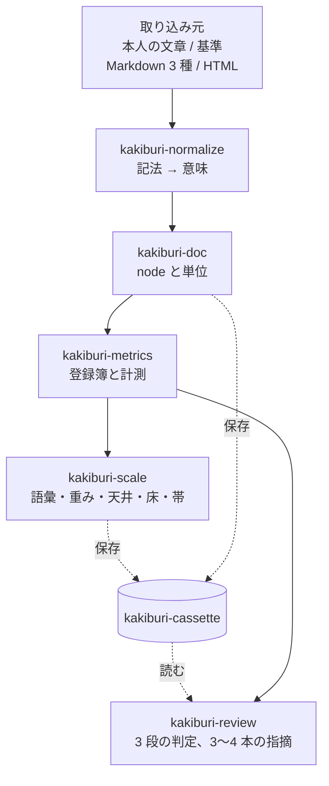
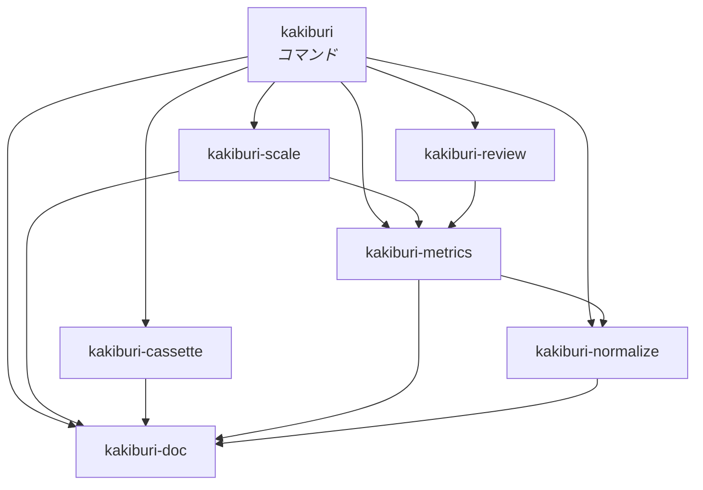

# 全体の構造とクレートの分割

[仕様](../spec/)が決めたことを、どういう部品に割るかを決める。

<strong>仕様を読み替えない。</strong> ここで決めるのは境界だけである。何を測るか、どう判定するかは
仕様が持つ。

## 分ける基準

<strong>境界は「漏れてはいけないもの」で引く。</strong> 層が綺麗に並ぶからではない。

仕様が「黙って壊れる」と名指しした場所が 4 つあり、そのどれもが <strong>境界を跨いだ漏れ</strong>で
起きる。

| 漏れると何が起きるか | どこで止めるか |
| --- | --- |
| 非決定的なものが数える側に入る | [基準を作らない](#基準は作らない)。どのクレートも LLM を呼ばない |
| 単位の意味が指標ごとに変わる | [文書](#kakiburi-doc)が単位を独占する |
| 指標の一覧が 2 か所に現れる | [指標](#kakiburi-metrics)が登録簿を独占する |
| <strong>検める対象で目盛りが動く</strong> | [検め](#kakiburi-review)が[目盛り](#kakiburi-scale)に依存できないようにする |
| <strong>場面を跨いだ素材で目盛りができる</strong> | [跨ぐ道を 1 本に絞る](#場面を跨ぐ道は-1-本に絞る) |

<strong>4 行目は[較正と目盛りの分離](../spec/200-extract.md#較正と天井床)とは別の漏れである。</strong>
あちらは較正した対で測ることを防ぐが、それは `kakiburi-scale` の中の話である。
ここで防ぐのは、<strong>検めが当てはめる手続きに手を伸ばせること</strong>——検める文書を見てから
重みや語彙を作り直せてしまう経路である。

<strong>5 行目は[1 カセット 1 場面](100-cassette.md#1-カセット-1-場面)にしたときに新しく開いた
穴である。</strong> 入れ物が場面で切れていた頃は、跨ぐ経路が物理的に書けなかった。

## 流れ

<strong>入力 → 正規形 → 値 → 目盛り → 判定と指摘。</strong>

<strong>横に 1 つ。</strong>[カセット](#kakiburi-cassette)が全部を保存する。

<strong>基準は取り込み元の 1 つである。</strong> 本人の文章と同じ口から入る——
[作らない](#基準は作らない)ので、作る経路が図に出ない。

<strong>検めが目盛りを作る側と繋がっていない</strong>のが、この図の要である。値はカセットを経由して
渡り、検めは受け取った数を読むだけになる——<strong>作る経路と使う経路が繋がっていなければ、
検めは目盛りを作り直せない。</strong>

## クレート

### kakiburi-doc

[文書の形](../spec/020-document.md)。<strong>node の型と、数える単位。</strong>

地の文・日本語の文字・文・段落・節・項目・見出しの深さを、<strong>ここだけが定義する。</strong>
仕様が「指標ごとに決め直さない」と要求しているものを、型で守る。

<strong>依存を持たない。</strong> 形態素解析器も入出力も要らない。ここが軽いことが、上のすべてを
試験しやすくする。

### kakiburi-normalize

[入力を正規形にする](../spec/030-normalize.md)。<strong>記法から意味への対応表。</strong>

取り込み元ごとの実装を持つ唯一の場所である。GitHub の Alert を引用より先に認識する、
といった<strong>取り込み元固有の知識をここに閉じこめる</strong>。

<strong>決定的である。</strong> 推測しない。落ちない入力は断る。

`kakiburi-doc` にだけ依存する。

### kakiburi-metrics

[指標を決める](../spec/100-metrics.md)。<strong>登録簿と計測。</strong>

<strong>登録簿がこのクレートの本体である。</strong> 仕様の「使う側は一覧を持たない」は、
<strong>ほかのクレートが指標名を書けない</strong>ことを意味する。名前は登録簿から回して得る。

| 持つもの | 何のためか |
| --- | --- |
| 種別（照合 / 指示 / 人らしさ） | 比べ方と使い道が違う |
| 分類と層 | [系統の 2 段引き](../spec/100-metrics.md#層は系統の属性である指標は系統から引く) |
| 除外（既定と個別） | 分母が小さいときに測らない |
| 直し方 | 指摘に載せる。照合は持たない |

<strong>形態素解析器と圧縮器を使う。</strong>（係り受け解析器は[文節パターンが保留中](../spec/metrics/文節パターン.md#保留)
なので、まだ要らない。）<strong>どれも辞書・設定を版として外に出す</strong>——
[指紋](../spec/200-extract.md#何で測ったかを指紋にする)に入るからである。

### kakiburi-scale

[評価して、その人の値と目盛りにする](../spec/200-extract.md)。<strong>コーパスから目盛りを作る。</strong>

| 作るもの | |
| --- | --- |
| 固定した語彙 | 頻度で次元を選ぶ系統の、選んだ中身 |
| 値・幅・出現割合 | 単位ごとの値と、その人の振れ幅（最小〜最大） |
| 重み | ロジスティック回帰。<strong>1 組だけ</strong> |
| 天井・床・帯 | 照合値と人らしさ値、それぞれの分布と重なり |
| <strong>前に出す指標</strong> | 効くと判定されたものから、層 3 と動かないものを除いた集合 |

<strong>ここだけが当てはめる。</strong> 較正・語彙選択・閾値の導出は全部ここにある。

<strong>[狭いだけ](../spec/200-extract.md#狭いだけで信じない)のときは「確かめられていない」を
添える。</strong>[標本の範囲](../spec/200-extract.md#見る前に標本の範囲を確かめる)は指標ごとの
門ではない——覆えていなければ <strong>場面まるごと目盛りを作らない</strong>ので、ここまで来ない。

<strong>成果物の型はここが持つ。</strong> 作り終えた形しか公開しない——[カセット](#kakiburi-cassette)へは
JSON にして渡す。<strong>だからカセットは中身の形を知らない</strong>（[理由](#カセットは中身の形を知らない)）。

### kakiburi-review

[検めて、直す](../spec/300-revise.md)。<strong>目盛りに載せて、判定と指摘を返す。</strong>

<strong>`kakiburi-scale` に依存しない。</strong> 当てはめる関数が視界に入らないので、検める対象を
見てから目盛りを作り直す経路が <strong>このクレートには書けない</strong>。受け取るのは、
<strong>作り終えた値と幅と集合</strong>だけである。
（[組み立て層は別である](#守られるのはクレートの中だけである)。）

<strong>判定にも指摘にも[前に出す指標](../spec/300-revise.md#種別を合わせて通るを出す)を使う。</strong>
同じ集合を 2 か所で組み立て直さない——`kakiburi-scale` が作ったものをそのまま読む。

### kakiburi-cassette

保存形式と <strong>原本の型</strong>。[カセットの構造](100-cassette.md)が中身を決める。

<strong>原本の型だけを持つ。</strong> 本文・人が決めたこと・指紋である。<strong>派生物はテキストとして
抱えるだけで、形を知らない</strong>（[理由](#カセットは中身の形を知らない)）。

<strong>1 カセットが 1 人で、中に場面ごとの束（トラック）が入る</strong>（[構造](100-cassette.md#1-カセット-1-場面)）。
本文は共有し、場面は単位が持つ。<strong>取り出し口を場面で絞る</strong>のもここの仕事である
（[理由](#場面を跨ぐ道は-1-本に絞る)）。

<strong>`kakiburi-doc` にだけ依存する。</strong> 指標も目盛りも知らないので、それらが増えても
保存の側は変わらない。

指紋の組み立ても持つ。<strong>入力の一部を混ぜ忘れる事故</strong>を型で防ぐ——指紋を作る関数が
全部の材料を引数に取り、1 つでも欠ければ組み立てられないようにする。<strong>材料が増えれば
型が変わり、既存の呼び出しがコンパイルで止まる。</strong>

## 基準は作らない

<strong>基準（LLM の既定出力）を作るクレートを置かない。</strong> どのクレートも LLM を呼ばない。

[軸](../spec/000-axis.md#だからしないこと)の判定基準——言うために内側になければならないか、
外から渡されれば済むか——に当てると、<strong>基準の生成は渡されれば済む側に落ちる</strong>。基準の
文書は言うために要るが、それを作る手続きは要らない。

<strong>作れば例外を 1 つ抱えることになる。</strong> 非決定的なものが 1 つ入り、外への繋ぎこみが
1 つ増え、それを外しても何も失われない——<strong>その 3 つが揃うなら、置かないほうがよい。</strong>

| | どこでやるか |
| --- | --- |
| 基準の文書を作る | <strong>外</strong>。書かせる道具は世に多い |
| 版・推論設定・題材を記録する | <strong>内</strong>。[`build --baseline`](200-command.md#基準は外で作る)が受け取り、指紋に入る |
| 依頼文の作り方を決める | <strong>[規則として書く](200-command.md#基準は外で作る)</strong>。人が守る |

<strong>記録の側だけを内に持つ。</strong> 記録が無ければ、次に測ったときに比べられない——
そこは言うために要る側である。

> [!NOTE]
> <strong>[評価](../spec/200-extract.md#基準を置く)が「集めてくるのではなく作れる」と言うのは、
> 素材が手に入らずに止まらないという意味である。</strong> 作る道具を我々が持つ、という意味では
> ない。外で作れることは変わらない。

### kakiburi

コマンド。<strong>[コマンドの体系](200-command.md)が決める。</strong>

## 依存の向き

<strong>`kakiburi-review` から `kakiburi-scale` への線が無いことが、この図の要である。</strong>
当てはめる関数が視界に入らないので、<strong>検める対象を見てから作り直す経路が、そのクレートの
中には書けない。</strong>

<strong>`kakiburi-metrics` から `kakiburi-normalize` への線がある。</strong> 取り込み元ごとの
[書ける・書けないの升目](../spec/030-normalize.md#対応表は取り込み元ごとに持つ)を引くため
である——[書けない記法](../spec/100-metrics.md#測れない理由を分けて返す)を返せなければ、
0 と測れないが混ざる。<strong>向きは逆にしない</strong>：正規化は指標を知らないまま木を作る。

### カセットは中身の形を知らない

<strong>派生物はテキストとして持つ。</strong> 目盛りの型は `kakiburi-scale` にあり、カセットは
その JSON を[捨ててよいもの](100-cassette.md#何を収めるか)として抱えるだけである。

<strong>だから `kakiburi-cassette` は `kakiburi-metrics` にも `kakiburi-scale` にも依存しない。</strong>
形を知らなければ、派生物が増えても保存の側は変わらない。

<strong>繋ぐのは組み立て層である。</strong> 目盛りを JSON にする道も、読み戻す道も、`kakiburi` が
持つ。<strong>読み戻したものが元と一致することは[試験が確かめる](300-test.md)</strong>——
一致しなければ、保存したカセットで測った値は作ったときの値と違う。

### 場面を跨ぐ道は 1 本に絞る

<strong>[1 カセット 1 場面](100-cassette.md#1-カセット-1-場面)にすると、場面を跨いで目盛りを作る
経路が書けてしまう。</strong> 入れ物が場面で切れていた頃は物理的に書けなかった守りである。

<strong>失わないために、跨げる素材を跨げない素材と同じ配列に入れない。</strong>

| どこ | 何をする |
| --- | --- |
| <strong>`kakiburi-cassette`</strong> | 場面を指定して取り出す口だけを公開する。<strong>全単位を返す口を持たない</strong> |
| 同上 | 所属を<strong>役と場面をひとつにした 1 つの値</strong>にする。`other` に場面を持たせられない |
| <strong>`kakiburi-scale`</strong> | 目盛りを作る関数が、跨げる素材を<strong>別の欄</strong>で受け取る |

<strong>`assemble` の入口は 3 つの欄を持つ</strong>——1 つの場面の本人、同じ場面の基準、
そして<strong>場面を跨いでよい他人の文書</strong>である。関数はその 3 つ目を
[人らしさの較正](../spec/200-extract.md#人らしさの境目は同じ材料から出る)にしか渡さない。

<strong>型が全部を守るわけではない。</strong> 呼ぶ側が 3 つ目に本人の文書を入れることはできる。
<strong>守れているのは、跨ぐ道が 1 本に絞られていることである</strong>——見張る場所が 1 か所に
なり、[試験で確かめられる](300-test.md)。他人の文書を足しても照合の側が 1 ミリも動かない
ことを確かめれば、相手集合にも語彙にも天井にも漏れていないと言える。

### 守られるのはクレートの中だけである

<strong>`kakiburi` は両方に依存する。</strong> コマンドは目盛りを作り（`build`）、目盛りで検める
（`review`）。<strong>だから組み立て層では、両方の関数が同時に視界に入っている。</strong>

| どこ | 何が守られるか |
| --- | --- |
| `kakiburi-review` の中 | <strong>型で守られる。</strong> 呼べる関数が存在しない |
| <strong>`kakiburi` の中</strong> | <strong>型では守られない。</strong> 書こうと思えば書ける |

<strong>これを「境界が無い」と読んではいけない。</strong> 守れているのは <strong>判定の中身がどこにあるか</strong>
である。検めの判断は `kakiburi-review` にあり、そこに当てはめは無い。組み立て層に
判断を置かなければ、漏れる場所そのものが無い。

<strong>だから組み立て層には規則が要る。</strong>`review` の経路から較正の関数を呼ばないことを、
[試験で確かめる](300-test.md#組み立て層が目盛りを作り直さないこと)——型で止まらない以上、
ここだけは検査で止める。

<strong>クレートを割る意味は、守る範囲を狭めたことにある。</strong> 見張るのは組み立て層 1 か所で
済み、残りは型が持つ。

<strong>逆向きの依存を作らない。</strong> とくに `kakiburi-metrics` が `kakiburi-scale` を知らない
ことが効く——指標は「誰にどう効くか」を知らないまま定義できる、という仕様の要求
（[集合は広く持つ](../spec/100-metrics.md#集合は広く持つ絞るのはあとである)）が、
そのまま依存の向きになる。

## なぜこの粒度か

<strong>7 つは多い。</strong> それでも割るのは、<strong>1 つ 1 つが仕様の要求と対応している</strong>からである。

| もし統合したら | 何が守れなくなるか |
| --- | --- |
| doc + normalize | 単位の定義に取り込み元の都合が混ざる |
| metrics + scale | 指標が「効くかどうか」を知ってしまう |
| <strong>scale + review</strong> | <strong>検めが、検める対象を見てから目盛りを作り直せてしまう</strong> |
| cassette + scale | <strong>保存が目盛りの形を知ってしまう。</strong> 派生物が増えるたびに保存の側が変わる |

<strong>[基準を作るクレートは無い](#基準は作らない)。</strong> 割る前に、置かないと決めている。

## 登録簿は定義ファイルから作る

<strong>[1 つ足すのに何か所も直す必要があれば、そこで止まる](../spec/100-metrics.md#実装に組みこむ)。</strong>

指標を 1 つ足すときに人が触るのは、<strong>[metrics/](../spec/metrics/) に定義ファイルを 1 つ置く
ことと、数え方を 1 つ書くこと</strong>の 2 か所にする。<strong>登録簿は定義ファイルから作る。</strong>

手で書けば 3 か所になり、書き忘れたものが黙って発火しなくなる——仕様が
[名前は 1 度しか書かない](../spec/100-metrics.md#名前は-1-度しか書かない)で警告している形
そのものである。

<strong>札と必須項目は定義ファイルが持っているので、そこから読める。</strong> 読めない形の定義ファイル
は、登録簿を組み立てる時点で落とす。

## 外部の道具

| 何に使うか | 制約 |
| --- | --- |
| 形態素解析 | <strong>辞書と版を[指紋](../spec/200-extract.md#何で測ったかを指紋にする)に出す。</strong> 解析器と対象がずれると精度が落ちる（[柳・金 2023](../references/yanagi-jin-2023.md)） |
| 係り受け解析 | 同上。<strong>[保留中](../spec/metrics/文節パターン.md#保留)</strong> |
| 圧縮 | <strong>圧縮器と設定を指紋に出す。</strong> ヘッダが短い文書の結果を支配する |
| LLM | <strong>呼ばない</strong>（[基準は作らない](#基準は作らない)）。外で作った基準の<strong>版と推論設定を受け取り、指紋に出す</strong>（[林・相澤](../references/japanese-llm-style.md)） |

<strong>埋め込みは使わない</strong>（[保留](../spec/100-metrics.md#埋め込みは保留する)）。使うと
決めたときは `kakiburi-metrics` に系統が 1 つ増え、モデルと版が指紋に増える。
<strong>ほかのクレートは変わらない。</strong>
