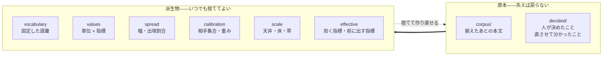

# カセットの構造

ある人の、ある場面についての一切を 1 つに収めた入れ物を <strong>カセット</strong>と呼ぶ。

[評価](../spec/200-extract.md)が作り、[検め](../spec/300-revise.md)が読む。

## 何を収めるか

仕様が[3 つに分けて持つ](../spec/200-extract.md#3-つに分けて持つ)と決めている。<strong>作り直せる
かどうかが、そのまま構造になる。</strong>

| | 作り直せるか | 失うとどうなるか |
| --- | --- | --- |
| <strong>揃えたあとの本文</strong> | <strong>できない。</strong> 元のファイルは手元に無い | 全部が終わる |
| <strong>人が決めたこと</strong> | <strong>できない。</strong> 人の頭の中にしかない | 同じ判断をやり直す |
| <strong>直させて分かったこと</strong> | <strong>できない。</strong> 測り直しても再現しない | 動かない指標が指摘に戻る |
| 派生物（値・語彙・重み・目盛り） | できる。本文と設定から何度でも | 測り直せばよい |

<strong>捨ててよいものを、捨てにくい場所に置かない。</strong> 置けば測り直しをためらうようになり、
[集合が増えたときに測り直す](../spec/200-extract.md#作り直せるようにする)という前提が
崩れる。



## 容器は zip

| | なぜ |
| --- | --- |
| 1 ファイルで扱える | 人が持ち運び、渡し、消せる |
| <strong>索引がある</strong> | 中の 1 つだけを読める。全部を展開しない |

tar は中央の索引を持たないので、目当ての entry までヘッダを 1 つずつ辿ることになる。
<strong>圧縮した tar では、そこまでを伸長しなければ辿れない。</strong>

<strong>選んだのは部分「読み」であって、部分「書き」ではない。</strong> 書くほうは zip でも全体を作り
直す。<strong>索引が末尾にあるので、中の 1 つを差し替えれば索引が動く。</strong> 追記して古い実体を
残す道もあるが、<strong>捨てたはずの派生物がファイルの中に残る</strong>ので採らない。

拡張子は `.kakiburi`。

### 書くときは、壊さないことを優先する

<strong>カセットは[原本](#何を収めるか)を含む。</strong> 失えば戻らないものを、毎回の書き込みで
上書きしている。<strong>途中で落ちれば、そこで終わる。</strong>

| | どうするか |
| --- | --- |
| 1 | <strong>同じディレクトリの一時ファイルへ書き切る。</strong> 既存のファイルを切り詰めない |
| 2 | <strong>一時ファイルを fsync する</strong> |
| 3 | <strong>読み直して[全部を検める](#置き換える前に何を検めるか)</strong> |
| 4 | <strong>rename で置き換える</strong> |
| 5 | <strong>親ディレクトリを fsync する</strong>。ここまでで置き換えが残る |
| 4 の前に失敗したら | <strong>一時ファイルを消す。元のカセットは無傷である</strong> |
| 4 のあとに失敗したら | <strong>置き換えは済んでいる。</strong> 元へは戻さない |

<strong>rename だけでは足りない。</strong> 置き換えが原子的かどうかも、電源が落ちたあとに残るかも、
OS とファイルシステムで違う。

<strong>前提を書く。</strong> POSIX の `rename` が同じディレクトリの中で原子的に置き換えること、
`fsync` が返れば書いたものが残ること、そして sidecar への `flock` が効くこと。<strong>macOS の
APFS と Linux の ext4 / btrfs / xfs を対象とする。</strong> ネットワーク越しのファイルシステム
は対象にしない——<strong>どれも保証が違う。</strong>

<strong>段によって守れるものが違う。</strong>

| どこで落ちたか | 何が残るか |
| --- | --- |
| 4 の前 | <strong>古いカセット。</strong> 一時ファイルが残ることがある |
| 4 と 5 のあいだ | <strong>見えているのは新しいカセット。</strong> 電源が落ちれば古いほうに戻りうる |
| 5 のあと | <strong>新しいカセット</strong> |

<strong>rename が済んだら、もう戻らない。</strong> 4 のあとで失敗しても、元へ巻き戻す道は持たない
——<strong>そこから先で守るのは「壊れていないこと」だけ</strong>である。新しいほうが見えても古い
ほうが残っても、<strong>読めるカセットが 1 つある</strong>。それがここで守れることの全部である。

<strong>残った一時ファイルは、次に開いたときに片づける。</strong> 決まった名前で作り、見つけたら
消す。<strong>放っておくと、置き換えの途中まで進んだ zip がディレクトリに溜まる。</strong>

#### 置き換える前に、何を検めるか

<strong>「開けた」では足りない。</strong> 中央の索引が読めても、その先の entry が壊れていることは
ある。<strong>置き換える前に全部読む。</strong>

- <strong>entry の名前が重複していない</strong>
- すべての entry を読み切り、<strong>CRC を照合する</strong>
- JSON がすべて構文として通り、<strong>同じ鍵が 2 度現れない</strong>
- <strong>必ずあるはずの entry が全部ある</strong>（`manifest.json`、`corpus/`、`decided/`）
- <strong>その `version` の形に合っている</strong>
- <strong>中の参照が解ける</strong>——値が指す `unit`、`unit` に属する `id`
- <strong>不変条件が成り立つ</strong>——`id` と `unit` の[一意性](#足すことと差し替えることを分ける)

<strong>1 つでも欠ければ置き換えない。</strong> 一時ファイルを消して、そこで止める。

<strong>JSON の重複鍵まで見るのは、読み手によって拾う値が変わるからである。</strong> `version` が
2 つ書かれた `manifest.json` は、<strong>どちらを読むかで別のカセットになる。</strong>

#### 同時に書かない

<strong>2 つのコマンドが同時に完全な zip を rename すると、片方の変更が正常終了のまま消える。</strong>
落ちるより悪い——誰も気付かない。

<strong>カセットの隣に置いた錠を押さえてから読む。</strong> カセット本体を押さえてはいけない——
置き換えでファイルが入れ替わるので、<strong>押さえた先が古いほうに取り残される。</strong>

<strong>錠は、読み始めてから親を fsync し終えるまで持つ。</strong> 押さえられなければ断る。

<strong>あわせて世代を見る。</strong>`manifest.json` に <strong>書くたびに 1 つ増える番号</strong>を持ち、
読んだときの番号と、置き換える直前の番号が同じことを確かめる。<strong>違えば断る。</strong>

<strong>[指紋](#指紋は組み立てを型で守る)を使ってはいけない。</strong> 指紋は測った条件を表すもので、
<strong>本文を差し替えても条件が同じなら変わらない</strong>。世代を見なければ、上書きが正常終了の
まま消える。

#### 足すことと差し替えることを分ける

<strong>id の衝突は、書く前に断る。</strong> 同じ `id` の文書を足そうとしたら、そこで止める。
<strong>黙って上書きしない</strong>——原本が 1 本消えたことは、値が変わるまで誰も気付かない。

<strong>`unit` の名前も、カセット全体で一意である</strong>（[仕様](../spec/200-extract.md#単位は-1-文書)）。
ただし <strong>[束ねた文書は同じ `unit` を共有する](#短い文書は束ねる)</strong>ので、単純な重複拒否
にはできない。

| 検めること | |
| --- | --- |
| `id` | <strong>カセット全体で一意。</strong> 役を跨いでも重複を許さない |
| `unit` | <strong>同じ役・同じ取り込み元の束の中だけで共有できる。</strong> それ以外の重複は断る |
| 束の中身 | <strong>役と取り込み元が全部そろっている</strong>こと |

<strong>置き換えは、置き換えだと言わせる</strong>（[コマンド](200-command.md#差し替える)）。
[取り込み元を間違える](../spec/030-normalize.md#取り込み元を間違えると0-が並ぶ)のと同じで、
<strong>やり直したい</strong>ことは実際に起きる。起きること自体は禁じない。

## 中身

```
manifest.json              版・場面・指紋
decided/                   人が決めたこと（作り直せない）
  scene-note.json            なぜその場面にしたか。場面そのものは manifest が持つ
  boilerplate.json           落とす定型
  baseline.json              基準の作り方
  movement.json              直させて分かったこと（条件 3）
corpus/                    揃えたあとの本文（作り直せない）
  person/<id>.json           本人の文書。正規形
  baseline/<id>.json         基準の文書。正規形
  other/<id>.json            他人の文書。正規形。無くてよい
derived/                   派生物（作り直せる）
  vocabulary.json            固定した語彙
  values.jsonl               単位 × 指標の値
  spread.json                幅・出現割合
  calibration.json           相手集合の割り、重み
  scale.json                 天井・床・帯（照合値と人らしさ値）
  effective.json             効く指標の判定、前に出す指標
```

<strong>3 つのディレクトリが、そのまま 3 つの層である。</strong>`derived/` を丸ごと消しても、
`manifest.json` の[原本の欄](#manifestjson)と `corpus/` と `decided/` があれば同じものが
作り直せる。<strong>それが正しく成り立つことは[試験する](300-test.md#作り直せることを試験する)。</strong>

<strong>`manifest.json` だけが 2 つにまたがる。</strong> 場面はそこにしか無く、指紋はそこで作られる。
<strong>だから欄で分ける</strong>——ディレクトリで割り切れない唯一のファイルである。

## manifest.json

```json
{
  "version": 1,
  "generation": 7,
  "scene": "技術記事",
  "fingerprint": "sha256:...",
  "fingerprint_inputs": { ... },
  "provisional": []
}
```

<strong>`provisional` が空でないカセットは、判定に但し書きが付く。</strong>

<strong>原本なのは `version`・`generation`・`scene` の 3 つだけである。</strong> 残りは build が書く
派生である。<strong>ファイル単位ではなく欄単位で分ける</strong>——1 つのファイルに両方が入っている
ので、「manifest は原本」とも「派生物」とも言えない。

| 欄 | どちら |
| --- | --- |
| `version` `generation` `scene` | <strong>原本</strong> |
| `fingerprint` `fingerprint_inputs` `provisional` | 派生。build が書く |

<strong>だから `build` が `manifest.json` を書くことは、[原本に触らない](200-command.md#破壊的な操作を短くしない)に
反しない。</strong> 触るのは下の 3 つだけである。

<strong>`scene` の正本はここである。</strong>`decided/scene-note.json` は、なぜその場面にしたかの
記録であって、場面そのものではない。<strong>2 か所に同じ値を置けば、食い違ったときにどちらが
正しいかを言えない。</strong>

<strong>だから「[派生物は `corpus/` と `decided/` から作り直せる](#中身)」は `manifest` の原本の
欄を足して読む</strong>——場面はここにしかなく、場面が変われば目盛りが変わる。

<strong>`manifest.scene` は[指紋](#指紋は組み立てを型で守る)の材料でもある。</strong> 材料の「人が
決めたこと」は `decided/` 全部と <strong>`manifest.scene`</strong> である。

<strong>`fingerprint_inputs` に写した場面は、診断のための控えである。</strong> 正本ではない。
読むときに `manifest.scene` と一致することを確かめ、<strong>食い違えば壊れているとして断る</strong>。

### 読めない版は、読まずに断る

<strong>`version` は読む側が確かめる。</strong> 知らない版のカセットを開いてはいけない。

<strong>版を見る前に、容器を検める。</strong> zip は同じ名前の entry を複数持てるので、
`manifest.json` が 2 つあるカセットを作れてしまう。<strong>どちらの `version` を見たかで挙動が
変わる。</strong>

| 段 | 確かめること | 通らなければ |
| --- | --- | --- |
| 1 | entry の名前が重複していない | <strong>壊れている</strong>として断る |
| 2 | `manifest.json` がちょうど 1 つある | 同上 |
| 3 | `version` が読める | 同上 |
| 4 | その `version` を知っている | <strong>知らない版</strong>として断る |

<strong>4 つを別の理由として返す。</strong> まとめると、壊れたカセットと新しすぎるカセットが同じ顔に
なる。前者は作り直しで、後者は道具の更新である。

<strong>知らない版を「たぶん読める」と読まない。</strong> 欠けた項目は空として通り、
[空と欠けの区別](../spec/200-extract.md#検めに渡すものをここで全部決める)がそこで崩れる。
<strong>そして崩れたことはエラーにならない。</strong>

<strong>版は、形か意味が非互換に変わったときに上げる。</strong> 形だけではない——同じ JSON でも、
必須かどうか、単位、列挙の解釈が変われば、古い読み手は間違った値を読む。<strong>形が同じなら
上げなくてよい、と読んではいけない。</strong>

<strong>古い版を読み続けるなら、その版の形を覚えておく。</strong> 覚えないなら、移し替える道を
用意する——どちらも持たないまま版だけ上げると、既存のカセットが全部読めなくなる。

<strong>いまは常に[暫定値](../spec/100-metrics.md#除外の既定)が立つ。</strong> 12 か所の閾値がまだ
導き直されていないので、どのカセットもその印を持つ。<strong>導き直したら降りる。</strong>

### 指紋は組み立てを型で守る

仕様が<strong>「一部だけを混ぜない」</strong>と警告している。混ぜ忘れても<strong>エラーにならず、古い値が
黙って使われる</strong>。

<strong>だから指紋を作る関数は、全部の材料を引数に取る。</strong> 1 つでも欠ければ組み立てられない。

| 材料 | どこから |
| --- | --- |
| 指標の定義そのもの | 登録簿 |
| <strong>数える単位の定義</strong>（地の文に何が入るか、日本語の文字の範囲と Unicode の版） | 実装 |
| 固定した語彙 | `derived/vocabulary.json` |
| 形態素解析器の辞書と版 | 実行環境 |
| 係り受け解析器の辞書と版（[保留中](../spec/metrics/文節パターン.md#保留)。使うと決めたら要る） | 実行環境 |
| 圧縮器と設定 | 実行環境 |
| <strong>固定した z 得点の平均と標準偏差</strong> | `derived/` |
| <strong>外部の表の版</strong>（語の文体値、文末表現の辞書、Unicode） | 実行環境 |
| 取り込み元の種類・変換の実装と版・対応表 | `decided/` と実行環境 |
| 基準の LLM の版と推論設定 | `decided/baseline.json` |
| <strong>較正の設定</strong>（L2 の強さ、解法、収束の条件、反復の上限、残差の合否の線） | 実装 |
| <strong>束の構成と並び</strong> | `corpus/` の `unit` |
| 人が決めたこと | `decided/` 全部と <strong>`manifest.scene`</strong> |

<strong>`fingerprint_inputs` に材料を平文で残す。</strong> ハッシュだけでは、変わったことは分かって
も <strong>何が変わったか</strong>が分からない。

## corpus/ — 正規形

<strong>正規形が原本である</strong>（[正規化](../spec/030-normalize.md#正規形が原本である)）。

node の木をそのまま JSON にする。<strong>往復は目的ではない</strong>ので、記法の情報は持たない。

```json
{
  "id": "2026-03-14-cassette",
  "unit": "2026-03-14-cassette",
  "source": { "kind": "github-markdown", "impl": "kakiburi-normalize", "version": "0.1.0" },
  "scene": "技術記事",
  "use": "floor",
  "root": { "type": "段落", "children": [ ... ] }
}
```

<strong>`scene` と `use` は `other/` の文書だけが持つ。</strong> ほかの役では、場面はカセットのもの
であり、用途は役が決めている。

<strong>1 文書 1 ファイルにする。</strong> 足すのがファイルを 1 つ増やすことで済み、zip の索引が効く。

### 役は 3 つ

| | |
| --- | --- |
| `person/` | 本人の文書 |
| `baseline/` | 基準（LLM の既定出力） |
| `other/` | <strong>他人の文書。無くてよい</strong> |

<strong>`other/` を最初から置くのは、あとから足すと形式の変更になるからである。</strong> 使い道が
2 つある——[他人に対する床](../spec/200-extract.md#他人が手に入るなら床をもう-1-つ置く)と、
[人らしさの人の側](../spec/200-extract.md#人らしさの境目は同じ材料から出る)の水増しである。
どちらも仕様が「手に入るなら」「素材が足りなければ」と条件付きで許している。

<strong>2 つは場面の扱いが違う。</strong> 床は[場面ごとに閉じる](../spec/010-strategy.md#場面ごとに閉じる)が、
人らしさは場面を跨いでよい。<strong>同じディレクトリに区別なく置くと、別の場面から入れた
文書が床にも使われる。</strong>

<strong>だから 1 本ごとに場面と用途を持たせる。</strong>

| 持つもの | |
| --- | --- |
| `scene` | その文書の場面。カセットの場面と同じとは限らない |
| `use` | `floor`（床に使える）/ `humanness`（人らしさだけ） |

<strong>床に使えるのは、`use` が `floor` で、かつ `scene` がカセットの場面と一致するものだけ
である。</strong> どちらか欠ければ人らしさにしか使わない。<strong>機械で決まる形にする</strong>——
「その用途に限って」と書いただけでは、どちらに使えるかが読み手ごとに変わる。

### 短い文書は束ねる

<strong>[1 文書では指標が意味を持たないほど短いものは、何本かをまとめて 1 単位にする](../spec/200-extract.md#単位は-1-文書)。</strong>
チャットの場面では例外ではなく普通のことになる。

<strong>だからファイルの id と、測る単位の id を分ける。</strong> 束ねた文書は同じ `unit` を持つ。

| | 何を指すか |
| --- | --- |
| `id` | 取り込んだ 1 本。ファイル 1 つ |
| `unit` | 測る 1 単位。束ねなければ `id` と同じ |

<strong>束ね方は人が決める</strong>——文章から当てにいかない。<strong>束の中の並びは `id` の昇順に固定する。</strong>
並びが変われば連結した本文が変わり、[決定性](300-test.md#決定性)が壊れる。

<strong>[10 単位の下限](../spec/200-extract.md#対が何本あれば信じるか)は単位で数える。</strong>
ファイルで数えれば、束ねた分だけ実際より多く見える。

> [!WARNING]
> <strong>[変換規則を変えると戻れない](../spec/030-normalize.md#変換規則を変えると戻れない)。</strong>
> 元のファイルが無いので、本文は作り直せない。規則を変えたカセットと変える前のカセット
> を <strong>混ぜて評価しない</strong>。指紋がそれを示す印になる。

## derived/ — 派生物

### values.jsonl

1 行が <strong>1 単位 × 1 指標</strong>。

```json
{"unit":"2026-03-14-cassette","metric":"三点リーダ","value":1.8}
{"unit":"2026-03-14-cassette","metric":"接続詞直後の読点・が・文中","value":0.62}
{"unit":"2026-03-14-cassette","metric":"読点の打ち方","vector":[...]}
{"unit":"2026-03-14-cassette","metric":"文字種","excluded":"日本語 200 字未満"}
```

<strong>測れなかったことを、値ではなく `excluded` で書く。</strong> 0 を書けば「使わなかった」と
区別が付かなくなる（[0 と測れないを区別する](../spec/030-normalize.md#対応表は取り込み元ごとに持つ)）。

<strong>行を足すだけで済む形にする。</strong> 指標が増えても、既存の行を書き換えない。

### spread.json

<strong>幅と出現割合。</strong> 値から導けるが、<strong>導く側を 1 つに固定するために置く</strong>——
[検め](000-architecture.md#kakiburi-review)が読み込みながら計算すると、当てはめる手続きを
持たないという境界が曖昧になる。

<strong>[2 つの規則のどちらで下端を見るか](../spec/200-extract.md#下限は使った割合で見る)は
単位で決まる</strong>ので、ここには結果だけが入る。

### calibration.json

<strong>重みは 1 組である</strong>（[理由](../spec/200-extract.md#較正と天井床)）。較正も帯も検めも
同じ重みを使う。

<strong>[相手集合](../spec/200-extract.md#相手集合を-1-つ決める)の割りも持つ。</strong>`unit` の昇順から
決定的に導くので、<strong>保存するのは覗くためであって、正本ではない。</strong>

### effective.json

<strong>効く指標の判定と、[前に出す指標](../spec/300-revise.md#3-種類を合わせて通るを出す)。</strong>

| 指標ごとに持つもの | |
| --- | --- |
| 幅が狭いか | 条件 1 |
| 基準から離れているか | 条件 2 |
| <strong>指示して動くか</strong> | 条件 3。`decided/movement.json` から引く |
| 確かめられていないか | [狭いだけで信じない](../spec/200-extract.md#狭いだけで信じない) |

<strong>標本の範囲は指標ごとに持たない</strong>——覆えていなければ[目盛りそのものを作らない](../spec/200-extract.md#見る前に標本の範囲を確かめる)ので、
`manifest.json` の止めた理由に載る。

<strong>条件 3 は[検めから返ってくる](../spec/010-strategy.md#運用に入ると戻る線が-2-本できる)。</strong>
初回は全部 `未知` で、`未知` は前に出す指標に入る——動かないと分かってから外す。

<strong>この列があることが、戻る線 1 本目の受け皿である。</strong> 無ければ「動かないものを枠から
外す」が永久に実行できない。

### 規模が問題になったら、ここだけ替える

文書が増えれば `values.jsonl` が最初に重くなる。<strong>中身は独立した entry なので、この
ファイルだけを別形式にできる。</strong> 容器も、ほかの層も、触らない。

<strong>いま替えない。</strong> replace する前に、[測るのを安くする](../spec/100-metrics.md#測るのを安くする)
が求める 3 つ——1 本を測る、2 本を比べる、分布を出す——が実際に遅いことを確かめる。

## 何を入れないか

| | なぜ |
| --- | --- |
| <strong>元のファイル</strong> | [収集は軸の外](../spec/000-axis.md#だからしないこと)。原本は正規形である |
| <strong>検める対象の文書</strong> | カセットはその人を表すもので、検める対象は毎回違う |
| <strong>周回の草稿</strong> | 直した草稿はその場のものである（[ただし](#周回のあいだの観測は外でやる)） |
| <strong>除外の上書き</strong> | 除外は[指標の定義](../spec/100-metrics.md#除外の既定)が持つ。カセットごとに変えない |

<strong>除外を `decided/` に置かないのは、それが人ではなく指標の性質だからである。</strong> 仕様が
「人が決めたこと」に除外を数えているのは、既定を導き直すのが人だという意味であって、
<strong>カセットごとに違う値を持てるという意味ではない</strong>。指紋には「指標の定義そのもの」の
一部として入る。

### 周回のあいだの観測は外でやる

<strong>[直すと差が均されるのを見張る](../spec/300-revise.md#直すと差が均されるのを見張る)</strong>には、
別々の文書を同じ周回数だけ回したものどうしの散らばりが要る。<strong>これはカセットに入れない。</strong>

周回の草稿はその場のもので、原本ではない。<strong>散らばりは[比べる](200-command.md#覗く)で
外から見る</strong>——n 周した A・B・C を並べて渡し、天井と比べる。

<strong>カセットに履歴を持たせない理由は、持たせると原本が増えるからである。</strong> 作り直せない
ものが増えるほど、測り直しが重くなる。

## 1 カセット 1 場面

<strong>場面をまたいで 1 つにしない</strong>（[場面ごとに閉じる](../spec/010-strategy.md#場面ごとに閉じる)）。

同じ人の技術記事とチャットは <strong>別のカセット</strong>になる。語彙も重みも帯も別に作られるので、
1 つに入れれば「どちらのものでもない」ものが混ざる余地ができる。

<strong>この縛りが効くのは照合の側だけである。</strong> 人らしさの人の側は、仕様が
[場面を跨いでよい](../spec/200-extract.md#人らしさの境目は同じ材料から出る)と明示している
——場面は人と機械の別を跨がないからである。<strong>`other/` の文書は、その用途に限って別の場面
から入れてよい。</strong> どの場面のどの用途かは、[その文書自身が持つ](#役は-3-つ)——
<strong>`decided/` に重ねて書かない。</strong> 2 か所に置けば、食い違ったときに正本が決まらない。

<strong>人とカセットも 1 対 1 ではない。</strong> 束ねる仕組みは持たない——ファイルを並べれば済む。
