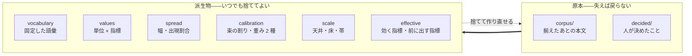

# カセットの構造

ある人の、ある場面についての一切を 1 つに収めた入れ物を <strong>カセット</strong>と呼ぶ。

[評価](../spec/200-extract.md)が作り、[検め](../spec/300-revise.md)が読む。

## 何を収めるか

仕様が[3 つに分けて持つ](../spec/200-extract.md#3-つに分けて持つ)と決めている。<strong>作り直せる
かどうかが、そのまま構造になる。</strong>

| | 作り直せるか | 失うとどうなるか |
| --- | --- | --- |
| <strong>揃えたあとの本文</strong> | <strong>できない。</strong> 元のファイルは手元に無い | 全部が終わる |
| <strong>人が決めたこと</strong> | <strong>できない。</strong> 人の頭の中にしかない | 同じ判断をやり直す |
| 派生物（値・語彙・重み・目盛り） | できる。本文と設定から何度でも | 測り直せばよい |

<strong>捨ててよいものを、捨てにくい場所に置かない。</strong> 置けば測り直しをためらうようになり、
[集合が増えたときに測り直す](../spec/200-extract.md#作り直せるようにする)という前提が
崩れる。



## 容器は zip

| | なぜ |
| --- | --- |
| 1 ファイルで扱える | 人が持ち運び、渡し、消せる |
| <strong>索引がある</strong> | 中の 1 つだけを読める。全部を展開しない |
| <strong>差し替えができる</strong> | 派生物だけ作り直して入れ替える |

tar は索引を持たないので、1 つ読むのに全部を舐める。<strong>派生物を差し替えるたびに全体を
書き直すことになる。</strong>

拡張子は `.kakiburi`。

## 中身

```
manifest.json              版・場面・指紋
decided/                   人が決めたこと（作り直せない）
  scene.json                 場面
  boilerplate.json           落とす定型
  topic-pairs.json           題材の近い組
  baseline.json              基準の作り方
corpus/                    揃えたあとの本文（作り直せない）
  person/<id>.json           本人の文書。正規形
  baseline/<id>.json         基準の文書。正規形
  other/<id>.json            他人の文書。正規形。無くてよい
derived/                   派生物（作り直せる）
  vocabulary.json            固定した語彙
  values.jsonl               単位 × 指標の値
  spread.json                幅・出現割合
  calibration.json           束の割り、交差検証の重み、本番の重み
  scale.json                 天井・床・帯（照合値と人らしさ値）
  effective.json             効く指標の判定、前に出す指標
```

<strong>3 つのディレクトリが、そのまま 3 つの層である。</strong>`derived/` を丸ごと消しても、
`corpus/` と `decided/` があれば同じものが作り直せる。<strong>それが正しく成り立つことは
[試験する](300-test.md#作り直せることを試験する)。</strong>

## manifest.json

```json
{
  "version": 1,
  "scene": "技術記事",
  "fingerprint": "sha256:...",
  "fingerprint_inputs": { ... },
  "provisional": ["題材が揃っていない"]
}
```

<strong>`provisional` が空でないカセットは、判定に但し書きが付く。</strong>
[題材を揃えられなかった](../spec/200-extract.md#2-つを同じ題材の統制で作る)ときに立つ。

### 指紋は組み立てを型で守る

仕様が<strong>「一部だけを混ぜない」</strong>と警告している。混ぜ忘れても<strong>エラーにならず、古い値が
黙って使われる</strong>。

<strong>だから指紋を作る関数は、全部の材料を引数に取る。</strong> 1 つでも欠ければ組み立てられない。

| 材料 | どこから |
| --- | --- |
| 指標の定義そのもの | 登録簿 |
| 固定した語彙 | `derived/vocabulary.json` |
| 形態素解析器の辞書と版 | 実行環境 |
| <strong>係り受け解析器の辞書と版</strong> | 実行環境 |
| 圧縮器と設定 | 実行環境 |
| 取り込み元の種類・変換の実装と版・対応表 | `decided/` と実行環境 |
| 基準の LLM の版と推論設定 | `decided/baseline.json` |
| 人が決めたこと | `decided/` 全部 |

<strong>`fingerprint_inputs` に材料を平文で残す。</strong> ハッシュだけでは、変わったことは分かって
も <strong>何が変わったか</strong>が分からない。

## corpus/ — 正規形

<strong>正規形が原本である</strong>（[正規化](../spec/030-normalize.md#正規形が原本である)）。

node の木をそのまま JSON にする。<strong>往復は目的ではない</strong>ので、記法の情報は持たない。

```json
{
  "id": "2026-03-14-cassette",
  "unit": "2026-03-14-cassette",
  "source": { "kind": "github-markdown", "impl": "kakiburi-normalize", "version": "0.1.0" },
  "root": { "type": "段落", "children": [ ... ] }
}
```

<strong>1 文書 1 ファイルにする。</strong> 足すのがファイルを 1 つ増やすことで済み、zip の索引が効く。

### 役は 3 つ

| | |
| --- | --- |
| `person/` | 本人の文書 |
| `baseline/` | 基準（LLM の既定出力） |
| `other/` | <strong>他人の文書。無くてよい</strong> |

<strong>`other/` を最初から置くのは、あとから足すと形式の変更になるからである。</strong> 使い道が
2 つある——[他人に対する床](../spec/200-extract.md#他人が手に入るなら床をもう-1-つ置く)と、
[人らしさの人の側](../spec/200-extract.md#人らしさの境目は同じ材料から出る)の水増しである。
どちらも仕様が「手に入るなら」「素材が足りなければ」と条件付きで許している。

### 短い文書は束ねる

<strong>[1 文書では指標が意味を持たないほど短いものは、何本かをまとめて 1 単位にする](../spec/200-extract.md#単位は-1-文書)。</strong>
チャットの場面では例外ではなく普通のことになる。

<strong>だからファイルの id と、測る単位の id を分ける。</strong> 束ねた文書は同じ `unit` を持つ。

| | 何を指すか |
| --- | --- |
| `id` | 取り込んだ 1 本。ファイル 1 つ |
| `unit` | 測る 1 単位。束ねなければ `id` と同じ |

<strong>束ね方は人が決める</strong>——文章から当てにいかない。<strong>束の中の並びは `id` の昇順に固定する。</strong>
並びが変われば連結した本文が変わり、[決定性](300-test.md#決定性)が壊れる。

<strong>[文書 5 本の下限](../spec/200-extract.md#対が何本あれば信じるか)は単位で数える。</strong>
ファイルで数えれば、束ねた分だけ実際より多く見える。

> [!WARNING]
> <strong>[変換規則を変えると戻れない](../spec/030-normalize.md#変換規則を変えると戻れない)。</strong>
> 元のファイルが無いので、本文は作り直せない。規則を変えたカセットと変える前のカセット
> を <strong>混ぜて評価しない</strong>。指紋がそれを示す印になる。

## derived/ — 派生物

### values.jsonl

1 行が <strong>1 単位 × 1 指標</strong>。

```json
{"unit":"2026-03-14-cassette","metric":"三点リーダ","value":1.8}
{"unit":"2026-03-14-cassette","metric":"接続詞直後の読点・が・文中","value":0.62}
{"unit":"2026-03-14-cassette","metric":"読点の打ち方","vector":[...]}
{"unit":"2026-03-14-cassette","metric":"文字種","excluded":"日本語 200 字未満"}
```

<strong>測れなかったことを、値ではなく `excluded` で書く。</strong> 0 を書けば「使わなかった」と
区別が付かなくなる（[0 と測れないを区別する](../spec/030-normalize.md#対応表は取り込み元ごとに持つ)）。

<strong>行を足すだけで済む形にする。</strong> 指標が増えても、既存の行を書き換えない。

### spread.json

<strong>幅と出現割合。</strong> 値から導けるが、<strong>導く側を 1 つに固定するために置く</strong>——
[検め](000-architecture.md#kakiburi-review)が読み込みながら計算すると、当てはめる手続きを
持たないという境界が曖昧になる。

<strong>[2 つの規則のどちらで下端を見るか](../spec/200-extract.md#下限は使った割合で見る)は
単位で決まる</strong>ので、ここには結果だけが入る。

### calibration.json

<strong>重みは 2 種類ある</strong>（[理由](../spec/200-extract.md#検めに使う重みは別に作る)）。混同すると
判定がどこでも狂う。

| | 何に使うか |
| --- | --- |
| 交差検証の k 通り | <strong>帯を作る</strong> |
| <strong>本番の重み</strong> | <strong>[検め](000-architecture.md#kakiburi-review)が新しい文書を採点する</strong> |

<strong>束の割りは `id` の昇順から決定的に導く。</strong> 無作為に割ると、
[作り直したときに同じものが出ない](300-test.md#作り直せることを試験する)——しかも
少しだけ違う帯が出るので、気付きにくい。<strong>保存するのは覗くためであって、正本ではない。</strong>

### effective.json

<strong>効く指標の判定と、[前に出す指標](../spec/300-revise.md#3-種類を合わせて通るを出す)。</strong>

| 指標ごとに持つもの | |
| --- | --- |
| 幅が狭いか | 条件 1 |
| 基準から離れているか | 条件 2 |
| <strong>指示して動くか</strong> | 条件 3。`動く` / `動かない` / <strong>`未知`</strong> |
| 標本の範囲が覆えているか | 覆えていなければ条件 1・2 を出さない |
| 確かめられていないか | [狭いだけで信じない](../spec/200-extract.md#狭いだけで信じない) |

<strong>条件 3 は[検めから返ってくる](../spec/010-strategy.md#運用に入ると戻る線が-2-本できる)。</strong>
初回は全部 `未知` で、`未知` は前に出す指標に入る——動かないと分かってから外す。

<strong>この列があることが、戻る線 1 本目の受け皿である。</strong> 無ければ「動かないものを枠から
外す」が永久に実行できない。

### 規模が問題になったら、ここだけ替える

文書が増えれば `values.jsonl` が最初に重くなる。<strong>zip は部分差し替えができるので、
このファイルだけを別形式にできる。</strong> 容器も、ほかの層も、触らない。

<strong>いま替えない。</strong> replace する前に、[測るのを安くする](../spec/100-metrics.md#測るのを安くする)
が求める 3 つ——1 本を測る、2 本を比べる、分布を出す——が実際に遅いことを確かめる。

## 何を入れないか

| | なぜ |
| --- | --- |
| <strong>元のファイル</strong> | [収集は軸の外](../spec/000-axis.md#だからしないこと)。原本は正規形である |
| <strong>検める対象の文書</strong> | カセットはその人を表すもので、検める対象は毎回違う |
| <strong>周回の草稿</strong> | 直した草稿はその場のものである（[ただし](#周回のあいだの観測は外でやる)） |
| <strong>除外の上書き</strong> | 除外は[指標の定義](../spec/100-metrics.md#除外の既定)が持つ。カセットごとに変えない |

<strong>除外を `decided/` に置かないのは、それが人ではなく指標の性質だからである。</strong> 仕様が
「人が決めたこと」に除外を数えているのは、既定を導き直すのが人だという意味であって、
<strong>カセットごとに違う値を持てるという意味ではない</strong>。指紋には「指標の定義そのもの」の
一部として入る。

### 周回のあいだの観測は外でやる

<strong>[直すと差が均されるのを見張る](../spec/300-revise.md#直すと差が均されるのを見張る)</strong>には、
別々の文書を同じ周回数だけ回したものどうしの散らばりが要る。<strong>これはカセットに入れない。</strong>

周回の草稿はその場のもので、原本ではない。<strong>散らばりは[比べる](200-command.md#覗く)で
外から見る</strong>——n 周した A・B・C を並べて渡し、天井と比べる。

<strong>カセットに履歴を持たせない理由は、持たせると原本が増えるからである。</strong> 作り直せない
ものが増えるほど、測り直しが重くなる。

## 1 カセット 1 場面

<strong>場面をまたいで 1 つにしない</strong>（[場面ごとに閉じる](../spec/010-strategy.md#場面ごとに閉じる)）。

同じ人の技術記事とチャットは <strong>別のカセット</strong>になる。語彙も重みも帯も別に作られるので、
1 つに入れれば「どちらのものでもない」ものが混ざる余地ができる。

<strong>この縛りが効くのは照合の側だけである。</strong> 人らしさの人の側は、仕様が
[場面を跨いでよい](../spec/200-extract.md#人らしさの境目は同じ材料から出る)と明示している
——場面は人と機械の別を跨がないからである。<strong>`other/` の文書は、その用途に限って別の場面
から入れてよい。</strong> 入れたことは `decided/` に残す。

<strong>人とカセットも 1 対 1 ではない。</strong> 束ねる仕組みは持たない——ファイルを並べれば済む。
