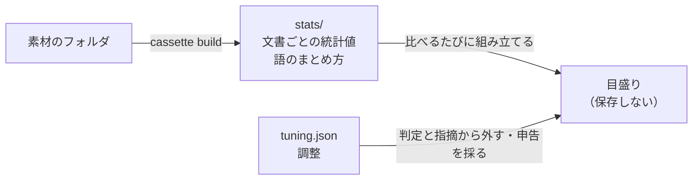

# カセットの構造

1 つのフォルダの文書を測った統計値を、1 つに収めた入れ物を カセット と呼ぶ。

`cassette build` が作り、`review` と `cassette diff` が 2 つ読んで目盛りを組み立てる
（[評価](../spec/200-extract.md#目盛りを作る)）。本人のカセットも基準のカセットも同じ形で
ある。本人の側として使うか基準の側として使うかは、渡す引数の位置で決まる。

## 何を収めるか

仕様が[素材を正本にする](../spec/200-extract.md#素材を正本にする)と決めている。作り直せる
かどうかが、そのまま構造になる。

| | 作り直せるか | 失うとどうなるか |
| --- | --- | --- |
| 揃えたあとの本文 | 持たない。素材のフォルダが正本である | — |
| 目盛り | 持たない。比べるたびに組み立てる | — |
| 統計値（文書ごとの値と語のまとめ方） | できる。素材のフォルダから何度でも | 測り直せばよい |
| 調整（無効にした対象、一人称と文体の申告） | できない。人が決めたことである | 同じ判断をやり直す |

捨ててよいものを、捨てにくい場所に置かない。置けば測り直しをためらうようになり、
[集合が増えたときに測り直す](../spec/200-extract.md#作り直せるようにする)という前提が
崩れる。



カセットの中に原本は 1 つしかない。`tuning.json` だけが、失えば戻らない。

## 容器は zip

| | なぜ |
| --- | --- |
| 1 ファイルで扱える | 人が持ち運び、渡し、消せる |
| 索引がある | 中の 1 つだけを読める。全部を展開しない |

tar は中央の索引を持たないので、目当ての entry までヘッダを 1 つずつ辿ることになる。
圧縮した tar では、そこまでを伸長しなければ辿れない。

選んだのは部分「読み」であって、部分「書き」ではない。書くほうは zip でも全体を作り
直す。索引が末尾にあるので、中の 1 つを差し替えれば索引が動く。追記して古い実体を残す道も
あるが、捨てたはずの統計値がファイルの中に残るので採らない。調整だけを書き換えるときも、
全体を書き直す。

拡張子は `.kb`。

### 書くときは、壊さないことを優先する

カセットは[原本](#何を収めるか)を含む。失えば戻らないものを、書き込みのたびに上書きして
いる。途中で落ちれば、そこで終わる。

| | どうするか |
| --- | --- |
| 1 | 同じディレクトリの一時ファイルへ書き切る。既存のファイルを切り詰めない |
| | 名前は書き手ごとに変え、まだ無いときだけ作って開く（下記） |
| 2 | 一時ファイルを fsync する |
| 3 | 読み直して[全部を検める](#置き換える前に何を検めるか) |
| 4 | rename で置き換える |
| 5 | 親ディレクトリを fsync する。ここまでで置き換えが残る |
| 4 の前に失敗したら | 一時ファイルを消す。元のカセットは無傷である |
| 4 のあとに失敗したら | 置き換えは済んでいる。元へは戻さない |

rename だけでは足りない。置き換えが原子的かどうかも、電源が落ちたあとに残るかも、
OS とファイルシステムで違う。

前提を書く。POSIX の `rename` が同じディレクトリの中で原子的に置き換えること、
`fsync` が返れば書いたものが残ること、そして sidecar への `flock` が効くこと。macOS の
APFS と Linux の ext4 / btrfs / xfs を対象とする。ネットワーク越しのファイルシステム
は対象にしない。どれも保証が違う。

段によって守れるものが違う。

| どこで落ちたか | 何が残るか |
| --- | --- |
| 4 の前 | 古いカセット。一時ファイルが残ることがある |
| 4 と 5 のあいだ | 見えているのは新しいカセット。電源が落ちれば古いほうに戻りうる |
| 5 のあと | 新しいカセット |

rename が済んだら、もう戻らない。4 のあとで失敗しても、元へ巻き戻す道は持たない。
そこから先で守るのは「壊れていないこと」だけである。新しいほうが見えても古いほうが
残っても、読めるカセットが 1 つある。それがここで守れることの全部である。

残った一時ファイルは、次に書くときに片づける。放っておくと、置き換えの途中まで進んだ
zip がディレクトリに溜まる。

一時ファイルの名前は書き手ごとに変える。固定名にすると 2 つが同時に壊れる。

| 固定名だと | |
| --- | --- |
| 先に symlink を置かれる | 開いた時点でその先を切り詰める |
| 片づけが他人のものを消す | 書いている最中の一時ファイルを消され、相手の検めか置き換えが失敗する |

まだ無いときだけ作って開く。既に在るものを開かないので、symlink も追わない。

片づけるのは錠を持っているあいだだけである。持っていれば、ほかの書き手が居ないと言い
切れる。だから隣の一時ファイルは全部、誰かが落とした跡である。

読むだけの側は片づけない。錠を取らない側は、書いている最中のものと落ちた跡を見分け
られない。消せば相手の検めか置き換えを失敗させられる。

拾うのは自分が作る形のものだけである。前置きが合うだけで消すと、`<カセット>.tmp.backup`
のような人が置いたファイルを黙って消す。

#### 置き換える前に、何を検めるか

「開けた」では足りない。中央の索引が読めても、その先の entry が壊れていることはある。
置き換える前に全部読む。

- entry の名前が重複していない
- すべての entry を読み切り、CRC を照合する
- JSON がすべて構文として通り、同じ鍵が 2 度現れない
- 必ずあるはずの entry が全部ある（`manifest.json`、`tuning.json`、`stats/documents.jsonl`、`stats/lexicon.json`）
- その `version` の形に合っている
- 中身のハッシュが `stats/` の中身と合う
- 場面を名乗っている。[`manifest.json` が正本である](#manifestjson)

1 つでも欠ければ置き換えない。一時ファイルを消して、そこで止める。

JSON の重複鍵まで見るのは、読み手によって拾う値が変わるからである。`version` が
2 つ書かれた `manifest.json` は、どちらを読むかで別のカセットになる。

#### 同時に書かない

2 つのコマンドが同時に完全な zip を rename すると、片方の変更が正常終了のまま消える。
落ちるより悪い。誰も気付かない。調整のサブコマンドを 2 つ続けて打つ使い方は普通に
あるので、ここは起きうる。

カセットの隣に置いた錠を押さえてから書く。カセット本体を押さえてはいけない。置き換えで
ファイルが入れ替わるので、押さえた先が古いほうに取り残される。

錠は書き込みのあいだだけ持つ。押さえられなければ断る。

錠は OS に持たせる（`flock`）。目印ファイルを作って終了時に消す形にすると、SIGKILL・
abort・電源断で消す処理が動かず、以後すべての置き換えが永久に断られる。直す道が
「手で消す」しかなくなる。目印ファイルが在ることではなく、押さえられていることで断る。

sidecar は消さない。消す隙に別の書き手が同じ名前を作れば、2 つの錠が別の実体を押さえる
ことになる。中身は空のままでよい。

読んでから書くまでのあいだは、世代で見る。`manifest.json` に書くたびに 1 つ増える番号を
持ち、読んだときの番号と、置き換える直前の番号が同じことを確かめる。違えば断る。

新しく作るときだけ、世代では守れない。相手が何世代目かではなく、相手が居ること自体が
断る理由になる。

「在るか見てから置き換える」では足りない。見てから置き換えるまでのあいだに誰かが作れば
踏むし、錠は助言的なので押さえていない相手は止められない。公開の仕方そのものを変える。
作るときは `rename` ではなく `hard_link` で名前を付け、成功したら一時ファイルの名前を外す。
「既に在れば失敗する」を OS が保証する。同じディレクトリに置いた一時ファイルなので、必ず
同じファイルシステムである。

| | どう公開するか | なぜ |
| --- | --- | --- |
| 置き換える | `rename` | 既存を原子的に差し替える。それが目的である |
| 作る | `hard_link` して一時を外す | 既に在れば失敗する。`rename` は黙って踏む |

錠を読み始めから持たないのは、そこまでしなくても失われないからである。守りたいのは
「片方の変更が正常終了のまま消える」ことであって、同時に読むこと自体ではない。世代が
それを捕まえる。読み直して、やり直せばよい。

[指紋](#指紋は組み立てを型で守る)を使ってはいけない。指紋は測った条件を表すもので、
調整を書き換えても変わらない。世代を見なければ、上書きが正常終了のまま消える。

#### 上書きの事故は素材の側へ移った

[素材を正本にした](../spec/200-extract.md#素材を正本にする)ので、カセットには入れ替える
先が無い。同じ名前の文書を 2 度取り込んで原本が 1 本消える、という経路はここから
消えた。原本はフォルダの側にある。

単位の名前はファイル名である（[仕様](../spec/200-extract.md#単位は-1-文書)）。だから
衝突はファイルシステムが断る。フォルダの下の階層にある同名のファイルは同じ単位名になる。
分けたいならファイル名を分ける。

## 中身

```
manifest.json              版・世代・場面の名前・指紋・中身のハッシュ
tuning.json                調整（作り直せない）
stats/                     統計値（素材から作り直せる）
  documents.jsonl            文書ごとの統計値
  lexicon.json               語のまとめ方
```

階層は原本と統計値を分けるためだけにある。場面で割る階層は要らない。1 カセットが
[1 つのフォルダ](#1-カセット-1-場面)だからである。

本文を持たない（[素材を正本にする](../spec/200-extract.md#素材を正本にする)）。
目盛りも持たない（[目盛りも派生物である](../spec/200-extract.md#目盛りも派生物である)）。
`stats/` を丸ごと消したら、素材のフォルダから作り直す。それが正しく成り立つことは
[試験する](300-test.md#作り直せることを試験する)。

## manifest.json

```json
{
  "version": 5,
  "generation": 7,
  "scene": "技術記事",
  "content_hash": "sha256:...",
  "fingerprint": "sha256:...",
  "fingerprint_inputs": { ... }
}
```

原本なのは `version`・`generation`・`scene` の 3 つだけである。残りは `cassette build` が
書く。ファイル単位ではなく欄単位で分ける。1 つのファイルに両方が入っているので、
「manifest は原本」とも「統計値」とも言えない。

| 欄 | どちら |
| --- | --- |
| `version` `generation` `scene` | 原本 |
| `content_hash` `fingerprint` `fingerprint_inputs` | `cassette build` が書く |

場面は `manifest.json` が正本である。欠けていたら断る。空に丸めれば、どの場面のカセットか
分からないまま検めが通る。場面の名前は名札であって、組み立てるときに本人と基準の名前が
違っても断らない（[場面ごとに閉じる](../spec/010-strategy.md#場面ごとに閉じる)）。出力に両方を
並べる。

`content_hash` は `stats/` の中身のハッシュである。基準として渡したときに、どの基準かを
名指すのに使う（[同じ基準カセットで比べる](../spec/200-extract.md#同じ基準カセットで比べる)）。
調整は入れない。調整は測った値を変えず、基準として渡したときには使われないからである。

### 読めない版は、読まずに断る

`version` は読む側が確かめる。知らない版のカセットを開いてはいけない。

版を見る前に、容器を検める。zip は同じ名前の entry を複数持てるので、`manifest.json` が
2 つあるカセットを作れてしまう。どちらの `version` を見たかで挙動が変わる。

| 段 | 確かめること | 通らなければ |
| --- | --- | --- |
| 1 | entry の名前が重複していない | 壊れているとして断る |
| 2 | `manifest.json` がちょうど 1 つある | 同上 |
| 3 | `version` が読める | 同上 |
| 4 | その `version` を知っている | 知らない版として断る |

4 つを別の理由として返す。まとめると、壊れたカセットと新しすぎるカセットが同じ顔に
なる。前者は作り直しで、後者は道具の更新である。

知らない版を「たぶん読める」と読まない。欠けた項目は空として通り、
[空と欠けの区別](../spec/200-extract.md#検めに渡すものをここで全部決める)がそこで崩れる。
そして崩れたことはエラーにならない。

版は、形か意味が非互換に変わったときに上げる。形だけではない。同じ JSON でも、必須か
どうか、単位、列挙の解釈が変われば、古い読み手は間違った値を読む。

古い版を読み続けるなら、その版の形を覚えておく。覚えないなら、移し替える道を用意する。
どちらも持たないまま版だけ上げると、既存のカセットが全部読めなくなる。

いまの版は 5 である。目盛りを持たなくなり、文書ごとの統計値と調整を持つ形になった。
版 4 とは形が違う。古い版を読む道も、移し替える道も持たない
（[古いカセットは読み戻さない](#古いカセットは読み戻さない)）。

版は整数として厳密に読む。丸めて通せば、名乗っていない形を名乗った形として扱うことに
なる。

### 指紋は組み立てを型で守る

仕様が「一部だけを混ぜない」と警告している（[指紋](../spec/200-extract.md#何で測ったかを指紋にする)）。
混ぜ忘れてもエラーにならず、古い値が黙って使われる。

だから指紋を作る関数は、全部の材料を引数に取る。1 つでも欠ければ組み立てられない。
材料が増えれば型が変わり、既存の呼び出しがコンパイルで止まる。

| 材料 | どこから |
| --- | --- |
| 指標の定義そのもの | 登録簿 |
| 数える単位の定義（地の文に何が入るか、日本語の文字の範囲と Unicode の版） | 実装 |
| 形態素解析器と辞書の版 | 実装（[同梱する](../spec/100-metrics.md#解析器は同梱する)） |
| 係り受け解析器の辞書と版（[保留中](../spec/metrics/文節パターン.md#保留)。使うと決めたら要る） | 実装 |
| 圧縮器と設定 | 実装 |
| 窓の大きさ・下限・言い回しの長さの設定、語のまとめ方の線 | 実装 |
| 外部の表の版（語の文体値、文末表現の辞書、Unicode） | 実装 |
| 取り込み元の種類・変換の実装と版・対応表 | 素材と実装 |
| 統計値の中身のハッシュ | `stats/` |

`fingerprint_inputs` に材料を平文で残す。ハッシュだけでは、変わったことは分かっても
何が変わったかが分からない。

指紋は 2 つの場面で見る。

| いつ | 何と照らすか | 合わなければ |
| --- | --- | --- |
| カセットを読むとき | 今の道具が出す材料（中身のハッシュを除く） | 使う前の問題として断る。作り直すか、道具の版を合わせる |
| 目盛りを組み立てるとき | もう片方のカセットの材料（中身のハッシュを除く） | 同上。解析器や定義の違う 2 つを並べない |

合わないときは、違う材料の名前を並べて出す。

較正の設定と閾値は指紋に入れない。統計値を変えないからである。入れれば、閾値を
1 つ動かしただけで全部のカセットが使えなくなり、作り直せない人からもらったカセットが
そこで捨てられる。較正の設定は、判定と一緒に `--json` に平文で出す
（[仕様](../spec/200-extract.md#較正の設定は判定と一緒に平文で出す)）。

## tuning.json

調整を持つ。作り直せない原本である。

```json
{
  "mute": {
    "指標": ["強調", "コードブロック"],
    "型": ["どうも、〜です。"],
    "基準の型": [],
    "基準の語": ["地味"]
  },
  "mute_kinds": ["基準の型"],
  "first_person": "僕",
  "register": null
}
```

| 欄 | 中身 | 空のとき |
| --- | --- | --- |
| `mute` | 種類ごとに、無効にした対象。指標は名前で、型・基準の型は言い回しの文字列で、基準の語は語彙素で持つ | 何も無効にしていない |
| `mute_kinds` | 種類ごと無効にしたもの | 同上 |
| `first_person` | 申告した一人称 | `null`。数えた結果を使う |
| `register` | 申告した文体。`polite` か `plain` | `null`。数えた結果を使う |

型と基準の型は、ID ではなく文字列で持つ。ID は[一覧](200-command.md#cassette-list)で
指しやすくするための短い名前で、文字列から決まる。持つのは元の文字列のほうである。

型・基準の型・基準の語は、組み立てるまで決まらない。どれが出るかは基準によって変わる。
そのため、無効にした言い回しは、今の組み合わせで出ていなくても捨てない。別の基準と
組み合わせたときに出てくれば、そこで効く。

指標の名前は登録簿と照らす。`cassette build` で作り直したときに、無効にした指標の名前が
今の登録簿に無ければ、知らせて捨てる。捨てずに残すと、綴りの合わない名前がいつまでも
何も無効にしないまま残る。

欠けを既定で埋めない。`tuning.json` が無い、または欄が無いカセットは壊れているとして断る。
空で通せば、次に書いたときに作り直せない判断が空として確定する。落ちるより悪い。
空の値は正しい状態である（調整していなければ全部空で書かれる）が、欄そのものが無いのは
壊れている。

知らない値も捨てない。`register` に `polite` でも `plain` でも `null` でもない値があったら
断る。捨てれば、申告したはずの文体が数えた結果に戻る。書き換えたつもりのものが黙って
戻る。

調整は本人の側として使うときにだけ効く。基準として渡したカセットの `tuning.json` は
読むが、使わない（[素材を正本にする](../spec/200-extract.md#素材を正本にする)）。

## stats/ — 統計値

### documents.jsonl

1 行が 1 文書である。持つものは[仕様の表](../spec/200-extract.md#文書ごとの統計値を持つ)が
決める。

```json
{"unit":"2026-03-14-cassette","chars":3120,"chars_masked":2988,"commas":141,"tokens":2270,"nodes":58,
 "polite_share":0.94,"content_words":["カセット","目盛り", ...],
 "systems":{"文字 bigram":{"の。":12, ...}, "機能語":{...}, ...},
 "windows":{"エントロピー":[[...],[...]], ...},
 "directives":{"三点リーダ":{"value":1.8,"num":6,"den":3.12,"floor":1.0},
               "文字種":{"excluded":"下限未満"}},
 "phrases":[{"text":"と思います。","first":0.42,"count":3,"nodes":[4,17,40]}, ...],
 "lexemes":{"地味":2, ...},"first_person":{"僕":5}}
```

測れなかったことを、値ではなく `excluded` で書く。0 を書けば「使わなかった」と区別が
付かなくなる（[0 と測れないを区別する](../spec/030-normalize.md#対応表は取り込み元ごとに持つ)）。

系統の頻度は語彙で切らない。語彙は組み立てるときに、2 つのカセットを見てから選ぶ
（[語彙は先に決めて、固定する](../spec/200-extract.md#語彙は先に決めて固定する)）。

指示できる指標は、値と一緒に分子・分母・下限を持つ。束ねた単位の値を
[足し合わせで作る](../spec/200-extract.md#短い文書は束ねる)ためである。人らしさの指標は
窓ごとの値を持つ。束ねた単位で窓が文書の境目をまたがないようにするためである。

行の並びは単位名の昇順にする。同じフォルダからは同じバイト列が出る。

### lexicon.json

語のまとめ方を持つ。このカセットの文書から見つけたものである
（[コーパスから語を見つける](../spec/200-extract.md#コーパスから語を見つける)）。

草稿を検めるときは、本人のカセットのものを使う。基準のカセットのものは、基準の文書を
測ったときに使ったきりで、組み立てるときには読まない。

## 同梱の基準カセット

同梱の基準は、カセットとして実行ファイルに埋め込む。`--baseline` を省いたときに使う。

埋め込むのはリポジトリに置いたカセットのファイルである。`baselines/` の文書から
`cassette build` で作り直したものと一致することを[試験で確かめる](300-test.md#同梱の基準カセット)。
実行ファイルだけで `review` が動き、リポジトリが手元に無くてもよい。

同梱の基準も普通のカセットと同じ形である。`cassette show` で中身を見られ、`cassette diff`
で本人のカセットと比べられる。

## 素材 — カセットの外

本文は持たない（[素材を正本にする](../spec/200-extract.md#素材を正本にする)）。
測るときに素材のフォルダを読み、[正規形](../spec/030-normalize.md#正規形が原本である)へ直し、
統計値を取って捨てる。

単位の名前は統計値に残る。どの単位が何本あったかは読み戻せる。本文は戻らない。
文章の断片は残る（[本文を持たない](../spec/200-extract.md#本文を持たない)）。

### 短い文書は束ねる

[基準の文書は、本人の長い記事に長さを届かせるために何本かをまとめて 1 単位にすることがある](../spec/200-extract.md#短い文書は束ねる)。
束ねるのは目盛りを組み立てるときで、カセットには束ねる前の文書ごとの統計値だけが入る。
本人の文書は束ねない。本人の短い記事をまとめたいなら、使う側がファイルを繋いで 1 本にする。

束の中の並びは短い順（同じ長さなら単位名の順）である。並びが変われば node の並びが変わり、
[決定性](300-test.md#決定性)が壊れる。

束ねた単位の名前は、中の単位名を束の中の並びのまま `+` で繋いだものである。

[10 単位の下限](../spec/200-extract.md#対が何本あれば信じるか)は束ねたあとの単位で数える。
文書で数えれば、束ねた分だけ実際より多く見える。

## 人からもらったカセット

カセットを人に渡せば、統計値と調整が一緒に渡る。

| 操作 | 自分で作ったカセット | 人からもらったカセット |
| --- | --- | --- |
| `review` の本人側・基準側として使う | できる | できる |
| `cassette mute` `first-person` `register` | できる | できる。測り直しが要らない |
| `cassette build` し直し | できる | できない。素材が無いので測り直せない |

作り直せないので、道具の版が変わって[指紋](#指紋は組み立てを型で守る)が合わなくなると、
もらったカセットは使えなくなる。そのときは、作った人に作り直してもらう。

## 何を入れないか

| | なぜ |
| --- | --- |
| 元のファイル | [収集は軸の外](../spec/000-axis.md#だからしないこと)。正本は使う側の手元にある素材のフォルダで、カセットは写しを持たない |
| 目盛り | 比べる相手が決まるまで作れない。持てば特定の基準に縛られる |
| 検める対象の文書 | カセットはフォルダの文書を表すもので、検める対象は毎回違う |
| 周回の草稿と、動いたかの記録 | 直した草稿はその場のものである（[ただし](#周回のあいだの観測は外でやる)） |
| 落とす定型 | 使う側が素材から消す（[定型を落とす](../spec/200-extract.md#定型を落とす)） |
| 除外の上書き | 除外は[指標の定義](../spec/100-metrics.md#除外の既定)が持つ。カセットごとに変えない |
| 人が足す固有名詞 | 語のまとめ方は自動で見つける。人が触ると、調整の中で 1 つだけ測り直しが要るものになる |

除外を調整に置かないのは、それが人ではなく指標の性質だからである。指紋には「指標の定義
そのもの」の一部として入る。

### 周回のあいだの観測は外でやる

[直すと差が均されるのを見張る](../spec/300-revise.md#直すと差が均されるのを見張る)には、
別々の文書を同じ周回数だけ回したものどうしの散らばりが要る。これはカセットに入れない。

周回の草稿はその場のもので、原本ではない。散らばりは[草稿を並べて検める](200-command.md#草稿を並べる)
ことで外から見る。n 周した A・B・C を並べて渡すと、天井と比べた散らばりを `--json` に出す。

動いたかの記録も持たない。指示して動かない指標は、使う人が[無効にする](../spec/300-revise.md#動かない指標は使う人が無効にする)。

カセットに履歴を持たせない理由は、持たせると原本が増えるからである。作り直せないものが
増えるほど、測り直しが重くなる。

## 1 カセット 1 場面

1 カセットが、1 つのフォルダの、1 つの場面である。入れ物が場面の境界そのものになる。

| | |
| --- | --- |
| カセットの同一性 | 中身のハッシュ（統計値）と、調整 |
| 場面 | カセットの属性。名札である |
| 統計的な閉じ方 | 場面ごと。1 つのフォルダに場面を混ぜない |

[場面ごとに閉じる](../spec/010-strategy.md#場面ごとに閉じる)は変えていない。語彙も重みも帯も、
本人の側は 1 つのフォルダから作る。根拠がある。同じ人でも役割が変われば +0.77、違う人でも
役割が同じなら +0.85（[水上ほか 2014](../references/mizukami-2014.md)）。

目盛りは本人と基準の 2 つのカセットから組み立てる。基準のカセットの場面は、本人の場面と
違ってもよい。道具は名前の食い違いでは断らず、組み合わせは使う人に任せる。

### 一度まとめて、また分けた

以前は 1 つのカセットに場面ごとの束（トラック）を持たせていた。分けた理由を、そのとき
挙げた利点と突き合わせる。

| まとめた理由 | 実際どうだったか |
| --- | --- |
| 人らしさの本人の側に、場面を跨ぐ素材を回せる | その素材は一度も入らなかった。口だけが残った |
| 「本当に 1 場面か」を測れる | 場面が 1 つなら走らない。1 度に作るのは 1 場面だけである |
| 場面ごとに道具が食い違わない | 指紋が環境と合うかは検めるたびに見る。そこで捕まる |
| 場面の取り違えを断れる | ここだけは失う。下に書く |

残ったのは、検めるたびに場面を打ち直す手間だけだった。

### 失うもの、守り方

取り違えを引数で止められなくなる。入れ物を選ぶことが場面の指定になるので、別の場面の
カセットを渡しても、道具から見れば正しい呼び出しである。

守り方は、黙らないことである。

- カセットは自分が何の場面かを持ち、検めるたびに本人と基準の両方が名乗る
  （[場面を指定させる](../spec/300-revise.md#場面を指定させる)）
- 名前は人が付ける。中身と合っている保証は無い。だから合っているかを人が見られるように
  出すのであって、道具が当てにいくのではない

跨いだ統計値を作る経路は、これで書けなくなる。1 つのカセットは 1 つのフォルダからしか
作れず、2 つのカセットを混ぜて 1 つにするコマンドも無い
（[跨ぐ道は 1 本に絞る](000-architecture.md#場面を跨ぐ道は-1-本に絞る)）。

### 古いカセットは読み戻さない

移行の道を持たない。統計値は[素材から作り直せる](../spec/200-extract.md#素材を正本にする)。
移行の道を持つと、作り直せないものが増える。

ただし調整は作り直せない。無効にした対象も、一人称と文体の申告も、人の頭の中にしか
ない。版を上げるたびに、そこは打ち直しになる。`cassette build` で作り直すときは調整を
引き継ぐが、版の違う古いカセットからは引き継がない。

それを承知で持たない。移行の道は版の数だけ増え、古い形を覚えているコードが永久に残る。
打ち直す手間のほうが安いあいだは、こちらを選ぶ。安くなくなったら考え直す。そのときは
移行ではなく、`tuning.json` だけを別に書き出して読み込む道になる。

版 4 のカセットが持っていた落とす定型と、動いたかの記録は、版 5 には対応するものが無い。
定型は素材から消し、動かない指標は無効にする。
