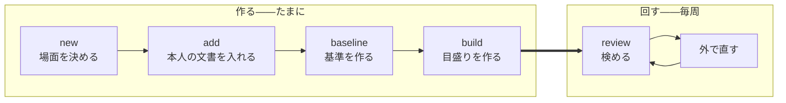

# コマンドの体系

人が触る面を決める。

<strong>[使うときはループになる](../spec/010-strategy.md#使うときはループになる)。</strong> 1 周を安く
することがそのまま品質になるので、<strong>周回に出てくるコマンドを最も短くする。</strong>

## 2 つに分かれる

| | いつ動かすか | 何をするか |
| --- | --- | --- |
| <strong>作る</strong> | 最初と、素材が増えたとき | カセットを組み立てる |
| <strong>回す</strong> | 毎周 | 検めて、直して、また検める |



<strong>`review` だけが周回に出てくる。</strong> ほかは素材が増えたときにしか動かさない。

## 作る

### new

```
kakiburi new <カセット> --scene <場面>
```

<strong>場面は人が指定する</strong>（[決定](../spec/010-strategy.md#場面ごとに閉じる)）。文章から当てに
いかないので、ここで必ず訊く。<strong>1 カセット 1 場面である。</strong>

### add

```
kakiburi add <カセット> <ファイル...> --source <取り込み元> --as person|baseline|other
                                 [--id <id>] [--unit <名前>]
                                 [--scene <場面> --use floor|humanness]
                                 [--model <名前> --version <版> --param <鍵>=<値>...]
```

[正規化](../spec/030-normalize.md)して入れる。<strong>取り込み元は内容から判定しない。</strong>
拡張子でも判定しない——Markdown 3 種は拡張子が同じである。`--source` だけで決める。

<strong>`--as` に既定を置かない。</strong> 役を間違えると[対照にしたはずの文書が書き手の帯に残る](../spec/200-extract.md#相手集合を-1-つ決める)。
<strong>いちばん高くつく取り違えに既定を与えない。</strong>

<strong>`--id` を省いたら、ファイル名の拡張子を除いた部分を `id` にする。</strong> 複数のファイルを
渡したときは 1 本ずつに当てる。<strong>`--id` は 1 本だけ渡すときにのみ書ける</strong>——複数に同じ
`id` は付けられない。

<strong>`id` はカセット全体で一意である</strong>（[検めること](100-cassette.md#足すことと差し替えることを分ける)）。
別のディレクトリの同名ファイルは <strong>そのままでは 2 本目を足せない</strong>ので、`--id` で分ける。

<strong>落ちない入力は断る</strong>（[決定](../spec/030-normalize.md#通らないものは断る)）。黙って
一部を落として通さない。<strong>1 本でも断ったら、そのコマンドは失敗する</strong>——成功したことに
すると、欠けたまま次へ進む。

<strong>`--as baseline` で入れるときは `--model` と `--version` が要る。</strong> 外で作った基準でも、
[版と推論設定が指紋に入る](../spec/200-extract.md#版と推論設定まで記録する)——記録の無い
基準で作った値は次に測ったときに比べられない。推論設定は `--param <鍵>=<値>`、
[題材](../spec/010-strategy.md#題材を統制する)は `--topic` で渡す。

<strong>作り方の違う基準は混ぜない。</strong> 既に入っている基準と `--model` か `--version` が
違えば <strong>断る</strong>。混ぜれば、測っているのが版の差になる——別のカセットにする。

<strong>`--unit` は短い文書を[束ねる](100-cassette.md#短い文書は束ねる)。</strong> 同じ名前を渡した
ものが 1 単位になる。チャットの場面では常用する。

<strong>`--as other` では `--scene` と `--use` が要る</strong>（[役は 3 つ](100-cassette.md#役は-3-つ)）。
他人の文書は用途によって場面の扱いが違うので、<strong>どちらに使えるかを入れるときに決める</strong>。
文章から当てにいかない。

<strong>`--use floor` は、カセットと同じ場面のときだけ受ける。</strong> 違えば断る——
[場面ごとに閉じる](../spec/010-strategy.md#場面ごとに閉じる)が床の側にだけ掛かる。

<strong>足す前に検める</strong>（[何を検めるか](100-cassette.md#足すことと差し替えることを分ける)）。
`id` が既にある、`unit` が別の役や別の取り込み元で使われている——どれも <strong>断る</strong>。
<strong>黙って上書きしない。</strong>

### 差し替える

```
kakiburi replace <カセット> --id <id> <ファイル> --source <取り込み元>
                            [--as person|baseline|other] [--unit <名前>]
                            [--scene <場面> --use floor|humanness]
                            [--model <名前> --version <版> --param <鍵>=<値>...]
```

<strong>`add` と同じ引数に `--id` が付く。</strong> 置き換える先をファイル名から当てにいかない——
<strong>取り込み直すときにファイル名が変わっていることは普通にある。</strong> 無い `id` を渡したら
断る。<strong>1 度に 1 本だけ置き換える。</strong>

<strong>操作を分けるのは、上書きを事故ではなく意思にするためである。</strong> `add` が上書きも
できると、<strong>同じ名前のファイルを 2 度取り込んだだけで原本が 1 本消える。</strong>

<strong>置き換えたあとも[束の中は揃っている](100-cassette.md#足すことと差し替えることを分ける)こと
を検める。</strong> 同じ `unit` の中で役や取り込み元がばらつけば断る。

<strong>置き換えも[丸ごと書き直して差し替える](100-cassette.md#書くときは壊さないことを優先する)。</strong>
途中の状態を残さない。

<strong>そして派生物を落とす。</strong> 本文が変われば値も目盛りも変わるが、<strong>指紋は測った条件を
表すものなので変わらない</strong>——落とさなければ、古い値が有効な顔で読まれる。
<strong>`add` も同じである。</strong> 落としたカセットは、`build` するまで
[判定できない](../spec/010-strategy.md#届かないときは判定できないと言う)を返す。

### decide

<strong>[人が決めたこと](100-cassette.md#何を収めるか)を書く。</strong> 場面のほかに 2 つある。

```
kakiburi decide <カセット> boilerplate <文字列...>
kakiburi decide <カセット> movement <指標> moves|stuck
```

<strong>落とす定型は、渡した一覧で置き換える。</strong> 足していく形にしない——<strong>いま何を落として
いるかが 1 度で読める</strong>ようにするためである。積み上げると、消すのに別の操作が要る。

<strong>知らない指標の名前は受けない。</strong> 綴りを間違えたまま書けば、直したつもりの指標が
いつまでも指摘に出続ける——<strong>エラーにならないので気付けない。</strong>

| | なぜコマンドが要るか |
| --- | --- |
| 落とす定型 | [場面ごとに人が決める](../spec/200-extract.md#定型を落とす)。文章から当てにいかない |
| <strong>指示して動くか</strong> | <strong>直させてみて初めて分かる。</strong> コーパスから導けない |

<strong>2 つ目が[戻る線 1 本目](../spec/010-strategy.md#運用に入ると戻る線が-2-本できる)の入口
である。</strong>[検めを 2 周](../spec/300-revise.md#直したら測り直す)して
<strong>その指標自身の値が</strong>動かなかったものを `stuck` にすると、次から
[前に出す指標](../spec/300-revise.md#3-種類を合わせて通るを出す)から外れる。

<strong>照合値が動かなかったことを根拠にしない。</strong> 照合値は 1 つの切り口には鈍く、指摘が正しく
通じても動かないことがある（[実測](../spec/300-revise.md#直したら測り直す)）。混ぜれば、
<strong>効いている指標を `stuck` にして捨てる。</strong>

<strong>書かないかぎり `未知` で、`未知` は前に出す指標に入る。</strong> 動かないと分かるまでは使う。

<strong>`decide movement` は周回の途中で打つ。</strong>「作る」に置いてあるのは、書き込む先が
[人が決めたこと](100-cassette.md#何を収めるか)だからであって、回し終えてから打つという
意味ではない（[周回を繋ぐ](../spec/300-revise.md#周回を繋ぐものを決める)）。

<strong>打ったら派生物が古くなる。</strong>[前に出す指標](100-cassette.md#effectivejson)は movement
から導くので、書き換えたのに作り直さなければ <strong>`stuck` にした指標が指摘に出続ける。</strong>

> <strong>`decide movement` は、書き換えたときに[効くかの判定](100-cassette.md#effectivejson)を
> 捨てる。</strong> 捨てたカセットで `review` すると、判定できないが返る。

<strong>その場で作り直さない。</strong> 作り直すには全単位を測り直すことになり、`decide` が
`build` と同じ重さになる。<strong>捨てて `build` に任せる</strong>——古いまま残すよりよい。

<strong>ほかの派生物は触らない。</strong> 値も目盛りも movement では変わらない——変わるのは
「どれを前に出すか」だけである。

<strong>どちらも作り直せない原本である。</strong> 書く道が無ければ、実装する人が「文章から推定する」
を発明する——仕様がどちらについても名指しで禁じている道である。

### 基準は外で作る

<strong>基準を作るコマンドを持たない。</strong> 書かせる側は
[軸の外](../spec/000-axis.md#だからしないこと)である——文章を作ることは、渡されれば済む。

作ったものは `add --as baseline` で入る。<strong>版と推論設定と題材を一緒に渡す</strong>
（[add](#add)）。

#### 依頼文の作り方は、人が守る規則である

作る道具を持たない以上、ここは検めようがない。<strong>だが決めておく</strong>——決めなければ、
測っているのが題材になる。

<strong>本文を依頼文に入れない。</strong> 本文の書き出しから依頼文を作ると、書き出しの癖が
そのまま手掛かりになり、基準値が <strong>28 ポイント</strong>膨らむ
（[漏らさない](../spec/200-extract.md#依頼文に書き方を漏らさない)）。<strong>渡すのは
「何について書くか」の中立な要約だけである。</strong>

<strong>題材は本人の文書から取る</strong>——[題材を揃える](../spec/200-extract.md#題材の統制は対ではなく素材に効かせる)
以上、本人が書いた題材について書かせることになる。<strong>ただし要約は人が書く。</strong> 本文から
機械的に作れば、そこが漏れる経路になる。

<strong>要約には記事が名指しする物を書く</strong>——製品名、コマンド名、版番号
（[理由](../spec/010-strategy.md#題材を統制する)）。題名だけだと基準の側だけラテン文字が薄く
なり、<strong>その差だけで帯が分離してしまう</strong>——通ったように見えて、測っているのは題材である。

<strong>ただし名前の表記までは写さない。</strong>「Vim script」か「Vim スクリプト」か、版番号を半角か
全角か——そこは書きぶりの層であり、写せば漏れる。

<strong>10 本以上作る。</strong> 基準の側にも[下限](../spec/200-extract.md#対が何本あれば信じるか)が
掛かる。1 題材から 1 本作るなら、題材も 10 要る。

<strong>この規則はどれも機械には見えない。</strong> 題材は自由な文字列で、名前が入っているかも
表記を写したかも判らない。<strong>`doctor` の一覧にも載らない</strong>——人が守る。

### build

```
kakiburi build <カセット>
```

<strong>語彙 → 値 → 較正 → 帯 → 効く指標</strong> を一度に作る。分けて呼べるようにしない——
途中まで作った状態を人が持つと、指紋の合わない派生物が混ざる。

<strong>目盛りを作らずに終わる条件を持つ。</strong>

| 作らない | なぜ |
| --- | --- |
| 本人または基準の単位が[下限](../spec/200-extract.md#対が何本あれば信じるか)を下回る | <strong>どちらも 10 単位が要る</strong>（本人は相手集合 5 ＋ 測る分 5、基準は較正分 5 ＋ 床の点 5） |
| <strong>照合値の</strong>天井と床がほとんど重なる | [骨格が通っていない](../spec/010-strategy.md#それでも骨格を先に通す) |
| <strong>本人側と基準側の長さの範囲が半分も重ならない</strong> | [測っているのが長さになる](../spec/200-extract.md#見る前に標本の範囲を確かめる) |
| どちらかの帯で天井か床の広がりが 0 | 端が決まらない（[帯](../spec/200-extract.md#帯は2-つの分布の重なりである)） |

<strong>基準の側にも下限が掛かる。</strong> 本人と基準の両方を[2 つに割る](../spec/200-extract.md#相手集合を-1-つ決める)
ので、片方だけ足りなくても目盛りは作れない。<strong>相手集合を減らして帳尻を合わせない</strong>——減らせば天井・床・検めの相手の本数が変わり、
3 つが同じ散らばりに載らなくなる。

<strong>2 行目だけが照合値限定である。</strong> 人らしさの帯が全体を覆うのは
[設計どおりの結果](../spec/100-metrics.md#なぜ人らしさは層-2-を判定から外す原則にかからないのか)
である——当てはまらないことが判定不能として出る仕組みなので、<strong>止めれば自己診断が消える。</strong>
重なった人らしさの帯はそのまま書き出す。

<strong>最後の行は両方に掛ける。</strong> 広がりが 0 なら端が決まらず、<strong>重なっているのかいないのかも
読めない。</strong> 覆っているのとは違う——覆っているなら端はある。

<strong>止まっても失敗ではない。</strong> 目盛りの無いカセットが出来上がり、`build` は `0` で終わる。
理由を `manifest.json` に残す。<strong>そのカセットで `review` すると、判定できないが返る。</strong>

## 回す

### review

```
kakiburi review <カセット> <ファイル> --source <取り込み元> [--json]
```

<strong>3 値と指摘を返す。</strong>

<strong>`--source` は `add` と同じ理由で要る。</strong> 検める文書も[同じ手順で正規化する](../spec/300-revise.md#同じ測り方で測る)
以上、取り込み元が決まらなければ通せない。<strong>推測しない</strong>——
[間違えれば黙って 0 が並ぶ](../spec/030-normalize.md#取り込み元を間違えると0-が並ぶ)。

| 終了コード | |
| --- | --- |
| `0` | 通る |
| `1` | 通らない |
| `2` | 判定できない |
| `64` 以上 | <strong>使い方の誤り、カセットが読めない</strong> |

<strong>判定できないを 1 と分けるのが要点である。</strong> 一緒にすれば、
[分からないと言えること](../spec/010-strategy.md#届かないときは判定できないと言う)が
呼ぶ側から消える。

<strong>目盛りの無いカセットは `64` ではなく `2` である。</strong> 素材が足りずに目盛りが作れなかった
のは <strong>正常な状態</strong>であり、仕様がそのために判定できないを置いている。`64` 以上は、
カセットが壊れている・読めない・指紋が環境と合わないといった <strong>使う前の問題</strong>に取っておく。

<strong>同じ理由で、系統が欠けたとき・素材が足りないときも `2` である。</strong> 判定できないを返す
経路を、エラーとして扱わない。

<strong>どの段で止まったかを必ず返す</strong>（[3 段](../spec/300-revise.md#3-種類を合わせて通るを出す)）。
返さなければ、照合値を上げようとして人らしさを下げる逆向きの直しを招く。

#### 既定は散文である

<strong>表で返さない。</strong> 構造化した形を求めると成績が落ちる（[SPTG の評価](../references/sptg-evaluation-2025.md)）。
既定の出力は <strong>そのまま直す側に貼れる散文</strong>にする。

<strong>数値は落とさない</strong>（[決定](../spec/300-revise.md#散文で渡す)）。散文にするのは言い方
であって、根拠の値ではない。

`--json` は道具向けである。<strong>人にも LLM にも既定では出さない。</strong>

#### 草稿の作られ方を訊く

```
kakiburi review ... [--own-writing shown|not-shown|unknown]
```

本人の文章を見せて書かせた草稿は[測定が膨らむ](../spec/300-revise.md#草稿の作られ方を疑う)。
kakiburi は書かせる側を持たないので防げない。<strong>だから申告させ、判定に添える。</strong>

<strong>真偽のフラグにしない。</strong> フラグでは「渡していない」と「申告していない」が同じ形に
なる。<strong>3 値で受ける</strong>——既定は `unknown` である。

| 値 | 何を言っているか |
| --- | --- |
| `shown` | 本人の文章を渡して書かせた |
| `not-shown` | 渡していない |
| `unknown`（既定） | 草稿の作られ方を知らない |

<strong>省略を `not-shown` と読まない。</strong> 読めば、いちばん膨らみやすい草稿がいちばん綺麗な
顔で通る。<strong>`shown` と `unknown` には、3 値のどれを返すときも但し書きを添える。</strong>

## 覗く

<strong>[測るのを安くする](../spec/100-metrics.md#測るのを安くする)が 3 つを名指ししている。</strong>
そのまま 3 つのコマンドにする。

```
kakiburi measure <ファイル> --source <取り込み元> [--cassette <カセット>]
kakiburi compare <ファイル>... --source <取り込み元> [--cassette <カセット>]
kakiburi show <カセット>
```

<strong>`measure` は 1 本を測り、`compare` は並べて比べ、`show` はコーパス全体の分布を出す。</strong>
<strong>文書を取るものには `--source` が要る</strong>——`show` はカセットの中の正規形を読むので
要らない。<strong>`compare` の複数のファイルは、同じ取り込み元でなければならない</strong>：違えば
[升目が単位ごとに変わり](../spec/030-normalize.md#対応表は取り込み元ごとに持つ)、
測れないの出方が揃わない。

<strong>カセットが無くても動く。ただし出るものが違う。</strong>

| | カセット無し | カセット有り |
| --- | --- | --- |
| 指示できる指標・人らしさ | 出る | 出る |
| <strong>系統の距離</strong> | <strong>出ない</strong> | 出る |

<strong>系統を出さないのは、[語彙が無い](../spec/200-extract.md#語彙は先に決めて固定する)から
である。</strong> 頻度で次元を選ぶ系統は、渡された 2 本からその場で選べば <strong>違う軸のベクトル
どうしの距離</strong>になる。仕様が名指しで禁じている。

<strong>黙ってスカラーだけ出さない。</strong> 系統を出せないことを言う——言わなければ、比べたつもり
で比べていない。

`compare` が 3 本以上を取るのは、[周回ごとの散らばり](100-cassette.md#周回のあいだの観測は外でやる)
を見るためである。n 周した A・B・C を並べて渡す。

## 検査

### doctor

```
kakiburi doctor <カセット>
```

<strong>[自分を検査する](../spec/300-revise.md#自分を検査する)。</strong> 本人の実際の文章をカセットに
通し、生成文より低く出る指標や組み合わせを探す。

<strong>本人がいちばん高く出ることが、目盛りが壊れていないことの最低条件である。</strong>

あわせて機械的に確かめる。

- 指紋が現在の環境と合っているか（辞書の版、圧縮器、正規化の実装）
- 派生物が原本と整合しているか
- `provisional` が立っていないか

<strong>相手集合は検査から外す。</strong> 較正に使った単位で測れば、分離するように合わせたものの
分離具合を見ることになる（[較正と天井・床](../spec/200-extract.md#較正と天井床)）。

<strong>疑わしければ `2` で返す。</strong> 検査が通らないことは「使う前の問題」ではない——
カセットは読めているし、判定も出せる。<strong>出た値を信じてよいかが分からない</strong>だけで
あり、それは判定できないと同じ側である。

### metrics

```
kakiburi metrics [--kind 指示|照合|人らしさ] [--layer 1|2|3]
```

登録簿を回して一覧を出す。<strong>使う側が一覧を持たない</strong>ことの裏返しで、
<strong>一覧を見たい人はここへ来る</strong>。

## 決めたこと

### 破壊的な操作を短くしない

<strong>`build` は派生物を作り直す。</strong> 原本には触らない。原本を消す道はコマンドとして持たない
——カセットは 1 ファイルなので、消したければファイルを消せばよい。

### 場面を跨ぐ道を作らない

<strong>複数のカセットをまとめて扱うコマンドを持たない。</strong>[場面ごとに閉じる](../spec/010-strategy.md#場面ごとに閉じる)
以上、まとめる操作は「どの場面のものでもない」ものを作る道になる。

並べたければファイルを並べればよい。

### 対話しない

<strong>訊くのは `new` の場面だけである。</strong> あとは引数で受ける。ループが回るものなので、
途中で人を待たせない。

<strong>[訊けるものは訊く](../spec/010-strategy.md#訊けるものは訊く)は判断軸の話であって、
この道具が測らないと決めたものである。</strong> 書く人が自分で添えるのは自由だが、コマンドが
訊きにいかない。
