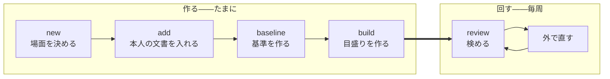

# コマンドの体系

人が触る面を決める。

<strong>[使うときはループになる](../spec/010-strategy.md#使うときはループになる)。</strong> 1 周を安く
することがそのまま品質になるので、<strong>周回に出てくるコマンドを最も短くする。</strong>

## 2 つに分かれる

| | いつ動かすか | 何をするか |
| --- | --- | --- |
| <strong>作る</strong> | 最初と、素材が増えたとき | カセットを組み立てる |
| <strong>回す</strong> | 毎周 | 検めて、直して、また検める |



<strong>`review` だけが周回に出てくる。</strong> ほかは素材が増えたときにしか動かさない。

## 作る

### new

```
kakiburi new <カセット> --scene <場面>
```

<strong>場面は人が指定する</strong>（[決定](../spec/010-strategy.md#場面ごとに閉じる)）。文章から当てに
いかないので、ここで必ず訊く。<strong>1 カセット 1 場面である。</strong>

### add

```
kakiburi add <カセット> <ファイル...> --source <取り込み元>
                                 [--as person|baseline|other] [--unit <名前>]
                                 [--model <名前> --version <版> --param <鍵>=<値>...]
```

[正規化](../spec/030-normalize.md)して入れる。取り込み元は内容から判定せず、拡張子と
`--source` で決める。

<strong>落ちない入力は断る</strong>（[決定](../spec/030-normalize.md#通らないものは断る)）。黙って
一部を落として通さない。<strong>1 本でも断ったら、そのコマンドは失敗する</strong>——成功したことに
すると、欠けたまま次へ進む。

<strong>`--as baseline` で入れるときは `--model` と `--version` が要る。</strong> 外で作った基準でも、
[版と推論設定が指紋に入る](../spec/200-extract.md#版と推論設定まで記録する)——記録の無い
基準で作った値は次に測ったときに比べられない。

<strong>`--unit` は短い文書を[束ねる](100-cassette.md#短い文書は束ねる)。</strong> 同じ名前を渡した
ものが 1 単位になる。チャットの場面では常用する。

### decide

<strong>[人が決めたこと](100-cassette.md#何を収めるか)を書く。</strong> 場面のほかに 2 つある。

```
kakiburi decide <カセット> boilerplate <文字列...>
kakiburi decide <カセット> movement <指標> moves|stuck
```

| | なぜコマンドが要るか |
| --- | --- |
| 落とす定型 | [場面ごとに人が決める](../spec/200-extract.md#定型を落とす)。文章から当てにいかない |
| <strong>指示して動くか</strong> | <strong>直させてみて初めて分かる。</strong> コーパスから導けない |

<strong>2 つ目が[戻る線 1 本目](../spec/010-strategy.md#運用に入ると戻る線が-2-本できる)の入口
である。</strong>[検めを 2 周](../spec/300-revise.md#直したら測り直す)して
<strong>その指標自身の値が</strong>動かなかったものを `stuck` にすると、次から
[前に出す指標](../spec/300-revise.md#3-種類を合わせて通るを出す)から外れる。

<strong>照合値が動かなかったことを根拠にしない。</strong> 照合値は 1 つの切り口には鈍く、指摘が正しく
通じても動かないことがある（[実測](../spec/300-revise.md#直したら測り直す)）。混ぜれば、
<strong>効いている指標を `stuck` にして捨てる。</strong>

<strong>書かないかぎり `未知` で、`未知` は前に出す指標に入る。</strong> 動かないと分かるまでは使う。

<strong>どちらも作り直せない原本である。</strong> 書く道が無ければ、実装する人が「文章から推定する」
を発明する——仕様がどちらについても名指しで禁じている道である。

### baseline

```
kakiburi baseline <カセット> --model <名前> --version <版>
                             --topic <要約> [--topic <要約>...]
                             [--param <鍵>=<値>...]
```

[基準](../spec/200-extract.md#基準を置く)を作る。<strong>`--version` も `--topic` も省略できない。</strong>

<strong>題材を引数で受けるのが要点である。</strong> 本文から作れるようにすると、書き出しの癖が
依頼文に漏れて基準値が <strong>28 ポイント</strong>膨らむ
（[漏らさない](../spec/200-extract.md#依頼文に書き方を漏らさない)）。<strong>`--topic` は
「何について書くか」の中立な要約</strong>であり、本文を渡す口は持たない。

<strong>`--topic` は 10 以上要る。</strong> 基準の側にも[下限](../spec/200-extract.md#対が何本あれば信じるか)
が掛かり、1 題材から 1 本作るので、<strong>10 本に満たなければ目盛りが作れない。</strong>

<strong>題材は本人の文書から取る</strong>——[題材を揃える](../spec/200-extract.md#題材の統制は対ではなく素材に効かせる)
以上、本人が書いた題材について書かせることになる。<strong>ただし要約は人が書く。</strong> 本文から
機械的に作れば、そこが漏れる経路になる。

<strong>要約には記事が名指しする物を書く</strong>——製品名、コマンド名、版番号
（[理由](../spec/010-strategy.md#題材を統制する)）。題名だけだと基準の側だけラテン文字が薄く
なり、<strong>その差だけで帯が分離してしまう</strong>——通ったように見えて、測っているのは題材である。

<strong>ただし名前の表記までは写さない。</strong>「Vim script」か「Vim スクリプト」か、版番号を半角か
全角か——そこは書きぶりの層であり、写せば漏れる。

<strong>この 2 つは検めようがない。</strong> `--topic` は自由な文字列で、名前が入っているかも表記を
写したかも機械には見えない。<strong>[要約は人が書く](#baseline)以上、ここは人が守る規則である</strong>
——`doctor` の一覧にも載らない。

`--topic` `--param` `--model` `--version` は `decided/baseline.json` に残り、<strong>そのまま指紋に
入る</strong>（[人が決めたこと](../spec/200-extract.md#何で測ったかを指紋にする)）。<strong>`--topic` を
外さない</strong>——題材の言葉づかいだけで帯が動くので、外せば古い目盛りが黙って使われる。

<strong>使わなくてもよい。</strong> 外で作った基準は `add --as baseline` で入る
（[理由](000-architecture.md#kakiburi-baseline)）。

### build

```
kakiburi build <カセット>
```

<strong>語彙 → 値 → 較正 → 帯 → 効く指標</strong> を一度に作る。分けて呼べるようにしない——
途中まで作った状態を人が持つと、指紋の合わない派生物が混ざる。

<strong>目盛りを作らずに終わる条件を持つ。</strong>

| 作らない | なぜ |
| --- | --- |
| 本人または基準の単位が[下限](../spec/200-extract.md#対が何本あれば信じるか)を下回る | <strong>どちらも 10 単位が要る</strong>（本人は相手集合 5 ＋ 測る分 5、基準は較正分 5 ＋ 床の点 5） |
| <strong>照合値の</strong>天井と床がほとんど重なる | [骨格が通っていない](../spec/010-strategy.md#それでも骨格を先に通す) |
| <strong>本人側と基準側の長さの範囲が半分も重ならない</strong> | [測っているのが長さになる](../spec/200-extract.md#見る前に標本の範囲を確かめる) |
| どちらかの帯で天井か床の広がりが 0 | 端が決まらない（[帯](../spec/200-extract.md#帯は2-つの分布の重なりである)） |

<strong>基準の側にも下限が掛かる。</strong> 本人と基準の両方を[2 つに割る](../spec/200-extract.md#相手集合を-1-つ決める)
ので、片方だけ足りなくても目盛りは作れない。<strong>相手集合を減らして帳尻を合わせない</strong>——減らせば天井・床・検めの相手の本数が変わり、
3 つが同じ散らばりに載らなくなる。

<strong>2 行目だけが照合値限定である。</strong> 人らしさの帯が全体を覆うのは
[設計どおりの結果](../spec/100-metrics.md#なぜ人らしさは層-2-を判定から外す原則にかからないのか)
である——当てはまらないことが判定不能として出る仕組みなので、<strong>止めれば自己診断が消える。</strong>
重なった人らしさの帯はそのまま書き出す。

<strong>最後の行は両方に掛ける。</strong> 広がりが 0 なら端が決まらず、<strong>重なっているのかいないのかも
読めない。</strong> 覆っているのとは違う——覆っているなら端はある。

<strong>止まっても失敗ではない。</strong> 目盛りの無いカセットが出来上がり、`build` は `0` で終わる。
理由を `manifest.json` に残す。<strong>そのカセットで `review` すると、判定できないが返る。</strong>

## 回す

### review

```
kakiburi review <カセット> <ファイル> [--json]
```

<strong>3 値と指摘を返す。</strong>

| 終了コード | |
| --- | --- |
| `0` | 通る |
| `1` | 通らない |
| `2` | 判定できない |
| `64` 以上 | <strong>使い方の誤り、カセットが読めない</strong> |

<strong>判定できないを 1 と分けるのが要点である。</strong> 一緒にすれば、
[分からないと言えること](../spec/010-strategy.md#届かないときは判定できないと言う)が
呼ぶ側から消える。

<strong>目盛りの無いカセットは `64` ではなく `2` である。</strong> 素材が足りずに目盛りが作れなかった
のは <strong>正常な状態</strong>であり、仕様がそのために判定できないを置いている。`64` 以上は、
カセットが壊れている・読めない・指紋が環境と合わないといった <strong>使う前の問題</strong>に取っておく。

<strong>同じ理由で、系統が欠けたとき・素材が足りないときも `2` である。</strong> 判定できないを返す
経路を、エラーとして扱わない。

<strong>どの段で止まったかを必ず返す</strong>（[3 段](../spec/300-revise.md#3-種類を合わせて通るを出す)）。
返さなければ、照合値を上げようとして人らしさを下げる逆向きの直しを招く。

#### 既定は散文である

<strong>表で返さない。</strong> 構造化した形を求めると成績が落ちる（[SPTG の評価](../references/sptg-evaluation-2025.md)）。
既定の出力は <strong>そのまま直す側に貼れる散文</strong>にする。

<strong>数値は落とさない</strong>（[決定](../spec/300-revise.md#散文で渡す)）。散文にするのは言い方
であって、根拠の値ではない。

`--json` は道具向けである。<strong>人にも LLM にも既定では出さない。</strong>

#### 草稿の作られ方を訊く

```
kakiburi review ... --shown-own-writing
```

本人の文章を見せて書かせた草稿は[測定が膨らむ](../spec/300-revise.md#草稿の作られ方を疑う)。
kakiburi は書かせる側を持たないので防げない。<strong>だから申告させ、判定に添える。</strong>

## 覗く

<strong>[測るのを安くする](../spec/100-metrics.md#測るのを安くする)が 3 つを名指ししている。</strong>
そのまま 3 つのコマンドにする。

```
kakiburi measure <ファイル> [--cassette <カセット>]      1 本を測る
kakiburi compare <ファイル>... [--cassette <カセット>]   並べて比べる
kakiburi show <カセット>                                 コーパス全体の分布を出す
```

<strong>カセットが無くても動く。ただし出るものが違う。</strong>

| | カセット無し | カセット有り |
| --- | --- | --- |
| 指示できる指標・人らしさ | 出る | 出る |
| <strong>系統の距離</strong> | <strong>出ない</strong> | 出る |

<strong>系統を出さないのは、[語彙が無い](../spec/200-extract.md#語彙は先に決めて固定する)から
である。</strong> 頻度で次元を選ぶ系統は、渡された 2 本からその場で選べば <strong>違う軸のベクトル
どうしの距離</strong>になる。仕様が名指しで禁じている。

<strong>黙ってスカラーだけ出さない。</strong> 系統を出せないことを言う——言わなければ、比べたつもり
で比べていない。

`compare` が 3 本以上を取るのは、[周回ごとの散らばり](100-cassette.md#周回のあいだの観測は外でやる)
を見るためである。n 周した A・B・C を並べて渡す。

## 検査

### doctor

```
kakiburi doctor <カセット>
```

<strong>[自分を検査する](../spec/300-revise.md#自分を検査する)。</strong> 本人の実際の文章をカセットに
通し、生成文より低く出る指標や組み合わせを探す。

<strong>本人がいちばん高く出ることが、目盛りが壊れていないことの最低条件である。</strong>

あわせて機械的に確かめる。

- 指紋が現在の環境と合っているか（辞書の版、圧縮器、正規化の実装）
- 派生物が原本と整合しているか
- `provisional` が立っていないか

### metrics

```
kakiburi metrics [--kind 指示|照合|人らしさ] [--layer 1|2|3]
```

登録簿を回して一覧を出す。<strong>使う側が一覧を持たない</strong>ことの裏返しで、
<strong>一覧を見たい人はここへ来る</strong>。

## 決めたこと

### 破壊的な操作を短くしない

<strong>`build` は派生物を作り直す。</strong> 原本には触らない。原本を消す道はコマンドとして持たない
——カセットは 1 ファイルなので、消したければファイルを消せばよい。

### 場面を跨ぐ道を作らない

<strong>複数のカセットをまとめて扱うコマンドを持たない。</strong>[場面ごとに閉じる](../spec/010-strategy.md#場面ごとに閉じる)
以上、まとめる操作は「どの場面のものでもない」ものを作る道になる。

並べたければファイルを並べればよい。

### 対話しない

<strong>訊くのは `new` の場面だけである。</strong> あとは引数で受ける。ループが回るものなので、
途中で人を待たせない。

<strong>[訊けるものは訊く](../spec/010-strategy.md#訊けるものは訊く)は判断軸の話であって、
この道具が測らないと決めたものである。</strong> 書く人が自分で添えるのは自由だが、コマンドが
訊きにいかない。
