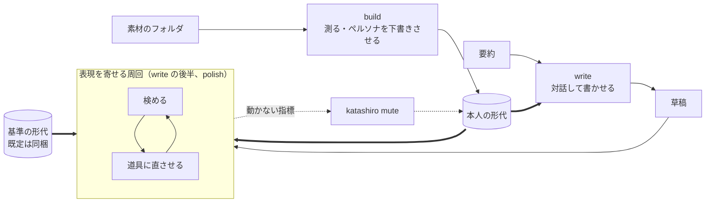

# コマンドの体系

人が触る面を決める。

[使うときはループになる](../spec/010-strategy.md#使うときはループになる)。1 周を安く
することがそのまま品質になるので、ふだん打つコマンドを最も短くし、周回そのものは
kuchiyose が回す。

## ふだん使うコマンドと、詳しく使うコマンド

| | いつ動かすか | 何をするか |
| --- | --- | --- |
| `kuchiyose build` | 最初と、記事が増えたとき | 形代を作る。統計値を測り、ペルソナを LLM の道具に下書きさせる |
| `kuchiyose write` | 記事を書くたび | 代筆させる。内容を詰めて書かせ、表現を寄せる周回に入る |
| `kuchiyose polish` | 手元の文章の表現だけを寄せたいとき | 表現を寄せる周回だけを回す |
| `kuchiyose review` | 判定と指摘だけを見たいとき | 2 つの形代から目盛りを組み立て、草稿を検める |
| `kuchiyose katashiro …` | 形代を覗く・比べる・調整するとき | 形代を作る・見る・比べる・調整する・ペルソナを入れる |



ふだん使うのは `build`、`write`、`polish` である。`review` と `katashiro` の下のものは、
判定と指摘だけを見たいとき、形代を覗くとき、指摘の出し方を変えたいときに使う。

ふだん使うコマンドは[既定の形代](#既定の形代)を使うので、形代を毎回渡さなくてよい。
`katashiro` の下では形代が操作の対象そのものなので、位置引数で渡す。`review` では
形代は検めるための道具なので、`--katashiro` で渡す。

素材を 1 本ずつ入れるコマンドを持たない。[形代は本文を持たない](100-katashiro.md#中身)
ので、入れる先が無い。素材はフォルダのまま `build` か `katashiro build` に渡す。

### 素材はフォルダで渡す

```
kuchiyose katashiro build <フォルダ> -o <形代>
```

フォルダの中の読める文書を、名前の昇順で全部読む。1 本ずつ名指しする道を持たない。
[形代は本文を持たない](100-katashiro.md#中身)ので、入れておく場所が無い。

本人の文書も基準の文書も、同じコマンドで形代にする。どちらとして使うかは、`review` に
渡す位置で決まる。道具は基準が機械の文章か人の文章かを区別しない
（[基準を置く](../spec/200-extract.md#基準を置く)）。

単位の名前はファイル名の拡張子を除いた部分である。フォルダの下の階層にある同名の
ファイルは同じ単位名になる。分けたいならファイル名を分ける。 名前が重なるか、名前に
改行やタブなどの制御文字があれば、形代を書かずに `64` で断る。 読み戻すときも同じ名前を
断るので、書いてしまえばその形代は使えない。

フォルダの中の象徴リンクは、ファイルもディレクトリも辿らない——辿れば、人から受け取った
フォルダの外の文書が素材に混ざり、自分を指すリンクでは際限なく降りる。

#### 取り込み元は拡張子から決める

[正規化](../spec/030-normalize.md)の取り込み元を、`.md` と `.markdown` は markdown、`.html` と
`.htm` は html として読む。ほかの拡張子は読まない。文書を取るコマンドはどれもこの 1 つの
規則で決める。`katashiro build` がフォルダを読むときも、`review` が草稿を読むときも。

人に名乗らせない。名乗らせれば毎回手間がかかり、名乗り違えは
[黙って 0 を並べる](../spec/030-normalize.md#取り込み元を間違えると0-が並ぶ)。
拡張子は文書が自分で名乗っているものである。

| 拡張子 | 1 本を渡したとき | フォルダの中にあるとき |
| --- | --- | --- |
| `.md` `.markdown` | markdown として読む | markdown として読む |
| `.html` `.htm` | html として読む | html として読む |
| それ以外 | 断る。終了コード 64（使い方の誤り） | 拾わない。読まずに飛ばす |

1 本を断るときは「断る: 取り込み元が拡張子から決まらない: <経路>」と出し、読める拡張子を
続けて示す。

知らない拡張子を markdown に倒さない。倒せば、プレーンテキストや別の記法が
Markdown として読まれ、[0 が並ぶ](../spec/030-normalize.md#取り込み元を間違えると0-が並ぶ)。
エラーにならないまま値だけが狂う。

フォルダでは断らずに飛ばす。素材のフォルダには README や控えが混ざる。拾ってから断れば、
[1 本の断りでフォルダごと使えなくなる](#落ちない入力は断る)。

拡張子より細かくは分けない。Markdown の方言は
[1 つにまとめてある](../spec/030-normalize.md#markdown-を方言に分けない)ので、中身を見て
決めるものが残っていない。

読んだ取り込み元は指紋に足す。足さなければ、別の取り込み元で読み直したことが指紋から
読めず、取り違えを検出する唯一の手がかりが止まる。

#### 落ちない入力は断る

[決定](../spec/030-normalize.md#通らないものは断る)。黙って一部を落として通さない。
1 本でも断ったら、そのフォルダは 1 本も使わない。成功したことにすると、欠けたまま
形代が出来上がる。

### 差し替えるコマンドを持たない

素材はフォルダである。1 本を入れ替えたいならファイルを上書きして `katashiro build` し直す。
形代の中に入れ替える先が無い。

## ふだん使うコマンド

### build

```
kuchiyose build <フォルダ> [-o <形代>] [--scene <場面>] [--no-persona]
                [--agent <道具>] [--print]
```

形代を作る。[`katashiro build`](#katashiro-build) と同じ手順で統計値を測り、続けて LLM の
道具を対話なしで起動してペルソナを下書きさせる
（[ペルソナを作る](../spec/400-write.md#ペルソナを作る)）。作った形代を
[既定の形代](#既定の形代)として覚える。

記事が増えたら同じコマンドを打つ。作り直しでは調整もペルソナも引き継ぐ。形代が既に
ペルソナを持っていれば、道具は起動しない。

| 引数 | 意味 |
| --- | --- |
| `-o` | 形代の経路。省けば `$XDG_DATA_HOME/kuchiyose/<フォルダの名前>.katashiro`（`XDG_DATA_HOME` が無ければ `~/.local/share`） |
| `--scene` | 場面の名前。`katashiro build` と同じ |
| `--no-persona` | ペルソナを作らない。統計値だけの形代にする。基準に使う形代や、比べるだけの形代のため |
| `--agent` | 起動する道具（[どの道具を使うか](400-agent.md#どの道具を使うか)） |
| `--print` | 統計値は作る。道具は起動せず、ペルソナを作るプロンプトを標準出力に出す。下書きの経路は `<形代の名前>.persona.md` で、取り込みは使う人が打つ |

`-o` を省いたときの経路に、別のフォルダから作った形代が既にあれば、書かずに `64` で断り、
`-o` を渡すよう言う。フォルダの名前だけで経路を決めるので、別の場所にある同じ名前の
フォルダが同じ経路に当たる。作り直しとして上書きすれば、別の人の統計値に調整とペルソナが
引き継がれる。どのフォルダから作ったかは形代の
[`material`](100-katashiro.md#manifestjson) で見る。

道具は形代のあるディレクトリでは走らせず、kuchiyose が作った専用のディレクトリで走らせて、
下書きをその中に書かせる（[ペルソナ作りは専用のディレクトリで走らせる](400-agent.md#ペルソナ作りは専用のディレクトリで走らせる)）。
道具に打たせるのは `katashiro persona --check` だけで、道具は形代に書けない。道具が
終わったら、kuchiyose が下書きを形代の隣の `<形代の名前>.persona.md` に置いて取り込む。
本人が読んで直すためのファイルである。取り込み直すときは [`katashiro persona`](#katashiro-persona) を使う。

その経路に既にファイルがあれば、道具を起動せずに `64` で断る。本人が直したものを下書きで
上書きさせないためである。取り込むなら `katashiro persona`、下書きさせ直すならファイルを
消すか移してから `build` する。

道具が失敗しても、統計値を書いた形代は残す。終了コードは `69` で、ペルソナが無いことを言う。
ペルソナだけを作り直すときは、同じ `build` を打てばよい。統計値は測り直すが、結果は同じである。

| 終了コード | |
| --- | --- |
| `0` | 形代を書いた（ペルソナを作らなかったときも含む） |
| `64` 以上 | `katashiro build` と同じ理由で断った |
| `69` | 形代は書いたが、道具が見つからないか失敗して、ペルソナが無い |

### write

```
kuchiyose write [<要約>] [-o <草稿>] [--katashiro <形代>] [--baseline <形代>]
                [--agent <道具>] [--rounds <数>] [--no-polish] [--print]
```

代筆させる。[代筆のプロンプト](../spec/400-write.md#代筆のプロンプト)を組み立て、LLM の
道具を対話の画面で起動する。使う人は道具と対話して内容を詰め、道具が草稿を保存する。
対話が終わって草稿があれば、そのまま[表現を寄せる周回](#polish)に入る。

草稿の保存先は kuchiyose が決め、プロンプトで道具に伝える。既定は今のディレクトリの
`draft-<日時>.md`（手元の時刻で `YYYYMMDD-HHMMSS`）で、`-o` で変えられる。
保存先を使う人に最後に訊く形にしないのは、対話を終えてから何かを打たせれば、周回の入口で
人を待たせるからである。

保存先に既にファイルがあれば、起動せずに `64` で断る。道具がそれを上書きすれば、人の
ファイルが消える。

`--no-polish` を付けると、対話が終わったところで止める。`--print` を付けると、道具を
起動せずにプロンプトを出す。

終了コードは、周回に入ったなら [`polish`](#polish) と同じである。周回に入らなかったときは、
草稿が無ければ `65`、`--no-polish` なら `0` で終わる。

### polish

```
kuchiyose polish <ファイル> [-o <ファイル>] [--katashiro <形代>] [--baseline <形代>]
                 [--agent <道具>] [--rounds <数>] [--print]
```

手元の文章の表現だけを寄せる。[表現を寄せる周回](../spec/400-write.md#表現を寄せる周回)を
回す。自分で書いた文章も、ほかで書かせた文章も渡せる。

| 引数 | 意味 |
| --- | --- |
| `-o` | 最後に採った版を書く経路。省けば `<ファイルの名前>.polished.<拡張子>`。1 周も採らなければ書かない |
| `--rounds` | 上限の周回数。1 以上 1,000 以下。既定は 4 |
| `--baseline` | 基準の形代。`review` と同じ |
| `--print` | 最初の周の直させるプロンプトを出して終わる。読む経路は元のファイル、書く経路は `-o` の行き先にする。作業用のフォルダに当たる捨てた版の記録があれば、それも載せる。作業用のフォルダは作らない。周回に入らない草稿なら、理由を言って判定の終了コードで終わる |

元のファイルは上書きしない。`-o` に元のファイルを渡したときだけ上書きし、そのときも元の版を
作業用のフォルダに残す。

作業用のフォルダは `<ファイルの名前>.kuchiyose/` で、元のファイルの隣に作る。

```
draft.kuchiyose/
  round-0.md          元の版の写し
  round-1.prompt.md   1 周目の直させるプロンプト
  round-1.md          1 周目に道具が書いた版
  round-1.review.json 1 周目の版を検めた結果（review --json と同じ形）
  round-1.rejected.json 1 周目の版を捨てたときだけ。何をして捨てたかの記録
  ...
```

版の拡張子は元のファイルに揃える。[取り込み元は拡張子から決める](#取り込み元は拡張子から決める)
ので、揃えなければ検められない。作業用のフォルダが既にあれば、断らずに続きの番号から書く。
元の版の写しも続きの番号に置き、そこから周回を始める。元の版と形代が前と同じなら、前に
捨てた版の記録も[直させるプロンプトに載る](../spec/400-write.md#捨てた直しを伝える)。

報告は `review` の散文の出力に、回した周の数、採った周の数、元の版と最後の版の地の文の
字数、推論設定の直し方を足したものである。

| 終了コード | |
| --- | --- |
| `0` `1` `2` | 最後に採った版の判定。`review` と同じ |
| `64` 以上 | `review` と同じ理由で断った |
| `69` | 道具が見つからない、または失敗して止まった。それまでに採った版は書いてある |

## 共通のオプション

| オプション | 取るコマンド | 意味 |
| --- | --- | --- |
| `--katashiro <形代>` | `write` `polish` `review` | 既定と違う形代を使う。人の形代で代筆するときなど |
| `--print` | `build` `write` `polish` | 道具を起動せず、プロンプトを標準出力に出す（[設計](400-agent.md#プロンプトを出すだけにする)） |
| `--agent claude\|codex\|custom` | `build` `write` `polish` | 起動する道具を選ぶ（[どの道具を使うか](400-agent.md#どの道具を使うか)） |

### 既定の形代

形代を渡さなければ、次の順に見て最初に決まったものを使う。

| 順 | どこ |
| --- | --- |
| 1 | `--katashiro` |
| 2 | 環境変数 `KUCHIYOSE_KATASHIRO` |
| 3 | [設定ファイル](#設定ファイル)の `katashiro` |

どれも無ければ `64` で断り、`build` するか `--katashiro` を渡すよう言う。

`build` は作った形代の絶対経路を設定ファイルの `katashiro` に書く。一度 `build` すれば、
あとは `write` と `polish` だけを打てばよい。`KUCHIYOSE_KATASHIRO` が設定されていれば、
設定ファイルに書いたうえで、環境変数のほうが優先されることを標準エラーに出す。

`review` も既定の形代を使う。既定を使ったときは、どの形代を使ったかを出力の名乗りに出す。
[場面を指定させる](../spec/300-revise.md#場面を指定させる)ので、形代を選んだことが見えない
まま判定が出てはいけない。

### 設定ファイル

`$XDG_CONFIG_HOME/kuchiyose/config.json`（`XDG_CONFIG_HOME` が無ければ
`~/.config/kuchiyose/config.json`）に置く。JSON の対象で、持つのは次の鍵だけである。

| 鍵 | 意味 | 同じ意味の環境変数 |
| --- | --- | --- |
| `katashiro` | 既定の形代 | `KUCHIYOSE_KATASHIRO` |
| `agent` | 起動する道具 | `KUCHIYOSE_AGENT` |
| `agent_cmd` | 自前の道具のひな形 | `KUCHIYOSE_AGENT_CMD` |
| `rounds` | 上限の周回数。1 以上 1,000 以下 | — |

環境変数は設定ファイルより優先する。一時的に替えるのは環境変数、ずっと使うのは設定ファイル、
という使い分けである。

書くのは `build` だけで、`katashiro` の鍵だけを書き換える。ほかの鍵は触らずに残す。
読めない設定ファイルは `64` で断る。黙って既定に戻れば、別の形代や別の道具で動いたことに
気付けない。知らない鍵と、形の違う値（`rounds` が 1 以上 1,000 以下の整数でない、など）も同じ理由で
断る。綴りを間違えた鍵は何も設定しない。

### 要約の渡し方

`write` の要約は、次の順に取る。

| 順 | 条件 | どこから |
| --- | --- | --- |
| 1 | 引数がある | 引数 |
| 2 | 引数が無く、標準入力が端末でない | 標準入力を終わりまで読む |
| 3 | どちらでもない | `$EDITOR` を開く（無ければ `vi`） |

```sh
kuchiyose write "Vim の Denops について"     # 短ければ引数で
kuchiyose write < brief.md                  # 標準入力から
:w !kuchiyose write --print                 # Vim のバッファを流し、プロンプトを受け取る
kuchiyose write                             # 何も渡さなければ $EDITOR を開く
```

`$EDITOR` には、何を書けばよいかの見本を HTML のコメント（`<!-- … -->`）として入れておく。
Markdown の見出しと区別できるように、`#` の行ではなくコメントにする。保存して閉じたあと、
コメントを除いて空なら、起動せずに `64` で終わる。`git commit` と同じ振る舞いである。

要約を標準入力から読んだあとに対話の画面を起動するときは、道具の入力を端末につなぎ
直す（[端末をつなぎ直す](400-agent.md#端末をつなぎ直す)）。

## katashiro

### katashiro build

```
kuchiyose katashiro build <フォルダ> -o <形代> [--scene <場面>] [--json]
```

フォルダの文書を測り、文書ごとの統計値と語のまとめ方を形代に書く
（[文書を測る](../spec/200-extract.md#文書を測る)）。比べる相手は見ない。目盛りは作らない。
素材のフォルダの絶対経路を [`material`](100-katashiro.md#manifestjson) に書く。

[`build`](#build) の前半がこれである。`katashiro build` はペルソナを作らせず、既定の形代も
書き換えない。基準の形代を作るときや、比べるだけの形代を作るときはこちらを使う。

`-o` の先に形代が無ければ作り、在れば作り直す。作り直すときは、前の形代の
[調整](100-katashiro.md#tuningjson)と[ペルソナ](100-katashiro.md#personamd)を引き継ぐ。無効にした指標の名前が今の登録簿に無ければ、
知らせて捨てる。

在るものを消さない。形代として読めないものを指されたら、それは人の別のファイルで
ある。消さずに断る。形代だったとしても、調整は作り直せないので、消さずに引き継ぐ。
版が違って読めない形代も断る。調整を引き継げないまま上書きすれば、そこで消える。

`--scene` は場面の名前を付ける。省けば、作り直すときは前の名前を引き継ぎ、新しく作るときは
フォルダの名前を使う。

言うのは、統計値が測れたかどうかだけである
（[測れたかだけを言う](../spec/200-extract.md#測れたかだけを言う)）。

| 出すもの | |
| --- | --- |
| 測った文書の本数 | |
| 下限に届かない文書 | 字数と下限を添える |
| 文書ごとに測れなかった系統と指標 | 理由ごとにまとめる |
| 語のまとめ方で見つけた語の数 | |
| 引き継いだ調整と、捨てた調整 | |
| 中身のハッシュ | 基準として渡したときに、どの基準かを名指す |

目盛りが作れるかは言わない。目盛りは比べる相手が決まるまで作れない。確かめたいときは
[`katashiro diff`](#katashiro-diff) で基準と比べる。

[環境の側の理由](../spec/100-metrics.md#測れない理由を分けて返す)で測れなかった文書が
あれば、形代を書かずに断る。終了コードは 64 以上である。

### katashiro show

```
kuchiyose katashiro show <形代> [--json]
```

中身を出す。場面・世代・中身のハッシュ・文書の本数・長さの範囲・文体の内訳・測れなかった
文書と理由・語のまとめ方・調整・ペルソナを持っているかである。無効にしている対象は並べて
見せる。無効にしたことを忘れたまま使わないためである。ペルソナを持っているかも同じ理由で
必ず出す。持っていることを忘れたまま人に渡さないためである
（[ペルソナは統計値より多くを語る](../spec/400-write.md#ペルソナは統計値より多くを語る)）。

形代単体で矛盾していないかも見る。

- 指紋が今の道具と合っているか（辞書の版、圧縮器、正規化の実装）
- 中身のハッシュが `stats/` の中身と合うか

素材は要らない。受け取っただけの形代でも走る。目盛りを見るなら
[`katashiro diff`](#katashiro-diff) を使う。

### katashiro diff

```
kuchiyose katashiro diff <本人の形代> <基準の形代> [--json]
```

2 つの形代から[目盛りを組み立て](#目盛りを組み立てる)、2 つがどこで違うかを出す。
1 つ目を本人の側、2 つ目を基準の側として組み立てる。

| 出すもの | |
| --- | --- |
| 両方の場面の名前と中身のハッシュ | どの組み合わせかを名乗る |
| 見分けられるか | 照合値と基準との距離の帯が分かれるか。天井・床・帯の端 |
| 見分けられないなら、その理由 | 下限、長さの範囲、帯の重なり、自己検査 |
| どの指標で違うか | [効く指標](../spec/200-extract.md#どの指標が効くかを決める)と、本人の癖 |
| 片方だけが使う言い回し | 型、基準の型、基準の語 |
| 使った基準の文書と束ね方 | 文体と題材で選んだ本数、束の構成、長さの窓で選び直したならその字数 |
| [割り](#割りを出す) | 相手集合・測る分・較正分・床の点 |

自己検査は内側で行い、崩れていたときだけ見分けられない理由として出す
（[自分を検査する](../spec/300-revise.md#自分を検査する)）。

本人の形代の調整は効かせない。何が違うかを全部見るためのコマンドなので、無効にした
ものも出す。無効にしているものには印を付ける。

文体の申告だけは効かせる。申告は外す調整ではなく、数えた結果を本人が正す口である。効かせ
なければ、基準の文書を `review` と違う文体で選び、`review` と違う目盛りを見せることになる。

見分けられるのは、目盛りが組み立てられ、[本人がいちばん高く出て](#本人がいちばん高く出るかをここで確かめる)、
照合値の帯が分かれているときである。基準との距離の帯は重なっても見分けられないとは
しない。重なった帯は `review` の 1 段目で判定できないとして出る、設計どおりの状態である
（[帯の重なり](../spec/200-extract.md#帯は2-つの分布の重なりである)）。帯の端は両方出す。

2 人の書き手を比べるときも、このコマンドを使う。A さんの形代と B さんの形代を
渡せば、B さんを基準にしたときに A さんがどこで際立つかが出る。

| 終了コード | |
| --- | --- |
| `0` | 見分けられる |
| `2` | 見分けられない |
| `64` 以上 | 使い方の誤り、形代が読めない、指紋が合わない |

### 調整する

調整は形代への操作なので、`katashiro` の下にサブコマンドとして並べる
（[tuning.json](100-katashiro.md#tuningjson)）。どれも測った値に触らないので、作り直しは
要らない。書いたら次の `review` から効く。

```
kuchiyose katashiro edit         <形代> [--baseline <形代>]
kuchiyose katashiro list         <形代> [--kind <種類>] [--state on|off] [--baseline <形代>]
kuchiyose katashiro mute         <形代> <名前または ID>... | --kind <種類> [--baseline <形代>]
kuchiyose katashiro unmute       <形代> <名前または ID>... | --kind <種類> [--baseline <形代>]
kuchiyose katashiro first-person <形代> <一人称>|auto
kuchiyose katashiro register     <形代> polite|plain|auto
```

調整の種類は次のとおりである。

| 種類 | `--kind` | 何を | 効き方 |
| --- | --- | --- | --- |
| 無効にする | `指標` | 指示できる指標 | 前に出す指標・指摘・本人の癖から外す |
| | `型` | 本人の型 | 使われていない型として渡さない |
| | `基準の型` | 基準の型 | 知らせに出さない |
| | `基準の語` | 基準の語 | 知らせに出さない |
| 申告する | `一人称` | 一人称 | [一人称の知らせ](../spec/300-revise.md#一人称は別に見る)で、数えた結果より申告を採る |
| | `文体` | 敬体か常体か | [基準の文書を絞る](../spec/200-extract.md#基準の文書は文体が同じで題材の近い分だけを使う)ときに、数えた結果より申告を採る |

人からもらった形代も調整できる。素材が無くても、測り直しが要らないからである。

#### katashiro list

1 行 1 項目で、種類・名前または ID・状態・説明をタブで区切って出す。見出しの行は出さない。
fzf のような道具とそのまま組み合わせるためである。

```
指標	強調	on	太字や強調の密度
型	型-3f2a9c	on	どうも、〜です。（本人 23% / 書き出し）
基準の型	基準の型-81d0e4	off	のではなく、（基準 56% / 本人 0%）
一人称	一人称	僕（申告）	数えた結果は 僕
```

状態は、無効にする種類では `on`（効いている）か `off`（無効にしてある）、申告する種類では
今の値である。申告していなければ数えた結果を「（数えた結果）」と添えて出す。`--state` は
無効にする種類にだけ効き、申告する種類の行は絞っても残る。

型・基準の型・基準の語は、組み立てるまで決まらない。`list` は基準と組み合わせて組み立て、
出てきたものを並べる。基準は `--baseline` で渡し、省けば同梱の基準を使う。基準を替えれば
並ぶものが変わる。

型と基準の型は長いので、ID を振る。ID は種類の名前と、言い回しの文字列の SHA-256 の先頭
6 桁を繋いだもので、同じ言い回しなら基準を替えても同じ ID になる。基準の語は短いので、
語彙素をそのまま名前にする。`mute` には名前でも ID でも言い回しの文字列でも渡せる。
同じ文字列が 2 つの種類にあれば、どちらかを決められないので ID で渡させる。

無効にした言い回しは、今の組み合わせで出ていなくても並べる。説明に「今の組み合わせでは
出ていない」と添える。並べなければ、別の基準と組み合わせたときのために残した言い回しを
`unmute` で戻す手掛かりが無くなる。

```sh
kuchiyose katashiro mute alisue.katashiro \
  $(kuchiyose katashiro list alisue.katashiro --kind 基準の型 --state on | fzf -m | cut -f2)
```

#### katashiro mute と unmute

名前か ID を並べて渡す。`--kind` を渡せば、その種類をまとめて無効にする。

知らない名前は受けない。綴りを間違えたまま書けば、無効にしたつもりの指標がいつまでも
指摘に出続ける。エラーにならないので気付けない。指標は登録簿と、言い回しは今の組み合わせで
組み立てた一覧と照らす。`--baseline` は `list` と同じで、省けば同梱の基準と組み合わせる。
1 つでも知らない名前があれば、ほかの名前も書かずに `64` で終わる。

指標と、無効にしてある言い回しは、組み立てずに照らせる。照らしきれない名前があるとき
だけ組み立てる。戻すための `unmute` を、組み立てが止まる組み合わせでも使えるようにする
ためである。

種類ごと無効にしたものは、1 つずつ無効にしたものとは別に持つ。種類ごと戻したときに、
1 つずつ無効にしたものまで戻らないようにするためである。

`指標` を種類ごと無効にすると、前に出す指標が空になり、3 段目は判定できないを返す。
理由は「無効にしたため」と言う（[前に出す指標が無ければ判定できない](../spec/300-revise.md#前に出す指標が無ければ判定できない)）。

#### katashiro first-person と register

申告を書く。`auto` で申告を消し、数えた結果に戻す。

`register` は `polite`（敬体）か `plain`（常体）を取る。ほかの綴りは受けず、`64` で終わる。

`first-person` は、数える一人称の[閉じた集合](../spec/300-revise.md#一人称は別に見る)
（私・僕・俺・わし・我々・我ら・あたい）のどれかを取る。集合の外の語は受けず、`64` で
終わる。申告しても、草稿の側ではその語を数えられないので、使っていても「違う一人称」と
言い続けることになる。

#### katashiro edit

調整を対話画面で行う。種類を選ぶメニューと、種類ごとのチェックリストである。無効にする
種類は印を付けて選び、先頭の行で種類ごと無効にする。申告する種類は選択肢から選ぶ。
保存して終えるまで書かない。できることは上のサブコマンドと同じで、それより多くはない。
指摘の履歴は持たない。

端末でなければ開かずに断り、`64` で終わる。スクリプトからは引数で受けるサブコマンドを使う。

対話画面は `edit` だけにする（[対話は edit だけにする](#対話は-edit-だけにする)）。

### katashiro persona

```
kuchiyose katashiro persona <形代>                          # 今のペルソナを出す
kuchiyose katashiro persona <形代> <ファイル> [--material <フォルダ>] [--json]
kuchiyose katashiro persona <形代> --remove
kuchiyose katashiro persona --check <ファイル> --material <フォルダ> [--json]
```

[ペルソナ](../spec/400-write.md#ペルソナ)を入れる・入れ直す・外す・見る・確かめる。ペルソナは
形代の中の原本なので、調整と同じく `katashiro` の下に置く。測った値に触らないので、
作り直しは要らない。

ファイルを渡すと、形を確かめて取り込む。

| 確かめること | 通らなければ |
| --- | --- |
| UTF-8 の Markdown として読める | 取り込まない。`65` |
| [見出し](../spec/400-write.md#見出しを固定した-markdown-にする)が決めたとおりに揃っている | 取り込まない。`64`。欠けた見出しと余計な見出しを名指す |
| [引用](../spec/400-write.md#引用は実在だけを確かめる)が素材のフォルダに実在する | 取り込む。解決しない引用と、解決する引用を持たない項目を名指しして知らせる |

素材のフォルダは `--material` で渡す。省けば、形代の [`material`](100-katashiro.md#manifestjson)
を使う。そこにフォルダが無ければ、引用を確かめずに取り込み、確かめていないことを言う。

知らせは標準出力に出す。取り込みの結果そのもので、[LLM の道具が読んで引用を直す](../spec/400-write.md#ペルソナを作る)
ためのものだからである。`--json` では、解決しない引用ごとに項目の見出し・項目の文・
引用の文字列・単位の名前・解決しない理由（単位が無い、文字列が無い、短すぎる）を出す。

取り込めば終了コードは `0` である。知らせがあっても `0` にする。解決しない引用を持つ
ペルソナも、本人が決めたものとして取り込むからである。

`--remove` は、形代からペルソナを外す。人に形代を渡す前に使う。外すと戻らないので、
戻したければ手元の `<形代の名前>.persona.md` を取り込み直す。

ファイルも `--remove` も渡さなければ、今のペルソナを標準出力に出す。持っていなければ、
持っていないと標準エラーに言って `2` で終わる。直すときは、これをファイルに書き出して
直し、取り込み直す。

`--check` は、取り込まずに形と引用だけを確かめる。形代を取らず、何も書かない。
`build` がペルソナを下書きする道具に打たせるのはこれだけである。形代を書き換える道を
道具に渡さないためである。引用を照らす先が形代から取れないので、`--material` が要る。

| 終了コード | |
| --- | --- |
| `0` | 形が決めたとおりで、引用はすべて解決した |
| `1` | 形は決めたとおりだが、解決しない引用か、解決する引用を持たない項目がある |
| `64` | 見出しが決めたとおりでない。`--material` が無い、読めない、文書が無い。形代や `--remove` を一緒に渡した |
| `65` | ファイルが UTF-8 として読めない |

### 基準は外で作る

基準の文書を作るコマンドを持たない。文章を作ることは[渡されれば済む](../spec/000-axis.md#だからしないこと)。
代筆の仕組みでも作らない。基準は LLM が素で書いた文章でなければならず、ペルソナや文体の
事実を入れたプロンプトで書かせれば基準ではなくなる。

作った文書はフォルダに置き、`katashiro build` で基準の形代にして `review --baseline` で
渡す。モデル名や版は訊かない。同じ基準かどうかは中身のハッシュで言える
（[同じ基準形代で比べる](../spec/200-extract.md#同じ基準形代で比べる)）。どの LLM の
どの版で作ったかを残したいなら、`--scene` かファイル名に書く。

同梱の基準形代を持つ。`--baseline` を省いたらそちらを使う。基準は機械がどう書くかで
あって書き手ごとに変わらないので、あらかじめ作ったものでよい。題材は
[本人の文書に近い分だけ選んで](../spec/200-extract.md#基準の文書は文体が同じで題材の近い分だけを使う)
使う。

同梱の基準形代は、リポジトリの `baselines/` の文書から `katashiro build` で作り、実行
ファイルに埋め込む（[同梱の基準形代](100-katashiro.md#同梱の基準形代)）。`baselines/` は
同梱の形代を作り直すためにあり、`review` は読まない。

#### 依頼文の作り方は、人が守る規則である

作る道具を持たない以上、ここは検めようがない。だが決めておく。決めなければ、測って
いるのが題材になる。

本文を依頼文に入れない。本文の書き出しから依頼文を作ると、書き出しの癖がそのまま
手掛かりになり、基準値が 28 ポイント膨らむ
（[漏らさない](../spec/200-extract.md#依頼文に書き方を漏らさない)）。渡すのは
「何について書くか」の中立な要約だけである。

題材は本人の文書から取らず、その種類の文章が扱う領域に広く散らす。同梱の基準の題材表
`tools/baseline-topics.txt` と同じ作り方である。題材は
[比べるときに近い分を選んで](../spec/200-extract.md#基準の文書は文体が同じで題材の近い分だけを使う)
揃えるので、本人の題材で書かせる必要は無い
（[理由](../spec/010-strategy.md#題材を統制する)）。広く散らしておけば、どの書き手にも
選べる余地が残る。

要約にはその題材で名指しする物を書く。製品名、コマンド名、版番号である
（[理由](../spec/010-strategy.md#題材を統制する)）。題名だけだと基準の側だけラテン文字が薄く
なり、その差だけで帯が分離してしまう。通ったように見えて、測っているのは題材である。

ただし名前の表記までは写さない。「Vim script」か「Vim スクリプト」か、版番号を半角か
全角か。そこは書きぶりの層であり、写せば漏れる。

文体（です・ます調か、だ・である調か）は本人に合わせて指定する。指定しなければ LLM は
常体に寄る。本人が敬体で書くと、床が敬体の機械の文章より下に来て、機械の草稿が帯の
隙間の中点を越えてしまう（[経緯](../spec/200-extract.md#基準の文書は文体が同じで題材の近い分だけを使う)）。
同梱の基準を作る `tools/gen-baseline.sh` は `KUCHIYOSE_BASELINE_REGISTER=dearu|desu` で文体を
指定する。

頼む長さは本ごとに散らす。同じ長さを頼むと LLM は同じ長さを返し、長さの範囲の防護柵に
当たる。コードブロックは書かせない。地の文しか数えないので、測れる語数が下限を割る。

10 本以上作る。基準の側にも[下限](../spec/200-extract.md#対が何本あれば信じるか)が
掛かる。題材で選ぶ余地を残すには、それより多く、題材を散らして作る。

この規則はどれも機械には見えない。題材は自由な文字列で、名前が入っているかも表記を
写したかも判らない。人が守る。

## review

```
kuchiyose review <草稿>... [--katashiro <形代>] [--baseline <形代>]
                           [--values] [--json]
```

2 つの形代から[目盛りを組み立て](#目盛りを組み立てる)、草稿を検めて 3 値と指摘を返す。
`--katashiro` を省けば[既定の形代](#既定の形代)を使う。

取り込み元は[拡張子から決める](#取り込み元は拡張子から決める)。草稿は、本人の形代の
[語のまとめ方](100-katashiro.md#lexiconjson)で測る
（[同じ測り方で測る](../spec/300-revise.md#同じ測り方で測る)）。

場面は取らない。[1 形代が 1 場面](100-katashiro.md#1-形代-1-場面)なので、どのファイルを
渡すかが場面の指定そのものである。出力には本人と基準の両方の場面の名前と、基準の中身の
ハッシュを出す（[場面を指定させる](../spec/300-revise.md#場面を指定させる)）。

| 終了コード | |
| --- | --- |
| `0` | 通る |
| `1` | 通らない |
| `2` | 判定できない |
| `64` 以上 | 使い方の誤り、形代が読めない、指紋が合わない |

判定できないを 1 と分けるのが要点である。一緒にすれば、
[分からないと言えること](../spec/010-strategy.md#届かないときは判定できないと言う)が
呼ぶ側から消える。

目盛りが組み立てられなかったときは `64` ではなく `2` である。素材が足りない、長さの範囲が
重ならない、帯が重なりすぎる、自己検査が崩れた。どれも正常な状態であり、仕様がそのために
判定できないを置いている。`64` 以上は、形代が壊れている・読めない・指紋が合わない
といった使う前の問題に取っておく。

同じ理由で、系統が欠けたとき・草稿が短すぎるときも `2` である。判定できないを返す経路を、
エラーとして扱わない。

どの段で止まったかを必ず返す（[3 段](../spec/300-revise.md#種別を合わせて通るを出す)）。
返さなければ、照合値を上げようとして基準との距離を縮める逆向きの直しを招く。

### 目盛りを組み立てる

`review` と `katashiro diff` は、同じ手順で目盛りを組み立てる
（[目盛りを作る](../spec/200-extract.md#目盛りを作る)）。組み立ては草稿を読む前に終える。
草稿は組み立ての入力にならない。

| 段 | |
| --- | --- |
| 1 | 2 つの形代を読み、[同じ検査](#形代を取る口は同じ検査を通す)を通す |
| 2 | 2 つの指紋が合うことを確かめる |
| 3 | 基準の文書を文体と題材で選び、束ねる |
| 4 | 語彙・標準化・較正・帯・効く指標・型を作る |
| 5 | 本人がいちばん高く出るかを確かめる |
| 6 | 本人の形代の調整を当てる |

どの段で止まっても、止まった理由を返す。

#### 本人がいちばん高く出るかを、ここで確かめる

[自分を検査する](../spec/300-revise.md#自分を検査する)のは、組み立てるたびに行う。本人の
形代は文書ごとの統計値を持つので、組み立てた目盛りで本人の文書と基準の文書を測り直せる。

崩れていなければ何も出さない。崩れていれば、`review` は判定できない、`katashiro diff` は
見分けられないを返し、理由に「本人を基準と見分けられない」と逆に出た対を添える。単独の
報告にはしない。

較正に使った単位は測らない。本人は相手集合を、基準は較正分を除く。対ごとの割合で見て、
逆に出た対を名指しする（[端では見ない](../spec/300-revise.md#端では見ない)）。

#### 束ね方は組み立てが決める

[基準の文書を、本人の長い記事に届くように何本かまとめて 1 単位にする](100-katashiro.md#短い文書は束ねる)。
束ねるのは基準だけで、本人の文書は束ねない。どう束ねるかを人に決めさせない。
[長さの範囲](../spec/200-extract.md#見る前に標本の範囲を確かめる)は測れた単位だけで
測られる。

手前で当てにいくと外れる。字数と読点で近似して計画したところ、延べ語数と地の文の
バイト数が効いて本人 37 本のうち使えたのは 17 本だった。見ている分布が違えば、束ね方も
違う。

だから組み立ててみて、断られたら次の案で組み立て直す。1 案目が通れば追加の費用は無い。

次の案へ進むのは、長さの範囲で断られたときだけである
（[仕様](../spec/200-extract.md#束ね直すのは長さで断られたときだけ)）。ほかの理由で止まったら、
そこで終わる。

どの案も長さの範囲で断られたら、基準の文書を本人の長さの窓の中から選び直し、束ね方を
もう一度頭から試す（[仕様](../spec/200-extract.md#束ね方が尽きたら本人の長さの窓の中から選び直す)）。
選び直しも組み立ての中で決める。題材で選ぶ段は窓を受け取るだけで、選び直すかどうかは
組み立てた結果を見ないと決まらないからである。選び直したときは、人向けの出力に窓の
字数を 1 行で出し、`--json` では `assembly.length_window` に `low` と `high` を出す。
選び直していなければ `null` である。

束ねた単位の値は、文書ごとの統計値から組み立てる。本文を連結して測り直さない。本文は
形代に無い。

#### 割りを出す

`katashiro diff` と `review --json` は、組み立てた目盛りの割りを 4 つとも出す。本人の相手集合・
本人の測る分・基準の較正分・基準の床の点である。止まった理由は出すのに通ったときの割りを
出さないと、いちばん静かな壊れ方だけが見えない。昇順で取るので、単位名に年や媒体が入って
いれば割りがその境目で分かれる。値は出るしエラーにもならないので、出力を見ても帯が
「ある時期 対 別の時期」になっていることに気付けない。

#### 形代を取る口は同じ検査を通す

口ごとに検査を書かない。書き分ければ、同じ形代が口によって通ったり断られたりする。
形代を読むコマンド（`write`、`polish`、`review`、`katashiro` の下のもの）は、形代を読む
ときに同じ検査を通す。`write` は目盛りが組み立てられなくても止まらず、基準が要る文体の
事実を置かずにプロンプトを作る（[文体の事実](../spec/400-write.md#文体の事実)）。

| 確かめること | 通らなければ |
| --- | --- |
| 容器と版が読める（[読めない版は断る](100-katashiro.md#読めない版は読まずに断る)） | 壊れている、または知らない版として断る |
| 中身のハッシュが合う | 壊れているとして断る |
| 指紋が今の道具と合う | 使う前の問題として断る |
| 2 つの形代の指紋が互いに合う | 同上 |
| 目盛りが組み立てられない | 判定できない。正常な状態である |

### 既定は散文である

表で返さない。構造化した形を求めると成績が落ちる（[SPTG の評価](../references/sptg-evaluation-2025.md)）。
既定の出力はそのまま直す側に貼れる散文にする。

数値は落とさない（[決定](../spec/300-revise.md#散文で渡す)）。散文にするのは言い方で
あって、根拠の値ではない。

本人の形代で無効にしている対象を、出力に並べて見せる。

`--json` は道具向けである。人にも LLM にも既定では出さない。

### 草稿を並べる

草稿を 2 本以上渡すと、1 本 1 行の表を出す。直すたびの版を並べて、近づいているかを
見るためである。

```
草稿          判定          止まった段      照合値   基準との距離
draft-1.md   通らない      基準との距離     0.412   -0.903
draft-2.md   判定できない  照合値          1.087    0.655
draft-3.md   通る          —               2.231    0.918
```

使う人向けに出すのは、判定・止まった段・主な値（照合値と基準との距離）だけである。指摘は
出さない。指摘を読みたい草稿は、1 本だけ渡して検め直す。

表の下に、草稿ごとの理由を 1 行ずつ出す。指摘ではなく、判定が止まった理由である。目盛りが
組み立てられなかったときは、理由は全部の草稿で同じなので 1 度だけ出し、止まった段は `—`
にする。どの段にも入っていないからである。

天井と比べた散らばりのような詳しい数字は、`--json` にだけ出す。`--json` は、名乗りの欄に
加えて、草稿ごとの結果（1 本のときと同じ欄）を `drafts` に、散らばりを `scatter` に入れる。
散らばりは照合値と基準との距離のそれぞれで、並べた草稿の値・幅（最大と最小の差）・標準偏差
と、天井の端と幅、天井の幅に対する割合である。
[周回ごとの散らばり](100-katashiro.md#周回のあいだの観測は外でやる)を見るには、n 周した
A・B・C を並べて渡す。

目盛りは 1 度だけ組み立て、全部の草稿に同じものを当てる。草稿ごとに組み立て直せば、
同じ組み合わせでも比べられなくなる。

複数の草稿の取り込み元は揃っていなくてよい。どの草稿も同じ目盛りに当てるだけなので、
升目の違いは草稿ごとの「測れない」として出る。

終了コードは、1 本でも通らないがあれば `1`、それ以外で 1 本でも判定できないがあれば `2`、
全部通れば `0` である。

### 測った値を出す

`--values` を付けると、判定と指摘に加えて、測った値を全部出す。指示できる指標の値、系統
ごとの距離、基準との距離の指標ごとと次元ごとの値である。幅や帯と並べて出す。

草稿を 1 本だけ渡したときに使う。複数渡したときは、`--json` の中に草稿ごとに出す。

### 道具向けの出口

`review` と `katashiro` の下のコマンドが `--json` を取る。この道具はスクリプトや LLM から
叩かれる回数のほうが多くなる。出口が無ければ、人向けの出力からラベルの文言と桁揃えに
頼って値を切り出すことになり、文言を変えた瞬間に黙って壊れる。

出すのは、人向けに出している値の生の形である。人向けの表示は変えない。

| 決めること | どうするか |
| --- | --- |
| 丸め | しない。人向けは 3 桁に丸めるが、道具向けは生の値 |
| 測れていない指標 | `null` と理由。人向けの `—` と `0.000` の区別をそのまま写す |
| 但し書き | stderr。stdout に混ぜれば JSON として読めない |
| 指摘 | stdout の JSON の中。あれは結果であって断り書きではない |
| 較正の設定 | 名前と値の組で入れる（[較正の設定](../spec/200-extract.md#較正の設定は判定と一緒に平文で出す)） |
| 終了コード | 変えない |

依存は増やさない。書き出しだけなら自前の JSON が既にある。

### 但し書きは stderr へ

`--json` の有無にかかわらず、断り書きは stderr が正しい。「草稿が 2 本以上のときは、
測った値を `--json` の中に草稿ごとに出す」のような文は、結果ではなく、結果の読み方への
注意である。

指摘は stdout に残す。`指摘 N 本` とその中身は結果そのものであり、そのまま直す側に貼る
ためのものである。

## 決めたこと

### 破壊的な操作を短くしない

`katashiro build` は統計値を作り直す。調整とペルソナには触らない。調整を消す道は
コマンドとして持たない。形代は 1 ファイルなので、消したければファイルを消せばよい。
個々の調整は `unmute` と `auto` で戻せる。

ペルソナを外す `katashiro persona --remove` は長い名前のまま置く。外したペルソナは形代から
戻らないが、手元のファイルがあれば取り込み直せる。`build` はペルソナを持つ形代では道具を
起動しないので、本人が直したペルソナを下書きで上書きする道も無い。

### 形代を混ぜる道を作らない

2 つの形代の統計値を混ぜて 1 つにするコマンドを持たない。
[場面ごとに閉じる](../spec/010-strategy.md#場面ごとに閉じる)以上、混ぜる操作は「どの場面の
ものでもない」ものを作る道になる。

2 つの形代を同時に開くのは、目盛りを組み立てるときだけである。そのときも、本人の
側と基準の側は別の欄に入り、混ざらない
（[跨ぐ道は 1 本に絞る](000-architecture.md#場面を跨ぐ道は-1-本に絞る)）。

1 つのフォルダに場面を混ぜないのは使う人の側の約束である。道具は文章から場面を当てに
いかない。

### 対話は edit だけにする

kuchiyose 自身が訊くものは、すべて引数で受ける。周回は途中で人を待たせない。

`write` の前半は対話だが、対話の相手は LLM の道具であって kuchiyose ではない
（[起動は 2 通り](400-agent.md#起動は-2-通り)）。要約を渡さなかったときに開く `$EDITOR` も、
要約を書く場所であって kuchiyose が訊いているのではない。

kuchiyose の対話画面は `katashiro edit` だけである。調整は周回の外で、並んだ項目を見比べながら選ぶ作業
だからである。`edit` でできることは全部、引数で受けるサブコマンドでもできる。スクリプト
からは対話画面を使わずに済む。

### help は引数解析より先に見る

`<コマンド> --help` は、どのコマンドでも通る。位置引数がファイルなので、そのまま引数解析に
渡すと `--help` がファイル名として解釈され、「読めない（65）」で終わる。

`kuchiyose --help`（`-h`、引数なしも同じ）は一覧だけを出す。ふだん使うコマンドと、形代を
作る・見る・調整するコマンドを 1 行ずつ、よく使うオプションと終了コードを並べ、
`kuchiyose <コマンド> --help` を案内して終わる。全部のコマンドの説明を 1 画面に並べると、
どれを打てばよいかが埋もれる。`kuchiyose help <コマンド>` も `<コマンド> --help` と同じ節を出す。

`kuchiyose --version`（`-V`）は `kuchiyose <版>` の 1 行を出す。木に書いた版は仮の値で、
crates.io に載せるときも配る実行ファイルを組むときも、リリースのタグから
`tools/set-version.sh` で版を入れる。どこから入れても同じ版を名乗る。

詳しい説明は各コマンドの節に置く。複数のコマンドに関わる説明は、同じ文をそれぞれの節に
並べる。2 か所に書けば、片方だけが古くなる。

help には次のことを書く。書かなければ仕様を読むまで進めない。

| 書くこと | どの節に | なぜ |
| --- | --- | --- |
| 解析器と辞書、基準の形代を同梱していること | `build`、`write`、`polish`、`review`、`katashiro build` | 用意するものが無いと分かれば、環境を整えに行かない |
| 取り込み元の一覧 | `build`、`katashiro build` | 実装から出す。手で並べれば増えたときに片方だけが古くなる |
| `--baseline` に何を渡せるか | `review` | 同梱の基準のほかに、`katashiro build` で作った誰の形代でも渡せることまで書く |
| 調整の種類 | `review`、調整のサブコマンド | `--kind` に渡せる名前は実装から出す |
| 同梱している道具の定義と、自前の道具のひな形の書き方 | `build`、`write`、`polish` | どの道具が起動するかを、動かす前に知れる |
| 既定の形代と設定ファイルの場所、今の既定 | `build`、`write`、`polish` | どの形代で代筆するかを、動かす前に知れる |

[訊けるものは訊く](../spec/010-strategy.md#訊けるものは訊く)は判断軸の話であって、検める部分が
測らないと決めたものである。判断軸はペルソナに書き、本人が直す。コマンドが訊きにいかない。
一人称と文体の申告は判断軸ではなく、数えた結果を本人が正す口である。
