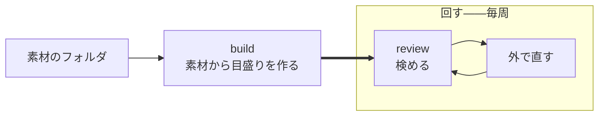

# コマンドの体系

人が触る面を決める。

<strong>[使うときはループになる](../spec/010-strategy.md#使うときはループになる)。</strong> 1 周を安く
することがそのまま品質になるので、<strong>周回に出てくるコマンドを最も短くする。</strong>

## 2 つに分かれる

| | いつ動かすか | 何をするか |
| --- | --- | --- |
| <strong>作る</strong> | 最初と、素材が増えたとき | カセットを組み立てる |
| <strong>回す</strong> | 毎周 | 検めて、直して、また検める |



<strong>`review` だけが周回に出てくる。</strong> ほかは素材が増えたときにしか動かさない。

<strong>素材を 1 本ずつ入れるコマンドを持たない。</strong>[カセットは本文を持たない](100-cassette.md#中身)
ので、入れる先が無い——<strong>素材はフォルダのまま `build` に渡す。</strong>

### 入れ物を別に作らせない

<strong>作る段は 1 つである。</strong> 素材をフォルダに置く形にした時点で、
「入れ物を作る」と「目盛りを作る」は分ける意味を失った。

<strong>空のカセットにできることは[人が決めたこと](#decide)を書くことだけで、それは
目盛りができた後でも打てる</strong>——むしろ、出てきた指摘を見てから決めるほうが順として
自然である。

> <strong>ここは作り直した決定である。</strong> 素材を 1 本ずつ `add` していた頃は、
> 入れ物を先に作る段に意味があった。<strong>`add` が消えた時点で、その段も消えていた</strong>
> ——気付かずに形だけ残していた。

<strong>毎回打つものに、何をするかの名前を付ける。</strong> よく打つものが `quick`（速さ＝
どう動くか）で、ほぼ打たないものが `new` を取っていた。<strong>名前は頻度ではなく
中身に付ける。</strong>

### 素材はフォルダで渡す

```
kakiburi build <本人の記事のフォルダ> [--baseline <フォルダ>] [--other <フォルダ>]
```

<strong>フォルダの中の読める文書を、名前の昇順で全部読む。</strong> 1 本ずつ名指しする道を
持たない——[カセットは本文を持たない](100-cassette.md#中身)ので、<strong>入れておく場所が無い。</strong>

| フォルダ | 役 |
| --- | --- |
| 位置引数 | 本人の文書。照合の[相手集合](../spec/200-extract.md#相手集合を-1-つ決める)と天井になる |
| `--baseline` | 基準。LLM の既定出力。床になる。省くと[同梱の池](#基準は外で作る) |
| `--other` | <strong>他人の文書。</strong>[較正にだけ効く](100-cassette.md#他人の文書)。照合値の較正の違う人の側と、人らしさの較正の人の側に足す。2 つ目の床は作らない |

<strong>役は引数の形で分かれる。</strong> 仕様の「越境はこの用途に限る」を、注釈ではなく
構造で言う——[役を取り違えると対照にしたはずの文書が書き手の帯に残る](../spec/200-extract.md#相手集合を-1-つ決める)
ので、<strong>いちばん高くつく取り違えを、同じ引数の中に置かない。</strong>

<strong>単位の名前はファイル名の拡張子を除いた部分である。</strong> 別のフォルダにある同名の
ファイルは<strong>同じ単位名になる</strong>——分けたいならファイル名を分ける。

#### 取り込み元は拡張子から決める

[正規化](../spec/030-normalize.md)の取り込み元を、<strong>`.md` と `.markdown` は markdown、`.html` と
`.htm` は html</strong> として読む。<strong>ほかの拡張子は読まない。</strong><strong>文書を取るコマンドはどれもこの 1 つの規則で決める</strong>——
`build` がフォルダを読むときも、`review` / `measure` / `compare` が 1 本を読むときも。

<strong>人に名乗らせない。</strong> 名乗らせれば毎回手間がかかり、名乗り違えは
[黙って 0 を並べる](../spec/030-normalize.md#取り込み元を間違えると0-が並ぶ)。
<strong>拡張子は文書が自分で名乗っているものである。</strong>

| 拡張子 | 1 本を渡したとき | フォルダの中にあるとき |
| --- | --- | --- |
| `.md` `.markdown` | markdown として読む | markdown として読む |
| `.html` `.htm` | html として読む | html として読む |
| それ以外 | 断る。終了コード 64（使い方の誤り） | 拾わない。読まずに飛ばす |

1 本を断るときは「断る: 取り込み元が拡張子から決まらない: <経路>」と出し、読める拡張子を
続けて示す。

<strong>知らない拡張子を markdown に倒さない。</strong> 倒せば、プレーンテキストや別の記法が
Markdown として読まれ、[0 が並ぶ](../spec/030-normalize.md#取り込み元を間違えると0-が並ぶ)。
エラーにならないまま値だけが狂う。

<strong>フォルダでは断らずに飛ばす。</strong> 素材のフォルダには README や控えが混ざる。拾って
から断れば、[1 本の断りでフォルダごと使えなくなる](#落ちない入力は断る)。

<strong>拡張子より細かくは分けない。</strong> Markdown の方言は
[1 つにまとめてある](../spec/030-normalize.md#markdown-を方言に分けない)ので、中身を見て
決めるものが残っていない。

<strong>読んだ取り込み元は指紋に足す。</strong> 足さなければ、別の取り込み元で読み直したことが
指紋から読めず、<strong>取り違えを検出する唯一の手がかりが止まる。</strong>

#### 落ちない入力は断る

[決定](../spec/030-normalize.md#通らないものは断る)。黙って一部を落として通さない。
<strong>1 本でも断ったら、そのフォルダは 1 本も使わない</strong>——成功したことにすると、欠けたまま
目盛りが出来上がる。

#### 束ね方は build が決める

<strong>[基準の文書を、本人の長い記事に届くように何本かまとめて 1 単位にする](100-cassette.md#短い文書は束ねる)。</strong>
束ねるのは基準だけで、本人の文書は束ねない。本人の短い記事をまとめたいなら、使う側が
ファイルを繋ぐ。
<strong>どう束ねるかを人に決めさせない</strong>——[長さの範囲](../spec/200-extract.md#見る前に標本の範囲を確かめる)
は<strong>測れた単位だけ</strong>で測られ、どれが測れるかは全文を解析するまで分からない。

<strong>手前で当てにいくと外れる。</strong> 字数と読点で近似して計画したところ、延べ語数と地の文の
バイト数が効いて<strong>本人 37 本のうち使えたのは 17 本</strong>だった。見ている分布が違えば、
束ね方も違う。

<strong>だから作ってみて、断られたら次の案で作り直す。</strong> 1 案目が通れば追加の費用は無い。

<strong>次の案へ進むのは、長さの範囲で断られたときだけである</strong>
（[仕様](../spec/200-extract.md#束ね直すのは長さで断られたときだけ)）。帯が重なりすぎた、
単位が足りない、環境の側で測れない——ほかの理由で止まったら、そこで終わる。どれも束ね方で
直るものではない。試し続ければ、通るまで基準の組み合わせを探したことになり、通った 1 案だけが
残って、最初に止まった理由が消える。全部の案が断られたら、最後の断りを出す。

作り直すたびに「長さの範囲で断られたので、束ね方を変えて作り直す（n 回目）」と出す。

<strong>束ねた単位だけが自分の名前を名乗る。</strong> 1 本しか入っていない組に別の名前を付けると、
[割り](100-cassette.md#calibrationjson)の表からどのファイルか引けなくなる。

### 差し替えるコマンドを持たない

<strong>素材はフォルダである。</strong> 1 本を入れ替えたいならファイルを上書きして `build` し直す
——<strong>カセットの中に入れ替える先が無い。</strong>

<strong>上書きが事故になる経路も消えた。</strong> 以前は `add` が同じ名前を黙って踏むと原本が
1 本消えたが、いまは<strong>原本はフォルダの側にある。</strong>

### decide

<strong>[人が決めたこと](100-cassette.md#何を収めるか)を書く。</strong> 場面のほかに 2 つある。

```
kakiburi decide <カセット> boilerplate <文字列...>
kakiburi decide <カセット> movement <指標> moves|stuck
```

<strong>場面は取らない。</strong>[1 カセットが 1 場面](100-cassette.md#1-カセット-1-場面)なので、
入れ物を選ぶことが場面を選ぶことである——<strong>2 か所で言わせれば、食い違ったときに
正本が決まらない。</strong>

<strong>落とす定型は、渡した一覧で置き換える。</strong> 足していく形にしない——<strong>いま何を落として
いるかが 1 度で読める</strong>ようにするためである。積み上げると、消すのに別の操作が要る。

<strong>知らない指標の名前は受けない。</strong> 綴りを間違えたまま書けば、直したつもりの指標が
いつまでも指摘に出続ける——<strong>エラーにならないので気付けない。</strong>

| | なぜコマンドが要るか |
| --- | --- |
| 落とす定型 | [場面ごとに人が決める](../spec/200-extract.md#定型を落とす)。文章から当てにいかない |
| <strong>指示して動くか</strong> | <strong>直させてみて初めて分かる。</strong> コーパスから導けない |

<strong>2 つ目が[戻る線 1 本目](../spec/010-strategy.md#運用に入ると戻る線が-2-本できる)の入口
である。</strong>[検めを 2 周](../spec/300-revise.md#直したら測り直す)して
<strong>その指標自身の値が</strong>動かなかったものを `stuck` にすると、次から
[前に出す指標](../spec/300-revise.md#種別を合わせて通るを出す)から外れる。

<strong>照合値が動かなかったことを根拠にしない。</strong> 照合値は 1 つの切り口には鈍く、指摘が正しく
通じても動かないことがある（[実測](../spec/300-revise.md#直したら測り直す)）。混ぜれば、
<strong>効いている指標を `stuck` にして捨てる。</strong>

<strong>書かないかぎり `未知` で、`未知` は前に出す指標に入る。</strong> 動かないと分かるまでは使う。

<strong>`decide movement` は周回の途中で打つ。</strong>「作る」に置いてあるのは、書き込む先が
[人が決めたこと](100-cassette.md#何を収めるか)だからであって、回し終えてから打つという
意味ではない（[周回を繋ぐ](../spec/300-revise.md#周回を繋ぐものを決める)）。

<strong>打ったら派生物が古くなる。</strong>[前に出す指標](100-cassette.md#effectivejson)は movement
から導くので、書き換えたのに作り直さなければ <strong>`stuck` にした指標が指摘に出続ける。</strong>

> <strong>`decide movement` は、書き換えたときに[効くかの判定](100-cassette.md#effectivejson)を
> 捨てる。</strong> 捨てたカセットで `review` すると、判定できないが返る。

<strong>その場で作り直さない。</strong> 作り直すには全単位を測り直すことになり、`decide` が
`build` と同じ重さになる。<strong>捨てて `build` に任せる</strong>——古いまま残すよりよい。

<strong>ほかの派生物は触らない。</strong> 値も目盛りも movement では変わらない——変わるのは
「どれを前に出すか」だけである。<strong>ほかの場面も触らない</strong>——場面ごとに決め直す
ものだからである。

<strong>どちらも作り直せない原本である。</strong> 書く道が無ければ、実装する人が「文章から推定する」
を発明する——仕様がどちらについても名指しで禁じている道である。

### 基準は外で作る

<strong>基準を作るコマンドを持たない。</strong> 書かせる側は
[軸の外](../spec/000-axis.md#だからしないこと)である——文章を作ることは、渡されれば済む。

作ったものはフォルダに置いて `build --baseline` で渡す。<strong>版と推論設定と題材を
一緒に渡す</strong>（`--model` / `--version` / `--param` / `--topic`）——
[版と推論設定が指紋に入る](../spec/200-extract.md#版と推論設定まで記録する)。
<strong>記録の無い基準で作った値は、次に測ったときに比べられない。</strong>

<strong>同梱の池を持つ。</strong>`--baseline` を省いたらそちらを使う。
<strong>基準は機械がどう書くかであって書き手ごとに変わらない</strong>ので、あらかじめ作った
ものでよい——[題材の統制は対ではなく素材全体に効かせる](../spec/200-extract.md#題材の統制は対ではなく素材に効かせる)。

<strong>同梱かどうかは、池自身が言う。</strong> フォルダの中の `POOL` が版を名乗っていれば
同梱の池で、そのときだけ来歴を訊かない。

<strong>場所では決められない。</strong>`KAKIBURI_BASELINES` が同梱の池を指すのは普通の
使い方だが、<strong>どこを指しているかは道具に分からない</strong>——場所で決めると、
別の素材が同梱の池の来歴を名乗る。

<strong>池からは、本人と同じ文体で題材の近い分だけを使う。</strong> 池は同じ題材を敬体と常体の
両方で持つ。本人の文体に合う側に絞り、そこから自立語の重なりが多い順に 24 本を
選ぶ（[仕様](../spec/200-extract.md#同梱の池からは文体が同じで題材の近い分だけを使う)）。池は題材を揃えずに
広く取ってあるので、選ばなければ題材を測ることになる。

<strong>`--baseline` で渡したフォルダは全部使う。</strong> 人が基準として集めたものを黙って一部に
絞れば、名乗った作り方と実際に使った素材が食い違う。池でも `--model` と `--version` で作り方を
名乗り直したら、全部使う。どちらを使ったかは `build` が「基準を同梱の池から n 本選んだ」か
「基準 n 本を全部使う」で出す。

#### 依頼文の作り方は、人が守る規則である

作る道具を持たない以上、ここは検めようがない。<strong>だが決めておく</strong>——決めなければ、
測っているのが題材になる。

<strong>本文を依頼文に入れない。</strong> 本文の書き出しから依頼文を作ると、書き出しの癖が
そのまま手掛かりになり、基準値が <strong>28 ポイント</strong>膨らむ
（[漏らさない](../spec/200-extract.md#依頼文に書き方を漏らさない)）。<strong>渡すのは
「何について書くか」の中立な要約だけである。</strong>

<strong>題材は本人の文書から取る</strong>——[題材を揃える](../spec/200-extract.md#題材の統制は対ではなく素材に効かせる)
以上、本人が書いた題材について書かせることになる。<strong>ただし要約は人が書く。</strong> 本文から
機械的に作れば、そこが漏れる経路になる。

<strong>要約には記事が名指しする物を書く</strong>——製品名、コマンド名、版番号
（[理由](../spec/010-strategy.md#題材を統制する)）。題名だけだと基準の側だけラテン文字が薄く
なり、<strong>その差だけで帯が分離してしまう</strong>——通ったように見えて、測っているのは題材である。

<strong>ただし名前の表記までは写さない。</strong>「Vim script」か「Vim スクリプト」か、版番号を半角か
全角か——そこは書きぶりの層であり、写せば漏れる。

<strong>文体（です・ます調か、だ・である調か）は本人に合わせて指定する。</strong> 指定しなければ
LLM は常体に寄る。本人が敬体で書くと、床が敬体の機械の文章より下に来て、機械の草稿が
帯の隙間の中点を越えてしまう（[経緯](../spec/200-extract.md#同梱の池からは文体が同じで題材の近い分だけを使う)）。
同梱の池を作る `tools/gen-baseline.sh` は `KAKIBURI_BASELINE_REGISTER=dearu|desu` で文体を
指定する。

<strong>10 本以上作る。</strong> 基準の側にも[下限](../spec/200-extract.md#対が何本あれば信じるか)が
掛かる。1 題材から 1 本作るなら、題材も 10 要る。

<strong>この規則はどれも機械には見えない。</strong> 題材は自由な文字列で、名前が入っているかも
表記を写したかも判らない。<strong>`doctor` の一覧にも載らない</strong>——人が守る。

### build

```
kakiburi build <本人の記事のフォルダ> [--cassette <カセット>] [--scene <場面>]
                                      [--baseline <フォルダ>] [--other <フォルダ>]
                                      [--model <名前> --version <版>] [--json]
```

<strong>入れ物を作る → 素材を読む → 語彙 → 値 → 較正 → 帯 → 効く指標</strong> を一度に作る。
分けて呼べるようにしない——途中まで作った状態を人が持つと、指紋の合わない派生物が混ざる。

<strong>カセットが無ければ作り、在れば作り直す。</strong> 経路の既定は `<フォルダ>.kb`、
場面の既定は `default` である——<strong>道具が勝手に作る名前を日本語にしない。</strong>

<strong>在るものを消さない。</strong> カセットとして読めないものを指されたら、それは人の
別のファイルである——消さずに断る。<strong>カセットだったとしても消さない</strong>：
[人が決めたこと](100-cassette.md#何を収めるか)は作り直せないので、消せば落とす定型も
動かない指標もそこで消える。<strong>目盛りは入れ替えるので、消す理由がそもそも無い。</strong>

<strong>場面の食い違いは断る。</strong> 名乗りだけ据え置いて中身を作り直せば、
<strong>中身と名前が合わないカセットになる。</strong>

<strong>[素材はフォルダで渡す](#素材はフォルダで渡す)。</strong> カセットは本文を持たないので、
作り直すたびにフォルダを読み直す——<strong>素材が変わっていれば、目盛りも変わる。</strong>

<strong>目盛りを作らずに終わる条件を持つ。</strong>

| 作らない | なぜ |
| --- | --- |
| 本人または基準の単位が[下限](../spec/200-extract.md#対が何本あれば信じるか)を下回る | <strong>どちらも 10 単位が要る</strong>（本人は相手集合 5 ＋ 測る分 5、基準は較正分 5 ＋ 床の点 5） |
| <strong>照合値の</strong>天井と床がほとんど重なる | [骨格が通っていない](../spec/010-strategy.md#それでも骨格を先に通す) |
| <strong>本人側と基準側の長さの範囲が半分も重ならない</strong> | [測っているのが長さになる](../spec/200-extract.md#見る前に標本の範囲を確かめる) |
| どちらかの帯で天井か床の広がりが 0 | 端が決まらない（[帯](../spec/200-extract.md#帯は2-つの分布の重なりである)） |

<strong>基準の側にも下限が掛かる。</strong> 本人と基準の両方を[2 つに割る](../spec/200-extract.md#相手集合を-1-つ決める)
ので、片方だけ足りなくても目盛りは作れない。<strong>相手集合を減らして帳尻を合わせない</strong>——減らせば天井・床・検めの相手の本数が変わり、
3 つが同じ散らばりに載らなくなる。

<strong>2 行目だけが照合値限定である。</strong> 人らしさの帯が全体を覆うのは
[設計どおりの結果](../spec/100-metrics.md#なぜ人らしさは層-2-を判定から外す原則にかからないのか)
である——当てはまらないことが判定不能として出る仕組みなので、<strong>止めれば自己診断が消える。</strong>
重なった人らしさの帯はそのまま書き出す。

<strong>最後の行は両方に掛ける。</strong> 広がりが 0 なら端が決まらず、<strong>重なっているのかいないのかも
読めない。</strong> 覆っているのとは違う——覆っているなら端はある。

<strong>止まっても失敗ではない。</strong> 目盛りの無いカセットが出来上がり、`build` は `0` で終わる。
理由を `manifest.json` に残す。<strong>そのカセットで `review` すると、判定できないが返る。</strong>

<strong>作れたときは、[割り](100-cassette.md#calibrationjson)を 4 つとも出す。</strong> 止まった理由は
出すのに通ったときの割りを出さないと、<strong>いちばん静かな壊れ方だけが見えない</strong>——
昇順で取るので、単位名に年や媒体が入っていれば割りがその境目で分かれる。値は出るし
エラーにもならないので、<strong>出力を見ても帯が「ある時期 対 別の時期」になっていることに
気付けない。</strong>

#### 本人がいちばん高く出るかを、ここで測る

<strong>[自分を検査する](../spec/300-revise.md#自分を検査する)のは `build` の仕事である。</strong>
本人がいちばん高く出ることが目盛りの壊れていない最低条件だが、<strong>測るには素材が要る</strong>
——カセットは本文を持たないので、<strong>作り終えたあとに測り直す道が無い。</strong>

<strong>素材を持っている瞬間はここしかない。</strong> だから `doctor` ではなくここで出す。

<strong>較正に使った単位は測らない。</strong> 本人は相手集合を、基準は較正分を除く。相手集合を
測れば自分との距離を測ることになり、基準の較正分を測れば、分けるように合わせたものの分け
具合を測ることになる。

<strong>対ごとの割合で見る。</strong> 端は n とともに外へ広がるので、最小と最大で見ると
<strong>素材を足すほど落ちやすくなる</strong>——目盛りが良くなっても検査が落ちる
（[端では見ない](../spec/300-revise.md#端では見ない)）。

<strong>逆に出た対を名指しする。</strong> 割合だけでは、目盛り全体が緩んでいるのか 1 本の単位が
外れているのかが分からない。

<strong>止めない。</strong> 疑わしいと言うだけである——何を壊れと呼ぶかの線がまだ暫定値なので、
[骨格が通るまで閾値を手で決めない](../spec/010-strategy.md#それでも骨格を先に通す)。

## 回す

### review

```
kakiburi review <ファイル> --cassette <カセット> [--own-writing shown|not-shown|unknown] [--json]
```

<strong>3 値と指摘を返す。</strong>

<strong>取り込み元は[拡張子から決める](#取り込み元は拡張子から決める)。</strong> 検める文書も
[同じ手順で正規化する](../spec/300-revise.md#同じ測り方で測る)以上、`build` と同じ規則で決める。

<strong>場面は取らない。</strong>[1 カセットが 1 場面](100-cassette.md#1-カセット-1-場面)なので、
<strong>どのファイルを渡すかが場面の指定そのものである。</strong>

<strong>摩擦は消えていない、移っただけである。</strong> 仕様が求めているのは
[場面を人に選ばせること](../spec/300-revise.md#場面を指定させる)であって、引数を打たせる
ことではない——<strong>入れ物を選ぶ時点で選んでいる。</strong> 綴りを間違えれば存在しない
カセットとして `64` で止まるので、<strong>間違いが正常な停止に化ける経路も無い。</strong>

<strong>相手集合のベクトルが欠けていたら `64` である。</strong>[目盛りが持っている](100-cassette.md#scalejson-は相手集合も持つ)
ものが欠けていれば照合値は出せない——<strong>目盛りがあるのに `2` が返る</strong>のは、
壊れていることが正常に見えるということである。

| 終了コード | |
| --- | --- |
| `0` | 通る |
| `1` | 通らない |
| `2` | 判定できない |
| `64` 以上 | <strong>使い方の誤り、カセットが読めない</strong> |

<strong>判定できないを 1 と分けるのが要点である。</strong> 一緒にすれば、
[分からないと言えること](../spec/010-strategy.md#届かないときは判定できないと言う)が
呼ぶ側から消える。

<strong>目盛りの無いカセットは `64` ではなく `2` である。</strong> 素材が足りずに目盛りが作れなかった
のは <strong>正常な状態</strong>であり、仕様がそのために判定できないを置いている。`64` 以上は、
カセットが壊れている・読めない・指紋が環境と合わないといった <strong>使う前の問題</strong>に取っておく。

<strong>同じ理由で、系統が欠けたとき・素材が足りないときも `2` である。</strong> 判定できないを返す
経路を、エラーとして扱わない。

<strong>どの段で止まったかを必ず返す</strong>（[3 段](../spec/300-revise.md#種別を合わせて通るを出す)）。
返さなければ、照合値を上げようとして人らしさを下げる逆向きの直しを招く。

#### 既定は散文である

<strong>表で返さない。</strong> 構造化した形を求めると成績が落ちる（[SPTG の評価](../references/sptg-evaluation-2025.md)）。
既定の出力は <strong>そのまま直す側に貼れる散文</strong>にする。

<strong>数値は落とさない</strong>（[決定](../spec/300-revise.md#散文で渡す)）。散文にするのは言い方
であって、根拠の値ではない。

`--json` は道具向けである。<strong>人にも LLM にも既定では出さない。</strong>

#### 道具向けの出口

<strong>`measure` / `build` / `review` が `--json` を取る。</strong> この道具は素材を集めて回す
性質上、<strong>スクリプトや LLM から叩かれる回数のほうが多くなる。</strong> 出口が無ければ、
人向けの出力からラベルの文言と桁揃えに頼って値を切り出すことになり、<strong>文言を変えた
瞬間に黙って壊れる。</strong>

<strong>出すのは、人向けに出している値の生の形である。</strong> 人向けの表示は変えない。

| 決めること | どうするか |
| --- | --- |
| 丸め | <strong>しない。</strong> 人向けは 3 桁に丸めるが、道具向けは生の値 |
| 測れていない指標 | <strong>`null` と理由。</strong> 人向けの `—` と `0.000` の区別をそのまま写す |
| 但し書き | <strong>stderr。</strong> stdout に混ぜれば JSON として読めない |
| 指摘 | <strong>stdout の JSON の中。</strong> あれは結果であって断り書きではない |
| 終了コード | 変えない |

<strong>`why` を持たせないと、JSON にしたとたんに「測っていない」が消える。</strong>

<strong>依存は増やさない。</strong> 書き出しだけなら[自前の JSON](100-cassette.md#容器は-zip) が
既にある。

#### 但し書きは stderr へ

<strong>`--json` の有無にかかわらず、断り書きは stderr が正しい。</strong> 「暫定値が立っている」
「定義ファイルが見つからない」「較正を疑う」「中のほうが散らばっている場面がある」——
どれも<strong>結果ではなく、結果の読み方への注意</strong>である。

<strong>指摘は stdout に残す。</strong> `指摘 N 本` とその中身は結果そのものであり、
そのまま直す側に貼るためのものである。

#### 草稿の作られ方を訊く

```
kakiburi review ... [--own-writing shown|not-shown|unknown]
```

本人の文章を見せて書かせた草稿は[測定が膨らむ](../spec/300-revise.md#草稿の作られ方を疑う)。
kakiburi は書かせる側を持たないので防げない。<strong>だから申告させ、判定に添える。</strong>

<strong>真偽のフラグにしない。</strong> フラグでは「渡していない」と「申告していない」が同じ形に
なる。<strong>3 値で受ける</strong>——既定は `unknown` である。

| 値 | 何を言っているか |
| --- | --- |
| `shown` | 本人の文章を渡して書かせた |
| `not-shown` | 渡していない |
| `unknown`（既定） | 草稿の作られ方を知らない |

<strong>省略を `not-shown` と読まない。</strong> 読めば、いちばん膨らみやすい草稿がいちばん綺麗な
顔で通る。<strong>`shown` と `unknown` には、3 値のどれを返すときも但し書きを添える。</strong>

但し書きの文は「本人の文章を見せて書かせた草稿では測定が膨らむ。この値が膨らんでいないこと
は確かめられていない」である。

| | `shown` / `unknown` | `not-shown` |
| --- | --- | --- |
| 人向けの出力 | stderr に「但し書き: 」を頭に付けて出す | 出さない |
| `--json` | `own_writing` に申告の綴り、`own_writing_caveat` に但し書きの文 | `own_writing` は `not-shown`、`own_writing_caveat` は `null` |
| 判定と終了コード | 変えない | 変えない |

<strong>JSON にも入れる。</strong> stderr にだけ出すと、JSON だけを読む道具に但し書きが届かない
——省いて返したのと同じになる。添えないときは空文字ではなく `null` にする。

<strong>判定は変えない。</strong> 渡したかどうかは値をどう読むかの問題であって、値が出せない
理由ではない。判定できないに落とせば、本当に判定できないときの重みが下がる。

<strong>3 つの綴り以外は断る。</strong>`true` `false` `yes` `no` のような真偽の綴りも受けない。
使い方の誤りとして `64` で終わる。

## 覗く

<strong>[測るのを安くする](../spec/100-metrics.md#測るのを安くする)が 3 つを名指ししている。</strong>
そのまま 3 つのコマンドにする。

```
kakiburi measure <ファイル> [--cassette <カセット>] [--json]
kakiburi compare <ファイル>... [--cassette <カセット>]
```

<strong>`measure` は 1 本を測り、`compare` は並べて比べる。</strong> カセットの中身を覗くのは
[`doctor`](#doctor) である——<strong>覗くことと検めることを分けない。</strong>

<strong>取り込み元は[拡張子から決める](#取り込み元は拡張子から決める)。</strong>
<strong>`compare` の複数のファイルは、同じ取り込み元でなければならない</strong>：違えば
[升目が単位ごとに変わり](../spec/030-normalize.md#対応表は取り込み元ごとに持つ)、
測れないの出方が揃わない。

<strong>カセットが無くても動く。ただし出るものが違う。</strong>

| | カセット無し | カセット有り |
| --- | --- | --- |
| 指示できる指標 | 出る | 出る |
| <strong>照合値・人らしさ値</strong> | <strong>出ない</strong> | 出る |
| <strong>系統の距離</strong> | <strong>出ない</strong> | 出る |
| <strong>帯</strong> | <strong>出ない</strong> | 出る |

<strong>系統を出さないのは、[語彙が無い](../spec/200-extract.md#語彙は先に決めて固定する)から
である。</strong> 頻度で次元を選ぶ系統は、渡された 2 本からその場で選べば <strong>違う軸のベクトル
どうしの距離</strong>になる。仕様が名指しで禁じている。

<strong>黙ってスカラーだけ出さない。</strong> 系統を出せないことを言う——言わなければ、比べたつもり
で比べていない。

<strong>`compare` が 3 本以上を取るのは、[周回ごとの散らばり](100-cassette.md#周回のあいだの観測は外でやる)
を見るためである。</strong> n 周した A・B・C を並べて渡す。

<strong>それにはカセットが要る。</strong> 散らばりを見るとは<strong>天井と比べる</strong>ことであり、
天井は目盛りの中にある——<strong>指示できる指標だけを並べても、近づいているのかは読めない。</strong>

> <strong>ここは文書が先に書かれて、実装が追いついていなかった。</strong>`--cassette` は
> 表にも書式にもあったが、受け取る側が無かった——<strong>`compare` は仕様が与えた仕事を
> できないまま、できるように見えていた。</strong>

<strong>判定はしない。</strong> 3 段で判定するのは [`review`](#review) である——混ぜれば、
指摘の出ない「通る」が別の口から出ることになる。

#### カセットを取る口は同じ検査を通す

<strong>口ごとに検査を書かない。</strong> 書き分ければ、<strong>同じカセットが口によって通ったり
断られたりする</strong>——実際そうなっていて、`review` だけが指紋と相手集合を確かめ、
`measure` と `compare` は確かめずに値を出していた。

| 確かめること | 通らなければ |
| --- | --- |
| 目盛りが<strong>書いてあるのに読めない</strong> | <strong>壊れている</strong>として断る |
| 指紋が環境と合う | <strong>使う前の問題</strong>として断る |
| [相手集合のベクトル](100-cassette.md#scalejson-は相手集合も持つ)が噛み合う | 同上 |
| 目盛りがまだ無い | <strong>判定できない。</strong> 正常な状態である |

<strong>目盛りを先に読む。</strong> 読めないまま指紋を照らすと、語彙が空のまま組み直されて
「指紋が合わない」として返る——<strong>同じ壊れたカセットに、口ごとに違う直し方を
案内することになる。</strong>

<strong>落とす定型も同じ口から掛ける。</strong> 掛け忘れれば、同じ文書が口によって違う照合値に
なる（[同じ測り方で測る](../spec/300-revise.md#同じ測り方で測る)）。
<strong>測る本文は 1 度だけ決める</strong>——指示できる指標を落とす前の本文で測り、目盛りの値を
落とした後の本文で測れば、<strong>1 つの出力の中で別の本文を測ったことになる。</strong>

## 検査

### doctor

```
kakiburi doctor <カセット>
```

<strong>中身を出して、検める。</strong> 場面・世代・人が決めたこと・帯・語彙の大きさ・割り・
効く指標・[言い回しの表](100-cassette.md#phrasesjsonl--本文の代わり)を出し、そのうえで
矛盾していないかを言う。

<strong>覗くことと検めることを分けない。</strong> 分けていたときは中身の大半が両方に出ていて、
<strong>利用者はどちらを打つかを毎回選ばされていた</strong>——選ばせるだけの違いしか無いなら、
分ける理由が無い。

<strong>素材の分布は出ない。</strong> カセットは本文を持たないので、出せるのは
<strong>作り終えた目盛りそのもの</strong>である——素材がどう散らばっていたかは `build` が
読んだその場でしか言えない。

<strong>カセット単体で矛盾していないかを見る。</strong>

- 指紋が現在の環境と合っているか（辞書の版、圧縮器、正規化の実装）
- 派生物が揃っているか——目盛りと効くかの判定は<strong>片方だけあってはいけない</strong>
- 帯が全体を覆っていないか——覆っていれば「判定できない」しか返らない
- [言い回しの表](100-cassette.md#phrasesjsonl--本文の代わり)があるか——無ければ繰り返しの上限を言えない
- `provisional` が立っていないか

<strong>素材は要らない。</strong>[自分を検査する](../spec/300-revise.md#自分を検査する)
——本人がいちばん高く出るか——は [`build` が測る](#本人がいちばん高く出るかをここで測る)。
<strong>カセットは本文を持たないので、素材を持っている瞬間はあちらしかない。</strong>

<strong>だから `doctor` はいつでも打てる。</strong> 素材のフォルダを消したあとでも、
受け取っただけのカセットでも走る——<strong>検査が素材に縛られない。</strong>

<strong>疑わしければ `2` で返す。</strong> 検査が通らないことは「使う前の問題」ではない——
カセットは読めているし、判定も出せる。<strong>出た値を信じてよいかが分からない</strong>だけで
あり、それは判定できないと同じ側である。

### metrics

```
kakiburi metrics [--kind 指示|照合|人らしさ] [--layer 1|2|3]
```

登録簿を回して一覧を出す。<strong>使う側が一覧を持たない</strong>ことの裏返しで、
<strong>一覧を見たい人はここへ来る</strong>。

## 決めたこと

### 破壊的な操作を短くしない

<strong>`build` は派生物を作り直す。</strong> 原本には触らない。原本を消す道はコマンドとして持たない
——カセットは 1 ファイルなので、消したければファイルを消せばよい。

### 場面を跨ぐ道を作らない

<strong>跨いで目盛りを作る道を持たない。</strong>[場面ごとに閉じる](../spec/010-strategy.md#場面ごとに閉じる)
以上、跨ぐ操作は「どの場面のものでもない」ものを作る道になる。

<strong>入れ物が境界そのものである。</strong>[1 カセットが 1 場面](100-cassette.md#1-カセット-1-場面)
なので、跨ぐ道は書こうとしても書けない——<strong>2 つのカセットを開いて混ぜるコマンドが
無いからである。</strong>

<strong>複数のカセットをまとめて扱うコマンドも持たない。</strong> まとめる操作は「どの場面の
ものでもない」ものを作る道になる。並べたければファイルを並べればよい。

<strong>跨げるのは[他人の文書](100-cassette.md#他人の文書)だけである</strong>
——`build --other` で渡す。他人の文書は較正にだけ足す。照合値の較正では本人ではない側
（違う人の側）に、人らしさの較正では人の側に入る。どちらも<strong>その人の側に他人を置く
使い方ではない</strong>ので、書き手も場面も問わない。相手集合・語彙・天井・床・帯には入らない。

### 対話しない

<strong>訊くものはすべて引数で受ける。</strong> ループが回るものなので、途中で人を待たせない。

### help は引数解析より先に見る

<strong>`<コマンド> --help` は、どのコマンドでも通る。</strong> 位置引数がファイルなので、
そのまま引数解析に渡すと <strong>`--help` がファイル名として解釈され、「読めない（65）」で
終わる。</strong>

<strong>全体の help と同じ文を切り出す。</strong> 2 か所に書けば、片方だけが古くなる。

<strong>環境変数を help に書く。</strong> 書かなければ<strong>仕様を読むまで進めない。</strong>
形態素解析器と辞書は実行ファイルに同梱してあるので、用意させるものは基準の池の場所だけである。

| 書くこと | なぜ |
| --- | --- |
| 解析器と辞書を同梱していること | 用意するものが無いと分かれば、環境を整えに行かない |
| `KAKIBURI_BASELINES` | 同梱の池を作業ディレクトリの外から指す唯一の手段である |
| 取り込み元の一覧 | <strong>実装から出す。</strong> 手で並べれば増えたときに片方だけが古くなる |
| <strong>`--other` が何に効くか</strong> | 役の名前だけでは、何に効くかが読めない。較正にだけ足し、2 つ目の床は作らないことまで書く |

<strong>[訊けるものは訊く](../spec/010-strategy.md#訊けるものは訊く)は判断軸の話であって、
この道具が測らないと決めたものである。</strong> 書く人が自分で添えるのは自由だが、コマンドが
訊きにいかない。
