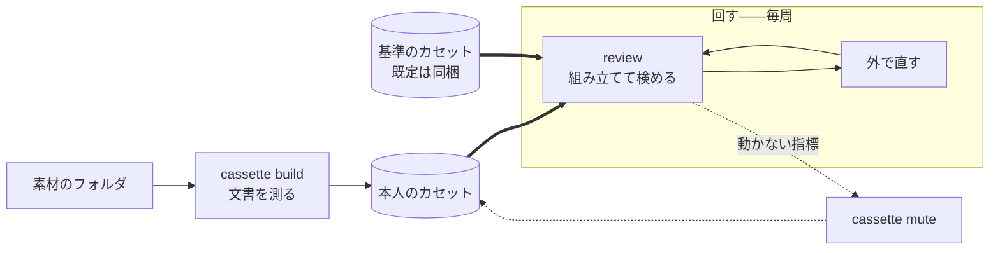

# コマンドの体系

人が触る面を決める。

[使うときはループになる](../spec/010-strategy.md#使うときはループになる)。1 周を安く
することがそのまま品質になるので、周回に出てくるコマンドを最も短くする。

## 2 つに分かれる

| | いつ動かすか | 何をするか |
| --- | --- | --- |
| `kakiburi cassette …` | 最初と、素材が増えたとき、指摘の出し方を変えたいとき | カセットを作る・見る・比べる・調整する |
| `kakiburi review` | 毎周 | 2 つのカセットから目盛りを組み立て、草稿を検める |



`review` だけが周回に出てくる。`cassette` の下のものは、素材が増えたときか、指摘の出し方を
変えたいときにしか動かさない。

`cassette` の下ではカセットが操作の対象そのものなので、位置引数で渡す。`review` では
カセットは検めるための道具なので、`--cassette` で渡す。

トップレベルのコマンドは `review` 1 つにする。

| 以前のコマンド | 移った先 | なぜ |
| --- | --- | --- |
| `build` | `cassette build` | カセットを作る操作である |
| `doctor` | `cassette show` | カセットの中身を見る操作である |
| `decide` | `cassette mute` など調整のサブコマンド | 定型は素材から消し、動かない指標は無効にする |
| `measure` | `review --values` | カセットを渡さずに測ると、比べる相手が無く値を眺めるだけになる |
| `compare` | `review` に草稿を複数渡す | 判定と主な値を 1 本 1 行で並べる |
| `metrics` | `cassette list` | 指標の名前を知りたいのは、無効にするときである。定義は[仕様](../spec/metrics/README.md)にある |

素材を 1 本ずつ入れるコマンドを持たない。[カセットは本文を持たない](100-cassette.md#中身)
ので、入れる先が無い。素材はフォルダのまま `cassette build` に渡す。

### 素材はフォルダで渡す

```
kakiburi cassette build <フォルダ> -o <カセット>
```

フォルダの中の読める文書を、名前の昇順で全部読む。1 本ずつ名指しする道を持たない。
[カセットは本文を持たない](100-cassette.md#中身)ので、入れておく場所が無い。

本人の文書も基準の文書も、同じコマンドでカセットにする。どちらとして使うかは、`review` に
渡す位置で決まる。道具は基準が機械の文章か人の文章かを区別しない
（[基準を置く](../spec/200-extract.md#基準を置く)）。

単位の名前はファイル名の拡張子を除いた部分である。フォルダの下の階層にある同名の
ファイルは同じ単位名になる。分けたいならファイル名を分ける。 名前が重なるか、名前に
改行やタブなどの制御文字があれば、カセットを書かずに `64` で断る。 読み戻すときも同じ名前を
断るので、書いてしまえばそのカセットは使えない。

フォルダの中の象徴リンクは、ファイルもディレクトリも辿らない——辿れば、人から受け取った
フォルダの外の文書が素材に混ざり、自分を指すリンクでは際限なく降りる。

#### 取り込み元は拡張子から決める

[正規化](../spec/030-normalize.md)の取り込み元を、`.md` と `.markdown` は markdown、`.html` と
`.htm` は html として読む。ほかの拡張子は読まない。文書を取るコマンドはどれもこの 1 つの
規則で決める。`cassette build` がフォルダを読むときも、`review` が草稿を読むときも。

人に名乗らせない。名乗らせれば毎回手間がかかり、名乗り違えは
[黙って 0 を並べる](../spec/030-normalize.md#取り込み元を間違えると0-が並ぶ)。
拡張子は文書が自分で名乗っているものである。

| 拡張子 | 1 本を渡したとき | フォルダの中にあるとき |
| --- | --- | --- |
| `.md` `.markdown` | markdown として読む | markdown として読む |
| `.html` `.htm` | html として読む | html として読む |
| それ以外 | 断る。終了コード 64（使い方の誤り） | 拾わない。読まずに飛ばす |

1 本を断るときは「断る: 取り込み元が拡張子から決まらない: <経路>」と出し、読める拡張子を
続けて示す。

知らない拡張子を markdown に倒さない。倒せば、プレーンテキストや別の記法が
Markdown として読まれ、[0 が並ぶ](../spec/030-normalize.md#取り込み元を間違えると0-が並ぶ)。
エラーにならないまま値だけが狂う。

フォルダでは断らずに飛ばす。素材のフォルダには README や控えが混ざる。拾ってから断れば、
[1 本の断りでフォルダごと使えなくなる](#落ちない入力は断る)。

拡張子より細かくは分けない。Markdown の方言は
[1 つにまとめてある](../spec/030-normalize.md#markdown-を方言に分けない)ので、中身を見て
決めるものが残っていない。

読んだ取り込み元は指紋に足す。足さなければ、別の取り込み元で読み直したことが指紋から
読めず、取り違えを検出する唯一の手がかりが止まる。

#### 落ちない入力は断る

[決定](../spec/030-normalize.md#通らないものは断る)。黙って一部を落として通さない。
1 本でも断ったら、そのフォルダは 1 本も使わない。成功したことにすると、欠けたまま
カセットが出来上がる。

### 差し替えるコマンドを持たない

素材はフォルダである。1 本を入れ替えたいならファイルを上書きして `cassette build` し直す。
カセットの中に入れ替える先が無い。

## cassette

### cassette build

```
kakiburi cassette build <フォルダ> -o <カセット> [--scene <場面>] [--json]
```

フォルダの文書を測り、文書ごとの統計値と語のまとめ方をカセットに書く
（[文書を測る](../spec/200-extract.md#文書を測る)）。比べる相手は見ない。目盛りは作らない。

`-o` の先にカセットが無ければ作り、在れば作り直す。作り直すときは、前のカセットの
[調整](100-cassette.md#tuningjson)を引き継ぐ。無効にした指標の名前が今の登録簿に無ければ、
知らせて捨てる。

在るものを消さない。カセットとして読めないものを指されたら、それは人の別のファイルで
ある。消さずに断る。カセットだったとしても、調整は作り直せないので、消さずに引き継ぐ。
版が違って読めないカセットも断る。調整を引き継げないまま上書きすれば、そこで消える。

`--scene` は場面の名前を付ける。省けば、作り直すときは前の名前を引き継ぎ、新しく作るときは
フォルダの名前を使う。

言うのは、統計値が測れたかどうかだけである
（[測れたかだけを言う](../spec/200-extract.md#測れたかだけを言う)）。

| 出すもの | |
| --- | --- |
| 測った文書の本数 | |
| 下限に届かない文書 | 字数と下限を添える |
| 文書ごとに測れなかった系統と指標 | 理由ごとにまとめる |
| 語のまとめ方で見つけた語の数 | |
| 引き継いだ調整と、捨てた調整 | |
| 中身のハッシュ | 基準として渡したときに、どの基準かを名指す |

目盛りが作れるかは言わない。目盛りは比べる相手が決まるまで作れない。確かめたいときは
[`cassette diff`](#cassette-diff) で基準と比べる。

[環境の側の理由](../spec/100-metrics.md#測れない理由を分けて返す)で測れなかった文書が
あれば、カセットを書かずに断る。終了コードは 64 以上である。

### cassette show

```
kakiburi cassette show <カセット> [--json]
```

中身を出す。場面・世代・中身のハッシュ・文書の本数・長さの範囲・文体の内訳・測れなかった
文書と理由・語のまとめ方・調整である。無効にしている対象は並べて見せる。無効にしたことを
忘れたまま使わないためである。

カセット単体で矛盾していないかも見る。

- 指紋が今の道具と合っているか（辞書の版、圧縮器、正規化の実装）
- 中身のハッシュが `stats/` の中身と合うか

素材は要らない。受け取っただけのカセットでも走る。目盛りを見るなら
[`cassette diff`](#cassette-diff) を使う。

### cassette diff

```
kakiburi cassette diff <本人のカセット> <基準のカセット> [--json]
```

2 つのカセットから[目盛りを組み立て](#目盛りを組み立てる)、2 つがどこで違うかを出す。
1 つ目を本人の側、2 つ目を基準の側として組み立てる。

| 出すもの | |
| --- | --- |
| 両方の場面の名前と中身のハッシュ | どの組み合わせかを名乗る |
| 見分けられるか | 照合値と基準との距離の帯が分かれるか。天井・床・帯の端 |
| 見分けられないなら、その理由 | 下限、長さの範囲、帯の重なり、自己検査 |
| どの指標で違うか | [効く指標](../spec/200-extract.md#どの指標が効くかを決める)と、本人の癖 |
| 片方だけが使う言い回し | 型、基準の型、基準の語 |
| 使った基準の文書と束ね方 | 文体と題材で選んだ本数、束の構成、長さの窓で選び直したならその字数 |
| [割り](#割りを出す) | 相手集合・測る分・較正分・床の点 |

自己検査は内側で行い、崩れていたときだけ見分けられない理由として出す
（[自分を検査する](../spec/300-revise.md#自分を検査する)）。

本人のカセットの調整は効かせない。何が違うかを全部見るためのコマンドなので、無効にした
ものも出す。無効にしているものには印を付ける。

文体の申告だけは効かせる。申告は外す調整ではなく、数えた結果を本人が正す口である。効かせ
なければ、基準の文書を `review` と違う文体で選び、`review` と違う目盛りを見せることになる。

見分けられるのは、目盛りが組み立てられ、[本人がいちばん高く出て](#本人がいちばん高く出るかをここで確かめる)、
照合値の帯が分かれているときである。基準との距離の帯は重なっても見分けられないとは
しない。重なった帯は `review` の 1 段目で判定できないとして出る、設計どおりの状態である
（[帯の重なり](../spec/200-extract.md#帯は2-つの分布の重なりである)）。帯の端は両方出す。

2 人の書き手を比べるときも、このコマンドを使う。A さんのカセットと B さんのカセットを
渡せば、B さんを基準にしたときに A さんがどこで際立つかが出る。

| 終了コード | |
| --- | --- |
| `0` | 見分けられる |
| `2` | 見分けられない |
| `64` 以上 | 使い方の誤り、カセットが読めない、指紋が合わない |

### 調整する

調整はカセットへの操作なので、`cassette` の下にサブコマンドとして並べる
（[tuning.json](100-cassette.md#tuningjson)）。どれも測った値に触らないので、作り直しは
要らない。書いたら次の `review` から効く。

```
kakiburi cassette edit         <カセット> [--baseline <カセット>]
kakiburi cassette list         <カセット> [--kind <種類>] [--state on|off] [--baseline <カセット>]
kakiburi cassette mute         <カセット> <名前または ID>... | --kind <種類> [--baseline <カセット>]
kakiburi cassette unmute       <カセット> <名前または ID>... | --kind <種類> [--baseline <カセット>]
kakiburi cassette first-person <カセット> <一人称>|auto
kakiburi cassette register     <カセット> polite|plain|auto
```

調整の種類は次のとおりである。

| 種類 | `--kind` | 何を | 効き方 |
| --- | --- | --- | --- |
| 無効にする | `指標` | 指示できる指標 | 前に出す指標・指摘・本人の癖から外す |
| | `型` | 本人の型 | 使われていない型として渡さない |
| | `基準の型` | 基準の型 | 知らせに出さない |
| | `基準の語` | 基準の語 | 知らせに出さない |
| 申告する | `一人称` | 一人称 | [一人称の知らせ](../spec/300-revise.md#一人称は別に見る)で、数えた結果より申告を採る |
| | `文体` | 敬体か常体か | [基準の文書を絞る](../spec/200-extract.md#基準の文書は文体が同じで題材の近い分だけを使う)ときに、数えた結果より申告を採る |

人からもらったカセットも調整できる。素材が無くても、測り直しが要らないからである。

#### cassette list

1 行 1 項目で、種類・名前または ID・状態・説明をタブで区切って出す。見出しの行は出さない。
fzf のような道具とそのまま組み合わせるためである。

```
指標	強調	on	太字や強調の密度
型	型-3f2a9c	on	どうも、〜です。（本人 23% / 書き出し）
基準の型	基準の型-81d0e4	off	のではなく、（基準 56% / 本人 0%）
一人称	一人称	僕（申告）	数えた結果は 僕
```

状態は、無効にする種類では `on`（効いている）か `off`（無効にしてある）、申告する種類では
今の値である。申告していなければ数えた結果を「（数えた結果）」と添えて出す。`--state` は
無効にする種類にだけ効き、申告する種類の行は絞っても残る。

型・基準の型・基準の語は、組み立てるまで決まらない。`list` は基準と組み合わせて組み立て、
出てきたものを並べる。基準は `--baseline` で渡し、省けば同梱の基準を使う。基準を替えれば
並ぶものが変わる。

型と基準の型は長いので、ID を振る。ID は種類の名前と、言い回しの文字列の SHA-256 の先頭
6 桁を繋いだもので、同じ言い回しなら基準を替えても同じ ID になる。基準の語は短いので、
語彙素をそのまま名前にする。`mute` には名前でも ID でも言い回しの文字列でも渡せる。
同じ文字列が 2 つの種類にあれば、どちらかを決められないので ID で渡させる。

無効にした言い回しは、今の組み合わせで出ていなくても並べる。説明に「今の組み合わせでは
出ていない」と添える。並べなければ、別の基準と組み合わせたときのために残した言い回しを
`unmute` で戻す手掛かりが無くなる。

```sh
kakiburi cassette mute alisue.kb \
  $(kakiburi cassette list alisue.kb --kind 基準の型 --state on | fzf -m | cut -f2)
```

#### cassette mute と unmute

名前か ID を並べて渡す。`--kind` を渡せば、その種類をまとめて無効にする。

知らない名前は受けない。綴りを間違えたまま書けば、無効にしたつもりの指標がいつまでも
指摘に出続ける。エラーにならないので気付けない。指標は登録簿と、言い回しは今の組み合わせで
組み立てた一覧と照らす。`--baseline` は `list` と同じで、省けば同梱の基準と組み合わせる。
1 つでも知らない名前があれば、ほかの名前も書かずに `64` で終わる。

指標と、無効にしてある言い回しは、組み立てずに照らせる。照らしきれない名前があるとき
だけ組み立てる。戻すための `unmute` を、組み立てが止まる組み合わせでも使えるようにする
ためである。

種類ごと無効にしたものは、1 つずつ無効にしたものとは別に持つ。種類ごと戻したときに、
1 つずつ無効にしたものまで戻らないようにするためである。

`指標` を種類ごと無効にすると、前に出す指標が空になり、3 段目は判定できないを返す。
理由は「無効にしたため」と言う（[前に出す指標が無ければ判定できない](../spec/300-revise.md#前に出す指標が無ければ判定できない)）。

#### cassette first-person と register

申告を書く。`auto` で申告を消し、数えた結果に戻す。

`register` は `polite`（敬体）か `plain`（常体）を取る。ほかの綴りは受けず、`64` で終わる。

`first-person` は、数える一人称の[閉じた集合](../spec/300-revise.md#一人称は別に見る)
（私・僕・俺・わし・我々・我ら・あたい）のどれかを取る。集合の外の語は受けず、`64` で
終わる。申告しても、草稿の側ではその語を数えられないので、使っていても「違う一人称」と
言い続けることになる。

#### cassette edit

調整を対話画面で行う。種類を選ぶメニューと、種類ごとのチェックリストである。無効にする
種類は印を付けて選び、先頭の行で種類ごと無効にする。申告する種類は選択肢から選ぶ。
保存して終えるまで書かない。できることは上のサブコマンドと同じで、それより多くはない。
指摘の履歴は持たない。

端末でなければ開かずに断り、`64` で終わる。スクリプトからは引数で受けるサブコマンドを使う。

対話画面は `edit` だけにする（[対話は edit だけにする](#対話は-edit-だけにする)）。

### 基準は外で作る

基準の文書を作るコマンドを持たない。書かせる側は[軸の外](../spec/000-axis.md#だからしないこと)
である。文章を作ることは、渡されれば済む。

作った文書はフォルダに置き、`cassette build` で基準のカセットにして `review --baseline` で
渡す。モデル名や版は訊かない。同じ基準かどうかは中身のハッシュで言える
（[同じ基準カセットで比べる](../spec/200-extract.md#同じ基準カセットで比べる)）。どの LLM の
どの版で作ったかを残したいなら、`--scene` かファイル名に書く。

同梱の基準カセットを持つ。`--baseline` を省いたらそちらを使う。基準は機械がどう書くかで
あって書き手ごとに変わらないので、あらかじめ作ったものでよい。題材は
[本人の文書に近い分だけ選んで](../spec/200-extract.md#基準の文書は文体が同じで題材の近い分だけを使う)
使う。

同梱の基準カセットは、リポジトリの `baselines/` の文書から `cassette build` で作り、実行
ファイルに埋め込む（[同梱の基準カセット](100-cassette.md#同梱の基準カセット)）。`baselines/` は
同梱のカセットを作り直すためにあり、`review` は読まない。

#### 依頼文の作り方は、人が守る規則である

作る道具を持たない以上、ここは検めようがない。だが決めておく。決めなければ、測って
いるのが題材になる。

本文を依頼文に入れない。本文の書き出しから依頼文を作ると、書き出しの癖がそのまま
手掛かりになり、基準値が 28 ポイント膨らむ
（[漏らさない](../spec/200-extract.md#依頼文に書き方を漏らさない)）。渡すのは
「何について書くか」の中立な要約だけである。

題材は本人の文書から取らず、その種類の文章が扱う領域に広く散らす。同梱の基準の題材表
`tools/baseline-topics.txt` と同じ作り方である。題材は
[比べるときに近い分を選んで](../spec/200-extract.md#基準の文書は文体が同じで題材の近い分だけを使う)
揃えるので、本人の題材で書かせる必要は無い
（[理由](../spec/010-strategy.md#題材を統制する)）。広く散らしておけば、どの書き手にも
選べる余地が残る。

要約にはその題材で名指しする物を書く。製品名、コマンド名、版番号である
（[理由](../spec/010-strategy.md#題材を統制する)）。題名だけだと基準の側だけラテン文字が薄く
なり、その差だけで帯が分離してしまう。通ったように見えて、測っているのは題材である。

ただし名前の表記までは写さない。「Vim script」か「Vim スクリプト」か、版番号を半角か
全角か。そこは書きぶりの層であり、写せば漏れる。

文体（です・ます調か、だ・である調か）は本人に合わせて指定する。指定しなければ LLM は
常体に寄る。本人が敬体で書くと、床が敬体の機械の文章より下に来て、機械の草稿が帯の
隙間の中点を越えてしまう（[経緯](../spec/200-extract.md#基準の文書は文体が同じで題材の近い分だけを使う)）。
同梱の基準を作る `tools/gen-baseline.sh` は `KAKIBURI_BASELINE_REGISTER=dearu|desu` で文体を
指定する。

頼む長さは本ごとに散らす。同じ長さを頼むと LLM は同じ長さを返し、長さの範囲の防護柵に
当たる。コードブロックは書かせない。地の文しか数えないので、測れる語数が下限を割る。

10 本以上作る。基準の側にも[下限](../spec/200-extract.md#対が何本あれば信じるか)が
掛かる。題材で選ぶ余地を残すには、それより多く、題材を散らして作る。

この規則はどれも機械には見えない。題材は自由な文字列で、名前が入っているかも表記を
写したかも判らない。人が守る。

## review

```
kakiburi review <草稿>... --cassette <カセット> [--baseline <カセット>]
                          [--values] [--json]
```

2 つのカセットから[目盛りを組み立て](#目盛りを組み立てる)、草稿を検めて 3 値と指摘を返す。

取り込み元は[拡張子から決める](#取り込み元は拡張子から決める)。草稿は、本人のカセットの
[語のまとめ方](100-cassette.md#lexiconjson)で測る
（[同じ測り方で測る](../spec/300-revise.md#同じ測り方で測る)）。

場面は取らない。[1 カセットが 1 場面](100-cassette.md#1-カセット-1-場面)なので、どのファイルを
渡すかが場面の指定そのものである。出力には本人と基準の両方の場面の名前と、基準の中身の
ハッシュを出す（[場面を指定させる](../spec/300-revise.md#場面を指定させる)）。

| 終了コード | |
| --- | --- |
| `0` | 通る |
| `1` | 通らない |
| `2` | 判定できない |
| `64` 以上 | 使い方の誤り、カセットが読めない、指紋が合わない |

判定できないを 1 と分けるのが要点である。一緒にすれば、
[分からないと言えること](../spec/010-strategy.md#届かないときは判定できないと言う)が
呼ぶ側から消える。

目盛りが組み立てられなかったときは `64` ではなく `2` である。素材が足りない、長さの範囲が
重ならない、帯が重なりすぎる、自己検査が崩れた。どれも正常な状態であり、仕様がそのために
判定できないを置いている。`64` 以上は、カセットが壊れている・読めない・指紋が合わない
といった使う前の問題に取っておく。

同じ理由で、系統が欠けたとき・草稿が短すぎるときも `2` である。判定できないを返す経路を、
エラーとして扱わない。

どの段で止まったかを必ず返す（[3 段](../spec/300-revise.md#種別を合わせて通るを出す)）。
返さなければ、照合値を上げようとして基準との距離を縮める逆向きの直しを招く。

### 目盛りを組み立てる

`review` と `cassette diff` は、同じ手順で目盛りを組み立てる
（[目盛りを作る](../spec/200-extract.md#目盛りを作る)）。組み立ては草稿を読む前に終える。
草稿は組み立ての入力にならない。

| 段 | |
| --- | --- |
| 1 | 2 つのカセットを読み、[同じ検査](#カセットを取る口は同じ検査を通す)を通す |
| 2 | 2 つの指紋が合うことを確かめる |
| 3 | 基準の文書を文体と題材で選び、束ねる |
| 4 | 語彙・標準化・較正・帯・効く指標・型を作る |
| 5 | 本人がいちばん高く出るかを確かめる |
| 6 | 本人のカセットの調整を当てる |

どの段で止まっても、止まった理由を返す。

#### 本人がいちばん高く出るかを、ここで確かめる

[自分を検査する](../spec/300-revise.md#自分を検査する)のは、組み立てるたびに行う。本人の
カセットは文書ごとの統計値を持つので、組み立てた目盛りで本人の文書と基準の文書を測り直せる。

崩れていなければ何も出さない。崩れていれば、`review` は判定できない、`cassette diff` は
見分けられないを返し、理由に「本人を基準と見分けられない」と逆に出た対を添える。単独の
報告にはしない。

較正に使った単位は測らない。本人は相手集合を、基準は較正分を除く。対ごとの割合で見て、
逆に出た対を名指しする（[端では見ない](../spec/300-revise.md#端では見ない)）。

#### 束ね方は組み立てが決める

[基準の文書を、本人の長い記事に届くように何本かまとめて 1 単位にする](100-cassette.md#短い文書は束ねる)。
束ねるのは基準だけで、本人の文書は束ねない。どう束ねるかを人に決めさせない。
[長さの範囲](../spec/200-extract.md#見る前に標本の範囲を確かめる)は測れた単位だけで
測られる。

手前で当てにいくと外れる。字数と読点で近似して計画したところ、延べ語数と地の文の
バイト数が効いて本人 37 本のうち使えたのは 17 本だった。見ている分布が違えば、束ね方も
違う。

だから組み立ててみて、断られたら次の案で組み立て直す。1 案目が通れば追加の費用は無い。

次の案へ進むのは、長さの範囲で断られたときだけである
（[仕様](../spec/200-extract.md#束ね直すのは長さで断られたときだけ)）。ほかの理由で止まったら、
そこで終わる。

どの案も長さの範囲で断られたら、基準の文書を本人の長さの窓の中から選び直し、束ね方を
もう一度頭から試す（[仕様](../spec/200-extract.md#束ね方が尽きたら本人の長さの窓の中から選び直す)）。
選び直しも組み立ての中で決める。題材で選ぶ段は窓を受け取るだけで、選び直すかどうかは
組み立てた結果を見ないと決まらないからである。選び直したときは、人向けの出力に窓の
字数を 1 行で出し、`--json` では `assembly.length_window` に `low` と `high` を出す。
選び直していなければ `null` である。

束ねた単位の値は、文書ごとの統計値から組み立てる。本文を連結して測り直さない。本文は
カセットに無い。

#### 割りを出す

`cassette diff` と `review --json` は、組み立てた目盛りの割りを 4 つとも出す。本人の相手集合・
本人の測る分・基準の較正分・基準の床の点である。止まった理由は出すのに通ったときの割りを
出さないと、いちばん静かな壊れ方だけが見えない。昇順で取るので、単位名に年や媒体が入って
いれば割りがその境目で分かれる。値は出るしエラーにもならないので、出力を見ても帯が
「ある時期 対 別の時期」になっていることに気付けない。

#### カセットを取る口は同じ検査を通す

口ごとに検査を書かない。書き分ければ、同じカセットが口によって通ったり断られたりする。
`review`、`cassette diff`、`cassette show`、`cassette list` は、カセットを読むときに同じ
検査を通す。

| 確かめること | 通らなければ |
| --- | --- |
| 容器と版が読める（[読めない版は断る](100-cassette.md#読めない版は読まずに断る)） | 壊れている、または知らない版として断る |
| 中身のハッシュが合う | 壊れているとして断る |
| 指紋が今の道具と合う | 使う前の問題として断る |
| 2 つのカセットの指紋が互いに合う | 同上 |
| 目盛りが組み立てられない | 判定できない。正常な状態である |

### 既定は散文である

表で返さない。構造化した形を求めると成績が落ちる（[SPTG の評価](../references/sptg-evaluation-2025.md)）。
既定の出力はそのまま直す側に貼れる散文にする。

数値は落とさない（[決定](../spec/300-revise.md#散文で渡す)）。散文にするのは言い方で
あって、根拠の値ではない。

本人のカセットで無効にしている対象を、出力に並べて見せる。

`--json` は道具向けである。人にも LLM にも既定では出さない。

### 草稿を並べる

草稿を 2 本以上渡すと、1 本 1 行の表を出す。直すたびの版を並べて、近づいているかを
見るためである。

```
草稿          判定          止まった段      照合値   基準との距離
draft-1.md   通らない      基準との距離     0.412   -0.903
draft-2.md   判定できない  照合値          1.087    0.655
draft-3.md   通る          —               2.231    0.918
```

使う人向けに出すのは、判定・止まった段・主な値（照合値と基準との距離）だけである。指摘は
出さない。指摘を読みたい草稿は、1 本だけ渡して検め直す。

表の下に、草稿ごとの理由を 1 行ずつ出す。指摘ではなく、判定が止まった理由である。目盛りが
組み立てられなかったときは、理由は全部の草稿で同じなので 1 度だけ出し、止まった段は `—`
にする。どの段にも入っていないからである。

天井と比べた散らばりのような詳しい数字は、`--json` にだけ出す。`--json` は、名乗りの欄に
加えて、草稿ごとの結果（1 本のときと同じ欄）を `drafts` に、散らばりを `scatter` に入れる。
散らばりは照合値と基準との距離のそれぞれで、並べた草稿の値・幅（最大と最小の差）・標準偏差
と、天井の端と幅、天井の幅に対する割合である。
[周回ごとの散らばり](100-cassette.md#周回のあいだの観測は外でやる)を見るには、n 周した
A・B・C を並べて渡す。

目盛りは 1 度だけ組み立て、全部の草稿に同じものを当てる。草稿ごとに組み立て直せば、
同じ組み合わせでも比べられなくなる。

複数の草稿の取り込み元は揃っていなくてよい。どの草稿も同じ目盛りに当てるだけなので、
升目の違いは草稿ごとの「測れない」として出る。

終了コードは、1 本でも通らないがあれば `1`、それ以外で 1 本でも判定できないがあれば `2`、
全部通れば `0` である。

### 測った値を出す

`--values` を付けると、判定と指摘に加えて、測った値を全部出す。指示できる指標の値、系統
ごとの距離、基準との距離の指標ごとと次元ごとの値である。幅や帯と並べて出す。

草稿を 1 本だけ渡したときに使う。複数渡したときは、`--json` の中に草稿ごとに出す。

### 道具向けの出口

`review` と `cassette` の下のコマンドが `--json` を取る。この道具はスクリプトや LLM から
叩かれる回数のほうが多くなる。出口が無ければ、人向けの出力からラベルの文言と桁揃えに
頼って値を切り出すことになり、文言を変えた瞬間に黙って壊れる。

出すのは、人向けに出している値の生の形である。人向けの表示は変えない。

| 決めること | どうするか |
| --- | --- |
| 丸め | しない。人向けは 3 桁に丸めるが、道具向けは生の値 |
| 測れていない指標 | `null` と理由。人向けの `—` と `0.000` の区別をそのまま写す |
| 但し書き | stderr。stdout に混ぜれば JSON として読めない |
| 指摘 | stdout の JSON の中。あれは結果であって断り書きではない |
| 較正の設定 | 名前と値の組で入れる（[較正の設定](../spec/200-extract.md#較正の設定は判定と一緒に平文で出す)） |
| 終了コード | 変えない |

依存は増やさない。書き出しだけなら自前の JSON が既にある。

### 但し書きは stderr へ

`--json` の有無にかかわらず、断り書きは stderr が正しい。「草稿が 2 本以上のときは、
測った値を `--json` の中に草稿ごとに出す」のような文は、結果ではなく、結果の読み方への
注意である。

指摘は stdout に残す。`指摘 N 本` とその中身は結果そのものであり、そのまま直す側に貼る
ためのものである。

## 決めたこと

### 破壊的な操作を短くしない

`cassette build` は統計値を作り直す。調整には触らない。調整を消す道はコマンドとして
持たない。カセットは 1 ファイルなので、消したければファイルを消せばよい。個々の調整は
`unmute` と `auto` で戻せる。

### カセットを混ぜる道を作らない

2 つのカセットの統計値を混ぜて 1 つにするコマンドを持たない。
[場面ごとに閉じる](../spec/010-strategy.md#場面ごとに閉じる)以上、混ぜる操作は「どの場面の
ものでもない」ものを作る道になる。

2 つのカセットを同時に開くのは、目盛りを組み立てるときだけである。そのときも、本人の
側と基準の側は別の欄に入り、混ざらない
（[跨ぐ道は 1 本に絞る](000-architecture.md#場面を跨ぐ道は-1-本に絞る)）。

1 つのフォルダに場面を混ぜないのは使う人の側の約束である。道具は文章から場面を当てに
いかない。

### 対話は edit だけにする

訊くものはすべて引数で受ける。ループが回るものなので、途中で人を待たせない。

`cassette edit` だけは対話画面である。調整は周回の外で、並んだ項目を見比べながら選ぶ作業
だからである。`edit` でできることは全部、引数で受けるサブコマンドでもできる。スクリプト
からは対話画面を使わずに済む。

### help は引数解析より先に見る

`<コマンド> --help` は、どのコマンドでも通る。位置引数がファイルなので、そのまま引数解析に
渡すと `--help` がファイル名として解釈され、「読めない（65）」で終わる。

全体の help と同じ文を切り出す。2 か所に書けば、片方だけが古くなる。

help には次のことを書く。書かなければ仕様を読むまで進めない。

| 書くこと | なぜ |
| --- | --- |
| 解析器と辞書、基準のカセットを同梱していること | 用意するものが無いと分かれば、環境を整えに行かない |
| 取り込み元の一覧 | 実装から出す。手で並べれば増えたときに片方だけが古くなる |
| `--baseline` に何を渡せるか | 同梱の基準のほかに、`cassette build` で作った誰のカセットでも渡せることまで書く |
| 調整の種類 | `--kind` に渡せる名前は実装から出す |

[訊けるものは訊く](../spec/010-strategy.md#訊けるものは訊く)は判断軸の話であって、この道具が
測らないと決めたものである。書く人が自分で添えるのは自由だが、コマンドが訊きにいかない。
一人称と文体の申告は判断軸ではなく、数えた結果を本人が正す口である。
