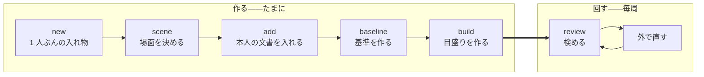

# コマンドの体系

人が触る面を決める。

<strong>[使うときはループになる](../spec/010-strategy.md#使うときはループになる)。</strong> 1 周を安く
することがそのまま品質になるので、<strong>周回に出てくるコマンドを最も短くする。</strong>

## 2 つに分かれる

| | いつ動かすか | 何をするか |
| --- | --- | --- |
| <strong>作る</strong> | 最初と、素材が増えたとき | カセットを組み立てる |
| <strong>回す</strong> | 毎周 | 検めて、直して、また検める |



<strong>`review` だけが周回に出てくる。</strong> ほかは素材が増えたときにしか動かさない。

## 作る

### new

```
kakiburi new <カセット>
```

<strong>1 カセットが 1 人である</strong>（[構造](100-cassette.md#1-カセット-1-人)）。場面はここでは
取らない。

<strong>既に在れば断る。</strong> 素材の取り込みには時間が掛かるうえ、
[原本は作り直せない](100-cassette.md#何を収めるか)——上書きすれば、取り込んだ単位はそこで消える。
<strong>この道具はほかの場所で「黙って一部を落として通さない」を徹底している</strong>ので、
ここだけ守りが無いのは方針からの取りこぼしである。

### scene

```
kakiburi scene <カセット> <場面>
```

<strong>場面は人が指定する</strong>（[決定](../spec/010-strategy.md#場面ごとに閉じる)）。文章から当てに
いかないので、ここで必ず訊く。

<strong>作るだけの操作を分ける。</strong>`add` が場面を作れると、`技術記事` を `技術記時` と打った
だけで<strong>誰もいない場面に素材が入り、エラーも出ない。</strong>

<strong>場面の名前は保存の中で階層の名前になる</strong>ので、`/` と空は断る。
<strong>既に在る場面も断る</strong>——作り直しに見えて、実際には何も起きないからである。

### add

```
kakiburi add <カセット> <ファイル...> --source <取り込み元> --as person|baseline
                                 --scene <場面>
                                 [--id <id>] [--unit <名前>]
                                 [--model <名前> --version <版> --param <鍵>=<値>...]

kakiburi add <カセット> <ファイル...> --source <取り込み元> --as other
                                 [--id <id>] [--unit <名前>]
```

[正規化](../spec/030-normalize.md)して入れる。<strong>取り込み元は内容から判定しない。</strong>
拡張子でも判定しない——Markdown 3 種は拡張子が同じである。`--source` だけで決める。

<strong>`--source` にも既定を置かない。</strong> 取り違えても<strong>エラーにならない</strong>——HTML を
`github-markdown` として読めば、見出しも箇条書きも記法として認識されず、節も項目も文も
違う数になる。値だけが静かに変わるので、<strong>出力を見ても間違いに気付けない。</strong>

<strong>`--as` に既定を置かない。</strong> 役を間違えると[対照にしたはずの文書が書き手の帯に残る](../spec/200-extract.md#相手集合を-1-つ決める)。
<strong>いちばん高くつく取り違えに既定を与えない。</strong>

<strong>`--id` を省いたら、ファイル名の拡張子を除いた部分を `id` にする。</strong> 複数のファイルを
渡したときは 1 本ずつに当てる。<strong>`--id` は 1 本だけ渡すときにのみ書ける</strong>——複数に同じ
`id` は付けられない。

<strong>`id` はカセット全体で一意である</strong>（[検めること](100-cassette.md#足すことと差し替えることを分ける)）。
別のディレクトリの同名ファイルは <strong>そのままでは 2 本目を足せない</strong>ので、`--id` で分ける。

<strong>落ちない入力は断る</strong>（[決定](../spec/030-normalize.md#通らないものは断る)）。黙って
一部を落として通さない。<strong>1 本でも断ったら、そのコマンドは失敗する</strong>——成功したことに
すると、欠けたまま次へ進む。

<strong>`--as baseline` で入れるときは `--model` と `--version` が要る。</strong> 外で作った基準でも、
[版と推論設定が指紋に入る](../spec/200-extract.md#版と推論設定まで記録する)——記録の無い
基準で作った値は次に測ったときに比べられない。推論設定は `--param <鍵>=<値>`、
[題材](../spec/010-strategy.md#題材を統制する)は `--topic` で渡す。

<strong>作り方の違う基準は混ぜない。</strong> 既に入っている基準と `--model`・`--version`・
<strong>推論設定</strong>のどれかが違えば <strong>断る</strong>。混ぜれば、測っているのが作り方の差になる
——別の場面か別のカセットにする。<strong>版が同じでも温度が違えば別の出力になる</strong>ので、
仕様が「[版と推論設定まで記録する](../spec/200-extract.md#版と推論設定まで記録する)」と
言うところまでが作り方である。

<strong>省いたときは、記録してあるものを引き継ぐ。</strong> 空で上書きすると、記録した設定が
黙って消える——題材と同じ扱いにする。

<strong>`--unit` は短い文書を[束ねる](100-cassette.md#短い文書は束ねる)。</strong> 同じ名前を渡した
ものが 1 単位になる。チャットの場面では常用する。

<strong>`--as other` だけが `--scene` を取らない</strong>（[役](100-cassette.md#役)）。
仕様の<strong>「越境はこの用途に限る」を、引数の形でそのまま言う</strong>——注釈でしか言えて
いなければ、越境は読み手の注意深さで守られることになる。<strong>`--as other` に `--scene` を
渡したら断る</strong>し、ほかの役で `--scene` を省いても断る。

<strong>知らない場面には入れない。</strong>`scene` で作っていない場面を受けると、綴りを間違えた
だけで<strong>誰もいない場面に素材が入り、エラーも出ない。</strong>

<strong>足す前に検める</strong>（[何を検めるか](100-cassette.md#足すことと差し替えることを分ける)）。
`id` が既にある、`unit` が別の役や別の取り込み元で使われている——どれも <strong>断る</strong>。
<strong>黙って上書きしない。</strong>

### 差し替える

```
kakiburi replace <カセット> --id <id> <ファイル> --source <取り込み元>
```

<strong>置き換える先をファイル名から当てにいかない</strong>——<strong>取り込み直すときにファイル名が
変わっていることは普通にある。</strong> 無い `id` を渡したら断る。<strong>1 度に 1 本だけ置き換える。</strong>

<strong>役も場面も束も変えない。</strong> 差し替えは中身の入れ替えであって、どこに属するかの
変更ではない——<strong>変えたいなら消して `add` し直す。</strong> 中身の入れ替えのつもりで所属まで
動けば、[相手集合](../spec/200-extract.md#相手集合を-1-つ決める)が黙って組み替わる。

<strong>操作を分けるのは、上書きを事故ではなく意思にするためである。</strong> `add` が上書きも
できると、<strong>同じ名前のファイルを 2 度取り込んだだけで原本が 1 本消える。</strong>

<strong>置き換えたあとも[束の中は揃っている](100-cassette.md#足すことと差し替えることを分ける)こと
を検める。</strong> 同じ `unit` の中で役や取り込み元がばらつけば断る。

<strong>置き換えも[丸ごと書き直して差し替える](100-cassette.md#書くときは壊さないことを優先する)。</strong>
途中の状態を残さない。

<strong>そして派生物を落とす。</strong> 本文が変われば値も目盛りも変わる——落とさなければ、
古い値が有効な顔で読まれる。<strong>`add` も同じである。</strong> 落としたカセットは、`build` する
まで[判定できない](../spec/010-strategy.md#届かないときは判定できないと言う)を返す。

<strong>落とすのは全部の場面である。</strong> 場面ごとに捨て分けたくなるが、
[`other` はどの場面の人らしさにも効く](100-cassette.md#役)ので、
<strong>越境する素材を足したときだけ捨て漏れる。</strong>

<strong>そのうえで指紋を組み直す。</strong> 派生物を捨てたのだから、語彙と z 得点も空に戻る
——残せば、次に検めたときに「合っている」と言われる。

<strong>取り込み元は `add` と `replace` の両方が指紋に足す。</strong> 片方だけだと、別の取り込み元
で差し替えても指紋が動かず、<strong>取り違えを検出する唯一の手がかりが止まる</strong>
（[間違えれば黙って 0 が並ぶ](../spec/030-normalize.md#取り込み元を間違えると0-が並ぶ)）。

<strong>減らす道は持たない。</strong> 単位ごとに取り込み元を持っていないので、最後の 1 本を
差し替えたことを知る手段が無い。<strong>足したことだけを残す</strong>——多めに名乗るのは
「この中のどれかで読んだ」であって、嘘ではない。

### decide

<strong>[人が決めたこと](100-cassette.md#何を収めるか)を書く。</strong> 場面のほかに 2 つある。

```
kakiburi decide <カセット> --scene <場面> boilerplate <文字列...>
kakiburi decide <カセット> --scene <場面> movement <指標> moves|stuck
```

<strong>決めることはすべて場面ごとである。</strong>`--scene` に既定を置かない——置けば、
<strong>いちばん打つ回数の多い操作が静かに別の場面へ掛かる。</strong> 知らない場面も断る。

<strong>落とす定型は、渡した一覧で置き換える。</strong> 足していく形にしない——<strong>いま何を落として
いるかが 1 度で読める</strong>ようにするためである。積み上げると、消すのに別の操作が要る。

<strong>知らない指標の名前は受けない。</strong> 綴りを間違えたまま書けば、直したつもりの指標が
いつまでも指摘に出続ける——<strong>エラーにならないので気付けない。</strong>

| | なぜコマンドが要るか |
| --- | --- |
| 落とす定型 | [場面ごとに人が決める](../spec/200-extract.md#定型を落とす)。文章から当てにいかない |
| <strong>指示して動くか</strong> | <strong>直させてみて初めて分かる。</strong> コーパスから導けない |

<strong>2 つ目が[戻る線 1 本目](../spec/010-strategy.md#運用に入ると戻る線が-2-本できる)の入口
である。</strong>[検めを 2 周](../spec/300-revise.md#直したら測り直す)して
<strong>その指標自身の値が</strong>動かなかったものを `stuck` にすると、次から
[前に出す指標](../spec/300-revise.md#種別を合わせて通るを出す)から外れる。

<strong>照合値が動かなかったことを根拠にしない。</strong> 照合値は 1 つの切り口には鈍く、指摘が正しく
通じても動かないことがある（[実測](../spec/300-revise.md#直したら測り直す)）。混ぜれば、
<strong>効いている指標を `stuck` にして捨てる。</strong>

<strong>書かないかぎり `未知` で、`未知` は前に出す指標に入る。</strong> 動かないと分かるまでは使う。

<strong>`decide movement` は周回の途中で打つ。</strong>「作る」に置いてあるのは、書き込む先が
[人が決めたこと](100-cassette.md#何を収めるか)だからであって、回し終えてから打つという
意味ではない（[周回を繋ぐ](../spec/300-revise.md#周回を繋ぐものを決める)）。

<strong>打ったら派生物が古くなる。</strong>[前に出す指標](100-cassette.md#effectivejson)は movement
から導くので、書き換えたのに作り直さなければ <strong>`stuck` にした指標が指摘に出続ける。</strong>

> <strong>`decide movement` は、書き換えたときに[効くかの判定](100-cassette.md#effectivejson)を
> 捨てる。</strong> 捨てたカセットで `review` すると、判定できないが返る。

<strong>その場で作り直さない。</strong> 作り直すには全単位を測り直すことになり、`decide` が
`build` と同じ重さになる。<strong>捨てて `build` に任せる</strong>——古いまま残すよりよい。

<strong>ほかの派生物は触らない。</strong> 値も目盛りも movement では変わらない——変わるのは
「どれを前に出すか」だけである。<strong>ほかの場面も触らない</strong>——場面ごとに決め直す
ものだからである。

<strong>どちらも作り直せない原本である。</strong> 書く道が無ければ、実装する人が「文章から推定する」
を発明する——仕様がどちらについても名指しで禁じている道である。

### 基準は外で作る

<strong>基準を作るコマンドを持たない。</strong> 書かせる側は
[軸の外](../spec/000-axis.md#だからしないこと)である——文章を作ることは、渡されれば済む。

作ったものは `add --as baseline` で入る。<strong>版と推論設定と題材を一緒に渡す</strong>
（[add](#add)）。

#### 依頼文の作り方は、人が守る規則である

作る道具を持たない以上、ここは検めようがない。<strong>だが決めておく</strong>——決めなければ、
測っているのが題材になる。

<strong>本文を依頼文に入れない。</strong> 本文の書き出しから依頼文を作ると、書き出しの癖が
そのまま手掛かりになり、基準値が <strong>28 ポイント</strong>膨らむ
（[漏らさない](../spec/200-extract.md#依頼文に書き方を漏らさない)）。<strong>渡すのは
「何について書くか」の中立な要約だけである。</strong>

<strong>題材は本人の文書から取る</strong>——[題材を揃える](../spec/200-extract.md#題材の統制は対ではなく素材に効かせる)
以上、本人が書いた題材について書かせることになる。<strong>ただし要約は人が書く。</strong> 本文から
機械的に作れば、そこが漏れる経路になる。

<strong>要約には記事が名指しする物を書く</strong>——製品名、コマンド名、版番号
（[理由](../spec/010-strategy.md#題材を統制する)）。題名だけだと基準の側だけラテン文字が薄く
なり、<strong>その差だけで帯が分離してしまう</strong>——通ったように見えて、測っているのは題材である。

<strong>ただし名前の表記までは写さない。</strong>「Vim script」か「Vim スクリプト」か、版番号を半角か
全角か——そこは書きぶりの層であり、写せば漏れる。

<strong>10 本以上作る。</strong> 基準の側にも[下限](../spec/200-extract.md#対が何本あれば信じるか)が
掛かる。1 題材から 1 本作るなら、題材も 10 要る。

<strong>この規則はどれも機械には見えない。</strong> 題材は自由な文字列で、名前が入っているかも
表記を写したかも判らない。<strong>`doctor` の一覧にも載らない</strong>——人が守る。

### build

```
kakiburi build <カセット> [--scene <場面>] [--json]
```

<strong>語彙 → 値 → 較正 → 帯 → 効く指標</strong> を一度に作る。分けて呼べるようにしない——
途中まで作った状態を人が持つと、指紋の合わない派生物が混ざる。

<strong>`--scene` を省いたら全場面を作る。</strong> 場面ごとに独立して作り、1 つが止まっても
ほかは続ける——<strong>止まるのは失敗ではない</strong>ので、まとめて中断する筋が無い。

<strong>道具は 1 度だけ解決して全場面に使う。</strong> 場面ごとにファイルが別だった頃は、片方を
辞書ありで、もう片方を無しで作れてしまい、しかも気づけなかった。

<strong>目盛りを作らずに終わる条件を持つ。</strong>

| 作らない | なぜ |
| --- | --- |
| 本人または基準の単位が[下限](../spec/200-extract.md#対が何本あれば信じるか)を下回る | <strong>どちらも 10 単位が要る</strong>（本人は相手集合 5 ＋ 測る分 5、基準は較正分 5 ＋ 床の点 5） |
| <strong>照合値の</strong>天井と床がほとんど重なる | [骨格が通っていない](../spec/010-strategy.md#それでも骨格を先に通す) |
| <strong>本人側と基準側の長さの範囲が半分も重ならない</strong> | [測っているのが長さになる](../spec/200-extract.md#見る前に標本の範囲を確かめる) |
| どちらかの帯で天井か床の広がりが 0 | 端が決まらない（[帯](../spec/200-extract.md#帯は2-つの分布の重なりである)） |

<strong>基準の側にも下限が掛かる。</strong> 本人と基準の両方を[2 つに割る](../spec/200-extract.md#相手集合を-1-つ決める)
ので、片方だけ足りなくても目盛りは作れない。<strong>相手集合を減らして帳尻を合わせない</strong>——減らせば天井・床・検めの相手の本数が変わり、
3 つが同じ散らばりに載らなくなる。

<strong>2 行目だけが照合値限定である。</strong> 人らしさの帯が全体を覆うのは
[設計どおりの結果](../spec/100-metrics.md#なぜ人らしさは層-2-を判定から外す原則にかからないのか)
である——当てはまらないことが判定不能として出る仕組みなので、<strong>止めれば自己診断が消える。</strong>
重なった人らしさの帯はそのまま書き出す。

<strong>最後の行は両方に掛ける。</strong> 広がりが 0 なら端が決まらず、<strong>重なっているのかいないのかも
読めない。</strong> 覆っているのとは違う——覆っているなら端はある。

<strong>止まっても失敗ではない。</strong> 目盛りの無いカセットが出来上がり、`build` は `0` で終わる。
理由を `manifest.json` に残す。<strong>そのカセットで `review` すると、判定できないが返る。</strong>

<strong>作れたときは、[割り](100-cassette.md#calibrationjson)を 4 つとも出す。</strong> 止まった理由は
出すのに通ったときの割りを出さないと、<strong>いちばん静かな壊れ方だけが見えない</strong>——
昇順で取るので、単位名に年や媒体が入っていれば割りがその境目で分かれる。値は出るし
エラーにもならないので、<strong>出力を見ても帯が「ある時期 対 別の時期」になっていることに
気付けない。</strong>

#### 場面が本当に分かれているかを見る

<strong>場面が 2 つ以上あれば、分かれ方も出す。</strong>[1 カセット 1 人](100-cassette.md#1-カセット-1-人)
になって初めて測れるようになった検査である——別のファイルだった頃は、比べる経路そのものが
無かった。

| 出すもの | |
| --- | --- |
| <strong>中の散らばり</strong> | その場面の本人の単位どうしの、指標ごとの散らばり |
| <strong>外との差</strong> | その場面とほかの場面の、指標ごとの中心の隔たり |

<strong>見るのは目盛りに載せる前の値である。</strong> 目盛りは場面ごとに違うので、載せたあとの値
どうしは比べられない。<strong>指標ごとに大きさが桁で違うので、どちらも中心で割って揃える</strong>
——揃えなければ、値の大きい指標だけが全体を決める。

<strong>外との差が中の散らばりを上回らない場面があれば、但し書きを出す。</strong> その「1 つの場面」
が 1 つではない可能性がある。<strong>止めない</strong>——何を偏りと呼ぶかがまだ決まっていないので、
暫定値を 1 つ増やすより言うだけにする（[骨格が通るまで閾値を手で決めない](../spec/010-strategy.md#それでも骨格を先に通す)）。

## 回す

### review

```
kakiburi review <ファイル> --cassette <カセット> --scene <場面> --source <取り込み元> [--json]
```

<strong>3 値と指摘を返す。</strong>

<strong>`--source` は `add` と同じ理由で要る。</strong> 検める文書も[同じ手順で正規化する](../spec/300-revise.md#同じ測り方で測る)
以上、取り込み元が決まらなければ通せない。<strong>推測しない</strong>——
[間違えれば黙って 0 が並ぶ](../spec/030-normalize.md#取り込み元を間違えると0-が並ぶ)。

<strong>`--scene` も要る。</strong> どの場面として検めるかは人が指定する——文章から当てにいかない
のと同じ理由である。<strong>1 手増えるが、正しい向きの摩擦である</strong>：ファイルを選ぶことが
暗黙の場面指定だった頃は、<strong>選び間違えても止まらなかった。</strong>

<strong>知らない場面は `64` で断る。</strong> 通せば「目盛りの無い場面」として `2` が返り、
綴りの間違いが正常な停止に化ける。

| 終了コード | |
| --- | --- |
| `0` | 通る |
| `1` | 通らない |
| `2` | 判定できない |
| `64` 以上 | <strong>使い方の誤り、カセットが読めない</strong> |

<strong>判定できないを 1 と分けるのが要点である。</strong> 一緒にすれば、
[分からないと言えること](../spec/010-strategy.md#届かないときは判定できないと言う)が
呼ぶ側から消える。

<strong>目盛りの無いカセットは `64` ではなく `2` である。</strong> 素材が足りずに目盛りが作れなかった
のは <strong>正常な状態</strong>であり、仕様がそのために判定できないを置いている。`64` 以上は、
カセットが壊れている・読めない・指紋が環境と合わないといった <strong>使う前の問題</strong>に取っておく。

<strong>同じ理由で、系統が欠けたとき・素材が足りないときも `2` である。</strong> 判定できないを返す
経路を、エラーとして扱わない。

<strong>どの段で止まったかを必ず返す</strong>（[3 段](../spec/300-revise.md#種別を合わせて通るを出す)）。
返さなければ、照合値を上げようとして人らしさを下げる逆向きの直しを招く。

#### 既定は散文である

<strong>表で返さない。</strong> 構造化した形を求めると成績が落ちる（[SPTG の評価](../references/sptg-evaluation-2025.md)）。
既定の出力は <strong>そのまま直す側に貼れる散文</strong>にする。

<strong>数値は落とさない</strong>（[決定](../spec/300-revise.md#散文で渡す)）。散文にするのは言い方
であって、根拠の値ではない。

`--json` は道具向けである。<strong>人にも LLM にも既定では出さない。</strong>

#### 道具向けの出口

<strong>`measure` / `build` / `review` が `--json` を取る。</strong> この道具は素材を集めて回す
性質上、<strong>スクリプトや LLM から叩かれる回数のほうが多くなる。</strong> 出口が無ければ、
人向けの出力からラベルの文言と桁揃えに頼って値を切り出すことになり、<strong>文言を変えた
瞬間に黙って壊れる。</strong>

<strong>出すのは、人向けに出している値の生の形である。</strong> 人向けの表示は変えない。

| 決めること | どうするか |
| --- | --- |
| 丸め | <strong>しない。</strong> 人向けは 3 桁に丸めるが、道具向けは生の値 |
| 測れていない指標 | <strong>`null` と理由。</strong> 人向けの `—` と `0.000` の区別をそのまま写す |
| 但し書き | <strong>stderr。</strong> stdout に混ぜれば JSON として読めない |
| 指摘 | <strong>stdout の JSON の中。</strong> あれは結果であって断り書きではない |
| 終了コード | 変えない |

<strong>`why` を持たせないと、JSON にしたとたんに「測っていない」が消える。</strong>

<strong>依存は増やさない。</strong> 書き出しだけなら[自前の JSON](100-cassette.md#容器は-zip) が
既にある。

#### 但し書きは stderr へ

<strong>`--json` の有無にかかわらず、断り書きは stderr が正しい。</strong> 「暫定値が立っている」
「定義ファイルが見つからない」「較正を疑う」「中のほうが散らばっている場面がある」——
どれも<strong>結果ではなく、結果の読み方への注意</strong>である。

<strong>指摘は stdout に残す。</strong> `指摘 N 本` とその中身は結果そのものであり、
そのまま直す側に貼るためのものである。

#### 草稿の作られ方を訊く

```
kakiburi review ... [--own-writing shown|not-shown|unknown]
```

本人の文章を見せて書かせた草稿は[測定が膨らむ](../spec/300-revise.md#草稿の作られ方を疑う)。
kakiburi は書かせる側を持たないので防げない。<strong>だから申告させ、判定に添える。</strong>

<strong>真偽のフラグにしない。</strong> フラグでは「渡していない」と「申告していない」が同じ形に
なる。<strong>3 値で受ける</strong>——既定は `unknown` である。

| 値 | 何を言っているか |
| --- | --- |
| `shown` | 本人の文章を渡して書かせた |
| `not-shown` | 渡していない |
| `unknown`（既定） | 草稿の作られ方を知らない |

<strong>省略を `not-shown` と読まない。</strong> 読めば、いちばん膨らみやすい草稿がいちばん綺麗な
顔で通る。<strong>`shown` と `unknown` には、3 値のどれを返すときも但し書きを添える。</strong>

## 覗く

<strong>[測るのを安くする](../spec/100-metrics.md#測るのを安くする)が 3 つを名指ししている。</strong>
そのまま 3 つのコマンドにする。

```
kakiburi measure <ファイル> --source <取り込み元> [--cassette <カセット>] [--json]
kakiburi compare <ファイル>... --source <取り込み元> [--cassette <カセット>]
kakiburi show <カセット>
```

<strong>`measure` は 1 本を測り、`compare` は並べて比べ、`show` はコーパス全体の分布を出す。</strong>
<strong>`show` は場面ごと・役ごとに分けて出す</strong>——まとめれば、場面ごとに閉じている以上、
出した分布は誰のものでもない。<strong>場面を持たない `other` は場面の外に並べる</strong>：どれか
1 つの場面の下に置けば、その場面のものだと読める。
<strong>文書を取るものには `--source` が要る</strong>——`show` はカセットの中の正規形を読むので
要らない。<strong>`compare` の複数のファイルは、同じ取り込み元でなければならない</strong>：違えば
[升目が単位ごとに変わり](../spec/030-normalize.md#対応表は取り込み元ごとに持つ)、
測れないの出方が揃わない。

<strong>カセットが無くても動く。ただし出るものが違う。</strong>

| | カセット無し | カセット有り |
| --- | --- | --- |
| 指示できる指標・人らしさ | 出る | 出る |
| <strong>系統の距離</strong> | <strong>出ない</strong> | 出る |

<strong>系統を出さないのは、[語彙が無い](../spec/200-extract.md#語彙は先に決めて固定する)から
である。</strong> 頻度で次元を選ぶ系統は、渡された 2 本からその場で選べば <strong>違う軸のベクトル
どうしの距離</strong>になる。仕様が名指しで禁じている。

<strong>黙ってスカラーだけ出さない。</strong> 系統を出せないことを言う——言わなければ、比べたつもり
で比べていない。

`compare` が 3 本以上を取るのは、[周回ごとの散らばり](100-cassette.md#周回のあいだの観測は外でやる)
を見るためである。n 周した A・B・C を並べて渡す。

## 検査

### doctor

```
kakiburi doctor <カセット>
```

<strong>[自分を検査する](../spec/300-revise.md#自分を検査する)。</strong> 本人の実際の文章をカセットに
通し、生成文より低く出る指標や組み合わせを探す。

<strong>本人がいちばん高く出ることが、目盛りが壊れていないことの最低条件である。</strong>

あわせて機械的に確かめる。

- 指紋が現在の環境と合っているか（辞書の版、圧縮器、正規化の実装）
- 派生物が原本と整合しているか
- `provisional` が立っていないか

<strong>場面ごとに検める。</strong> まとめて 1 つの判定にしない——1 つの場面が壊れていることが、
ほかの場面の健全さで薄まる。

<strong>相手集合は検査から外す。</strong> 較正に使った単位で測れば、分離するように合わせたものの
分離具合を見ることになる（[較正と天井・床](../spec/200-extract.md#較正と天井床)）。

<strong>疑わしければ `2` で返す。</strong> 検査が通らないことは「使う前の問題」ではない——
カセットは読めているし、判定も出せる。<strong>出た値を信じてよいかが分からない</strong>だけで
あり、それは判定できないと同じ側である。

### metrics

```
kakiburi metrics [--kind 指示|照合|人らしさ] [--layer 1|2|3]
```

登録簿を回して一覧を出す。<strong>使う側が一覧を持たない</strong>ことの裏返しで、
<strong>一覧を見たい人はここへ来る</strong>。

## 決めたこと

### 破壊的な操作を短くしない

<strong>`build` は派生物を作り直す。</strong> 原本には触らない。原本を消す道はコマンドとして持たない
——カセットは 1 ファイルなので、消したければファイルを消せばよい。

### 場面を跨ぐ道を作らない

<strong>1 つのカセットに複数の場面が入るようになっても、跨いで目盛りを作る道は持たない。</strong>
[場面ごとに閉じる](../spec/010-strategy.md#場面ごとに閉じる)以上、跨ぐ操作は「どの場面の
ものでもない」ものを作る道になる。

<strong>入れ物が別だった頃は物理的に書けなかった。</strong> いまは
[型で守る](100-cassette.md#失うもの守り方)——`build` も `review` も `decide` も
1 つの場面を名指しして動き、跨げるのは
[人らしさの人の側](100-cassette.md#役)の 1 本だけである。

<strong>複数のカセットをまとめて扱うコマンドも持たない。</strong> カセットは 1 人なので、
まとめる操作は「どの人のものでもない」ものを作る道になる。並べたければファイルを
並べればよい。

### 対話しない

<strong>訊くものはすべて引数で受ける。</strong> ループが回るものなので、途中で人を待たせない。

### help は引数解析より先に見る

<strong>`<コマンド> --help` は、どのコマンドでも通る。</strong> 位置引数がファイルなので、
そのまま引数解析に渡すと <strong>`--help` がファイル名として解釈され、「読めない（65）」で
終わる。</strong>

<strong>全体の help と同じ文を切り出す。</strong> 2 か所に書けば、片方だけが古くなる。

<strong>環境変数を help に書く。</strong> 3 つある（`KAKIBURI_UNIDIC` / `KAKIBURI_UNIDIC_VERSION` /
`KAKIBURI_MECAB`）が、書かなければ<strong>仕様を読むまで進めない。</strong> 辞書の入手先も置く
——`build` の「未設定」の行からもそこを指す。

| 書くこと | なぜ |
| --- | --- |
| <strong>辞書の入手先</strong> | nixpkgs に無い。国語研が配布している |
| <strong>IPADic を断ること</strong> | 体系が違えば語彙素で引けない |
| 取り込み元の一覧 | <strong>実装から出す。</strong> 手で並べれば増えたときに片方だけが古くなる |
| <strong>`--as other` が何か</strong> | 役の名前だけでは、何に効くかが読めない |

<strong>[訊けるものは訊く](../spec/010-strategy.md#訊けるものは訊く)は判断軸の話であって、
この道具が測らないと決めたものである。</strong> 書く人が自分で添えるのは自由だが、コマンドが
訊きにいかない。
