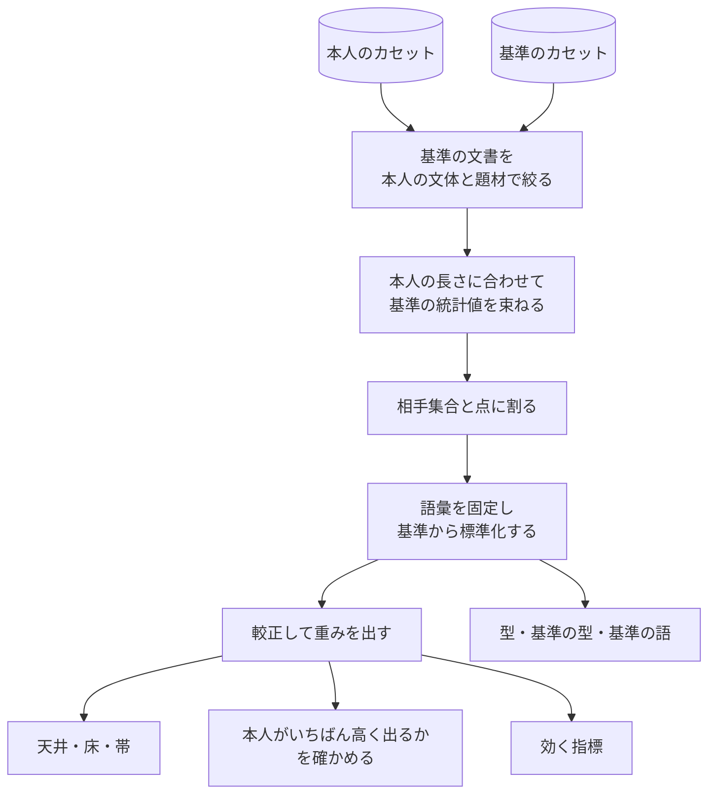

# 評価して、その人の値と目盛りにする

[戦略](010-strategy.md#言うために何が要るか)は、違いを言うために要るものを挙げている。
この文書はそのうちの 2 つ目と 3 つ目、つまり「その人の側の値」と「値を読む目盛り」を
作る手順を決める。

両方とも同じ材料から出る。目盛りのために別の文章を集めてくる必要は無い。本人の文章
（[素材](../glossary.md#素材)）と、比べる相手の文章（[基準](../glossary.md#基準)）を
[指標](100-metrics.md)で測れば、その結果から値も目盛りも導ける。
言葉の意味は[用語集](../glossary.md)にある。

## この文書の流れ

手順は 2 つの段に分かれる。

| 段 | いつ | 何をするか |
| --- | --- | --- |
| 測る | `cassette build` のとき | フォルダの文書を 1 本ずつ測り、文書ごとの統計値を[カセット](../glossary.md#カセット)に書く |
| 組み立てる | `review` と `cassette diff` のたび | 本人のカセットと基準のカセットの統計値から、目盛りをその場で組み立てる |

測る段は、比べる相手を知らない。どのカセットも、本人のものでも基準のものでも同じ形になる。
比べる相手に依るものは、すべて組み立てる段で作る。

組み立てる段が作るものは次のとおりである。どれも保存しない。

| 作るもの | 何を言うためのものか | 決めている節 |
| --- | --- | --- |
| 指標ごとの[幅](../glossary.md#幅) | その指標で、草稿が本人の書き方から外れているか | [その人の値を作る](#その人の値を作る) |
| [照合値](../glossary.md#照合値)の目盛り（[天井](../glossary.md#天井)・[床](../glossary.md#床)・[帯](../glossary.md#帯)） | 草稿が全体として本人の書いたものに見えるか | [目盛りを作る](#目盛りを作る) |
| [基準との距離](../glossary.md#基準との距離)の目盛り | 基準の書きぶりが残っていないか | [人らしさの境目は、同じ材料から出る](#人らしさの境目は同じ材料から出る) |
| [効く指標](../glossary.md#効く指標)の一覧 | どの指標を指摘に使うか | [どの指標が効くかを決める](#どの指標が効くかを決める) |
| その人の[型](../glossary.md#型) | 本人がよく使う言い回しの手本 | [その人の型を取り出す](#その人の型を取り出す) |
| [基準の型](../glossary.md#基準の型)と[基準の語](../glossary.md#基準の語) | 草稿に残っている基準の言い回し | [基準の型を取り出す](#基準の型を取り出す)、[基準の語を取り出す](#基準の語を取り出す) |

最後の章 [作り直せるようにする](#作り直せるようにする) は、指標や道具が変わったときに
カセットを作り直すための決まりである。

## 材料を揃える

### 場面ごとに分ける

集めた文章は[場面](../glossary.md#場面)ごとに分けて評価する
（[決定](010-strategy.md#場面ごとに閉じる)）。場面の違う文章を混ぜると、値はどの場面の
ものでもない中間になる。

場面は人が指定する。誰に向けて、どんな立場で、何のために書いたかは文章の外にある
情報なので、文章から推定すると外れる。指定はフォルダを分けることで行い、1 つのフォルダから
1 つのカセットを作る。

### 基準を置く

本人の値だけを見ても、それがその人の特徴なのか、誰でもそう書くのかは分からない。
そこで比べる相手として基準を置く。

基準はカセットとして渡す。本人のカセットと同じ手順で、比べる相手の文書のフォルダから作る。
渡さなければ、道具に同梱した基準のカセットを使う。

同梱の基準は、LLM が既定の設定で書いた文章から作ってある。これを既定にする理由は 2 つある。

- 代筆で直したいのは、まさにこの既定の書きぶりである。
- 集めてくるのではなく作れるので、材料が手に入らずに止まることが無い。

道具は、基準が機械の文章か人の文章かを区別しない。どの基準のカセットにも同じ処理を掛ける。
何を基準に置いたかで、判定が言えることが変わる（[天井と床を測る](010-strategy.md#天井と床を測る)）。

基準の文書を作るのはこの道具の外である。[文章を作ることは渡されれば済む](000-axis.md#だからしないこと)
ので、道具は文章を書かせる機能を持たない。道具が受け取るのは、出来上がった文書のフォルダだけ
である。

基準は本人の素材と同じ場面のもので、題材もできるだけ揃える。題材が揃っていないと、
題材の違いがその人らしさとして測られてしまう（[決定](010-strategy.md#題材を統制する)）。

#### 依頼文に書き方を漏らさない

基準を書かせる依頼文は、「何について書くか」を中立に要約したものにする。

本人の本文の書き出しをそのまま依頼文に使うと、書き出しの癖が手掛かりとして基準に
漏れる。実際に、それで基準値が 28 ポイント膨らんだ例がある
（[Sawant](../references/authorship-gap-2026.md)。LLM に同一著者らしさを判定させた割合が
22% から 50% へ動いた、という値である）。

中立といっても、短くすればよいわけではない。要約には、記事が名指しする物（製品名、
コマンド名、版番号）を入れる（[決定](010-strategy.md#題材を統制する)）。題名だけを渡すと
LLM はそれらを書かないので、基準の側だけラテン文字と記号が少なくなり、その差だけで
帯が分かれてしまう。

一方で、名前の表記は写さない。「Vim script」と書くか「Vim スクリプト」と書くか、
版番号を半角で書くか全角で書くかは[表記](020-document.md#表記は残る優先して採る理由がある)
の層に属し、写せば本人の書き方が漏れる。依頼文で渡すのは「何を指すか」であって、
「どう書くか」ではない。

#### 同じ基準カセットで比べる

2 つの判定を比べてよいのは、同じ基準のカセットで出したときだけである。同じかどうかは、
基準のカセットの中身のハッシュで決める。`review` と `cassette diff` は、使った基準の
ハッシュと場面の名前を出力に出す。

基準は LLM ごとに、さらに同じ LLM でも版ごとに違う。日本語では、同じ系列の版の違いだけで
93.6% 識別できたと報告されている（[林・相澤](../references/japanese-llm-style.md)）。推論設定の
違いによる識別は 73.0%（2 クラス）で、論文自身も「相対的に小さかった」としている。基準が
変われば同じ草稿でも値が変わるので、違う基準で出した値は比べられない。

道具は、基準を作った LLM の名前や版を訊かない。中身のハッシュが同じなら、同じ文書から
同じ手順で測った統計値なので、比べてよい。名前は人が名乗るもので、名乗り違えを道具は
確かめられない。ハッシュは名乗り違えようが無い。どの LLM のどの版で作ったかを残したい
ときは、基準のカセットの場面の名前やファイル名に書く。

作り方の違う基準は、1 つのフォルダに混ぜない。版が違えば出力が違うので、混ぜると測っている
ものが版の差になる。作り方が違うなら別のフォルダにして、別のカセットにする。

> 経緯：以前は本人のカセットが目盛りを持ち、目盛りを作るたびに基準のフォルダを読んで
> いた。そのため基準の来歴を `--model` と `--version` で人に名乗らせ、指紋に入れていた。
> 基準がカセットになり、同じ基準かどうかを中身のハッシュで言えるようになったので、
> 名乗らせるのをやめた。

### 入力を揃える

同じ内容でも、書式が違えば値が変わる。書式を揃える手順は[正規化](030-normalize.md)が
決める。ここでは評価に固有の判断だけを決める。

#### 定型を落とす

場面ごとに、誰が書いても同じになる部分（定型）がある。落とすなら、使う側が素材の文書から
消す。道具は定型を落とさない。

定型を残すと、書き手どうしが実際より似て見え、書き手の差が埋もれる。日本語の短いレビュー
では、「発送が早かった」「梱包が丁寧」のような定型が著者間の言語的類似を上げ、文体の
識別力を下げると報告されている（[日本語レビュー](../references/japanese-attribution-recent.md)）。

| 場面 | 落とす候補 |
| --- | --- |
| 技術記事 | 見出しの定型、生成された目次、他人の文章の引用 |
| チャット | 挨拶、相槌、定型の返信 |
| メール | 署名、宛名、結びの定型 |

道具が落とさないのは、統計値からは特定の文だけを引けないからである。定型は本人の文書からも
草稿からも落とす必要がある。しかしカセットは本文を持たず、文書ごとの統計値だけを持つ。
測り終えた統計値から 1 文を抜くことはできず、抜けば人らしさの窓の切れ目も動く。道具に
落とさせるには、測る前に文字列を受け取るしかない。それなら、文書から消すほうが何を
落としたかが分かりやすい。

コードブロックの中身は、[地の文](020-document.md#地の文)の定義によってすでに外れている。
消す必要は無い。

> 経緯：以前は、落とす文字列を人がカセットに書き、測る前に部分一致で文ごと落としていた。
> カセットが統計値だけを持つ形になり、落とす処理を置ける場所が無くなったのでやめた。

## 文書を測る

`cassette build` は、フォルダの文書を 1 本ずつ測り、文書ごとの統計値をカセットに書く。
比べる相手は見ない。どのカセットも同じ手順で作り、同じ形になる。

### 単位は 1 文書

指標は文書ごとに測る。測るときのひとまとまりを[単位](../glossary.md#単位)と呼び、ふつうは
1 文書が 1 単位である。全部の文書を連結して 1 度に測ると、文書ごとの揺れ（分布）が
消えて 1 点になってしまう。

単位には名前を付ける。対を作るとき、値を保存するとき、指摘に添えるときに、どの単位の
ことかを指す言葉が要るからである。

名前はカセットの中で一意でなければならない。同じ名前の単位を 2 つ入れようとしたら
[断る](030-normalize.md#通らないものは断る)。黙って上書きはしない。

2 つのカセットをまたいで同じ名前があってもかまわない。組み立てるときは、単位をカセットの
役（本人か基準か）と名前の組で指す。役は引数の位置で決まり、1 つのカセットの中で混ざる
ことが無いからである。

### 文書ごとの統計値を持つ

カセットは、文書ごとに次のものを持つ。

| 持つもの | 中身 | 何に使うか |
| --- | --- | --- |
| 長さ | 日本語の字数、識別子を畳んだあとの字数、読点の数、延べ語数、node の数 | 下限の判定、長さの範囲、束ね方 |
| 系統の頻度 | 系統ごとの全次元の頻度。語彙で切らない | 語彙を選び、照合値の距離を出す |
| 人らしさの窓 | 人らしさの指標の、[窓](100-metrics.md#人らしさは固定長の窓で測る)ごとの値 | 基準との距離 |
| 指示できる指標 | 値と、その分子・分母・下限。下限を掛ける前の生の数も持つ | 幅、出現割合、束ねた単位の値 |
| 言い回し | ひらがなを含む 1〜4 [文節](020-document.md#数える単位)の並び。最初の位置・数・どの node か | 型、基準の型、使いすぎの上限 |
| 語彙素の数 | 形容詞・形状詞・副詞の語彙素と、一人称ごとの数 | 基準の語、一人称 |
| 選ぶための値 | 段落の[敬体率](metrics/敬体率.md)、2 文字以上の自立語の集合 | 基準として使われるとき、文体と題材で絞る |
| 測れなかった理由 | 指標ごとの[理由](100-metrics.md#測れない理由を分けて返す) | 出現割合の分母、判定できないの理由 |

どれも、その文書 1 本だけから決まる値である。比べる相手が変わっても変わらない。

#### 人に依らない値だけを持つ

統計値には、比べる相手に依る値を入れない。語彙で切った頻度も、z 得点も、較正の重みも
持たない。どれも組み立てるときに、2 つのカセットを見てから作る。

相手に依る値を持てば、そのカセットは特定の相手としか比べられなくなる。相手を替えるたびに
作り直しが要り、作り直すには素材のフォルダが要る。人からもらったカセットはフォルダを
持たないので、そこで使えなくなる。

> 経緯：実測で確かめた。本人の記事 49 本を 4 組に分けて、1 組ずつ取り置いて検めた。
> 目盛りを文書ごとの統計値だけから組み立てても、判定が動いたのは 104 回の検めのうち
> 1 回だけだった（機械の草稿 1 本が、基準との距離の段で「通らない」から「判定できない」に
> 移った）。同梱の池 88 本の統計値は 10.5 MB、gzip で 1.5 MB だった。

#### 文章の断片は残す

統計値は本文を持たないが、文章の断片は残る。題材で選ぶための自立語の集合と、4 文節までの
言い回しの表である。

断片を減らすために精度は落とさない。言い回しを「文書に出たかどうか」だけにすれば断片は
減るが、型と穴あきの型に要る位置の情報を失う。断片が残ることは[本文を持たない](#本文を持たない)
でも書いている。カセットを渡す相手は、そのつもりで選ぶ。

### コーパスから語を見つける

形態素解析の辞書に無い語を、カセットの文書から見つけて 1 語として扱う。

辞書は、書き手の名前も、新しい製品名も、その分野の言い回しも知らない。知らない語は
複数の語に割れる。割れたままだと、その語のところで機能語の分布も、品詞 bigram も、
[型](#その人の型を取り出す)も、割れた欠片を数えることになる。

しかも割れ方が揺れる。実測で、ある書き手の名前は同じ綴りなのに 3 通りに割られていた。
名詞＋名詞が 7 回、動詞＋動詞が 1 回、動詞＋固有名詞が 2 回である。同じ語が文脈によって
別の品詞になる。

見つける規則は次のとおりである。

> 隣り合う 2 形態素が、その出現でおおむね名詞であり、後ろの語がほぼ必ずその前の語の
> 直後にしか現れないなら、1 語である。

手掛かりは、1 語であれば後ろの欠片は前の欠片の直後にしか現れない、ということである。
線は次のように置く。どれも暫定値である。

- 並びが 3 回以上現れる。
- 後ろの欠片の出現のうち 9 割以上が、前の欠片の直後である。
- 出現の過半で名詞である。

名詞に絞るのは、絞らないと付属語の連なりまで 1 語に畳まれるからである。`て+いる`
`と+いう` は正しく割れている。実測で、名詞に絞らないと `ている` `という` が語として並んだ。

名詞かどうかは多数決で決める。すべての出現で名詞であることを求めると、品詞が揺れている
からこそ直したい語が落ちる。

見つけたまとめ方は、人が足したり外したりできない。自動で拾えないのは文書に 3 回未満しか
出ない語で、まれなので統計値への影響は小さい。自動のまとめ方が間違っていた例も見つかって
いない。人が触れる形にすると、[調整](#素材を正本にする)の中で 1 つだけ測り直しが要るものを
抱えることになる。

#### 語は実装が持たない

見つける語は、実装にも定義ファイルにも書かず、素材から見つける。道具は書き手も分野も
選ばない。特定の語を実装に書けば、その書き手にしか使えない道具になる。

実測では、ある書き手の素材から 26 語が見つかった。書き手の名前、`リファクタリング`、
`キーバインド`、`スクリーンショット` などである。手で並べた語は 1 つも無い。

#### 2 度測る

素材は 2 度測る。1 度目で語を見つけ、2 度目で見つけた語を 1 語に畳んで測る。語を見つける
には解析が要り、測るには語が要るからである。

見つけたまとめ方はカセットに持たせる。草稿は本人のカセットのまとめ方で測る。草稿を違う
区切り方で測ると、同じ語が本人の文書と草稿で違う割れ方になり、機能語や品詞の並びが
食い違う。

> 語が変われば、延べ語数が変わる。延べ語数を使う窓も下限も動くので、
> [作り直せる形](#作り直せるようにする)で持つ。

#### まとめ方はカセットごとに見つける

語のまとめ方は、カセットごとに自分の文書から見つける。本人のカセットは本人の文書から、
基準のカセットは基準の文書から見つける。本人の語で基準を区切り直すことはしない。

区切り直すには基準の本文が要る。カセットは本文を持たないので、組み立てるときに相手の
まとめ方で測り直すことはできない。測る段が相手を知らないことが、どのカセットも同じ形で
持てることの条件である。

> 経緯：以前は本人の文書から見つけたまとめ方を基準にも当てていた。カセットごとに見つける
> 形に変えて実測すると、判定が動いたのは 104 回の検めのうち 1 回だった。ほかの書き手では
> どちらに転ぶかまだ分からない。

### 測れたかだけを言う

`cassette build` が言うのは、統計値が測れたかどうかだけである。下限に届かない文書と、
その文書で測れなかった系統や指標を、理由ごとに出す。目盛りが作れるかは言わない。
目盛りは比べる相手が決まるまで作れないからである。

[環境の側の理由](100-metrics.md#測れない理由を分けて返す)（道具が無い、道具が失敗した）で
測れなかった文書が 1 つでもあれば、カセットを書かずに断る。直すのはコーパスではなく環境で
あり、環境を直せば全部の値が変わる。

## その人の値を作る

ここからは組み立てる段である。本人のカセットの統計値から、指標ごとの値の持ち方を決める。

### 値は幅で持つ

指標の値は、1 点ではなく[幅](../glossary.md#幅)で持つ。幅とは、測れた単位での最小値から
最大値までの範囲、つまり本人の書きぶりが実際に振れた範囲である。

1 点にしないのは、同じ人でも文書ごとに値が揺れるからである。平均だけを持つと、その人が
現に書いている書き方まで外れと判定されてしまう。

百分位で両端を刈ることもしない。刈ると、その人が現に 1 度書いた書き方が幅の外に出る。
外れた 1 本で幅が広がるのは、この設計では正しい向きである。幅が広がれば指摘が減り、
狭まれば本人の書き方を外れと呼ぶことになる。間違えるなら、指摘しない側に間違えるように
する。

幅が偶然狭く出る問題は、これとは別に[見張る](#狭いだけで信じない)。

### 外れの大きさは、幅を 1 とした倍数である

草稿の値が幅からはみ出したとき、その大きさを次の式で表す。これを
[外れの大きさ](../glossary.md#外れの大きさ)と呼び、[指摘の順位付け](300-revise.md#指摘は-3-本か-4-本に絞る)
に使う。

> 外れの大きさ ＝ 幅の端からはみ出した量 ÷ 幅の大きさ

たとえば幅が 10 から 20 の指標で、検める文書の値が 45 なら、はみ出しは 25、幅は 10 なので、
外れの大きさは 2.5 になる。幅で割るので、単位の違う指標どうしが同じ尺度で並ぶ。

幅が 0 の指標（全部の単位で同じ値だった指標）では、この式は使えない。0 で割ることはせず、
単位が n 本なら外れの大きさを n とする。これは[出現割合の上限](#出てこないことの大きさを幅と同じ単位にする)
を式に入れた値と同じで、順位では上位に来る側である。その人が一度も揺れなかった点が
動いているのだから、弱い信号として扱う理由は無い。

外れの大きさが同じ指標が並んだら、指標名の昇順で順位を決める。昇順とは Unicode の
符号位置の順である。

| | |
| --- | --- |
| 採る | Unicode の符号位置の順（`感嘆符` < `笑い` < `絵文字`） |
| 採らない | 五十音順、ロケールの照合順、読みの順 |

同順位の決め方を定めておくのは、技術記事では絵文字も感嘆符も笑いも幅 0 になりうる
からである。決めておかないと、上位 3〜4 本が実装ごとに変わり、
[決定性](../design/300-test.md#決定性)と[作り直し](../design/300-test.md#作り直せることを試験する)
が成り立たなくなる。

符号位置の順にするのは、和名の「昇順」が五十音順ともロケールの照合順とも読め、どちらも
実装と環境によって変わるからである。決定性のために順序を決めているのに、その順序が
揺れては意味が無い。読みの順を使わないのは、指標名に読みを持たせていないからでもある。
読みを添えれば、それが[2 か所目の名前](100-metrics.md#名前は-1-度しか書かない)になる。

### 下限は「使った割合」で見る

0 を取りうる指標では、下側の外れを「幅の最小値を下回ったか」で判定してはいけない。
一度でも使わなかった文書があれば最小値は 0 になり、0 を下回る値は出ないので、下側の
判定が永久に効かなくなる。

そこで、下側をどう見るかを指標の値の単位で決める。指標ごとに個別には書かない。

| 単位 | 下端の見方 |
| --- | --- |
| 密度・個数・その現象の出現に対する割合 | 出現割合で見る（下記） |
| 無次元（変動係数など）・常に値を持つ割合 | 幅の下端をそのまま使う |

2 行目は、0 が「使わなかった」を意味しない指標である。変動係数は測れるかぎり必ず値を
持ち、「段落の中で 1 文だけのもの」の割合は 0 が正当な値になる。こちらは普通に幅で見る。

1 行目の指標には、その指標が現れた単位の割合（出現割合）を持たせ、次の規則で見る。

> 本人の単位すべてに現れている指標が、検める文書で 1 度も出てこなければ外れである。

線を「すべて」に置くのは、「たいてい現れる」で切ると本人を誤って止めるからである。
出現割合 0.8 で切れば、残りの 2 割の文書はその人自身が書いたものである。その人が現に
そういう文書を書いているのに、「あなたらしくない」と言うことになる。この規則が拾いたい
のは、毎回使う語が丸ごと消えている状態であって、たまに使わない語ではない。

> 経緯：実測で数えた。[前に出す指標](300-revise.md#種別を合わせて通るを出す)3 本の出現割合は
> 0.90 / 0.84 / 0.84 で、どれか 1 本が誤って止める見込みは 36% になる。カセットから
> 抜いた本人の記事 8 本のうち、3 本が実際にこれで止まっていた。止めた理由は
> 「あなたらしくない」だが、実際にはその人の 1〜2 割そのものだった。線を「すべて」に
> 上げたあと、8 本のうち通るものが 2 本から 6 本になった。

出現割合の分母は「その指標を測れた単位」である。全単位ではない。

| 単位の状態 | 分母 | 分子 |
| --- | --- | --- |
| 測れて、1 回以上出た | 入る | 入る |
| 測れて、0 回だった | 入る | 入らない |
| コーパスの側の理由で測れなかった（下限未満・分母 0・書けない記法） | 入らない | 入らない |

測れなかった単位を分母に入れてはいけない。入れると、短い文書の多い書き手ほど出現割合が
下がり、毎回使っている語が「たまにしか使わない」ことになる。

逆に、値が出た単位だけを分母にしてもいけない。それでは 0 回だった単位が消えて出現割合が
必ず 1.0 になり、この節の下端の判定が全部の指標で発火する。

[環境の側の理由](100-metrics.md#測れない理由を分けて返す)で測れなかった単位は、カセットに
入らない（[測れたかだけを言う](#測れたかだけを言う)）。

これらを区別できるように、測れなかった理由を単位ごとに分けて保存する
（[保存の形](../design/100-cassette.md#documentsjsonl)）。測れて 0 回なら値として `0` を持ち、
測れなかったなら値を持たずに理由を持つ。値の有無だけでは分母を復元できないからである。

線は出現割合 1.0、つまり「すべての単位」である。上の経緯のとおり 0.8 から上げた。

#### 出てこないことの大きさを、幅と同じ単位にする

出てこなかった指標も、外れの大きさの順位に並べられるように、出現割合 p を次の式で
幅の単位に直す。

> p / (1 − p)

毎回使う指標（p が 1.0 に近い）ほど大きくなる。たとえば p = 0.8 なら 4.0 で、幅 4 つ分の
外れと同じ重さで並ぶ。ただし外れと言うのは p が 1.0 のときだけなので（上の線）、実際に
並ぶのは下で上限を抑えた値である。この対応は恣意的だが、目的は 2 種類の外れを 1 つの尺度に
載せることにある。

直す必要があるのは、幅を単位にした外れと出現割合が、そのままでは比べられないからである。
前者は 2.5 や 4.0 のような値になり、後者は 0.8 から 1.0 のあいだにしかならない。そのまま
混ぜて並べると、出てこないことは永久に上位に来ない。毎回使う語が丸ごと消えているのに、
指摘に出てこないことになる。

p は 1.0 になりうるので、上限を抑える。単位が n 本なら、p の上限を n /(n + 1) としてから
式に入れる。抑えなければ値が無限大に飛び、ほかの指標と比べられなくなる。

この式も暫定値であり、実際にどちらを先に言うべきかが分かったら導き直す。

## 目盛りを作る

指標ごとの幅は、その指標が外れたかどうかを言う。しかし、草稿が全体として通ったかは
言わない。それを言うには、「どこまでなら本人で、どこからが他人か」を示す目盛りが要る
（[決定](010-strategy.md#天井と床を測る)）。この章はその目盛りの作り方を決める。

目盛りは、本人のカセットと基準のカセットから、比べるたびにその場で組み立てる。保存しない
（[目盛りも派生物である](#目盛りも派生物である)）。手順は次のとおりで、どの基準のカセットにも
同じ手順を掛ける。



組み立てるたびに、[本人がいちばん高く出るか](300-revise.md#自分を検査する)も内側で
確かめる。崩れていれば、その組み合わせでは判定できない。

### 基準の文書は、文体が同じで題材の近い分だけを使う

基準のカセットの文書は全部は使わない。本人と同じ文体で書かれ、本人の素材と題材の近い
24 本だけを使う。基準が同梱のものでも、人のカセットでも、同じ手順を掛ける。

1. 文体を揃える。本人と基準の文書を、段落の[敬体率](metrics/敬体率.md)で分ける。0.5 以上なら
   敬体、未満なら常体で、敬体率が測れない文書はどちらにも入れない。本人の文体は、分けられた
   文書の多いほうである。本人のカセットに文体の[申告](#素材を正本にする)があれば、数えた
   結果より申告を採る。基準の文書のうち、本人と同じ文体のものだけを次の段の候補にする。
2. 本人の素材全体から、2 文字以上の自立語（機能語でない語）を集める。
3. 候補の文書ごとに、同じように集めた語が本人の語といくつ重なるかを数える。
4. 重なりの多い順に 24 本を取る。同点なら文書の名前の昇順で決める。

候補が 24 本以下なら全部を使う。24 は暫定値である。多く取れば題材の遠いものが混ざり、
少なく取れば[下限](#対が何本あれば信じるか)を割る。

選ぶのは、基準が題材を揃えずに作ってあるかもしれないからである。同梱の基準は題材を広く
取ってある。題材を揃えないと、測っているのは題材になる（[題材を統制する](010-strategy.md#題材を統制する)）。
選ぶ単位を対ではなく素材全体にするのは、[対で絞ると相手の本数が変わる](#題材の統制は対ではなく素材に効かせる)
からである。助詞や助動詞で近さを測らないのは、誰が書いても同じで題材を分けないからである。

文体を題材より先に揃えるのは、文体のずれのほうが床を大きく動かすからである。基準が常体で
本人が敬体なら、床は「常体の機械の文章」の位置に来る。敬体で書かれた機械の草稿はそれより
本人寄りに出て、帯の隙間の中点を越えてしまう。同梱の基準は、そのために同じ題材を敬体と常体の
両方で持っている。

本人の文体が決まらない（分けられた文書が同数、または 1 本も分けられない）ときと、基準に本人の
文体の文書が無いときは、基準の全部を候補にする。候補が空になれば目盛りが作れないからである。
どちらになったかは出力に出る。0.5 は暫定値で、[判定と一緒に出す設定](#較正の設定は判定と一緒に平文で出す)
に入る。

> 経緯：2026-09-26 までの同梱の池は 44 本中 42 本が常体で、依頼文も文体を指定していなかった。
> 本人の記事は 49 本中 48 本が敬体、機械の草稿は全部が敬体だった。この池で目盛りを作ると、
> 池に無い機械の草稿が 104 回の検めのうち 8 回通った。
>
> 同じ題材の敬体版を池に足して文体で選ぶようにすると、8 回は 6 回に減ったが 0 にはならな
> かった。一方、手作りの敬体の草稿（別の依頼文で書かせたもの）を基準に足すと 0 回になった。
> 文体は効くが、それだけでは足りない。手作りの草稿と池の文書は依頼文も違うので、残りの差が
> 何から来ているかはまだ分かっていない。
>
> 同じ調べで、手順 2〜4 の重なりの数は文書の語彙の大きさとほぼ比例する（r = 0.93）ことも
> 分かった。題材よりも長い文書を選んでいることになる。重なりを語彙の大きさで割って選び直すと
> 機械の通過が増えたので、手順はそのままにしてある。

題材で選んでから、長さで[束ねる](#短い文書は束ねる)。逆にすると、題材の合わない分を
束ねてから捨てることになる。どの束ね方も長さで断られたときだけ、本人の長さの窓の中から
[選び直す](#束ね方が尽きたら本人の長さの窓の中から選び直す)。

> 経緯：以前は、人が `--baseline` で渡したフォルダは選ばずに全部使い、同梱の池だけを
> 絞っていた。人が名乗った作り方と実際に使った素材が食い違わないようにするためだった。
> 基準が人か機械かを区別しないと決め、どの基準のカセットにも同じ処理を掛ける形にした。
> 24 本以下なら全部を使うので、少ない基準は今までどおり丸ごと使われる。

### 短い文書は束ねる

基準の文書は、何本かをまとめて 1 単位にすることがある。本人の文書は束ねない。

束ねるのは、基準の長さを本人に届かせるためである。LLM に書かせた文書は地の文 4,500 字
あたりで頭打ちになるので、本人に長い記事があると[長さの範囲](#見る前に標本の範囲を確かめる)
で断られ、目盛りが作れない。本人の側は届かせる先なので、束ねる対象にならない。本人の短い
記事を 1 単位にしたいなら、使う側がファイルを繋いで 1 本にする。

束ね方は道具が決める。どこまで束ねれば長さの範囲に収まるかは、測れた単位だけで決まる。
人が事前に決めると外れる。

道具は束ね方の案を順に試す。

1. 基準の文書を短い順に並べる。
2. 1 案目は、短いほうから積んで本人の最も長い記事の長さに届かせ、残りは 1 本ずつ置く。
   積むのに使う本数は基準の 3 分の 1 までである。本人の最も長い記事が基準の最も長い
   文書より短ければ、この案は作らない。
3. 次の案は、束ねずに 1 本ずつ置くものである。
4. その後に、届かせる長さと積む本数を変えた案を、長さの重なりが良さそうな順に並べる。
5. 長さの範囲で断られたときだけ、次の案を試す（[どこで止めるか](#束ね直すのは長さで断られたときだけ)）。

本人の最も長い記事の長さは、測れそうな記事だけで取る。字数と読点の数が
[除外](100-metrics.md#除外の既定)の下限に届かない記事を数えると、実際より低いところから
始まる分布に合わせることになる。

束ねた単位の値は、文書ごとの統計値から組み立てる。本文を連結して測り直すことはしない。

| 統計値 | 組み立て方 |
| --- | --- |
| 数、分子と分母、系統の頻度 | 足す |
| 言い回しの集合 | 合併する |
| 人らしさの窓 | 文書ごとの窓をそのまま並べる。窓は文書の境目をまたがない |

人らしさの窓を文書の境目で切るのは、窓が文書をまたぐと、別の文書の語が 1 つの窓で数えられる
からである。束ねたのは長さを届かせるためであって、2 本を 1 本の文書とみなすためではない。

足し合わせで作った値は、連結して測った値と一致しない指標がある。実測では
[節の長さの変動係数](metrics/節の長さの変動係数.md)と[深い見出し](metrics/深い見出し.md)で
食い違った。どちらも、連結すると節の区切りや見出しの深さの基準が文書をまたいで変わる指標で
ある。文書の境界を node の境界として残す、という束ねるときの決まりに合うのは、足し合わせの
ほうである。

束ねるときの決まりは次のとおりである。

| | |
| --- | --- |
| 束ねた結果は 1 単位 | 名前を 1 つ持つ。上の一意性の決まりがそのまま掛かる |
| 文書の境界は node の境界として残す | 連結して 1 本の地の文にしない。連結すると、本来[node を跨がない](020-document.md#地の文は-1-本の文字列ではない)ものが文書を跨いで繋がる |
| 並べる順は決定的に決める | 順が変われば node の並びが変わる（[束の中の並び](../design/100-cassette.md#短い文書は束ねる)） |

どの文書をどの順で束ねたかは出力に出す。出さないと、単位の名前だけが並んで中身が
見えず、単位の割り振り（[相手集合](#相手集合を-1-つ決める)と測る分への振り分け）が
偏っていても気付けない。

束ねた単位の名前は、束ねた文書の名前を束ねた順に `+` で繋いだものである。名前が
そのまま束の構成と並びを表す。

> 経緯：実測で、統計値から組み立てた束と連結して測った束を比べた。系統の頻度と字数は
> ビットまで一致した。人らしさの値は一部の次元で最大 26% 動いた。窓を文書の境目で切る
> ことが狙いなので、意図どおりである。基準を束ねない案も試したが、4 組とも長さの範囲で
> 断られた。

#### 束ね直すのは、長さで断られたときだけ

目盛りを作ろうとして[長さの範囲](#見る前に標本の範囲を確かめる)で断られたときだけ、次の
束ね方を試す。ほかの理由で止まったら、そこで終わる。

| 止まった理由 | 次の案を試すか |
| --- | --- |
| 長さの範囲 | 試す。束ね方で基準の長さが変わるので、別の案なら通りうる |
| 帯が重なりすぎた、単位が足りない、自己検査が崩れた | 試さない。束ね方では直らない |

長さ以外の理由で試し続けると、通るまで基準の組み合わせを探したことになる。通った 1 案だけ
が残り、最初に止まった理由が消える。全部の案が断られたら、最後の断りを返す。

> 経緯：以前は「束ね方は人が決める」としていた。長さで自動的に束ねると、同じコーパスが
> 取り込みの順によって違う単位に割れる、というのが理由だった。いまはその危険が無い。
> 束ね方は長さと名前の順から決めるので、同じ 2 つのカセットからは何度やっても同じ束が
> 出る。そのため決定を覆し、道具が決めることにした。

#### 束ね方が尽きたら、本人の長さの窓の中から選び直す

どの束ね方も[長さの範囲](#見る前に標本の範囲を確かめる)で断られたら、基準の文書を
選び直して、束ね方をもう一度試す。選び直すときは、[題材で選ぶ](#基準の文書は文体が同じで題材の近い分だけを使う)
前に、地の文の字数が本人の長さの窓に入る文書だけを候補にする。窓は、本人の測れそうな
記事（[束ね方](#短い文書は束ねる)と同じく、字数と読点の数が除外の下限に届くもの）の
最短から最長までである。文体で絞る段と題材で選ぶ段は、最初の選び方と同じである。

窓に入る文書が[単位の下限](#対が何本あれば信じるか)に届かなければ、選び直さない。
最初の選び方で断られた理由をそのまま返す。選び直しても目盛りは作れず、最初の断りの
ほうが素材の足りなさを正しく言うからである。

長さで断られなかったときは選び直さない。長い記事を書く人の基準は、これまでと同じ
文書になる。選び直したときは、そのことと窓の字数を出力に出す。試した束ね方の数には、
選び直す前の分も入る。

選び直すのは、題材で選ぶと基準が長いほうへ寄るからである。題材の近さは自立語の重なりで
数えるので、語彙の多い長い文書ほど重なりが大きく出る（上の経緯にある r = 0.93）。束ねれば
基準は長くなる一方なので、本人の記事が選んだ基準より短いと、束ね方をいくら替えても長さの
範囲に届かない。窓で候補を絞れば、題材で選んでも本人より長い文書は来ない。本人より長い
側は、これまでどおり束ねて届かせる。

長さの範囲の検査そのものは緩めない。緩めれば、長さと連動する指標がどれも離れて見える
（[見る前に標本の範囲を確かめる](#見る前に標本の範囲を確かめる)）。直すのは、検査に
渡す基準の選び方のほうである。重なりを語彙の大きさで割る選び方にしなかったのは、上の
経緯で機械の通過が増えたからである。窓は長い記事の人には掛からないので、その人たちの
目盛りは変わらない。

> 経緯：2026-09-26 に、LLM に書かせたペルソナの記事（1 人 20 本）で目盛りを組み立てた。
> 記事が地の文 950〜2,300 字の常体のペルソナは、同梱の基準から題材で選んだ 24 本が
> 1,838〜3,278 字になり、どの束ね方も「長さの範囲が半分も重ならない」で断られた。
> 敬体のペルソナ 1 人も、記事を 1 本除いた 19 本の素材では同じ理由で止まった。窓の中から
> 選び直すと、どちらも目盛りができた。ほかのペルソナは最初の選び方で目盛りができ、選び
> 直しは起きなかった。

### 何を目盛りに載せるのか

目盛りに載せるのは 1 つの数である。文書を 2 本取り、それが同じ人の書いたものと言えるか
を 1 次元の値で表す。これを[照合値](../glossary.md#照合値)と呼ぶ。

照合値は、[尤度比](../references/fusing-lr-2026.md)の論文の手順に倣って作る。日本語の
ブログで較正された手順は、これしか無いからである。

| | すること |
| --- | --- |
| 1 | [判定に使う系統](#判定に使う系統を選ぶ)ごとに、2 本の距離を出す |
| 2 | 系統ごとに、同じ人の対と違う人の対の距離分布に照らし、距離を尤度比に変える |
| 3 | 尤度比を合算して 1 つの照合値にする |

ここで[系統](../glossary.md#系統)とは、文字 bigram や品詞 bigram のように、たくさんの
次元をまとめて見る指標のことである。

要は手順 2 である。系統ごとの距離をそのまま足すと、次元の数も尺度も違う系統が、たまたま
の重みで混ざる。尤度比に変えれば、どの系統の値も「同じ人である見込みが何倍か」という
同じ単位になる。この変換を較正と呼ぶ。

合算の重みは測って決め、手で置かない（[決定](010-strategy.md#それでも骨格を先に通す)）。

> 経緯：手元で確かめた。系統を等しい重みで平均すると、寄与の薄い系統を入れるほど本人と
> 基準の隙間が狭まった。較正してから合算すると狭まらなかった。「系統を混ぜると効く」は、
> 較正があって初めて成り立つ。

#### 距離は Cosine Delta で取る

2 本の文書の距離は Cosine Delta で取る。手順は次のとおりである。

1. 次元ごとに値を z 得点にする。
2. z 得点のベクトルどうしのコサイン距離を取る。

理由は 2 つある。

1 つ目は、比較実験で最も良かったからである。英独仏の 3 コーパスで Delta とその 13 の
変種を比べた実験で、Cosine Delta が明確に上回っている
（[Burrows's Delta](../references/burrows-delta.md)）。論文は効いている要素も名指ししている。

> Vector normalization is revealed as the key factor behind the success of Cosine Delta.
> It also improves Burrows's Delta and makes all measures robust wrt. the choice of n<sub>w</sub>

2 つ目は、引用の後半にあるとおり、ベクトルを正規化すると語彙の大きさ（n<sub>w</sub>）の
選び方に左右されにくくなるからである。この設計にとってはこちらが重要である。この設計の
[語彙の大きさ](#語彙は先に決めて固定する)はどれも暫定値である（文字 bigram 500、機能語 300、
読点 50。文末表現 150 と文節パターン 800 は[保留中](metrics/文末表現.md#保留)）。正規化を
入れなければ、この暫定値がそのまま結果を左右する。

なお、ここで選んでいるのは「z 得点の上で何の距離を取るか」である。コサインは尺度に
依らないので、ベクトルの正規化はコサイン距離に最初から含まれている。比べた相手は、
Burrows が使ったマンハッタン距離である。

#### z 得点の平均と標準偏差も、先に決めて固定する

z 得点を作るための平均と標準偏差は、組み立ての最初に 1 度だけ取り、その目盛りの中で
固定する。扱いは[語彙](#語彙は先に決めて固定する)と同じである。

| 決めること | 決め方 |
| --- | --- |
| 何から取るか | 基準の単位だけ（[標準化の物差しは基準から取る](#標準化の物差しは基準から取る)） |
| いつ取るか | 組み立ての最初。語彙を決めた直後に 1 度だけ |
| 誰が使うか | 較正も天井と床も、[検め](300-revise.md)が草稿を測るときも同じものを使う |

固定するのは、どこから取った平均と標準偏差かで距離が変わるからである。検めが草稿を見てから
取り直すと、違う軸に載ったベクトルどうしを比べることになる。

平均と標準偏差は、相手集合と測る分に単位を割り振る前に取る。これも語彙と同じで、割って
から側ごとに取ると、側ごとに距離の意味が変わる。ただし割る前に取るので、較正に使わない
はずの単位の情報が混ざる（漏れる）。漏れの向きも語彙と同じなので、
[骨格の検査](010-strategy.md#それでも骨格を先に通す)ではそのぶん厳しく読む。

#### 尤度比はロジスティック回帰で当てはめる

距離 1 つを尤度比 1 つに変える手続きにも、系統ごとの尤度比を合算する手続きにも、
ロジスティック回帰を使う。

これは[尤度比](../references/fusing-lr-2026.md)の論文がしていることである。論文の §5.2 が
「Logistic regression calibration and fusion」で、合算の式も較正の分け方も書かれている。
この設計は、目盛りの単位だけでなく、手続きごと論文から借りている。

利点は、距離を尤度比に変えるのに正規分布を仮定しなくて済むことである。距離の分布が
正規になる保証は無く、外れた 1 本が分布の裾を動かす。

仮定が無いわけではない。対数尤度比が距離の 1 次式で書ける、という仮定を置いている。
仮定を置く場所が違うだけである。この仮定はまだ確かめていない。当てはめの残差を出す
仕組みは実装していない（[下](#尤度比はロジスティック回帰で当てはめる)の当てはめ方の表）。

当てはめには次の決まりを掛ける。

- 正則化を入れる。下限ちょうどの素材では、相手集合 5 本から作れる同じ人の対が 10 本
  しかない。正則化が無いと 2 つの側が完全に分離し、尤度比が無限大に飛ぶ。
- 合算の重みは負にしない。負に出たら 0 にする。反転はさせない。
- 対の数の偏りから来る事前オッズを、切片から外す。

合算の重みを負にしないのは、系統ごとの対数尤度比がすでに「本人に近いほど大きい」向きに
揃っているからである。負の重みは「本人に近いほど本人らしくない」という、成り立ちようの
無いことを言う。これは素材から分かったことではなく、距離の定義から決まることなので、
素材によって覆ることは無い。負に出るのは当てはめの揺れである。この点で、素材が覆しうる
[人らしさの向き](#寄せる向きはこの較正が決める)とは違う。反転させずに 0 にするのは、
反転すると素材が言っていないことを言うことになるからである。

> 経緯：実測では機能語の重みだけが負に出て、そのぶん照合値の帯の分離が狭くなっていた。

事前オッズを外すのは、対の数が釣り合っていないからである。[相手集合の割り方](#較正に使う-2-つの対集合)
から作れるのは同じ人の対 10 本、違う人の対 25 本で、数が揃わない。素のロジスティック回帰が
返すのは事後オッズの対数であって、尤度比ではない。標本の作り方で決まった事前オッズが、
そのまま切片に乗っている。

手順は次の 1 つに決める。「同じ人の側」を 1、「違う人の側」を 0 と置く。

> 1. 入力を次元ごとに標準化する。平均を引き、標準偏差で割る
> 2. 標本に重みを付けず、そのままで L2 付きのロジスティック回帰を当てはめる
> 3. 切片から `log(1 の数 / 0 の数)` を引く。傾きは触らない
> 4. 引いたあとの切片と、1 で使った平均と標準偏差を組にして持つ

##### 標準化しなければ、尺度が答えを決める

当てはめる前に、入力を次元ごとに標準化する（上の手順 1）。勾配降下の歩幅も正則化の罰則も
次元の尺度に依るので、標準化せずに渡すと、次元の値の大きさが当てはめの結果を決めてしまう。

| 次元の値が | 何が起きるか |
| --- | --- |
| 大きい | 歩幅が安定条件を超えて収束しない。歩幅を変えると答えが変わり、符号まで逆に出る |
| 小さい | 罰則がデータの勾配を上回り、傾きが 0 付近に潰れる |

照合値の側は距離なので値の範囲が揃っているが、同じ手順を掛ける。使う先によって手順を
分けると、どちらの手続きで作ったかを覚えておく必要が出るからである。

広がりが 0 の次元は、標準偏差を 1 として扱う。0 では割れないうえ、定数の列は 2 つの側を
分けないので害が無い。その次元を落とすことはしない。落とすと、次元の数が素材ごとに
変わる。

> 経緯：[人らしさ](#人らしさの境目は同じ材料から出る)では、表の 2 つが同時に起きていた。
> 人らしさの次元は 0.003 から 7.6 まで 3 桁ちがう値をそのまま渡していたからである。
> 実測では、符号の逆転した 1 次元が合算を支配し、天井と床が同じ 1 点に潰れた。素材を
> 何に替えても重なるので、常にその段で止まっていた。

##### 平均と標準偏差は固定して持つ

標準化に使った平均と標準偏差は、重みと組にして持つ。扱いは[語彙](#語彙は先に決めて固定する)
と同じである。検めが取り直すと、違う軸に載った値に同じ重みを当てることになる。

| 決めること | 決め方 |
| --- | --- |
| 何から取るか | その回帰に渡した標本そのもの |
| いつ取るか | 当てはめの直前。1 度だけ |
| どこに置くか | 重みと同じ組。組み立てた目盛りの中 |
| 誰が使うか | [検め](300-revise.md)もそのまま使う |

重みだけを持ってはいけない。標準化して当てはめた重みを標準化していない値に当てても、
エラーにはならず、値だけが静かに変わる。

組み立てた重みを使う前に、中身が揃っていることを確かめる。次の条件のどれかが通らなければ、
目盛りを使わない。

| 確かめること | 通らなければ |
| --- | --- |
| 傾き・平均・標準偏差の数が同じ | 使わない |
| どれも有限である | 同上 |
| 標準偏差が正である | 同上。0 で割れば無限大か NaN になる |
| 傾きの本数が、受け取る値の数と同じ | 同上 |

- 平均と標準偏差が傾きと同じ数だけ無いと、足りない次元だけが標準化されずに通り、値が
  静かに変わる。
- 広がりが 0 の次元は標準偏差を 1 として持つので、0 が入っていること自体が壊れている
  印である。
- 最後の条件を落とすと、いちばん気付きにくい壊れ方をする。傾きが 0 本の重みは、どんな
  入力に対しても切片だけを返すので、「いつも同じ値を出す判定器」として正常に動いて
  しまう。受け取る値の数は、系統ごとの較正なら距離 1 つなので 1 本、合算なら系統の数で
  ある。人らしさも同じで、次元ごとの較正なら 1 本、合算なら指標の数である。
- 系統が 0 本の較正も断る。数が揃っていることだけを見ると、空どうしが揃っているとして
  通り、同じ「定数を返す判定器」がそこだけ残る。

手順 3 で引く値は、その回帰で実際に使った標本の数から計算する。照合値の較正では、標本の
数は素材の量に依らない。対はすべて[相手集合](#相手集合を-1-つ決める)との対なので、同じ人の
対は相手集合の中の 10 本、違う人の対は基準の較正分 5 本 × 相手集合の 25 本に決まっており、
素材を足しても増えない。そのため `log(10 / 25)` になるが、この値を書き写しては使わない。
割り方を変えれば変わるからである。

標本が 35 対に固定されていることは、重みの不安定さとして現れている。文字種の重みは、
相手集合の選び方だけで 300 倍振れた（[判定に使う系統を選ぶ](#判定に使う系統を選ぶ)）。
素材を足しても、この標本は大きくならない。

人らしさの較正では、標本が対ではなく単位なので、そちらも実際の単位の数から計算する。
こちらは素材を足せば増える。

クラス重みで同じ人の側と違う人の側を釣り合わせる方法は採らない。正則化を掛けたまま
標本の重みを変えると傾きまで動くので、切片だけを直す上の手順とは別の答えになりうる。
2 つの方法を「どちらでもよい」とは書けない。

この手順は近似である。傾きを L2 で縮めている以上、切片を直しても厳密な対数尤度比には
ならない。この近似は、[対数尤度比が距離の 1 次式で書けるという仮定](#尤度比はロジスティック回帰で当てはめる)
と同じ扱いにする。どちらもまだ確かめていない。

当てはめ方も決めておく。ここが実装ごとに違うと、同じ素材から違う目盛りが出る。

| 決めること | |
| --- | --- |
| 目的関数 | 標本ごとの負の対数尤度の平均 + `λ` × 傾きの二乗和。これを最小化する |
| 正則化 | L2。`λ` を[判定と一緒に出す設定](#較正の設定は判定と一緒に平文で出す)に入れる |
| 切片 | 正則化しない。事前オッズを外す先がここなので、縮めると外し損なう |
| 最適化 | 解法（学習率）と反復の回数。どちらも同じ設定に入れる |
| 収束 | 確かめない。決めた回数だけ回して止める |

目的関数を和ではなく平均にするのは、`λ` の意味を標本の数から切り離すためである。和に
すると、素材が増えるだけで正則化が相対的に弱くなり、同じ `λ` が同じ強さを指さなくなる。

値は暫定で次のように置く（[指標](100-metrics.md#除外の既定)）。置かなければ実装ごとに
違う目盛りが出る。

| | 暫定値 |
| --- | --- |
| `λ` | 0.1 |
| 解法 | 勾配降下。学習率 0.5 |
| 反復の回数 | 4,000。途中で打ち切らない |

どれも出どころの無い値なので、骨格が通ったら導き直す。暫定のあいだも設定として出す。値が
変われば、過去の判定と比べられないからである。

収束したかどうかは確かめていない。決めた回数で止めた重みを、そのまま目盛りに使う。
収束しなかった重みでも値は出て、正しい目盛りのように見えるので、これは
[判定できない](010-strategy.md#届かないときは判定できないと言う)を返すべき経路を
素通りしうる穴である。収束の判定も、当てはまり具合（残差）の報告も実装していない。
入力を[標準化](#標準化しなければ尺度が答えを決める)しているのは、決めた歩幅で回して
答えが尺度に左右されないようにするためでもある。

当てはまり具合で目盛りを止める線も置かない
（[骨格が通るまで判定の閾値を手で決めない](010-strategy.md#それでも骨格を先に通す)）。線を
置けば、当てはまらなかったという事実が定数の陰に隠れる。

基準との距離も同じ手続きで作る（[境目](#人らしさの境目は同じ材料から出る)）。基準との
距離は、指標ごとにまとめてから合算する。

#### 欠けた系統は 1 つまで、基準の側へ寄せて埋める

草稿で系統が 2 つ以上測れなかったら、照合値を出さない。1 つだけなら、その系統に基準の側へ
寄せた代わりの値を置いて照合値を出す。代わりの値で出した照合値からは「通らない」を返さない。
基準との距離の側は埋めない。

系統にも[除外](100-metrics.md#除外の既定)がある。たとえば読点が少ない文書では、読点の
打ち方が測れない。

欠けた系統を抜いて残りだけで合算することはしない。重みは全系統が揃っている前提で較正
されているので、1 つ抜くと残りの重みの意味が変わり、同じ目盛りに載らない値が出る。

代わりの値は、その系統の対数尤度比を、較正の標本の平均から標準偏差 2 つ分だけ違う人の側へ
寄せたものである。欠けた系統こそその文書で特徴的だったかもしれないので、本人に不利な側で
埋める。

埋めた照合値は次のように読む。

| 埋めた照合値の位置 | 返す |
| --- | --- |
| 天井の側 | 次の段へ進む。不利な側で埋めても本人の側に出たので、欠けた系統がどう出ても本人の側に留まる見込みが高い |
| 帯の中、床の側 | 判定できない。置いた値のせいでそこに出たのかもしれない |

判定には、どの系統を埋めたかを添える。言わなければ、埋めた値で出した判定と、揃った値で
出した判定が同じ顔になる。

2σ は暫定値である。

> 経緯：実測で、寄せる幅を 2σ・4σ・8σ と変えた。2σ で本人の記事 1 本が判定できないから
> 通るに移り、機械の草稿の通過は増えなかった。8σ まで寄せると本人の記事 1 本を「通らない」と
> 誤った。そのため、埋めた値からは「通らない」を返さない形にした。系統が 1 つだけ欠けた
> 機械の草稿は、試験の中にほとんど無かった。この規則が機械の草稿でどう働くかは、まだ
> 確かめられていない。

#### 標準化の物差しは基準から取る

次元をどこから選ぶかと、z 得点の平均と標準偏差をどこから取るかは、別の問題である。
次元は本人と基準を合わせた全体から選ぶ（[語彙](#語彙は先に決めて固定する)）。しかし
平均と標準偏差は全体から取ってはいけない。

> z 得点の平均と標準偏差は、基準の単位だけから取る。

全体から取ると、本人の単位が過半を占める場合、平均が本人のところに来る。すると本人の
記事はどれも原点の近くに置かれ、z 得点に残るのは 1 本ごとの雑音だけになる。雑音どうしの
向きは揃わないので、同じ人が書いた 2 本のベクトルがほぼ直交し、距離が最大近くに張り付く。

> 経緯：実測で確かめた。本人どうしの距離（コサイン距離）は次のとおりだった。
>
> | 系統 | 全体で標準化 | 基準で標準化 |
> | --- | --- | --- |
> | 機能語 | 0.997（コサイン 0.003） | 0.604 |
> | 品詞 bigram | 0.931 | 0.303 |
> | 読点の打ち方 | 0.852 | 0.495 |
> | 文字 bigram | 0.742 | 0.438 |
> | 文字種 | 0.605 | 0.176 |
>
> 0.997 は、実質的に何も比べていないということである。距離が上限に張り付いているので、
> どう書き換えても動く余地が無い。次元を 300 から 20 まで削っても 0.90 までしか下がらな
> かった。原因は次元の数ではなく、物差しを置く場所だった。
>
> 基準で標準化すると、合算の重みも均された。機能語の重みは 0.106 から 0.453 になり、
> 各系統が 0.448〜0.637 に収まった。

##### 歩幅には下限を敷く

z 得点を作るときに割る標準偏差（歩幅）には下限を敷く。

> その系統の平均の歩幅の 1 割を下限とする。暫定値である。

まれな次元は歩幅が 0 に近い。そのまま割ると z 得点が極端に大きくなり、1 つの次元が
ベクトル全体を支配する。

ただし、歩幅がちょうど 0 の次元は 0 のまま残す。全部の文書で同じ値なら、そこに情報は
無いからである。

> 経緯：実測で、文字種の「半角数字」の z 得点が 246 まで飛び、どの文書でもいちばん
> 外れている次元がそれになっていた。下限を敷くと 63.8 に収まった。

#### 語彙は先に決めて、固定する

次元を頻度で選ぶ系統がある。文字 bigram、機能語、文末表現、読点の打ち方、文節パターンで
ある（文末表現と文節パターンは[保留中](metrics/文末表現.md#保留)）。これらの系統では、
頻度上位の N 個を次元にする。この N 個（語彙）を、組み立ての最初に決めて固定する。固定
しなければ値が比べられない。

この規則は頻度で選ぶ系統すべてに掛かる。次元が固定の系統（文字種、品詞 bigram、語の
文体値）には掛からない。

| 決めること | 決め方 |
| --- | --- |
| 何から選ぶか | 本人の単位と、選んで束ねた基準の単位を合わせた全体 |
| 「全体」とは | 組み立てに使う、測れた単位のすべて。[相手集合](#相手集合を-1-つ決める)に選ばれた分だけではない |
| いつ決めるか | 組み立ての最初。1 度だけ |
| 誰が使うか | [検め](300-revise.md)もそのまま使う。草稿から選び直さない |

語彙を選べるのは、カセットが系統の頻度を語彙で切らずに持っているからである
（[文書ごとの統計値を持つ](#文書ごとの統計値を持つ)）。相手が決まるまで語彙は決まらない。

検めが選び直すと、違う軸のベクトルどうしの距離を取ることになり、比べた結果に意味が無く
なる。

語彙は、単位を[相手集合と測る分](#相手集合を-1-つ決める)に割る前に、全体から 1 度だけ
選ぶ。

> [!NOTE]
> これは漏れである。較正に使わないはずの単位も、語彙を選ぶときには見ている。
> それでも割る前に選ぶのは、側ごとに違う語彙を使うと側ごとに次元の意味が変わり、
> 照合値が同じ尺度に載らなくなるからである。漏れの向きは分離を実際より良く見せる側
> なので、[骨格の検査](010-strategy.md#それでも骨格を先に通す)ではそのぶん厳しく読む。

#### 選び方と並べ方を閉じる

「頻度上位 N」とだけ決めると、実装ごとに違うものが出る。次の 3 つを決める。

| | 決め |
| --- | --- |
| 同順位が N 番目に跨るとき | 識別子の昇順で先に来たものを採る。何番目までかは動かさない |
| 次元の並び | 頻度の降順、同順位は識別子の昇順。決めた順を、その目盛りの中で使う |
| 相対頻度の分母 | 選ぶ前の全体。上位 N の中で割り直さない |

3 つ目は値を変える。上位 N の中で割り直すと、N をいくつにするかが値そのものを動かす。
割り直さなければ、N は「どこまで見るか」を決めるだけになる。

1 つ目と 2 つ目は値を変えないが、`--json` に出す値の並びを変える。決めておかないと、
[同じ 2 つのカセットからは同じ目盛りが出る](../design/300-test.md#決定性)が成り立たない。

#### 較正に使う 2 つの対集合

較正に使う対は、外から持ってこなくても手元の材料で揃う。

| | 何の対か |
| --- | --- |
| 同じ人の側 | 本人の文書どうし |
| 違う人の側 | 本人の文書と、基準の文書 |

「違う人の側」が基準だけでできていることは、この設計の弱点である。厳密には、較正して
いるのは「本人か、この基準か」であって、「本人か、誰か別の人か」ではない。基準が既定の
機械の文章なら、較正しているのは「本人か LLM か」である。

較正に使った対からは、天井と床を作らない。較正は 2 つの対集合を分離するように重みを
決める手続きである。同じ対で目盛りを作ると、分離するように合わせたものがどれだけ分離
しているかを測ることになり、[いちばん危ない検査](010-strategy.md#それでも骨格を先に通す)
がそこで無効になる。

較正用と目盛り用の分け方は、交差検証ではなく固定の 2 分割にする。交差検証は分割ごとに
違う重みを作るので、新しい文書をどの重みで採点するかが決まらない。重みを 1 組しか作ら
ない形にする。

#### 相手集合を 1 つ決める

本人の単位を 2 つの群に割る。1 つは[相手集合](../glossary.md#相手集合)で、あらゆる照合の
相手になる 5 本である。もう 1 つは天井の点を作る「測る分」である。基準の単位も同じく、
較正分と床の点に割る。

| | 何本 | 何に使うか |
| --- | --- | --- |
| 相手集合 | 5 | あらゆる照合の相手。天井も床も検めも、必ずこれと対にする |
| 測る分 | 残りの半分（下限 5） | 天井の点になる |

基準の単位も同じく割る。較正分が 5 本、床の点は残りの半分である。

相手集合が 1 つに定まることが、この設計の要である。相手が 1 つなので、
[天井・床・検める対象が、まったく同じ形の値になる](#目盛りに載るのは1-本-対-その人である)。

割り振りの規則は次のとおりである。

1. 割り振りに使えるのは、判定に使うものをすべて測れた単位だけである。基準の側も同じ
   条件で選ぶ（下の表）。
2. 条件を満たした単位を、[単位](#単位は-1-文書)の名前の昇順に並べる。
3. 先頭から切らずに、1 本ずつ、取り分がいちばん余っている群へ配る。
4. 相手集合はちょうど 5 本取る。
5. 帯の点（測る分・床の点）は、相手集合を除いた残りの半分を取る。
6. 条件を満たした単位で 5 本揃わなければ、目盛りを作らない。[下限](#対が何本あれば信じるか)
   も、この条件を満たした単位で数える。

| 測れていなければならないもの | |
| --- | --- |
| [判定に使う系統](#判定に使う系統を選ぶ) | 照合値がそこから出る |
| 人らしさの指標 | [基準との距離](#人らしさの境目は同じ材料から出る)がそこから出る |

人らしさの指標を条件から外すと、その側だけが痩せる。人らしさの除外は系統より厳しい
（[窓](100-metrics.md#人らしさは固定長の窓で測る)が 1 つ取れること、圧縮率は 2,000 バイト）
ので、系統は測れるのに人らしさは測れない単位が普通に出る。それを相手集合に入れると、
基準との距離の較正と帯だけが 5 本を割る。

照合値の側も同じ理由で揃える。[除外](100-metrics.md#除外の既定)に掛かった単位を相手集合に
入れると、それを含む対から照合値が出ず、相手の本数が黙って 5 を割る。そうなると天井・床・
検めが同じ散らばりに載らなくなる。

先頭から切らずに配るのは、先頭から切ると割り方が素材を足した順とそのまま揃うからである。
単位名には媒体・年代・題材が入るので、「ある時期 対 別の時期」や「題材の合う基準 対
合わない基準」で割れた帯ができる。この場合も値は出るし、エラーにもならない。

相手集合をちょうど 5 本に固定するのは、あらゆる照合の相手だからである。増やすと、
照合値の意味が単位の数によって変わる。

帯の点を相手集合以外の残り全部ではなく半分にするのは、較正に渡す単位を残すためである。
帯の端は[分位で取る](#帯は2-つの分布の重なりである)ので点は多いほど安定するが、
[帯の点は較正から外す](#人らしさの境目は同じ材料から出る)ので、全部を点にすると較正に
渡す単位が無くなる。

#### 較正と、天井・床

割り振った単位から、較正の対と、天井・床の点を次のように作る。

| | 何の対か |
| --- | --- |
| 較正・同じ人の側 | 相手集合の中の対 |
| 較正・違う人の側 | 基準の較正分 × 相手集合 |
| 天井 | 測る分の本人の単位 1 本 × 相手集合 の中央値。1 本につき 1 点 |
| 床 | 床の点に取った基準 1 本 × 相手集合 の中央値。1 本につき 1 点 |

較正は相手集合の中だけで閉じ、天井と床は相手集合の外の単位から作る。較正に使った対から
天井と床を作らないためである。同じ対で目盛りを作れば、分離するように合わせたものの分離
具合を測ることになり、[いちばん危ない検査](010-strategy.md#それでも骨格を先に通す)が
そこで無効になる。

基準も割るのは、割らないと床だけが汚れるからである。較正の違う人の側は基準 ×
相手集合なので、基準を割らなければ、較正に使ったその対で床を測ることになる。汚れるのが
床だけなので、床が押し下げられて帯が狭まり、分離が実際より良く見える。

単位は共有するが、対は共有しない。相手集合の単位は較正にも天井にも現れるが、同じ対を
2 度使うことはしない。それでも[語彙](#語彙は先に決めて固定する)と同じ種類の漏れが残るので、
骨格の検査ではそのぶん厳しく読む。

重みは 1 組だけできる。検めはそれをそのまま使う。

### 目盛りに載るのは「1 本 対 その人」である

照合値は 2 本の文書の対から決まる値だが、[検め](300-revise.md)が受け取る草稿は 1 本である。
そこで、1 本の文書に対する照合値を次のように決める。

> 1 本を、[相手集合](#相手集合を-1-つ決める)のそれぞれと対にして、照合値の中央値を取る。

中央値にするのは、外れた 1 本に動かされないためである。平均だと、たまたま似ていない 1 本が
全体を引き下げる。

天井と床も、これと同じ形で作る。どれも 1 本につき 1 点で、相手は必ず相手集合の 5 本である。
具体的な作り方は[較正の節](#較正と天井床)が決めている。

| | 何を 1 点とするか |
| --- | --- |
| 天井 | 測る分の本人の単位 1 本 |
| 床 | 基準の残り 1 本 |
| 検める対象 | 検める文書そのもの |

同じ形で作るのは、形が違うと目盛りが合わなくなるからである。対 1 つ 1 つの照合値の分布
より、中央値でまとめた値の分布のほうが狭い。対の分布で帯を引いてまとめた値を載せると、
ほとんどが帯の外に落ちる。また、3 つとも相手が同じ 5 本なので、同じ散らばりの上に載る。
相手の本数が違えば中央値の散らばりが違い、帯に載せた値が読めなくなる。
相手集合を 1 つに保つことが、目盛りが合っているということの中身である。

題材で対を絞ることはしない。絞れば相手の本数が変わり、上の揃え方が崩れる。相手集合の
選び方にも題材を効かせない。選ぶ規則は単位名の昇順だけである
（[統制](#題材の統制は対ではなく素材に効かせる)）。

天井と床は、それぞれ次のことを表す。

- 天井は本人の揺れである。同じ人が書いたものどうしでも完全には一致しない。天井まで
  来れば十分だという目安になる。
- 床は基準の位置である。既定の基準なら、何もしていない状態である。床を超えなければ、
  LLM に素で書かせたのと変わらない。

#### 題材の統制は、対ではなく素材に効かせる

対ごとに題材を揃えることはしない。天井も床も検める対象も、相手は同じ
[相手集合](#相手集合を-1-つ決める) 5 本なので、題材の混ざり方も同じになるからである。

題材を揃える手当ては、素材の選び方と作り方のほうで行う。基準の文書を
[本人の題材に近い分だけ選ぶ](#基準の文書は文体が同じで題材の近い分だけを使う)。基準を自分で
作るなら、[題材を本人が実際に書いた題材から取る](../design/200-command.md#基準は外で作る)。
そうすれば、コーパス全体として、本人側と基準側で題材の散らばり方が揃う。

> 経緯：これは相手集合を固定にしたことで消えた問題である。総当たりで天井を作っていた
> ときは、床だけが題材の揃った対でできていて、床が膨らみ天井が縮んだ。いまは両方とも、
> 同じ 5 本に対する、題材の混ざった値になる。非対称が無いので、対を選び直して直すものが
> 無い。

> [!WARNING]
> 題材の影響から完全には逃げられない（[決定](010-strategy.md#題材を統制する)）。照合値は
> 題材も拾う（[Wegmann](../references/wegmann-2022.md)）。ここでしているのは、題材の影響を
> 片側だけに偏らせないことであって、消すことではない。

### 対が何本あれば信じるか

目盛りを作るには、本人・基準とも 10 単位を下限とする。数えるのは単位の本数であって、
対の本数ではない。

| | 内訳 |
| --- | --- |
| 本人 | [相手集合](#相手集合を-1-つ決める) 5 ＋ 天井の点 5 |
| 基準 | 較正分 5 ＋ 床の点 5 |

基準の側は、文体と題材で[選んで](#基準の文書は文体が同じで題材の近い分だけを使う)
[束ねた](#短い文書は束ねる)あとの単位で数える。

対の数で数えないのは、実際より多くの証拠があるように見えるからである。天井の点も床の点も
5 本しか作らないが、その 1 点 1 点は[相手集合 5 本との対の中央値](#目盛りに載るのは1-本-対-その人である)
であり、同じ 5 本が何度も現れる。

内訳のどちらの 5 も、直接置いた暫定値である（[指標](100-metrics.md#除外の既定)）。ほかの
下限から引き算で導いたものではない。

下限ちょうどの素材では、帯の端は片側 5 点で決まる。そこが薄いことは承知しておく。素材が
増えれば[点も増える](#相手集合を-1-つ決める)。下限を下回るなら目盛りを作らず、
[検め](300-revise.md#当てにならないときは言う)が判定できないを返す。

この下限も暫定値である（[指標](100-metrics.md#除外の既定)）。何本から帯が安定するかは、
測って決める。

### 帯は、2 つの分布の重なりである

天井の点の分布と床の点の分布から、判定の区切りを決める。どちらとも言えない区間を
[帯](../glossary.md#帯)と呼び、草稿の値がここに入ると判定できないになる
（[検め](300-revise.md#全体の判定は-3-値で返す)）。帯の端も、手で置かずに測って決める。

読み方は、2 つの分布が重なっているか分離しているかで分かれる。

| 分布の関係 | 判定できない帯 |
| --- | --- |
| 重なっている（天井の下端 ≦ 床の上端） | 重なっている区間 |
| 分離している（天井の下端 > 床の上端） | 隙間の真ん中のまわりの狭い区間（下） |

重なっているときは、次の表で読む。

| 照合値の位置 | 判定 |
| --- | --- |
| 天井の下端以上、かつ床の上端より上 | 通る |
| 床の上端以下、かつ天井の下端より下 | 通らない |
| どちらでもない | 判定できない |

両方の端を見るのは、片方の端だけで切ると、通ると通らないが同時に成り立つ値が出るから
である。

分離しているときは、隙間（床の上端から天井の下端まで）を真ん中で割る。真ん中から上下
それぞれ、隙間の幅の 5% の範囲を判定できないとして残す。

| 照合値の位置 | 判定 |
| --- | --- |
| 真ん中 + 隙間の 5% 以上 | 通る |
| 真ん中 − 隙間の 5% 以下 | 通らない |
| そのあいだ | 判定できない |

隙間を丸ごと帯にしないのは、分離しているなら重なりが無いからである。帯は 2 つの分布の
重なりであって、隙間は重なりではない。隙間を帯として扱うと、どちら側かが決まっている
場所を「分からない」と言うことになる。

> 経緯：以前は隙間を丸ごと判定できないにしていた。捨てていたのは安全ではなく感度だった。
> 実測では、隙間を帯にすると取り置いた本人の記事は 22 本中 11 本しか通らず、真ん中で
> 割ると 20 本が通った。機械の文章のすり抜けは、どちらも 0 本だった。

真ん中のまわりに判定できない区間を残すのは、真ん中が有限の標本から出した推定だからで
ある。すれすれの値を断定すれば、推定の誤差がそのまま誤判定になる。

5% は暫定値である。実測で選んだ。取り置いた本人の記事 22 本のうち、真ん中より下に
落ちたのは 2 本で、深さは −0.296 と −0.028 だった。後者は線上と言ってよい。5% を置くと、
通る本数を 1 本も失わずにその 1 本が判定できないに戻り、機械のすり抜けは 0 本のままで
ある。

> 経緯：余白を 0 や 0.02 に狭めると本人の記事を「通らない」と誤る例が出て、0.1 に広げると
> 本人の通る本数が減った。5% のままにしている。

同じ規則を[基準との距離の帯](#人らしさの境目は同じ材料から出る)にも使う。天井にあたるのが
本人の側、床にあたるのが基準の側である。

端と広がりは次のように決める。決め方しだいで帯は大きく動く。

| | |
| --- | --- |
| 天井の下端 | その分布の 25 パーセンタイル |
| 天井の上端 | その分布の最大値 |
| 床の下端 | その分布の最小値 |
| 床の上端 | その分布の 75 パーセンタイル |
| 分布の広がり | 上端 − 下端 |

判定に使う 2 つの端（天井の下端と床の上端）だけを分位で刈り、判定に使わない 2 つの端は
刈らない。刈るのは、点の数によって端が漂わないようにするためである。最小値と最大値は
点を足すほど外へ広がるので、そのままでは素材を足すたびに帯が動く。

刈る向きは端ごとに違う。見かけは対称だが、2 つの端は外したときの代償が違うからである。

| 端 | 意味 | 外すとどうなる |
| --- | --- | --- |
| 天井の下端 | ここ以上なら通る | 高すぎても判定できないに落ちるだけ |
| 床の上端 | ここ以下なら通らない | 高すぎると、書き手に「あなたの文章は基準の側だ」と言う |

床の上端だけが、間違えたときに書き手を否定する。だから床は上の裾を刈って、通らないと
言う範囲を狭める側（保守側）に倒す。刈った分は判定できないになり、それは
[正しい停止](010-strategy.md#届かないときは判定できないと言う)である。

天井の下端は逆に、下の裾を刈る。天井の下端を下げると基準の側の文章を通してしまうので、
床とは反対向きが保守側になる。外れた 1 本まで下がった下端で通せば、
[いちばん危ない検査](010-strategy.md#それでも骨格を先に通す)がそこで無効になる。

判定に使わない 2 つの端（天井の上端と床の下端）は、帯の読み方に現れない。外れた 1 本が
それを伸ばしても、誰も否定されない。刈れば、[幅](#値は幅で持つ)と同じ理由で「実際に出た
値が範囲の外に出る」ことになる。

> 経緯：実測では、床の上端を刈ったことで、人が書いた文章を通らないと言う誤りが 10 本から
> 1 本になった。通るの数は変わらず、機械の検出だけが 9/9 から 7/9 に落ちた。この交換を
> 選んだ。

25 パーセンタイルと 75 パーセンタイルは、どちらも暫定値である。刈る向きは代償の非対称
から決まるが、どこで刈るかは 1 人分の実測で選んだ。
[骨格が通るまで閾値を手で決めない](010-strategy.md#それでも骨格を先に通す)の但し書きが
付いたままである。

目盛りを作らずに止める条件が 2 つある。

1. 重なっている区間の幅が大きすぎるとき。次の線で判断する。

   > 重なっている区間の幅が、天井の広がりと床の広がりのどちらに対しても 5 割を超えたら、
   > 目盛りを作らない。

   帯を狭めて無理に判定を出すことはしない。分離していないという事実が出ている以上、
   [骨格が通っていない](010-strategy.md#それでも骨格を先に通す)。5 割は暫定値である
   （[指標](100-metrics.md#除外の既定)）。
2. 天井か床の広がりが 0 のとき。点が全部同じ値だと端が決まらず、重なっているのかどうかも
   読めない。この条件は照合値の帯にも基準との距離の帯にも掛かり、1 の 5 割の線とは別である。

分離しているとき（天井の下端が床の上端より上）は、隙間がどれだけ広くても止めない。
分離はこの設計が目指している結果であり、隙間は広いほど良い。「帯が広いから止める」を
隙間にも当てはめると、いちばん良い結果を拒否することになる。

> [!NOTE]
> 5 割の線は照合値にだけ引く。基準との距離の帯が全体を覆うのは
> [設計どおりの結果](100-metrics.md#なぜ人らしさは層-2-を判定から外す原則にかからないのか)
> であり、そのまま使って、1 段目（基準との距離の段）が判定できないを返す。

判定できない区間を置く形は、[財津・金](../references/zaitsu-2018.md)が得点の絶対値 4 以下を
判定から逃がし、判定不能率を 14〜19% にしたのと同じである。ただし端の値は借りない。
あちらの得点は 16 の分析の得点を合算したもので、照合値とは別の量である。

### 判定に使う系統を選ぶ

照合値に使う系統は、上限を 5 に置く。候補の集合を全部は使わない。系統の数を増やしても、
[3〜7 系統でほぼ横ばい](010-strategy.md#種類の違うものを混ぜるただし-5-系統前後まで)に
なるからである。上限 5 は我々の判断である。

系統は判別力の高さでは選ばない（[決定](010-strategy.md#指標を発明しない)）。選ぶ基準は、
互いに違うものを見ていることである。規則は次のとおりである。

> [分類](100-metrics.md#定義に落とす)をまたいで取る。同じ分類から 2 つ以上取るときは、
> 独立の系統として立つ根拠を書く。根拠が書けないなら、同じ分類から 2 つ取らない。

これは「1 分類から 1 つずつ」という意味ではない。較正された組み合わせで最良のものは
文字 bigram・読点 bigram・文字種・単語埋め込み・文字埋め込みで、記号から 2 つ、埋め込み
から 2 つ取っており、語と品詞は入っていない（[尤度比](../references/fusing-lr-2026.md)）。

読点の直後に何が来るか（読点の打ち方）は、文字 bigram とは独立の系統として立つ、と
判断する。根拠は、最良の組み合わせに両方が入っているという事実である。これは我々の
判断であって、論文がそう述べているのではない（[尤度比](../references/fusing-lr-2026.md)は
組み合わせの結果を報告しているだけである）。

ほかに次の制約がある。

- 層 2 と層 3 の指標は判定の系統に選ばない（[指標](100-metrics.md#層-2別の目的の研究から取るもの)）。
  確かめられていないものを目盛りの土台にしないためである。
- 埋め込みは当面入れない（[指標](100-metrics.md#埋め込みは保留する)）。

埋め込みを除いても、残る層 1 の系統で規則は満たせる。判定に使うのは文字 bigram（記号）、
読点の打ち方（記号）、機能語（語）、品詞 bigram（品詞）、文字種（表記）で、記号・語・
品詞・表記にまたがり、分類が重なる記号どうしには[独立の根拠がある](#判定に使う系統を選ぶ)。

文字種も判定に入れている。表記の分類から取れる層 1 の系統は文字種だけで、抜けば照合値が
表記を見なくなる。較正された最良の組み合わせにも文字種は入っている
（[尤度比](../references/fusing-lr-2026.md)）。

> [!WARNING]
> ただし文字種がいちばん怪しい。較正した論文で単独の成績は 0.84082 で最下位であり、最良の
> 組み合わせに入っているとはいえ寄与は Cllr で 0.00061、EER はむしろ悪化する
> （[尤度比](../references/fusing-lr-2026.md)）。
>
> 手元で測っても重みが定まらない。相手集合の選び方で 300 倍振れた（文字 bigram は
> 2.3 倍）。文字種を抜いても本人と基準は分離する。入れたままにするかは、複数の書き手で
> 重みが定まるかを見て決め直す。較正の標本は素材を足しても増えないので
> （[上](#平均と標準偏差は固定して持つ)）、1 人分の素材を足して待っても定まらない。

### 人らしさの境目は、同じ材料から出る

[人らしさの指標](../glossary.md#人らしさの指標)（同じ言い回しの繰り返し、語彙の狭さ、
エントロピー、圧縮率、句読点の密度のように、誰の文章にも使える次元。
[指標の種類](100-metrics.md#指標の種類)）は、本人の幅とは比べない。本人の側と基準の側という
2 つの集団の境目と比べる。この境目に照らした値を[基準との距離](../glossary.md#基準との距離)
と呼ぶ。正なら基準から離れて本人の側、負なら基準に近い側である。

この境目も、手元の材料で作れる。

| 側 | 何を使うか |
| --- | --- |
| 本人 | 本人のカセットの文書 |
| 基準 | 選んで束ねた基準の文書 |

この段がしているのは、本人と基準を、誰の文章にも使える次元で分けることである。基準が
既定の機械の文章なら、結果として「機械の書きぶりが残っていないか」を見ることになる。
しかし機械かどうかを判定しているのではない。[軸](000-axis.md#隠すための道具ではない)が
見ているのは読みづらさの元が残っていないかであって、人か機械かの判別ではない。
「人と判定されるか」を目標にしてはいけない。

基準に別の人のカセットを渡せば、この段が見るのは「その人の書きぶりが残っていないか」に
なる。段の意味は基準で決まる。道具は基準が何かを区別しないので、この読み替えは使う人が
する。

作り方は照合値と同じで、たくさんの次元を 1 つの数（基準との距離）にしてから比べる。
人らしさの指標は合わせていくつもの次元を持ち、そのままではどちらの側かが決まらない
からである。

| | すること |
| --- | --- |
| 1 | 人らしさの指標を、窓ごとの値から測る |
| 2 | 次元ごとに、本人の側の分布と基準の側の分布に照らし、尤度比に変える |
| 3 | 指標ごとに、その指標の次元の対数尤度比を平均する |
| 4 | 指標ごとの値を合算して 1 つの基準との距離にする |

人らしさの指標は、圧縮率・短い繰り返し・長い繰り返し・語彙の豊富さ・エントロピー・
句読点の密度である（[指標](metrics/README.md#人らしさ)）。

照合値との違いは、手順 2 で次元ごとに尤度比に変えることである。照合値は系統ごとに先に
1 つの距離を作るが、人らしさには距離を取る相手がいない。比べるのが 2 本の文書ではなく、
2 つの集団だからである。そのため、次元がそのまま尤度比の単位になる。

手順 3 で平均するのは、当てはめる重みの数を指標の数に抑えるためである。較正に使える単位は
少ない。次元ごとの重みを十数点から当てはめると、どうとでも決まってしまう。繰り返しの
指標だけでも次元がいくつもあり、そこが重みを持ち去る。平均は当てはめではないので標本を
必要としない。次元ごとの重み付けを諦める代わりに、合算の重みの数が素材の量に見合う。

平均は対数の上で取る。尤度比のままで平均すると、いちばん大きい 1 次元が全体を決めて
しまい、繰り返しの次元を抑えるという目的が消える。合算も[対数の上で当てはめる](#尤度比はロジスティック回帰で当てはめる)
ので、単位が揃う。

圧縮率・短い繰り返し・長い繰り返し・語彙の豊富さ・エントロピーを、独立した証拠としては
扱わない。どれも語彙の狭さという同じ現象を別の角度から見ているので、合算の重みは較正に
よってそのどれかに偏るはずである。句読点の密度だけは語を数えず、別の現象を見ている。
したがって、どの指標にも重みが同じくらい開いたら、それは較正を疑う印である。合算の重みが
どれも最大の重みの 8 割を超えていたら、「基準との距離の合算が指標に均等に開いている。
較正を疑う」と但し書きを出す。目盛りは作る。

#### 分けていない次元は、合算に効かせない

次元ごとに、それだけで本人と基準を分けているかを確かめる。分けていない次元は、傾きを 0 に
して合算に効かせない。

分けているかは、較正に渡した本人の側の単位と基準の側の単位のすべての組について、基準の側の
値が高い組の割合（並べ替え性能、AUC）で見る。

> AUC が 0.5 から 0.1 以上離れていなければ、その次元は分けていない。

0.1 は暫定値である。

傾きの大きさでは見ない。当てはめは、次元どうしが相関していると、分けていない次元にも大きな
傾きを置くことがある。そこに乗った重みは、[直し方](300-revise.md#人らしさの直し方は書き直しに戻ることがある)
の先頭に来て、受け取った側を逆へ導く。

> 経緯：実測で、異なり語率の AUC は 0.541 だった。本人 28 単位と機械 21 単位の 588 組で、
> 機械のほうが高い組が半分をわずかに超えるだけである。同じ素材で圧縮率は 0.768、語の
> エントロピーは 0.723 だった。それでも異なり語率の重みは語のエントロピーの約 11 倍あった。

傾きを 0 にした次元も、次元の並びからは外さない。外すと、次元の数が組み合わせごとに変わる。

そのため、傾きを 0 にした次元も[手順 3](#人らしさの境目は同じ材料から出る)の平均には
残る。その次元の対数尤度比は常に 0 なので、その指標の値は 0 の側へ薄まる。たとえば語彙の
豊富さのように次元が 1 つしか無い指標では、その指標の値そのものが常に 0 になる。

外した次元は、「定義と逆に出た」次元とは別の行で、先に出す。外した理由は向きではなく、
分けていないことだからである。定義と逆に出た次元の数には、外した次元を含めない。

> [!NOTE]
> 上に外れることは見ていない。天井の下端を超えていれば通る作りなので、本人より繰り返し
> が多すぎる文章も通る。目的からすればこれも欠陥のはずだが、実測で 1 本も出ていないので
> 規則を置いていない。[言い回しの使いすぎ](300-revise.md#繰り返せと言うなら上限も言う)は
> 同じ壊れ方を語の単位で捕まえており、そちらは実測から出ている。人らしさの指標の単位で
> 出たら、そのとき規則を足す。

#### 寄せる向きは、この較正が決める

どちらの向きが本人の側かは、指標の定義に固定せず、較正の結果から読む。

指標の定義は、先行研究に基づいて「どちらが機械の側か」を名乗っている。しかし、それが
成り立つかは基準の作り方による。同じ型で書かせた生成文は、人より語彙が散らず、短い
言い回しを人より多く繰り返すことがある。基準が人のカセットなら、向きは書き手の組み合わせで
決まる。向きを定義に固定すると、直し方に従うほど基準との距離が縮まり、道具が自分の指示で
自分の判定を悪くする。

そこで向きは次のように扱う。

- [直し方](300-revise.md#人らしさの直し方は書き直しに戻ることがある)の向きは、次元ごとの
  傾きの符号から読む。
- 判定には、素材から出た傾きをそのまま使う。定義と逆向きに出た次元を落とすと、判定が
  弱くなるだけである。向きで縛るのは指示の側だけにする。
- 次元ごとの向きが割れている指標には、直し方を渡さない。どちらへ動かせばよいかを言えない
  ものを指示にしない。ただし、傾きがほぼ 0 の次元は割れに数えない。どちらへ動かしても
  値が変わらない次元に、指標全体の可否を委ねないためである。

較正と帯は、単位で分ける。照合値は対で分けたが、基準との距離は 1 本ごとに出る値で対を
作らないからである。

| | どの単位から |
| --- | --- |
| 較正（指標ごとの重みを当てはめる） | 帯に使う分を除いた、測れた単位すべて |
| 帯（本人の側と基準の側の分布） | 測る分の本人の単位と、基準の残り |

較正には、帯と同じ本数の縛りを掛けない。帯の点を残りの半分で止めたのは、
[較正に渡す単位を残すため](#相手集合を-1-つ決める)である。回帰は点の数で漂わないので、
渡せる単位は全部渡す。10 単位で指標の数だけの重みを当てはめると、標本の外で当たらない。

> 経緯：実測では、較正を帯以外の全単位へ広げただけで、標本外の並べ替え性能（AUC）が
> 0.815 から 0.907 へ上がった。

帯の点は較正から除く。較正に使った単位で帯を作れば、分離するように合わせたものの分離
具合を見ることになる（[較正と天井・床](#較正と天井床)と同じ理由）。

帯の読み方は照合値と同じである（[規則](#帯は2-つの分布の重なりである)）。天井にあたるのが
本人の側、床にあたるのが基準の側である。分離しているときに隙間の真ん中で割る規則も同じで
ある。

### 他人と比べるなら、他人のカセットを基準に渡す

本人と別の人の書き方を比べたいときは、その人のカセットを基準に渡す。床をもう 1 本置く
仕組みは持たない。

既定の基準に対する床が言えるのは、素の LLM より良くなったかどうかまでである。その人の味が
出ているかまでは言えない。他人の文章に対する床があれば、そちらが言える
（[財津・金](../references/zaitsu-2018.md)の無関係テキスト）。基準に他人のカセットを渡せば、
床はその人になり、判定が言えることもそこまで広がる（[天井と床を測る](010-strategy.md#天井と床を測る)）。

2 本の床を同時に置く設計は採らない。判定の形が複雑になる割に、得られるものが確かめられて
いない。基準を替えて 2 度検めれば、同じことが分かる。

これで失うものがある。素材が少ない人の、基準との距離の較正が弱くなる。以前は他人の文章を
較正の本人の側に足して厚くできたが、それができなくなった。これは受け入れる。

他人の文章を LLM に生成させて代わりにしてはいけない。生成した他人は基準と同じ機械が
書いたものなので、機能語では本人と離れない。

> 経緯：実測で確かめた。文体をわざと散らした（常体・短文・体言止め・口語・長文）他人を
> 5 本生成して較正に足したところ、次のようになった。
>
> | | 他人なし | 生成した他人あり |
> | --- | --- | --- |
> | 常体に変えた文章の名指し | 0 / 15 | 0 / 20 |
> | 機能語の重み | 0.106 | 0.000 |
> | 照合値の帯の天井 | 2.806 | 1.200 |
> | 本人を「通らない」と言った本数 | 0 | 1 |
>
> 直らないどころか悪くなった。散らした文体は文字種に出て、文字種が重みを総取りし
> （0.666 → 0.981）、帯が緩んで本人を 1 本落とした。

> 経緯：以前は他人の文書を `--other` で受け取り、較正にだけ足していた。他人に対する床の
> 設計も書いていたが、実装していなかった。基準がカセットになり、他人のカセットをそのまま
> 基準に渡せるようになったので、どちらもやめた。

### その人の型を取り出す

本人が繰り返し使う語の並び（[型](../glossary.md#型)）を、素材から取り出す。書き出しの
挨拶、決まった繋ぎ方、結びの型などである。

型を別に取り出すのは、分布では言えないからである。こうした並びは、頻度のベクトルでは
ほかの語に均されて消える。照合値がどれだけ本人に寄っても、その人の型が 1 つも出てこない
文章はありうる。

> 本人の単位の 10% 以上に現れ、基準の単位には 5% 以下しか現れない語の並びを、
> その人の型とする。

2 つの条件がどちらも要る。前者だけだと「ています。」のような誰でも書く並びが並び、
後者だけだと 1 本にしかない偶然の並びが並ぶ。10% と 5% は暫定値である。

本人の側は本人のすべての単位で数える。基準の側は、帯の点に取った分を除いた基準の単位で
数える。

並びの長さは 1〜4 [文節](020-document.md#数える単位)とする。短すぎれば誰でも書く並びに
なり、長すぎれば 1 本にしか出てこない。この長さも暫定値である。

文節で数えるのは、形態素の窓で切ると、`が地味` `に分け` のように言葉として立たない断片が
候補を埋めるからである。

ひらがなを 1 文字も含まない並びは型にしない。付属語も活用もひらがなで書かれるので、漢字と
カタカナだけの並びは言い方ではなく語そのもの、つまり題材である。

> 経緯：実測で、繰り返し出ている順に並べたとたん `フロントエンド` が上位に来た。8 回
> 出ていたが、それはその記事の題材だった。

型は 2 種類に分けて、それぞれ 6 本まで残す。6 は暫定値である。

| | 何を型とするか |
| --- | --- |
| 場所の型 | 文書の中の位置のばらつき（母標準偏差）が 0.12 以下のもの。短くてもよい |
| 言い回しの型 | 位置は問わない。6 文字以上のもの |

分けて数えるのは、まとめて数えると場所の型が押し出されるからである。場所の型は珍しいので、
割合が低い。0.12 と 6 文字は暫定値である。

言い回しの型に長さの下限を置くのは、どこにでも出てくる短い並びは、その人の癖ではなく
日本語だからである。ただし、基準の側に 1 度も出てこない並びは、短くても残す。日本語なら
基準の側にも出てくるはずで、片側にしか出てこない短い並びはその側のものである。

> 経緯：[基準の型](#基準の型を取り出す)で実測した。基準 3 本のどれもが使う「地味に」を、
> 本人は 50 単位で 1 度も使っていなかった。それでも 3 文字なので落ちていた。

候補は、現れた単位の割合の高い順に並べる。同じなら長いほう、それでも同じなら文字の順で
ある。上から採り、既に採った型と重なる並びは落とす。重なるとは、片方がもう片方を含むか、
共通する部分が短いほうの半分を超えることである。`ご無沙汰しており` と
`無沙汰しております` は、同じ型の切り出し方が違うだけである。

型は基準によって変わる。同じ本人のカセットでも、基準を替えれば「基準は使わない」の条件が
変わるので、出てくる型が変わる。

#### 型は実装が持たない。コーパスから見つける

型も語と同じく、実装や定義ファイルには書かず、素材から出す。道具は書き手を選ばない。
特定の言い回しを実装に書けば、その書き手にしか使えない道具になる。

識別子と伏せ字を含む並びは型にしない。URL・パス・製品名は
[題材であって書きぶりではない](100-metrics.md#題材で判定が覆ってはいけない)。
伏せ字は[識別子を畳んだ跡](100-metrics.md#題材で判定が覆ってはいけない)であって、書き手が
選んだ言い回しではない。型として渡せば「伏せ字と書け」と言うことになる。

#### 固定部が 2 つあって間が変わる型がある

連続した並びだけでは拾えない型がある。

```
どうも、ありすえです。
どうも、いつのまにか Vim プラグイン量産していた、ありすえです。
どうも、最近 Rust と Deno にハマってるありすえです。
どうも、サブタイトル通りご無沙汰しております、有末です。
```

間に入る一言が毎回違うので、全体としては 1 つの並びとして一度も繰り返されていない。
実測で、この書き出しは 11 本の記事にあったのに、連続した並びとしてはいちばん短い固定部
しか残らなかった。

そこで、2 つの型を繋いで穴あきの型にする。

> 2 つの型が、本人の単位の 10% 以上で同じ node にこの順で現れ、基準の単位では 5% 以下
> しか同じように現れないなら、繋げて 1 つの穴あきの型とする。

線は型を取り出すときと同じものを使う。新しい暫定値を増やさない。

繋ぐときの決まりは次のとおりである。

- 繋いだら、部品の型は落とす。3 本に分けて渡すと、受け取った側は 3 か所に挿しこむことに
  なる。
- もともと繋がっている 1 つの言い回しを、穴あきにしない。前の型の終わりと後ろの型の
  始まりが重なっていれば、同じ地の文を違う位置で切り出しただけである。`ご無沙汰して` と
  `しております` のあいだに入るものは無い。重なりは前後どちら向きでも見る。
- 部品のほうがずっと広く出ているなら繋がない。穴あきの型の出現割合は、2 つが同じ node に
  現れた回数でしか数えられないので、繋ぐと必ず下がる。部品が単独でそれより広く出ていれば、
  繋いだ時点でその差を捨てることになる。穴あきの型の出現割合が、どちらの部品の出現割合の
  半分にも届いているときだけ繋ぐ。半分は暫定値である。
- 繋げる組が重なったら、出現割合の高い組から採る。1 つの型は 1 つの穴あきの型にしか
  使わない。

> 経緯：実測で、出現割合 0.706 の `僕は` が、0.176 の `思います。`〜`僕は` に食われた。
> 繋いだ先は型として意味をなさず、その書き手がいちばん広く使っていた一人称が表から
> 消えた。

#### 並べ替えは割合が先である

型を並べて上位を採るときは、出現割合の高い順に並べる。長い順に採ってはいけない。
長い並びから枠を埋めると、短くて頻度の高い型が押し出される。

> 経緯：実測で、11 本の記事に出てくる挨拶の書き出しが、長い順に並べていたせいで落ちていた。

#### どこで使うかも持つ

型には、文書の中で使われる位置の中央値を一緒に残す。位置は、文書の中の node の番号を
node の総数で割った値である。

型は、その位置で使うから型なのであって、どこかに混ぜればよいものではない。書き出しにしか
現れない型を「どこかで使え」と渡すと、受け取った側は文中に挿しこむ。

実測では、ある書き手の挨拶の型が位置 0.03 に出た。[検め](300-revise.md#使われていない型を渡す)
はこれを使って「書き出しで」と言える。

#### 判定には使わない

型は指摘にだけ使い、判定には使わない。型を使っていない本人の記事が普通にあるからである。

> 経緯：実測で、本人の記事 50 本のうち 5 本が型を 1 つも使っていなかった。型を止める材料に
> すれば、10% の記事を誤って止めることになる。

### 基準の型を取り出す

[型](#その人の型を取り出す)と同じ仕組みを、本人と基準の役を入れ替えてもう 1 度回す。出て
くるのは、基準がよく使い本人はほとんど使わない並びである。これを[基準の型](../glossary.md#基準の型)
と呼ぶ。

> 基準の単位（帯の点を除く）の 10% 以上に現れ、本人の単位には 5% 以下しか現れない語の
> 並びを、基準の型とする。

線も並びの長さも、ひらがなの条件も、場所の型と言い回しの型に分けることも、重なりの落とし
方も穴あきの繋ぎ方も、型と同じである。新しい暫定値を増やさない。

違うのは残す本数だけで、種類ごとに 200 本まで残す。200 は暫定値である。本人の型よりずっと
多く持つのは、枠の意味が違うからである。

| | 何を言うか | 多く持つと |
| --- | --- | --- |
| 本人の型 | この文章に入っていないもの | 指摘が薄まる |
| 基準の型 | この文章に出ているもの | 指摘は増えない。持っていない並びは見つけられないだけである |

> 経緯：実測で、6 本に絞ると割合の高い並びが枠を占め、珍しい言い回しが落ちた。基準 3 本の
> どれもが使う「地味に」は 18 単位中 2 本（11%）で、56% の「のではなく、」に押し出されていた。

本人の側の割合は 0 とは限らない。条件は本人側の割合に上限を置いているだけなので、本人が
時々使う並びも基準の型になる。[検め](300-revise.md#使われていない型を渡す)は、本人が使わ
ないのか、たまに使うのかを言い分ける。

判定には使わない。指摘として、この文章に出ているものを言う。

### 基準の語を取り出す

型が取りこぼす基準の癖を、語で拾い直す。これを[基準の語](../glossary.md#基準の語)と呼ぶ。

型は表層の並びをそのまま照合するので、同じ癖が語形ごとに割れて、どの綴りも線を割ることが
ある。語彙素まで畳めば `地味な` `地味だ` `地味に` が 1 つに合流する。

> 経緯：実測で、基準の池 44 本のうち `地味` は 9 本（20%）に出るのに、`地味に` という綴りは
> 2 本にしか無かった。題材で絞った後は 1 単位（5.6%）で、並びとしては一度も拾えなかった。

見る語は、形容詞・形状詞・副詞の語彙素である。何をどう評価するかを言う語で、題材が変わっても
書き手ごとにほぼ閉じている。名詞と動詞は題材が決めるので見ない。

> 基準の単位（帯の点を除く）の 10% 以上に現れ、本人の単位には 5% 以下しか現れない語彙素を、
> 基準の語とする。

条件は型と同じものを語彙素に当てている。新しい暫定値を増やさない。残す本数は 200 本まで
で、暫定値である。多く持つ理由は基準の型と同じである。

基準の語には、置き換える先を添える。本人が同じ品詞で延べで多く使う語彙素を、多い順に 5 つ
まで並べる。その語自身は並べない。5 は暫定値である。多く出すと選べなくなる。

「別の言い方にする」だけでは直せない。受け取った側が道具の外で語を探すことになり、そこで
選んだ語がまた本人の使わない語でありうる。言い換えの辞書は持たない。同義語を出すのではなく、
その人が現にその品詞で何を使うかを並べ、選ぶのは書き手に任せる。

本人の側の語は作らない。型には「入っていない本人の型を使え」と言う向きがあるが、語には
それが無い。形容詞を 1 つ足せと言われても直せない。言えるのは「この語はその人のものでは
ない」だけである。

判定には使わない。

### 目盛りも派生物である

天井と床は、指標の集合と 2 つのカセットの統計値から導かれる。保存しない。比べるたびに
組み立てる。

保存しないのは、どのカセットも特定の相手に縛られないようにするためである。目盛りを
本人のカセットに持たせると、基準を替えるたびに作り直しが要り、作り直すには素材のフォルダが
要る。保存した目盛りと今の実装が食い違うことも起きなくなる。

組み立てる手順は同じ 2 つのカセットから必ず同じ目盛りを出す（[決定性](../design/300-test.md#決定性)）。
保存していなくても、同じ組み合わせで出した判定はいつでも出し直せる。

> 経緯：以前は `build` が本人の素材と基準の本文を読んで目盛りを作り、カセットに保存して
> いた。基準の本文はバイナリに入っていなかったので、リポジトリが手元に無いと作れなかった。

## どの指標が効くかを決める

指標の集合は、誰に対しても同じものを当てる。しかし、その人を際立たせる指標は人によって
違う。この章では、その書き手のその場面で、どの指標を前に出すか（[効く指標](../glossary.md#効く指標)）
を決める。効く指標は基準との比べ方で決まるので、組み立てるたびに決める。

ここで決めるのは選択であって、集合に入れるかどうかではない。集合から落ちる指標は無い
（[指標](100-metrics.md#集合は広く持つ絞るのはあとである)）。効かないと判定しても、その
書き手のこの場面で前に出さない、というだけである。

効くかどうかは次の 3 つの条件で見る。

| | 何を見るか | いつ分かるか |
| --- | --- | --- |
| 1 | その人の幅が狭い（一貫している） | ここで |
| 2 | 基準から離れている（その人に固有である） | ここで |
| 3 | 指摘すると動く | 直させてみて初めて |

条件 1 と 2 の両方を満たした指標が「効く」。条件 3 は道具が判定しない。直させてみて動かない
と分かった指標は、使う人がカセットの調整で[無効にする](300-revise.md#動かない指標は使う人が無効にする)。

条件 3 は、軸からではなく、直す側の事情から来る。LLM には制御できる文体と制御の難しい
文体があり、その違いはモデルの種類に依存しない（[高橋ら](../references/japanese-llm-style.md)）。
動かない指標を指摘しても、[限られた枠](010-strategy.md#一度に渡すのは-3-本か-4-本)を潰す
だけである。

無効にした指標も、集合からは外さない。判定でも指摘でも前に出さないだけである
（[検め](300-revise.md#種別を合わせて通るを出す)）。直せない指摘で「通る」を止めれば、
受け取った側は手の打ちようがない。無効にしたことはカセットに残り、測った値には触らない。
あとで戻せる。

### 狭いかの判定

その人の幅は、基準の幅と比べて狭いかを見る。

> その人の幅が、基準の同じ指標の幅の半分以下なら、狭い。

比べる先が基準なのは、ほかに比べる相手が手元に無いからである。1 つの目盛りは本人と基準の
2 つのカセットからしか作らないので、「みんなの中で狭いか」を言える材料を持たない。基準は
「その場面で普通に書いたらどれだけ揺れるか」を表している。それより明らかに揺れない点が、
その人の一貫している点である。

半分は暫定値である（[指標](100-metrics.md#除外の既定)）。

#### 下端を出現割合で見る指標は、出現割合で狭さを見る

[下端を出現割合で見る指標](#下限は使った割合で見る)（単位が密度・個数・その現象の出現に
対する割合の指標）は、狭さも出現割合で見る。

> 出現割合が 0.8 以上、または 0.2 以下なら、一貫している。

「ほぼ毎回使う」も「ほとんど使わない」も、どちらも揺れていないので、両端とも一貫とする。
0.8 は暫定値である。

こうした指標では、一度でも使わなかった単位があると幅の下端が 0 まで下がる。そこで素の幅を
比べると、毎回のように使っている癖ほど幅が広く出て、最初から候補から外れてしまう。下端の
ためにこの規則を置いておきながら、効くかの判定を素の幅で行えば、規則を半分だけ使っている
ことになる。

この線は[下端の判定](#下限は使った割合で見る)より緩い。下端の判定は「すべての単位に
現れる」で切っている。線が違うのは問いが違うからである。ここで決めるのは、その指標を
前に出すかどうかであって、出てこないことを外れと言うかどうかではない。前に出すだけなら、
間違えたときの害は「言わなくてよいことを言った」で済む。外れと言えば、その文書は通らない。

その指標がどちらの見方の指標か（単位の札）を読めないときは、幅で見る。出現割合のほうが
通りやすい判定なので、分からないときに通りやすい側へ倒さない。

### 離れているかの判定

その人の範囲と基準の範囲が離れているかは、範囲の交わり方で見る。素材が少なく、統計的な
検定に足りる件数が集まらないからである。

| 形 | 判定 |
| --- | --- |
| 交わらない | 離れている |
| 一方が他方を完全に含む | 離れていない。含む側は「その値も取りうる」としか言っていない |
| 端が重なる | 重なりの幅を、その人の幅と比べる。半分を超えるなら離れていない |
| その人の幅が 0 で、その 1 点が基準の中にある | 離れていない。割る幅が無い |

その人の幅が 0 でも、その 1 点が基準の範囲の外にあれば、交わらないので離れている。
表の 1 行目がそのまま効く。

#### 出現割合で見る指標は、出現割合の差で離れているかを見る

出現割合で見る指標は、[狭さ](#下端を出現割合で見る指標は出現割合で狭さを見る)と揃えて、
離れているかも出現割合で見る。範囲の交わり方で見ると、両方の下端が 0 なら必ず交わって
しまうからである。

> 本人と基準の出現割合の差が 0.4 以上なら、離れている。

0.4 は暫定値である。一方が 0.8 以上で他方が 0.4 以下、という形を最小限で拾える差として
置いた。

#### 片側でしか測れない指標は、判定しない

効くかを判定できるのは、本人と基準の両側で測れた指標だけである。基準の幅が無ければ
[狭いか](#狭いかの判定)を言えず、基準の範囲が無ければ離れているかも言えない。

片側でしか測れない指標を「効かない」とは判定しない。効かないとは「比べて、際立たなかった」
という判定である。比べていないものを同じ扱いにすると、素材が足りないことが「その人には
効かない指標だ」として出力に残ってしまう。

> 判定できなかった指標は、[前に出す指標](300-revise.md#種別を合わせて通るを出す)に
> 入れない。そして、判定できなかったこととして出す。

### 一貫しているだけの指標は、本人の癖として知らせる

条件 1 を満たし、条件 2 を満たさない指標がある。本人の幅は狭いが、基準からは離れていない
指標である。これを[本人の癖](../glossary.md#本人の癖)と呼び、判定には使わず、知らせに
だけ出す。

条件 2 は、基準と本人が違うかで指標を選ぶ。しかし基準と本人が一致している指標でも、草稿が
そこから外れることはある。条件 2 で捨てたままにすると、外れても何も言われない。

> 経緯：ある書き手は箇条書きの 85% を常体で書き、基準も常体で書く。そのため条件 2 が
> この指標を落とす。箇条書きを敬体で書いた草稿は本人の幅の外にいるのに、何も言われて
> いなかった。

判定に使わないのは、止めれば害が大きいからである。

> 経緯：実測で、この指標まで判定に入れると、カセットから抜いた本人の記事 16 本のうち幅の
> 外に出るものが 2 本から 6 本に増えた。止めれば害だが、言うだけなら払える。

前に出す指標と同じく、層 3 と検査と、無効にした指標は除く。
[検め](300-revise.md#本人の癖は判定を止めずに知らせる)は、この指標の外れを、2 段目か
3 段目で止まったときだけ知らせる。

### 見る前に標本の範囲を確かめる

効くかを判定する前に、本人側と基準側が同じ範囲を覆っているかを確かめる。覆っていなければ、
離れていても重なっていても、どちらの結果も信じられない。

たとえば、長い文書だけを書いた人と短い文書ばかりの基準を比べると、長さと連動する指標は
すべて離れて見える。それは書きぶりの差ではない。

見るのは長さの範囲、つまり単位ごとの日本語の文字数である。ほとんどの指標は長さと連動
しうるので、ここを揃えれば見せかけの差の大半が消える。

> 本人側の長さの範囲と基準側の長さの範囲が重なる部分が、どちらの範囲に対しても半分に
> 満たなければ、その組み合わせの判定を出さない。

止めるときは指標ごとではなく、その組み合わせをまるごと止める。素材の取り方の問題なので、
指標を選び直しても直らない。

止め方は「目盛りを作らない」である。ただし、基準の[束ね方](#短い文書は束ねる)を変えれば
基準の長さの範囲が変わるので、束ね方の案を順に試し、全部が断られたときに止まる
（[束ね直すのは長さで断られたときだけ](#束ね直すのは長さで断られたときだけ)）。
目盛りが無ければ、[検め](300-revise.md#当てにならないときは言う)は判定できないを返す。

「効く指標を空にする」で代用してはいけない。空にしても[3 段判定](300-revise.md#種別を合わせて通るを出す)
は 3 段目で判定できないを返すが、そのとき添える理由は「この書き手には効く指標が無い」で
あり、止めた本当の理由（素材の長さが揃っていない）が消える。

範囲は最小値と最大値で測る。そのため、1 単位だけで全体が止まることがある。

> 経緯：実測では、本人の 10 単位のうち 1 本だけが 11,993 字あり、その 1 本のせいで基準を
> 6,647 字まで並べることになった。

それでも、この粗い測り方のままにする。

- 分位で測れば外れ値に強くなるが、10 単位では分位も信じられない。
- 同じ理由で、「長さと連動しているか」を相関で確かめる方法も採らない。10 単位の相関は
  当てにならない。
- 範囲の中に入る単位だけを残す方法も無い。残った本数が[下限](#対が何本あれば信じるか)を
  割れば、結局止まる。

直し方は素材を足すことだけである。数を増やすより先に、範囲を見る。

半分は暫定値である（[指標](100-metrics.md#除外の既定)）。

### 狭いだけで信じない

文書が少なければ、たまたま狭く出る指標がある。30 の指標を 10 本で測れば、いくつかは偶然
揃う。

幅の狭さは、素材が増えても狭いままかで確かめるべきである。確かめられないうちは、効くと
断定せず、素材が足りないことを添えるべきである。

これは実装していない。いまは、狭くて離れていれば効くと判定し、素材が足りないことを
添えない。効くかの判定に「確かめられていない」という印も付けない。偶然狭く出た指標は、
そのまま前に出す指標になる。

### 決まったことを検めに渡す

効くかの判定は、組み立てた目盛りと一緒に[検め](300-revise.md)へ渡す。検めは効く指標を
前に出して指摘にする。効かない指標まで同じ重さで並べると、いちばん言うべきことが埋もれる。

効かないと判定した指標も、判定ごと渡す。`--json` に出せば、判定が変わったときに、判定が
変わったのか値が変わったのかを見分けられる。

#### 検めに渡すものを、ここで全部決める

[検め](300-revise.md)に渡すものを下の表に列挙する。検めが自分で計算し直してよいものは
1 つも無く、表に無いものを検めが作ってはいけない。検める文書を見てから幅や集合を
作り直せる経路があると、[目盛りが検める対象によって動いてしまう](../design/000-architecture.md#分ける基準)。

| 渡すもの | 何に使うか |
| --- | --- |
| 単位ごとの値 | 幅の出どころ |
| [測れなかった理由](100-metrics.md#測れない理由を分けて返す) | 出現割合の分母。判定できないの理由 |
| 指標ごとの幅（最小・最大） | [外れの大きさ](#外れの大きさは幅を-1-とした倍数である) |
| 出現割合と、その分母になった単位の数 | [下端の判定](#下限は使った割合で見る)と、[幅の単位に直す式](#出てこないことの大きさを幅と同じ単位にする) |
| 効くかの判定（条件 1・2 の結果と、根拠にした値） | 前に出すかどうか |
| 無効にした対象（本人のカセットの調整） | 前に出す指標、型、基準の型、基準の語から外す |
| 前に出す指標の集合 | 判定と指摘の両方がこれを使う |
| 固定した語彙 | 距離を同じ軸で取る |
| 固定した z 得点の平均と標準偏差 | 同上 |
| 較正した重みと切片、標準化の平均と標準偏差 | 照合値・基準との距離（[標準化](#平均と標準偏差は固定して持つ)） |
| 天井・床・帯 | 3 値の判定 |
| 相手集合の単位の値 | 草稿の照合値を相手集合との中央値で出す |
| 自己検査の結果 | 崩れていれば判定できない |
| 本人のカセットの語のまとめ方 | 草稿を同じ区切り方で測る |
| 両方のカセットの[指紋](#何で測ったかを指紋にする)と場面の名前 | 比べてよい組み合わせかの確認と、出力の名乗り |

渡し方について、次の 2 つを決める。

- 前に出す指標の集合は、名前の一覧として渡す。検めに条件から導き直させない。導き直せる
  なら、[検めが導き直す経路が書けてしまう](../design/000-architecture.md#kakiburi-review)。
- 欠けていることと、空であることを区別する。「効くと判定された指標が 1 つも無い」と
  「効くかの判定がまだ行われていない」は別である。前者は 3 段目まで判定を進め、3 段目で
  [判定できない](010-strategy.md#届かないときは判定できないと言う)を返す（その書き手には
  効く指標が無い）。後者は目盛りが揃っていないので、そもそも判定できないである。

## 作り直せるようにする

指標の集合は増える（[指標](100-metrics.md#集合が変わるとき)）。増えるたびに過去の文章を
測り直せなければ、古い値と新しい値が混ざる。この章は、そのための決まりである。

### 素材を正本にする

素材の原本は使う側の手元にある。使う側が渡すのは自分の書いたものが入ったフォルダであり、
そこが原本である。道具はその写しを持たない。

| | どこにあるか |
| --- | --- |
| 揃えたあとの本文 | 持たない。素材のフォルダから作り直す |
| 文書ごとの統計値と語のまとめ方 | 持つ。素材から何度でも作れる |
| 調整（無効にした対象、一人称と文体の申告） | 持つ。作り直せない |
| 目盛り | 持たない。比べるたびに組み立てる |

調整は人が決めたことで、素材から導けない。統計値と混ぜて置かない。統計値を作り直すときに
消え、しかも消えたことに気付かないまま、無効にした指標が指摘に戻ってくる。

調整は測った値を変えない。無効にするのは判定と指摘から外すことで、申告は知らせの出し方と
基準の文書の絞り方を変えることである。どちらも統計値に触らないので、調整しても作り直しは
要らない。作り直すときは、前のカセットの調整を引き継ぐ。

| 調整 | 例 | 何を変えるか |
| --- | --- | --- |
| 無効にする | 動かない指標、型、基準の型、基準の語 | 判定と指摘から外す |
| 申告する | 一人称、文体 | 数えた結果より申告を優先する |

調整は本人の側として使うときにだけ効く。基準に渡したカセットの調整は使わない。基準は比べる
相手であって、指摘の対象ではないからである。

> 経緯：以前は、落とす定型と、指示して動いたかの記録を、人が決めたこととしてカセットに
> 書いていた。書いた直後にカセットの派生物を捨てていたので、作り直すまで判定できないが
> 返った。定型は[素材から消す](#定型を落とす)形にし、動かない指標は無効にする形にした。

#### 本文を持たない

カセットは、揃えたあとの本文を持たない。持たないことで次の 3 つが変わる。

| | |
| --- | --- |
| 大きさ | 本文がカセットの 9 割近くを占めていた。統計値だけなら数分の 1 になる |
| 渡せるか | 文書は戻らない。本文を持っていれば、カセットを渡すことは記事を渡すことになる |
| 作り直し | 素材のフォルダが要る。カセット単体では作り直せない |

3 行目は失うものである。辞書を入れ替えたとき、素材が消えていれば作り直せない。人からもらった
カセットも作り直せない。調整はできるが、測り直しはできない。しかし、作り直しとは同じ素材で
測り直すことなので、素材が無ければ、そもそも作り直す意味が無い。

その代わり、検めに要るもので本文から作るものは、先に作って持つ。言い回しの並びとその数、
[直し方に付ける実例](300-revise.md#直せる形にする)に要る次元ごとの断片がそれである。

本文を持たなくても、断片は残る。その人が繰り返す言い回し、題材を選ぶための語の集合、
実例は、どれも本人の地の文から切り出した文字列である。文書は戻らないが、断片は戻る。

断片が残ることは避けられない。直し方は「どこに置くか」まで言わなければ使えず、それを
言うには実物が要るからである。精度を落としてまで断片を削ることはしない。したがって
「本文を持たない」を「何も漏れない」と読んではいけない。固有名や URL が断片に入ることは
ある。カセットを渡す相手は、そのつもりで選ぶ。

> 経緯：以前は本文を持っていた。素材を手で集めて組み立てていた頃は、元のファイルが
> 散らばっていて戻れなかったからである。フォルダを指してカセットを作るようになって、
> その前提が消えた。

### 何で測ったかを指紋にする

統計値を作ったときの条件から指紋を作り、統計値と一緒に保存する。指紋が今の道具と合わない
カセットは使わない。作り直すか、道具の版を合わせる。

組み立てるときは、本人のカセットと基準のカセットの指紋が合っていることも確かめる。解析器や
指標の定義が違う 2 つの統計値を並べれば、書き手の差ではなく道具の差を測ることになる。

指紋に入れるものは次のとおりである。

| | 出どころ |
| --- | --- |
| 指標の定義そのもの | [指標](100-metrics.md#定義に落とす) |
| 数える単位の定義（地の文に何が入るか、日本語の文字の範囲） | [文書の形](020-document.md#数える単位) |
| 形態素解析器の辞書と版 | [機能語](metrics/機能語.md) |
| 圧縮器と設定 | [圧縮率](metrics/圧縮率.md) |
| 窓の大きさ、下限、言い回しの長さの設定 | [固定長の窓](100-metrics.md#人らしさは固定長の窓で測る)、[除外の既定](100-metrics.md#除外の既定) |
| 語のまとめ方の線 | [コーパスから語を見つける](#コーパスから語を見つける) |
| 外部の表の版（語の文体値の表、Unicode。文末表現の辞書は[保留中](metrics/文末表現.md#保留)） | [指標](100-metrics.md#何を使うか) |
| 埋め込みのモデルと版（[使うと決めたときだけ](100-metrics.md#埋め込みは保留する)） | [指標](100-metrics.md#埋め込みは保留する) |
| 取り込み元の種類、変換の実装と版、適用した対応表 | [正規化](030-normalize.md#変換したことを記録する) |
| 統計値の中身のハッシュ | [同じ基準カセットで比べる](#同じ基準カセットで比べる) |

一部だけを指紋に入れることはしない。入れ忘れた条件が変わっても指紋が変わらず、古い値が
黙って使われる。これは[名前を 1 度しか書かない](100-metrics.md#名前は-1-度しか書かない)が
防いでいるのと同じ種類の事故で、やはりエラーにならない。

調整は指紋にも中身のハッシュにも入れない。調整は測った値を変えないので、調整しただけで
「比べられない」と言う理由が無い。基準として渡したときには使われないので、同じ基準かどうか
にも関わらない。

変換規則が変わったときも、指紋が動いて測り直しになる（[正規化](030-normalize.md#変換規則を変えたら測り直す)）。
本文は[素材から作り直せる](#素材を正本にする)ので、ほかの材料と同じ扱いでよい。指紋は
そこで「作り直すまで比べてはいけない」ことを示す印になる。

#### 較正の設定は、判定と一緒に平文で出す

目盛りと判定を決める設定と閾値は、名前と値の組として平文で `--json` の出力に入れる。名前は
`scale::band::GAP_MARGIN` や `review::OVERUSE` のように、どの閾値かが分かる形にする。

同じカセットの組み合わせでも、正則化の強さや帯の端の分位を変えれば別の目盛りができる。
判定を後で比べるとき、出した道具の設定が分からなければ、差が草稿から来たのか設定から来た
のかを言えない。

カセットの指紋には入れない。較正の設定は統計値を変えないからである。入れれば、閾値を
1 つ動かしただけで全部のカセットが使えなくなり、作り直せない人からもらったカセットが
そこで捨てられる。

ハッシュにせず平文で出すのは、判定が変わったときにどの閾値が変わったかを名指すためで
ある。2 つの出力を比べるときに、「較正の設定: `scale::band::GAP_MARGIN`」のように、変わった
閾値の名前ごとに言える。

出すのは、目盛りの側（`scale::`）と判定の側（`review::`）がそれぞれ自分で返す閾値である。
判定の側が目盛りの側の閾値を集めに行くと、[依存してはいけない向き](../design/000-architecture.md#kakiburi-review)
の依存ができる。

#### 数えたものを指紋にしない

指紋には、中身から計算した値を入れる。数や丸めた名前を入れてはいけない。

| 入れるもの | 入れてはいけないもの |
| --- | --- |
| 定義を正規化した中身のハッシュ | 定義の本数 |
| 道具の完全な版と設定 | 丸めた版、主要版だけ |
| 外部の表の版とチェックサム | 表の名前だけ |
| Unicode の版 | 「最新」 |

「指標が何本あるか」は指紋にならない。本数が同じまま数え方・除外・直し方を変えると、
値の意味が変わったのに指紋は動かず、古い統計値がそのまま使い回される。

同じことが版の書き方にも起きる。`0.8` のような丸めた版を書いてはいけない。`0.8.9` と
`0.8.10` で圧縮の出力が変われば[圧縮率](metrics/圧縮率.md)が変わるのに、指紋は同じになる。

ハッシュを取る前に、定義を正規化する。改行や空白の違いで指紋が動くと、意味の変わって
いない編集で全部の値が捨てられる。それが続くと、捨てられるのを嫌って誰も指紋を見なく
なる。
