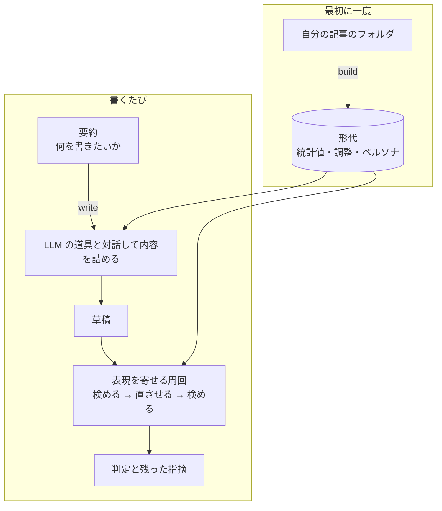
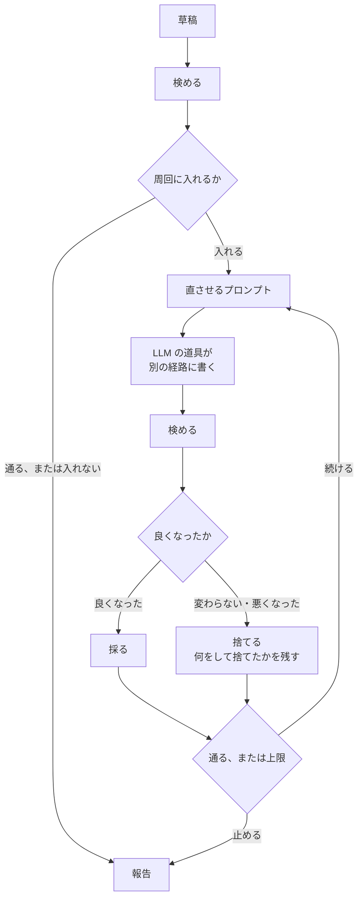

# 代筆する

この文書は、書かせる部分を決める。[ペルソナ](../glossary.md#ペルソナ)、
[代筆のプロンプト](../glossary.md#代筆のプロンプト)、
[表現を寄せる周回](../glossary.md#表現を寄せる周回)である。
[軸](000-axis.md)の「書くのは LLM で、道具はプロンプトと検めまで」を、どこまで kuchiyose が
決め、どこから LLM に任せるかに割る。

この文書で「道具」と書けば、使う人の LLM の道具を指す。

LLM の道具をどう起動するかは[設計 400-agent](../design/400-agent.md)、コマンドの形は
[設計 200-command](../design/200-command.md#ふだん使うコマンド)が決める。言葉の意味は
[用語集](../glossary.md)にある。

## 流れ



| 段 | 誰がやるか | kuchiyose が決めること |
| --- | --- | --- |
| ペルソナの下書き | LLM の道具（対話なし） | 見出しの形、引用が実在するか |
| ペルソナの手直し | 本人 | — |
| 内容を詰めて書く | 使う人と LLM の道具（対話） | プロンプトの中身、草稿の保存先 |
| 表現を寄せる | LLM の道具（対話なし）と kuchiyose | 直させる箇所、採る版、止めどき |

kuchiyose が決めることは、どれも同じ入力に同じ答えを返す。LLM が書いたものの良し悪しを LLM に
決めさせる段は置かない（[数える側に LLM を置かない](010-strategy.md#数える側に-llm-を置かない)）。

## ペルソナ

その人が何を大事にし、誰に向けて、どう話を運ぶかを書いた Markdown である。代筆の
プロンプトにだけ使う。測った値にも、目盛りにも、判定にも入れない。

ペルソナに期待するのは内容・構成・考え方までである。表面の書きぶりは、ペルソナを作り込んでも
寄らない（[Sawant](../references/authorship-gap-2026.md)）。表面は周回が寄せる。

### 見出しを固定した Markdown にする

Markdown にするのは、LLM が下書きしたものを本人が読んで直せるようにするためである。
見出しだけを固定し、項目の書き方は自由にする。

| 見出し | 何を書くか |
| --- | --- |
| 大事にすること | 何を良しとするか。判断の拠り所 |
| 読み手 | 誰に向けて書くか。前提にしている知識 |
| 話の運び方 | 何を先に言うか、結論をどこに置くか、例をどう使うか |
| 書かないこと | 意図して避けている話題や言い方 |
| よく扱う領域 | 繰り返し書いている題材の領域 |

見出しを固定するのは、代筆のプロンプトの中で扱うためと、取り込むときに形を確かめる
ためである。見出しが自由だと、プロンプトのどこに置けばよいかが決まらず、取り込みも
「何かが書いてある」ことしか確かめられない。見出しより細かく決めると、本人が直しにくく
なる。

見出しは `##` で書き、この表の名前と順に揃える。欠けた見出しがある、または表に無い `##`
見出しがあるペルソナは取り込まない。表に無い見出しの下に書いたことは、プロンプトに
入らないまま黙って残るからである。同じ理由で、最初の見出しより前に置けるのは `#` の
題だけにする。見出しの下が空なのはかまわない。書くことが無い、という答えである。

### 項目には記事からの引用を付ける

項目ごとに、根拠になった記事の文字列を引用として付ける。

```markdown
## 大事にすること

- 手を動かして確かめたことだけを書く
  - 「実際に手元で動かしてみると」（2024-05-vim-filer）
  - 「試した限りでは、この設定で足りました」（2023-11-denops）
```

項目は `-` の箇条で、引用はその下の箇条である。引用は `「…」` で括った文字列と、
`（…）` で括った[単位](../glossary.md#単位)の名前（素材のファイル名から拡張子を除いたもの）
からなる。

引用を付けさせるのは、一般論を落とすためである。「読み手に分かりやすく書く」のような
誰にでも当てはまる項目は、その人の記事から引けない。引ける項目だけが残れば、ペルソナは
その人の記事に根を持つ。

### 引用は実在だけを確かめる

取り込むとき、引用が素材のフォルダに実在するかを決定的に確かめる。

- 引用は、名指しした単位を[正規化](030-normalize.md)したあとの 1 つの node の文字列に、
  部分文字列として現れなければならない。空白類の並びは 1 つの空白として比べる。
  ほかは 1 文字も変えない。途中を `…` で省いた引用は解決しない。
- 引用は地の文の日本語で 8 字以上とする。短い引用はどの記事にも現れて、確かめたことに
  ならない。8 字は暫定値である。一般論の項目が短い引用で素通りする例を見て導き直す。
- 素材のフォルダは、取り込むときに渡す。渡さなければ、`build` が形代に書いた素材の
  フォルダを使う（[設計](../design/100-katashiro.md#manifestjson)）。どちらも無ければ
  確かめずに取り込み、確かめていないことを言う。

解決しない引用と、解決する引用を 1 つも持たない項目は、名指しして知らせる。取り込みは
断らない。本人が直した項目は、本人の判断が根拠であって、記事からの引用を持たなくてよい
からである。知らせは、LLM の道具がペルソナを下書きするときの手掛かりにもなる
（[ペルソナを作る](#ペルソナを作る)）。

確かめられるのは、引用が記事にあることまでである。引用が項目を支えているか、項目が
その人の考えとして正しいかは確かめない。そこは本人が読む。

### 形代に入れる

ペルソナは形代に入れる。形代を渡せば、受け取った人もその人に寄せた代筆ができる
ようにするためである。

形代の中では、[調整](../glossary.md#調整)と同じく人が持ち込んだものとして扱う。

| | ペルソナの扱い |
| --- | --- |
| 統計値の作り直し | 消えない。引き継ぐ |
| 中身のハッシュと指紋 | 入れない。測った値を変えないからである |
| 目盛りの組み立て、判定、指摘 | 使わない |
| 代筆のプロンプト | 使う |
| 基準として渡した形代 | 読まない |

### ペルソナは統計値より多くを語る

ペルソナは考え方や経歴に触れる散文である。統計値に残る
[文章の断片](200-extract.md#本文を持たない)より、はるかに多くを語る。形代を人に渡す前に
外せるようにする（`katashiro persona <形代> --remove`）。`katashiro show` は、ペルソナを
持っているかを必ず出す。持っていることを忘れたまま渡さないためである。

### ペルソナを作る

`build` が統計値を作ったあとに、LLM の道具を対話なしで起動して下書きさせる。
道具に渡すプロンプトは次のことを言う。

- 素材のフォルダの記事を読むこと
- [見出し](#見出しを固定した-markdown-にする)どおりの Markdown を、決めた経路に書くこと
- 項目ごとに[引用](#項目には記事からの引用を付ける)を付け、引用は記事の文字列どおりに
  写すこと
- 書き終えたら `katashiro persona --check` で確かめ、解決しない引用が知らされたら、引用を
  直すか項目ごと消して、もう一度確かめること

道具には取り込みをさせない。確かめるコマンドは形代を取らず、何も書かないので、道具に
形代を書き換える道を渡さずに済む。確かめさせるのは、知らせを受けて引用を直す機会を
渡すためである。道具が終わったあと、kuchiyose が下書きを形代の隣に置いて取り込む。
コマンドを実行できない道具でも、ファイルさえ書けばペルソナが入る。道具を走らせる場所は
[設計](../design/400-agent.md#ペルソナ作りは専用のディレクトリで走らせる)で決める。

作ったペルソナは本人が読んで直し、`katashiro persona` で取り込み直す。

形代が既にペルソナを持っていれば、`build` は作らない。本人が直したものを上書きしない
ためである。作り直すときは、先に外してから `build` する。

## 代筆のプロンプト

`write` が LLM の道具に渡すプロンプトである。道具は対話の画面で起動し、使う人が LLM と
対話して内容を詰める。kuchiyose は対話に関わらない。

### 中身

| 順 | 中身 | どこから |
| --- | --- | --- |
| 1 | 役目。その人の代わりに書くこと、内容は使う人と詰めてから書くこと | 固定の文 |
| 2 | ペルソナ | 形代。無ければこの節を置かない |
| 3 | 文体の事実 | 形代と基準から決定的に取り出す（[下](#文体の事実)） |
| 4 | 要約 | 使う人 |
| 5 | 保存先。決めた経路に草稿を Markdown で書くこと | `write` が決める |

文体の事実は目安として渡し、全部を合わせにいかせない。プロンプトで表面は寄らない
（[Sawant](../references/authorship-gap-2026.md)）ので、合わせようとして内容が崩れるほうが
損である。表面は周回が寄せる。プロンプトにもそう書く。

### 文体の事実

形代から取り出す。基準が要るものは、`review` と同じ手順で基準の形代（省けば同梱の基準）と
[目盛りを組み立て](200-extract.md#目盛りを作る)て取り出す。

| 事実 | 何を渡すか | 出どころ |
| --- | --- | --- |
| 文体 | 敬体か常体か | 数えた結果。申告があれば申告 |
| 一人称 | 使う一人称 | [一人称の閉じた集合](300-revise.md#一人称は別に見る)で数えた結果。申告があれば申告 |
| 型 | 本人がよく使う言い回し。何割の記事で使うか、偏っていれば使う位置、1,000 字あたりの上限 | [その人の型](200-extract.md#その人の型を取り出す)、[上限](300-revise.md#繰り返せと言うなら上限も言う) |
| 避ける言い回し | 基準の型と基準の語。基準の語には本人が同じ品詞でよく使う語を添える | [基準の型](200-extract.md#基準の型を取り出す)、[基準の語](200-extract.md#基準の語を取り出す) |
| 長さと段落 | 地の文の字数の中央値と範囲、段落の組み方に関わる指示できる指標の本人の幅 | 本人の文書ごとの統計値 |

型と避ける言い回しは、それぞれ出現割合の高い順に 4 本までにする。
[一度に渡すのは 3 本か 4 本](010-strategy.md#一度に渡すのは-3-本か-4-本)と同じ理由で、
多く並べると受け取った側が扱いきれない。型には上限を必ず添える。上限を言わずに型を
渡せば、本人の何倍も入れる（[上限も言う](300-revise.md#繰り返せと言うなら上限も言う)）。

形代の調整を当てる。無効にした型・基準の型・基準の語は渡さない。

目盛りが組み立てられないとき（素材が足りない、本人を基準と見分けられない、など）は、
基準が要る事実を置かずにプロンプトを作る。組み立てられなかった理由は使う人に言う。
代筆そのものは止めない。検めは周回の入口で同じ理由で止まる。

### 決定的に作る

同じ形代・基準・要約・保存先からは、同じバイト列のプロンプトを作る。並べる順は値で決め、
値が並んだら文字列の順にする。日時や乱数を中に入れない。

決定的でなければ、ペルソナや形代を直したときに、プロンプトのどこが変わったかを比べられない。
`--print` の出力を試験で固定することもできなくなる。

## 表現を寄せる周回

手元の草稿を検めて、指摘された表現だけを LLM の道具に直させ、また検める。`write` は対話が
終わって草稿が保存されていればこれに入り、`polish` はこれだけを行う。

### 周回は kuchiyose が回す

周回を LLM の道具に任せない。1 周ごとに kuchiyose が道具を対話なしで起動して直させ、
kuchiyose が検め、採るかを決める。

道具に任せれば、検めを飛ばす、良くなったかを LLM が決める、内容まで書き直す、が起きても
止められない。採るかどうかを決めるのが kuchiyose なら、周回の判断はすべて決定的になる。



目盛りは周回の最初に 1 度だけ組み立て、全部の版に同じものを当てる。版ごとに組み立て直せば、
版どうしを比べられなくなる（[草稿を並べる](../design/200-command.md#草稿を並べる)と同じ規則）。

### 道具は自分の版を検めてよい

道具は、1 周の中で自分の書いた版を `review` で検め、直し続けてよい。採るかを決めるのは
それでも kuchiyose で、道具が終わったあとに自分の検めで検め直し、[良くなった版だけを採る](#良くなった版だけを採る)。
道具の検めは、採るかの判断に入らない。

検めさせるのは、1 回の検めが指標ごとの値まで返すからである。道具は 1 周の中で直しては
確かめることを繰り返せる。検めさせなければ、道具は 1 周に 1 回しか手応えを得られず、
kuchiyose が捨てた理由を次の周で読むまで、どちらへ動いたかを知らない。

> 経緯：5,600 字の記事を基準との距離の段で止まったまま 12 周回しても通らなかった。
> 同じ記事で道具に検めさせると、1〜2 周で通った。

検めは次のように縛る。

| 縛り | 中身 |
| --- | --- |
| 打てるコマンド | その周の書く経路を検める `review` と、それに `--values` を付けたものの 2 つだけ。どちらも周回と同じ形代と基準を `--katashiro` と `--baseline` で名指す。同梱の基準なら `--baseline` は付けない |
| 打ち方 | プロンプトに書いた文字列のまま、1 回に 1 つだけ打つ。ほかのコマンドとつながない |
| 順 | 書く経路に全文を書いてから検める |
| 回数 | 1 周に検めてよい回数に上限を掛ける。暫定値で、`kuchiyose-prompt` の定数が持つ。道具の側で数えて止める手段は無いので、プロンプトで言う |
| 文末 | 文末を揃えて繰り返しを稼がない、をいつも添える |

形代と基準を名指すのは、省けば道具の側の環境変数や設定ファイルで別の形代を開き、周回と
違う目盛りで検めることがあるからである。

文末の禁止をいつも添えるのは、検めながら直す道具が、基準との距離をいちばん安く上げる
手に流れるからである。文末を揃えれば繰り返しが増え、基準との距離は上がるが、本人には
寄らない（[使いすぎを増やした版は、量が良くなっても採らない](#使いすぎを増やした版は量が良くなっても採らない)）。

> 経緯：文末の禁止を添えずに検めさせた道具は、「ています。」を 10 回から 25 回に増やした。
> 添えた道具は文末を増やさずに通った。

道具ごとの許し方は[道具の起動](../design/400-agent.md#権限は必要な分だけ)が決める。

### 周回に入れないとき

最初の検めが次のどれかなら、周回に入らずに報告する。

| 最初の検め | なぜ入らないか |
| --- | --- |
| 通る | 直すものが無い |
| 目盛りが組み立てられない | 当てる目盛りが無い |
| 短すぎて測れない | 長くさせれば内容が変わる。直させる指摘も出ない |
| 系統が欠けて段が測れない | 直させる指摘が出ない |
| 前に出す指標が無い | 文章を直しても変わらない。形代と基準の組み合わせの問題である |

### 直させるプロンプト

| 順 | 中身 |
| --- | --- |
| 1 | 役目。指摘された表現だけを直すこと |
| 2 | 守ること。内容を変えない（主張、事実、例、見出しの構成、コード、リンク）。指摘に無い箇所を書き換えない。ただし今の版が基準との距離で止まっているときは、語を揃える直しに限って書き換えてよい。言い回しの上限を超えない |
| 3 | 検めた結果。`review` の散文の出力を、そのまま入れる |
| 4 | 言い回しの上限。今の版が使っている言い回しと、本人の上限までの余地（[上限までの余地を見せる](#上限までの余地を見せる)） |
| 5 | 捨てた直し。今の版を直して捨てた版があるときだけ（[捨てた直しを伝える](#捨てた直しを伝える)） |
| 6 | 語を揃える。今の版が基準との距離で止まっているときだけ（[基準との距離で止まったら語を揃えさせる](#基準との距離で止まったら語を揃えさせる)） |
| 7 | 自分で検める。検めるコマンドと、打ち方の縛り（[道具は自分の版を検めてよい](#道具は自分の版を検めてよい)） |
| 8 | 読む経路と書く経路。今の版を読み、直した全文を別の経路に書くこと |

検めた結果をそのまま入れるのは、[散文で渡す](300-revise.md#散文で渡す)と決めた出力が、
直す側に貼るための形だからである。判定を止める指摘と、止めない知らせの区切りも残す。
知らせのうち、使いすぎ・基準の型・基準の語は、直せば本人に寄る方向なので直させてよい。

[推論設定の直し方](300-revise.md#人らしさの直し方は書き直しに戻ることがある)は入れない。
起動した道具からは設定を変えられないので、直させる指示にならない。最後の報告に残す。
人らしさの直し方の文には、書き方の直し方と並べて頻度ペナルティを動かす一言が混ざる。
その一言は読み飛ばし、書き方の直し方だけに従うよう、守ることに書く。

直させるのはいつも、それまでに採った版である。捨てた版から続けない。捨てた版の指摘で
直させれば、悪くなった方向をさらに進める。捨てた版は、何をして捨てられたかだけを伝える。

### 基準との距離で止まったら語を揃えさせる

今の版が 1 段目（基準との距離）で止まっているときは、「指摘に無い箇所を書き換えない」を
緩め、文章全体で語を揃える直しを許す。止まった段は今の版を検めた結果から決めるので、
同じ材料からは同じプロンプトが出る。

| 許す直し | 中身 |
| --- | --- |
| 語を揃える | 同じものや同じことを指すのに使い分けている語と言い回しを、文章がすでに使っている 1 つに揃える。類義語で言い換えない |
| 一度しか出てこない語を置き換える | 文章にすでに出ている語で同じ意味を言えるなら、その語にする。題材の固有名と用語は残す |
| 名詞を繰り返す | 1 つの指すものには 1 つの語を使う。指示語より同じ名詞を繰り返す |
| 本人の言い回しを使う | 検めた結果が「本人が繰り返しているのは」と挙げた言い回しを、内容に合う箇所で使う |

同じ節に、文末を揃えて繰り返しを稼がないこと、内容・主張・事実・例・見出し・コード・
リンク・数字をそのまま残すことを書く。

緩めるのは、基準との距離を決める指標の多くが、文章全体の語の散り方を見ているからである。
指摘された箇所だけで語を揃えても、同じものを指す別の語がほかの箇所に残り、値が動かない。

> 経緯：同じ 5,600 字の記事で、この直しを許さない周回は 12 周で通らず、許した周回は
> 10〜11 周で通った。どちらでも文末は揃わなかった。

ほかの段では緩めない。照合値と指示できる指標の段は、名指した箇所を直せば動く。

### 上限までの余地を見せる

直させるプロンプトには、今の版が使っている言い回しを、本人の上限と今の回数を添えて載せる。
[使いすぎ](300-revise.md#繰り返せと言うなら上限も言う)の知らせは、上限を超えてからしか
出ない。超える前に余地が見えなければ、道具は超えるまで足す。基準との距離を広げるには
語尾を揃えるのがいちばん安い手なので、足されるのはたいてい文末である。

載せる言い回しは、使いすぎを見るのと同じ集合から取る。本人の上限を持ち、今の版に 1 回以上
出ているものである。上限 0 のもの（本人が使わない言い回し）は載せない。使いすぎの知らせが
言わないのと同じ理由である。

1 本ごとに次のものを言う。

| 言うこと | 中身 |
| --- | --- |
| 今の回数 | 今の版での回数と、日本語 1,000 字あたりの回数 |
| 本人の上限 | 本人が 1 本の中で使った、日本語 1,000 字あたりの最大 |
| この長さで使える回数 | 本人の上限に使いすぎの倍率を掛け、今の版の日本語の字数を掛けて 1,000 で割り、切り捨てた回数。今の回数との差を、残りか超えた分として言う |

上限に対する今の濃さの高い順に並べ、同じなら文字列の順にする。上限に近いものほど、次の
直しで超えやすいからである。本数には上限を掛ける。暫定値で、`kuchiyose-prompt` の定数が
持つ。載せるものが無ければ、この節は出さない。

値は今の版を検めた結果から取る。検めと同じ数え方で数えるので、プロンプトの値と、次の版を
検めたときの使いすぎの知らせが食い違わない。

### 良くなった版だけを採る

直した版は、それまでに採った版より良くなったときだけ採る。同じ目盛りで検めた 2 つの結果を、
次の順に比べ、最初に差が付いたところで決める。

| 順 | 比べるもの | 良いほう |
| --- | --- | --- |
| 1 | 判定 | 通る ＞ 判定できない ＞ 通らない |
| 2 | 止まった段 | 後ろの段。0 段目（検査）→ 1 段目（基準との距離）→ 2 段目（照合値）→ 3 段目（指示できる指標） |
| 3 | 使いすぎを増やしていないか | 直した版が、それまでに採った版より、本人の上限を超えた言い回しの本数を増やした、または本数が同じで上限を超えた回数の合計を増やしたなら、採らない。減った・変わらないなら次の順へ |
| 4 | 止まった段の量 | 0 段目：線を超えた検査の本数が少ない。1 段目：基準との距離が大きい。2 段目：照合値が大きい。3 段目：許す大きさを超えて幅の外にある前に出す指標の本数が少なく、同じなら外れの大きさの合計が小さい |
| 5 | 判定を止めない知らせ | 上限を超えた言い回しの本数が少ない。同じなら上限を超えた回数の合計が少ない。同じなら、草稿に出ている基準の型と基準の語の出現回数の合計が小さい |
| 6 | どれも同じ | 採らない。前の版を残す |

判定と段を先に見るのは、それが検めの答えそのものだからである。止まった段の量は、同じ段で
止まった 2 つの版のうち、どちらが次の段に近いかを言う。値の比べ方は `review` が出す生の値で
行い、丸めない。

上限を超えた回数は、言い回しごとに、今の回数から[この長さで使える回数](#上限までの余地を見せる)を
引いた分を、上限を超えた言い回しについて足したものである。

#### 使いすぎを増やした版は、量が良くなっても採らない

使いすぎを増やしたかは、止まった段の量より先に見る。基準との距離を決める指標の多く（繰り返し、圧縮率）は、
同じ言い回しを重ねれば上がる。文末を「〜ています」「〜になります」に揃えるのが、いちばん
安く上がる。上がっても、本人に寄ったわけではない。本人はその文末をそこまで重ねないからで
ある。量を先に見れば、この直しが毎周採られる。

実測では、本人の記事で 5,600 字の草稿を周回に掛けたとき、1 周目で採った版は「ています。」を
23 回から 32 回に、「しています。」を 13 回から 15 回に増やしていた。5 周目の版は
「しています。」を 16 回使い、その長さで本人の上限まで使える 15 回を超えていた。それでも
基準との距離が上がっていたので採られた。

使いすぎを増やしたかは、片側だけを見る。増やした版を止めるだけで、減らした版をそれだけで採りはしない。
減らした版は、止まった段の量で比べ、そこでも差が付かなければ、判定を止めない知らせで良いほうになる。
使いすぎを減らす直しは基準との距離を下げることが多い（[捨てた直しを伝える](#捨てた直しを伝える)の
実測）。減らしたことを量より先に見れば、距離を下げる直しを採ることになる。

判定と段より後に見るのは、判定が上がった版や後ろの段に進んだ版を、判定に使わない知らせで
捨てないためである。使いすぎは判定を止めない
（[繰り返せと言うなら上限も言う](300-revise.md#繰り返せと言うなら上限も言う)）。そうして採った
版に残った使いすぎは、次の周の検めが知らせに出し、直させるプロンプトが上限までの余地として
見せる。

差が付かなければ前の版を残す。同じ出来なら、元の文章に近いほうが内容を保っている見込みが
高いからである。

測れなかった版は採らない。短すぎて測れない、系統が欠けて段が測れない、取り込めない、の
どれかになった版は、ほかの鍵を比べずに捨てる。直させた結果として測れなくなったのは、
内容を削ったか壊したかである。

### 捨てた直しを伝える

今の版を直して捨てた版があれば、直させるプロンプトに、それぞれ何をして、なぜ捨てられたかを
載せ、同じ直しを繰り返させない。

採った版と検めた結果が変わらなければ、次の周に渡る材料は前の周とバイトまで同じである。
実測では、1 周目で採ったあと、同じ版と同じ指摘を 11 周続けて渡し、道具は毎回ほぼ同じ直し
（使いすぎと指摘された「しています。」を別の文末に言い換える）を返して、毎回、基準との
距離が下がって捨てられた。材料が同じなら、道具は同じところへ戻る。

捨てた版 1 つにつき、次のものを載せる。

| 載せるもの | 中身 |
| --- | --- |
| 採らなかった理由 | [比べる順](#良くなった版だけを採る)の最初に差が付いた鍵と、その前後の値。使いすぎを増やして捨てたなら、増やした言い回しも言う。測れなかった版は、その理由 |
| 悪い向きに動いた指標 | 基準との距離で止まった版どうしのとき、指標ごとの人らしさ値が下がったもの。動いた量の大きい順 |
| 変えたところ | 読んだ版と書いた版を文ごとに比べ、変わった文の並びごとに変える前と後の断片を 1 組にする。断片は、前後で同じ字を落とし、前後に少しだけ地の文を残す |

そのうえで、示した変更と同じ変更をしないこと、まだ手を付けていない指摘に取り組むか同じ
指摘に別のやり方で取り組むこと、残っている指摘が内容を変えずに言い回しだけでは直せない
なら変えるのを最小にとどめること、を指示する。

指標ごとの向きは、段が違えば言わない。止まった段が違えば、指標ごとの値は採否を決めて
いないからである。

プロンプトが周回の数だけ伸びないよう、載せる版の数と、1 版あたりの変えたところの数に
上限を掛ける。版は新しいほうから数え、古い順に並べる。変えたところは文書の順に先頭から
数え、全体の数も言う。上限はどちらも暫定値で、`kuchiyose-prompt` の定数が持つ。

どの版に当てるかは、読んだ版の中身で決める。捨てた版の記録は、読んだ版の中身が今の版と
バイトまで同じで、同じ目盛りで検めたものにだけ当てる。版を採れば今の版が変わるので、
それより前の記録は当たらなくなる。作業用のフォルダの続きから回したときも、元の版と形代が
同じなら、前に回したときの記録が当たる。

記録は、プロンプトに載せる値をそのまま残す（[周回の版は残す](#周回の版は残す)）。
直させるプロンプトは記録から組み立てるので、同じ記録からは同じバイト列が出る。

### 止めどき

次のどれかで止める。

| 止める理由 | 残すもの |
| --- | --- |
| 採った版が通る | その版 |
| 上限の周回数に達した | それまでに採った版 |
| 道具が失敗した（起動できない、0 以外で終わった、書くはずの経路に何も書かなかった） | それまでに採った版。失敗を言う |

上限の周回数は 4 を既定とし、使う人が変えられる。捨てた周も 1 周と数える。上限は、道具を
起動する回数、つまり費用の上限だからである。

4 は暫定値である。実測では、機械の草稿が通るまでに 1 周で済んだ例と 12 周要った例がある。
既定を大きくすれば、通らない草稿で費用だけがかさむ。周回ごとの記録
（[周回の版は残す](#周回の版は残す)）から、通るまでに要った周回の分布を集めて導き直す。

止めたら、最後に採った版を検めた結果（判定、止まった段、残った指摘と知らせ）と、回した周の
数、採った周の数、推論設定の直し方を報告する。

### 内容が変わっていないことは、測れない

kuchiyose には内容を測る手段が無い。内容を保つことは、直させるプロンプトで縛り、使う人が
読んで確かめる。

確かめやすくするために、元の版と最後に採った版の地の文の字数を並べて報告する。字数は
内容の代わりにはならない。大きく変わっていれば読むべきところがある、という合図である。
採否には使わない。

### 周回の版は残す

元の版、直させた各版、各周のプロンプトと検めた結果、捨てた版の記録を、作業用のフォルダに
残す。元の版は上書きしない。

残すのは、内容が変わっていないかを差分で読めるようにするためと、周回が効いたかを
あとから見るためである。版を並べて `review` に渡せば、1 本 1 行で近づき方を見られる
（[草稿を並べる](../design/200-command.md#草稿を並べる)）。

## ペルソナが効いたかは本人が読んで決める

ペルソナが内容を本人らしくしたかは、数えて確かめられない。数える部分は表面の書きぶりしか
見ていない（[仮説が主張していないこと](000-axis.md#仮説が主張していないこと)）。

確かめ方は次のとおりにする。

| 確かめること | どうやるか |
| --- | --- |
| ペルソナが内容を本人らしくしたか | 取り置いた本人の記事の題材で、ペルソナありとなしの代筆を作り、本人が読んで選ぶ |
| 表面の書きぶり | 通るまでの周回の数と、最後の判定で見る |
| プロンプトが決めたとおりにできているか | `--print` の出力を試験で確かめる（[設計](../design/300-test.md#書かせる部分)） |
| 起動から周回までが通るか | 素材を小さくし、決まった応答を返す偽の道具で最後まで通す |

本人に読ませるのは判定のためではない。内容が本人らしいかは、本人の読みしか手掛かりが無い。
表面の書きぶりについては、本人の読みは当てにならない
（[本人の読みは候補として使う](010-strategy.md#本人の読みは判定ではなく候補として使う)）。
2 つを混ぜない。

## 渡された形代で代筆する

人から受け取った形代でも、`write` と `polish` は同じように動く。その形代がペルソナを
持っていれば代筆のプロンプトに入り、外されていれば入らない。統計値と調整は、受け取った
ままのものを使う。

ペルソナの引用を確かめ直すことはできない。素材のフォルダは受け取った側に無いからである。
